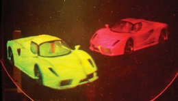

## "Hi-tech" - L'holographie animée 2
### Un nouveau cap franchi dans l'animation holographique - Section Hi-tech
 **Un nouveau cap franchi dans l'animation holographique**

Un [précédent article](hitechhologtempsreel.html) posait la question "le compte à rebours a-t-il vraiment commencé". Nous aurions alors dû répondre par l'affirmative car une équipe américaine vient de réaliser un dispositif holographique donnant des cadences de rafraîchissement de l'ordre d'une webcam.

 

 

_[Vidéos complémentaires](http://www.nature.com/nature/journal/v468/n7320/abs/nature09521.html#supplementary-information) sur le site de_ Nature_._

_Sur l'holographie et l'holographie numérique, lire les chapitres [XIV](chap14holographie.html) et [XV](chap15holographienum.html) des Dialogues de Dotapea_

Resituons le contexte : une bataille de polymères sous-tendue par des enjeux immenses, comme on peut l'imaginer. Qui inventera le polymère photoréfractif le plus rapide (le plus rapidement actualisable) afin d'afficher une image animée en trois dimension sans fatiguer l'oeil et sans exiger le port de lunettes ? Comme dans la célèbre scène de science-fiction évoquée ci-contre.

Après les travaux de l'équipe de Savas Tay en 2008, la revue _Nature_ (édition du 4 nov. 2010) évoque ceux de l'University of Arizona's College of Optical Sciences et de la Nitto Denko Technical Corporation (Oceanside, California) et l'avancée est nette : c'est la première application d'une technique d'animation holographique qui accède au rang de l'invention "pratique et utile", peut-être une première étape marquée par un résultat concret avant un possible bouleversement de l'univers de l'image.

Comme on peut le voir dans les vidéos complémentaires référencées ci-dessus, on est encore assez loin du temps réel. Trois secondes de rafraîchissement dans la première, huit dans la seconde, bien que cela autorise dès maintenant des applications concrètes, c'est respectivement 75 et 200 fois trop lent pour restituer une impression normale de mouvement. L'expérience de Savas Tay était 3 750 fois trop lente (2,5mn). Le progrès est donc énorme. Il témoigne de l'intense activité dans ce domaine.

Par ailleurs il faut souligner que la taille des hologrammes est moins limitée et qu'un indispensable travail sur "l'occlusion" a été fait. En effet, un hologramme est immatériel, transparent, cela flotte dans l'air, donc comment représenter un objet opaque, un personnage par exemple, en respectant de plus la parallaxe ? Ne se lasserait-on pas de films où les personnages, exception faite des éclairages frontaux, resteraient des apparitions spectrales ? Comment rendre la projection visible dans une lumière ambiante comme celle d'une pièce normalement éclairée ? Comment donner un rendu en couleurs alors que le bleu pose un problème dans la technologie des indispensables lasers qui balayent la zone filmée ? Tout cela est semble-t-il résolu. Il s'agit de très importants progrès après une longue stagnation.

On devine la complexité de la tâche et c'est représentatif du fait que par l'effet de cette avancée, l'on se retrouve devant ce genre de problèmes "enfin concrets" si l'on peut dire.

Pour terminer, on précisera quand même qu'il reste de gros problèmes car on le voit bien, les images obtenues ne sont pas d'une grande qualité :

  

Elles évoquent les premières photos, les premiers films, et c'est un peu ce qu'elles sont dans notre siècle : une merveilleuse technologie qui s'élabore devant nos yeux. Du moins souhaitons-le. Affaire à suivre...

_Emmanuel Luc,  
éditeur_

 [Communication](http://www.artrealite.com/annonceurs.htm) 

