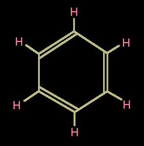

        ## Acyclique
### Acyclique, adjectif, article du glossaire
 Une molécule acyclique a une structure en [chaîne](chaine.html) ouverte (série grasse).

Elle est souvent linéaire, mais peut avoir une forme plus élaborée. En tout cas, elle n'est pas fermée, contrairement aux molécules dont les structures ont une base [cyclique](cyclique.html) fermée (voir [ci-dessous](acyclique.html#fermee)).

Il s'agit notamment [d'acides gras](acidesgras.html). Voir [corps gras](gras.html#corpsgras).

Un exemple - parmi une infinité d'autres - de molécule acyclique est la molécule [d'acide alpha linolénique](huiledelin.html#formulationchimique), bien présente dans l'huile des peintres. On le voit, c'est une chaîne ouverte, une ligne :


... à comparer par exemple avec la chaîne fermée du [benzène](benzene.html) :



Ces deux molécules ont des points communs : elles sont pareillement [organiques](organique.html) et sont de même trois fois [insaturées](saturation.html), mais si la première est [aliphatique](aliphatique.html) et acyclique - estérifiée elle donne des huiles -, la seconde est [aromatique](aromatique.html) et cyclique - c'est une essence.

Note : la classe des composés [alicycliques](alicyclique.html) correspond aux molécules cycliques qui ont pu se former à partir de molécules aliphatiques par fermeture de chaîne.

**"Rond en bouche" : une intuition ?**

Ces formes définissent bien sûr des propriétés, des capacités d'association, de déplacement et d'évolution, que l'humain a peut-être ressenti intuitivement - qui sait ? - au point d'utiliser des termes comme "rond en bouche" pour désigner certains arômes, particulièrement amples, des vins et d'autres substances alimentaires.

De fait, il suffit de comparer la lenteur de déplacement d'un corps gras à la rapidité avec laquelle une essence s'étend sur ou dans une matière - sauf exceptions lorsqu'il s'agit de molécules aromatiques complexes - pour faire naturellement un rapprochement (à tort ou à raison) avec des catégories de formes que nous connaissons bien à notre échelle, comme la roue et la tige, que l'on associe intuitivement à des capacités de déplacement bien différentes. [Tout chimiste ou physicien spécialisé dans ce sujet difficile est bienvenu à nous contacter.](ecrire.html)


```
title: Acyclique
date: Fri Dec 22 2023 11:25:56 GMT+0100 (Central European Standard Time)
author: postite
```

    
    
    