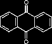
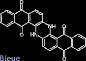
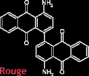
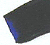

## Anthraquinone
### Anthraquinone, usage en arts plastiques
 **Anthraquinones**  



[Anthracène](anthracene.html) oxydé, l'anthraquinone (n.f.) donne notamment des synthèses qui se sont substituées à [l'alizarine](alizarine.html) naturelle (la [garance](garance.html) contenant elle-même, naturellement, différentes molécules anthraquinoniques), mais aussi différents rouges et bleus, eux-mêmes parfois inclus au sein de plus vastes polymères. Ci contre, le [monomère](polymere.html#monomeres) de l'anthraquinone.

Comme souvent lorsqu'il s'agit de pigments organiques, quelques variations permettent d'obtenir des résultats très différents.



**Exemples**

A gauche, une anthraquinone bleue obtenue avec deux monomères azotées.

A droite, une anthraquinone rouge obtenue avec deux monomères azotées également, mais de manière différente.



Ces pigments sont assez transparents. Leur permanence, sans être médiocre (surtout pour une teinture), n'est pas supérieure (notamment pour la peinture).

Aujourd'hui encore, certains fabricants proposent des _alizarines_ synthétiques composées de dihydroxyantraquinone, et aussi, heureusement, d'autres versions nettement plus permanentes à base de [quinacridone](quinacridones.html) (PR206).



Le bleu d'anthraquinone foncé n'est autre que le bleu d'indanthrène, sorte de substitut du principe colorant de l'indigo (cf. [indican](indican.html)). Lire absolument [Le bleu d'indanthrène _in_ Les bleus froids](bleusfroids.html#indanthrene).

Voir aussi [Laques](laques.html).


 [Communication](http://www.artrealite.com/annonceurs.htm) 

[](index-2.html#20131014)


```
title: Anthraquinone
date: Fri Dec 22 2023 11:26:03 GMT+0100 (Central European Standard Time)
author: postite
```
