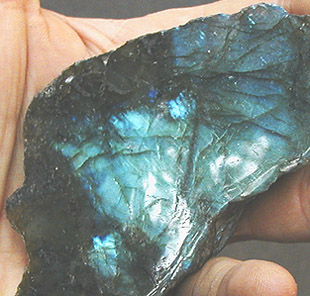

## Les autres pierres ignées
### Les autres pierres ignées, usage en sculpture
 **Autres pierres ignées**  Des granites "porphyriques" et certains calcaires roses, proches du porphyre par leur aspect mais pas du tout par leur composition ni leur tenue, seraient parfois "confondus" avec de véritables porphyres.

Il faut dire que la composition du porphyre est extrêmement vague. Cette pierre pourrait contenir de 35 à 70% de [feldspath](feldspath.html), 10 à 30% de feldspath spécifiquement calcique, de 15 à 40% de quartz, un pourcentage tout aussi variable de [plagioclases](plagioclase.html), de [biotite](biotite.html) (5 à 25%), [d'amphiboles](amphibole.html) et d'autres minéraux.

Il existe en fait un groupe de roches dites _porphyriques_ dont le point commun est moins la composition chimique que le fait d'avoir subi un refroidissement en deux phases. La première correspond à un refroidissement lent, dans les profondeurs de la croûte terrestre. Lente, elle est propice à la formation de [phénocristaux](phenocristal.html). La seconde est  plus rapide, correspondant à une montée du magma vers la surface. Elle provoque l'apparition de [microlithes](m.html).

_L'obsidienne_

Photo : avec l'aide de [Catherine Lisack](quinoussommes.html#catherinelisack) 

[](quinoussommes.html#catherinelisack)

[Pierre ignée effusive](ignees.html#effusives).

C'est l'un des deux seuls véritables "verres naturels" dont les conditions de formation sont exposées dans [un passage de l'article _Le verre_](verre.html#obsidiennetxt).

Composition : [silice](silice.html) en très forte quantité. Autres éléments : fer (donne un aspect sombre, noirâtre), magnésium (aspect vert) calcium, potassium, sodium, etc. (colorations bleues, pourpres, brunes et même mouchetés blancs).

Minerai : en nodules ou en strates importantes parmi d'autres pierres [effusives](e.html#effusif). Les minerais présentant des facettes cristallines sont à éviter (sauf si une taille complète n'est pas envisagée).

Densité 2,4 à 2,6 environ. Dureté : nettement inférieure à celle du quartz.

Provenances : Italie, Mexique, Écosse, États-Unis d'Amérique, etc.

Il s'agit d'une pierre semi-précieuse.

Son emploi dans le passé était extrêmement courant au néolithique. En Europe et en Afrique du Nord, de véritables "centres industriels" produisaient haches, bijoux et autres objets de formes parfaites qui voyageaient sur des milliers de kilomètres, sur terre et sur mer, déjà.

Autant dire que l'art de la taille de l'obsidienne avait déjà atteint son plus haut degré de perfection technique et formelle voici cinq ou six mille ans.

La structure très fine de cette pierre et sa dureté autorisent la réalisation de lames très coupantes.

Mais parce qu'elle est cassable, l'obsidienne se travaille surtout par abrasion. [Sable](sable.html), [émeri](emeri.html) et autres substances sont utilisés à cette fin depuis des périodes très reculées.

Le polissage donne un aspect nettement brillant, propre à cette pierre (voir photo).

_La diorite_

[Pierre ignée intrusive](ignees.html#intrusives) moyennement grenue, elle est constituée de [cristaux](cristal.html) blancs de [feldspath](feldspath.html) (système triclinique), de [biotite](biotite.html) et de [hornblende](hornblende.html) ou autres [amphiboles](amphibole.html), matériaux verts, noirs ou gris foncé. Les rares variétés chargées de quartz sont considérées comme fondamentalement différentes (on les appelle granodiorites).

La taille et le polissage de cette pierre extrêmement dure et hétérogène sont très difficiles.

Elle fut pourtant employée dès l'Égypte ancienne.

_La syénite_

Cette [pierre ignée intrusive](ignees.html#intrusives) ressemble au granit (son grain est assez grossier), mais elle ne contient pas de quartz. Sa résistance est supérieure à celle du granit et, pour cette raison, elle est parfois utilisée comme matériau de construction très solide. Sa composition est proche de celle de la diorite mais elle diffère de celle-ci par son [système cristallin](cristal.html).

Elle contient du [feldspath](feldspath.html), du [mica](mica.html) et des [amphiboles](amphibole.html) ou des [pyroxènes](pyroxene.html). Les variétés de syénites sont en fait plutôt nombreuses bien que ces minéraux soient relativement rares.

Leurs couleurs vont du blanc au rose en passant par différentes teintes de gris.

Leur taille ne présente pas de difficulté spécifique par rapport au granit.

Provenances : Alpes, Norvège, Afrique, Fédération de Russie, États-Unis d'Amérique, etc.

_La diabase_


Composant principal : [feldspath](feldspath.html) (système triclinique - voir [cristaux](cristal.html)). La diabase peut inclure des [olivines](olivine.html), des [pyroxènes](pyroxene.html), des [amphiboles](amphibole.html), des [biotites](biotite.html), etc. Des centaines de variétés peuvent émaner d'une seule source volcanique.

Densité : un peu plus de 3.

Coloration : juxtaposition à dominante sombre de vert foncé, parfois presque noir, et de blanc.


 [Communication](http://www.artrealite.com/annonceurs.htm) 

[](index-2.html#20131014)


```
title: Les autres pierres ignées
date: Fri Dec 22 2023 11:26:08 GMT+0100 (Central European Standard Time)
author: postite
```
