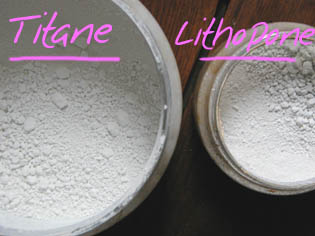
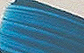

## Les blancs synthétiques
### Les blancs synthétiques, usage en arts plastiques
 **Les blancs synthétiques**

_[English version](english/syntheticwhites.html) [](english/syntheticwhites.html)_ 

 _Le blanc de titane_ 

Contrairement à ce que prétendent encore certains auteurs, il n'est pas jaunâtre du tout : il est plutôt légèrement bleuté. A vrai dire, il ne nous a même pas été possible de trouver un blanc de titane à tendance jaune, ni sous forme de pigment, ni sous forme de peinture en tube. Il faut préciser qu'il s'agit d'un pigment enrobé et que le matériau utilisé pour cela lui confère des propriétés variées. Ce sujet est développé dans un important passage du chapitre XXII des Dialogues de Dotapea ([lien](chap22mouillage.html#titane)) et en différents points du [Courrier des Lecteurs](courrierdeslecteurs.html).

Le traitement du matériau interne, à base de [rutile](rutile.html), TiO2, peut également faire varier, par association à d'autres éléments, la teinte de ce pigment (lire l'article _[Les titanes](titanes.html)_).

**Sommaire**

[Le blanc de titane](blancssynthetiques.html#leblancdetitane)

[Le blanc de zinc](blancssynthetiques.html#leblancdezinc)

[Le blanc de lithopone (glossaire)](lithopone.html)

[Le blanc dit d'argent, de Saturne, de plomb ou céruse](blancssynthetiques.html#leblancditdargentdeplombouceruse)

[Le blanc de Jupiter ou blanc de bismuth](blancssynthetiques.html#leblancdejupiteroublancdebismuth)

[Les blancs de baryum et de silice](blancssynthetiques.html#lesblancsdebaryumetdesilice)

[Le blanc d'étain](blancssynthetiques.html#blancdetain)

[Le blanc fluorescent](blancssynthetiques.html#blancfluo)

[Un cas particulier : le chlore](blancssynthetiques.html#lechlore)



Il y a gros à parier que les premières synthèses du blanc de titane tiraient sur le jaune, comme certaines sources le mentionnent, et que ce défaut a été compensé par la suite. Peut-être aussi la mauvaise préparation de certaines huiles transparaissait-elle davantage en présence de ce blanc qui est l'un des plus éblouissants pigments qui soient. A tel point - et ce n'est pas une boutade - que l'on déconseillera de laisser à l'air libre, pendant les nuits d'été, une surface fraîche peinte avec ce pigment tant il attire les insectes nocturnes qui la confondent avec une source de lumière.

La photo ci-contre permet de comparer le blanc de titane à un [blanc de lithopone](lithopone.html), mélange de blanc de zinc et de blanc de baryum réputé plutôt neutre.

Le titane a détrôné le blanc de lithopone et les autres blancs pour nombre d'usages parce qu'il est à la fois

> \* très lumineux
> 
> \* permanent
> 
> \* parfaitement stable en mélange (ce qui n'est pas forcément le cas du blanc de lithopone, selon la qualité du lavage du pigment), sauf variétés non enrobées qui ne devraient pas se trouver sur le marché pigmentaire
> 
> \* sensiblement dépourvu de toxicité ([Lire _Blanc de zinc, blanc de titane : toxicité_](blancdezincblancdetittox.html)).


Ses défauts :

> \* il est un peu grumeleux au liage. A cause des temps d'imbibition, il doit être de préférence traité en premier sur la palette lorsque le peintre prépare lui-même la pâte (voir _[Séparer ou non liants et pigments](separerounon.html)_). Le mélange à la spatule doit être effectué un peu plus longuement et vigoureusement que pour les autres couleurs. Certaines variétés sont un peu difficiles à lier aux liants aqueux. En dehors de ce détail technique, il ne pose aucun problème particulier. Il est légèrement plus absorbant que la moyenne, c'est tout. Lire [passage in Mauvaise absorption](mauvaiseabsorp.html#titane).
> 
> \* il est parfois un peu trop bleu ! Il faut souvent lui adjoindre une très petite quantité de jaune.
> 
> \* il est un petit peu coûteux mais son rapport coût/facteur couvrant est plus intéressant que celui du blanc de lithopone.

Malgré ces menus inconvénients, l'apport de ce pigment pour tous les procédés de peinture est immense. De même, il est conseillé d'en ajouter aux blancs naturels comme le blanc de Meudon lors de la préparation de [gessos](fabriquerungesso.html).

Voir [Les titanes](titanes.html) (famille de pigments) et surtout l'article [Ciments et peintures autonettoyantes](hitechcimentautonet.html), nanotechnologies dont le TiO2 est la pierre angulaire.

_Le blanc de zinc_ 

Composition, extraction, détails : [lire l'article du glossaire](blancdezinc.html).

Pendant longtemps, le blanc de [zinc](annexe1.html#zn) a bénéficié d'une réputation de froideur et de bonne tenue, contrairement à toutes les autres couleurs au zinc, qui ont été abandonnées. Il a suscité beaucoup d'intérêt malgré sa transparence excessive parce que le titane naissant était considéré comme étant trop chaud (voir [ci-dessus](blancssynthetiques.html#leblancdetitane)), de même que les [blancs naturels](terresblanches.html), naturellement grisâtres ou jaunâtres.

_[](pigments.html#compatibilitesetincompatibilites)_

Aujourd'hui, l'intérêt du blanc de zinc pur semble plutôt limité. Certaines variétés de mauvaise qualité contiendraient du soufre, ce qui peut pose un problème de compatibilité avec les siccatifs au plomb en peinture à l'huile. De plus, il est assez transparent. Pour cette raison, son emploi manque cruellement du confort remarquable qu'offre le blanc de titane. Il peut cependant rendre des services pour l'application de [vélatures](velature.html) et d'autres [glacis](glacis.html).

Il trouve une application utile en utilisation conjointe au blanc de titane. Lire [passage](chap22mouillage.html#zinctitane) in Les dialogues de Dotapea, chap. XXII.

Le [blanc de lithopone](lithopone.html), comportant une variété sulfurée du blanc de zinc, n'a plus maintenant que des emplois d'arrière plan en peinture artistique.

L'oxyde de zinc et les arts du feu --> lire [l'article du glossaire](zinc.html).

Lecture conseillée : [Le blanc de zinc sur Pourpre.com](http://pourpre.com/chroma/dico.php?typ=fiche&&ent=zinc)

[](pigments.html#compatibilitesetincompatibilites)

 _Le blanc dit d'argent, de Saturne, de plomb ou ceruse_ 

C'est un blanc minéral à base de plomb, poison violent traité dans une [page séparée](ceruse.html).

 _Le blanc de Jupiter ou blanc de bismuth_ 

A base de bismuth (métal très lourd, voir [tableau des éléments périodique](annexe1.html#bi)), c'est un pigment très transparent à utiliser de préférence en [glacis](glacis.html).

Il doit être broyé d'une manière particulière de sorte à ne pas jaunir. Le procédé est flamand. Il est mentionné par le Docteur de Mayerne. On fait cuire une part [d'huile **_de tournesol_**](autreshuiles.html#lhuiledetournesol) crue avec de la [litharge](lithargeetsiccatifs.html), puis on introduit le pigment à froid.

 _Les blancs de baryum et de silice_ 

Ils font partie des blancs dits "naturels" car ils sont très présents dans les terres blanches. Cependant, un traitement est nécessaire pour les extraire.

[Ils sont traités dans l'article consacré aux terres blanches.](terresblanches.html)

 _Le blanc d'étain_

Cet oxyde [d'étain](annexe1.html#sn) ([PW15](nomenclaturepig.html#pw15)) n'est pas un pigment très courant. Il ne brille pas par sa présence dans les catalogues. En fait, c'est un composé SnO3 ([stannate](stannate.html)) que l'on marie avec d'autres composés pour former des [sels](formationdesels.html). Nous ignorons s'il est aussi utilisé parfois sous forme pure en peinture mais de toute façon cet emploi serait plus que marginal.



Sa principale utilisation se trouve dans la fabrication du [bleu caeruleum](bleuschauds.html#leceruleum) (photo ci-contre), ou du moins de certaines versions ce cette couleur. Dans ce bleu, il "rompt" la teinte franche du cobalt avec lequel il est associé. C'est lui qui apporte toute sa subtilité à cette couleur.

_Le blanc fluorescent_

C'est typiquement un triazine-toluene sulfonamide-paraformaldehyde polycondensé résineux (!) ajouté d'autres substances colorantes. Il peut être utilisé pour tous les procédés de peinture ordinaires, aqueux ou gras. Rien ne dit qu'il n'existera pas demain d'autres formulations car nous sommes là dans un domaine très dynamique.

Dans la petite palette des pigments fluorescents, il joue évidemment un rôle décisif, notamment dans les mélanges dont il permet de rehausser le ton. Son prix n'est pas excessif, environ 10€ pour 100 grammes en 2011. Sa tenue serait assez bonne (non confirmé) car il appartient à la génération assez récente des couleurs fluorescentes non fugaces qui ont demandé quelques décennies de recherches. Pour autant - et sous toute réserve -, on le classera plutôt, en attendant des confirmations, dans les semi-permanents à l'instar de pigments synthétiques moyens.

Comme il se doit, il est luminescent en [lumière noire (de Wood)](lumierenoire.html) et non uniquement en lumière visible.

A lire en complément  
[Fluorescence : enfin des couleurs rompues ?](courrierdeslecteurs2011b210.html#20110726ca)  
in Courrier des lecteurs

Voir aussi  
[Pigments et phénomènes phospho/fluo](phosphofluo.html)

 _Le chlore_ 

[L'élément sur la table de Mendeleïev](annexe1.html#cl)

[Article du glossaire](chlore.html)

Ce n'est pas un pigment, pourtant cette substance permet sous certaines formes (notamment _l'eau de Javel_), de blanchir les tissus et les papiers trop jaunes, mais aussi "d'ouvrir un blanc" dans une aquarelle - et d'autres peintures à l'eau - et à ce titre, il mérite d'être mentionné dans cet article.

Claude Berthollet découvrit les vertus décolorante du chlore en 1791. Ce faisant, il a bouleversé l'univers chromatique des tissus car il était pratiquement impossible ou du moins très difficile auparavant d'obtenir un blanc véritablement pur et permanent (la méthode la plus courante était le blanchiment "au pré", lourde par sa mise en oeuvre et peu efficace).

_L'eau de Javel_ est du chlor[ure](uresiresates.html) ou de l'hypochlorite de sodium ou de potassium - un sel comprenant ce [non-métal halogène](annexe1.html#halogene) gazeux qu'est le chlore - en solution aqueuse. Son nom provient de celui d'un village devenu un quartier de Paris, où était implanté le site de fabrication. Simplement séchée à l'air libre, elle produit un [précipité](diluantssolvants.html#precipite) cristallin discret que l'on ne remarque pas lors d'un emploi ménager. Ce sel se remet en solution en présence d'eau.

On nous signale que l'utilisation du chlore pour le blanchiment ne se ferait pas toujours dans des conditions normales d'hygiène et de sécurité dans certains pays en voie de développement ou du tiers-monde (voir [La teinte du papier dit 'blanc" _in_ papiers](papier.html#lateintedupapierditblanc)).


 [Communication](http://www.artrealite.com/annonceurs.htm) 

[](index-2.html#20131014)


```
title: Les blancs synthétiques
date: Fri Dec 22 2023 11:26:16 GMT+0100 (Central European Standard Time)
author: postite
```
