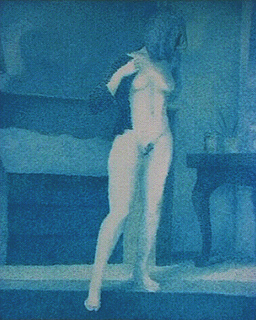

## Les bleus
### Les bleus, usages en arts plastiques
   

**Les bleus**

_[English version](english/blue.html) [](english/blue.html)_ 

\[Lectures conseillées :  
[Le bleu dans la langue française, Pourpre.com](http://www.pourpre.com/langue/expressions.php#bleu)  
[La couleur bleue, Pourpre.com](http://pourpre.com/chroma/dico.php?typ=fiche&&ent=bleu)\] 

_Les bleus font partie des parents pauvres de la famille pigmentaire : ils sont moins courants que les autres couleurs (sauf peut-être les verts ou les violets) bien que les synthèses chimiques des derniers siècles aient amélioré cet état de fait. L'être humain, avant cette période, avait déjà dû faire preuve d'une grande ingéniosité pour extraire des bleus de son environnement. Tout comme le vert, ils sont très présent autour de nous (ciel) et ont dû longtemps se faire désirer par les artistes._

_Peut être à cause de cette rareté ou parce qu'il est associé au ciel, au divin, dans la plupart des régions du monde le bleu - qui est aussi la couleur des veines, de l'ombre et de la nuit - a pu surprendre, inquiéter, repousser, voire effrayer (voir [effroi des légions romaines](bleusfroids.html#peurromaine), [peurs internationales](bleusfroids.html#peurinternationale)), surtout dans ses variantes violacées très froides et, presque absentes dans la nature. Il fut parfois la couleur du deuil, y compris dans l'Occident chrétien._

Sommaire

[Classification](bleus.html#classification)

[Précisions](bleus.html#precisions)



_Comme le [rouge](rouges.html), c'est l'une des couleurs les plus connues pour leur pouvoir de fascination souvent non dénué de sensualité. Combien de peuples l'ont employé en maquillage pour renforcer la séduction d'un regard, ou bien en peinture et en sculpture pour évoquer un exotisme troublant, un dieu ou un mortel au pouvoir mystérieux ?_

_Au XVIIIème siècle, le bleu était déjà redevenu à la mode. Celle-ci atteint peut-être son paroxysme de nos jours où d'une station de radio à une équipe de football en passant par une numérotation téléphonique et une foule de services commerciaux, le bleu est devenu dans tout le monde occidental l'objet d'une adoration inimaginable il y a mille ou deux mille ans et dans d'autres civilisations aujourd'hui encore. Peut-être a-t-il perdu l'aspect négatif de sa symbolique passée parce qu'il n'est plus aussi rare. Il est moins surprenant, moins effrayant et livre sa véritable nature, emprunte de ciel et de nuit._

**Classification**

_Les bleus peuvent se décliner en deux catégories assez clairement distinctes que nous avons reprises sur ce site :_

> _\* les [bleus "chauds"](bleuschauds.html), dont les plus importants représentants contemporains sont sans doute les bleus de [phtalocyanine](phtalocyanines.html) de cuivre, le bleu de [manganèse](bleuschauds.html#lebleudemanganese) et le bleu [céruléum](bleuschauds.html#leceruleum)_
> 
> _\* les [bleus moyens ou froids.](bleusfroids.html) Un bleu outremer clair est proche du bleu de cobalt, donc plutôt moyen. Un outremer foncé tire nettement sur le violacé. Dans tous les cas, ces couleurs de référence, de genèse assez récente, comptent parmi les plus froides et les plus **sombres** de la palette hormis les noirs, certains violets et certains bruns. Elles s'associent très souvent avec les mauves, les pourpres, les rouges d'une part (donnant des violets) et les orangés (donnant toutes les gammes de coloris terreux) ou les jaunes (donnant des sortes de terres vertes)._

**Précisions**

Le gris de Payne qui est pratiquement un bleu est traité dans la [section des gris](gris.html).

A propos de l'adage "_les bleus éloignent_", lire l'article sur _[les familles de couleurs](famillesdecouleurs.html)_.


```
title: Les bleus
date: Fri Dec 22 2023 11:26:16 GMT+0100 (Central European Standard Time)
author: postite
```
