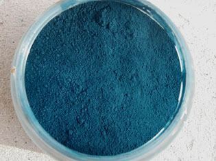
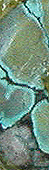

## Bleus chauds
### Bleus chauds, usages en arts plastiques
 **Les bleus chauds**

_[English version](english/warmblues.html) [](english/warmblues.html)_ 

Le céruléum - orthographe contemporaine habituelle - ou cæruleum - à l'ancienne, du latin _cælum_, ciel - ou encore le "bleu céruléen", "céleste" est un [stannate](stannate.html) de cobalt ([oxyde d'étain](blancssynthetiques.html#blancdetain) SnO3 + [cobalt](annexe1.html#co) + H2O + ... - noter que l'oxyde d'étain donne un pigment blanc, [PW15](nomenclaturepig.html#pw15)) ou parfois un chrom[ite](uresiresates.html) de cobalt ([PB36](nomenclaturepig.html#pb36)) dans l'offre de certains fabricants (voir photo ci-contre).

Contenant du cobalt, il est de toute façon extrêmement coûteux.

Permanent, couvrant, plutôt lumineux mais subtil, rompu, un peu grisâtre, il constitue bizarrement un "standard" des bleus chauds - recommandé par certains enseignants et ouvrages d'apprentissage comme substitut d'un cyan primaire ([voir ci-dessous](bleuschauds.html#utilisationceruleum)) - alors que sa composition et sa couleur l'apparentent plutôt à un bleu moyen - comme son cousin, [le bleu de cobalt](bleusfroids.html#lebleudecobalt). _Il est plus froid que le bleu de manganèse (__[voir ci-dessous](bleuschauds.html#photomanganese))._

Ses imitations (des [phtalocyanines](phtalocyanines.html)), très répandues à cause du coût élevé de l'original, sont souvent grossières, nettement plus chaudes que l'original. De plus, les assez nombreuses versions du céruléum au cobalt déclinent déjà une gamme de nuances assez variées. Cela pourrait expliquer une certaine confusion.

_L__e céruléum est ici positionné parmi les bleus chauds pour des raisons pratiques, afin de faciliter la recherche de cette couleur, mais en fait il semble bien, quand même, que sa clarté ne doit pas nous induire en erreur et qu'il s'inscrit plutôt parmi les bleus moyens, voire froids!_

L'emploi du véritable céruléum en peinture à l'huile pose un problème : le cobalt qu'il contient est un très puissant siccatif. Certains auteurs proclament joyeusement et naïvement que le céruléum est fort siccatif, comme s'il s'agissait d'un avantage... Au contraire, c'est un problème. Introduire un pigment ayant un tel pouvoir dans une peinture n'est pas innocent : cela induit notamment le risque de provoquer des "différentiels de siccativation" qui occasionnent habituellement plissements, craquelures et autres déformations indésirables.

Nous conseillons un emploi très prudent et réfléchi du céruléum véritable en peinture à l'huile pour cette raison _sauf s'il est appliqué pur entre deux couches de glacis isolants_ (il est alors prudent de respecter des temps de siccativation raisonnables). Il existe certainement d'autres procédés, mais celui-ci est sans doute le plus classique.

Par contre, nous conseillons le céruléum sans aucune réserve "technique" pour tout autre procédé pictural.

_Quel que soit la technique de peinture, l'utilisation du céruléum en mélange - notamment comme substitut d'une couleur primaire - est une aberration financière autant que chromatique. Le céruléum est précieux. Le peintre le choisit avec attention. Sa couleur est subtile. Il se prête à des corrections nuancées en glacis ou en lavis ou bien à une coloration pure à l'échelle locale ou générale beaucoup plus qu'aux mélanges destinés à l'apprentissage._


_Le bleu de manganèse_

Encore plus que les couleurs au cobalt, son emploi en peinture à l'huile pose un problème. Il est un siccatif extrêmement puissant (voir notamment [Courtrai brun](siccatifs.html#courtraibrun)). Il est magnifique mais coûte fort cher.

Il donne lieu à des imitations très intéressantes et fort justes à base de cuivre (voir cliché ci-contre).

Des pigments violets largement distribués contiennent des phosphates de manganèse ("_[violets minéraux](violetsetmauves.html#levioletmineral)_") dont il y a peut-être lieu de se méfier en emploi à l'huile.

Le bleu de manganèse et surtout sa remarquable imitation sont d'une chaleur incroyable. Ils sont "à la pointe du bleu", à l'orée des couleurs chaudes, inespérés. Du rêve à l'état pigmentaire.

[Lire l'article _Le bleu Mn-YIn_ in section Hi-tech](hitechbleumnyin.html)  
[Lire l'article _Les manganèse_s in _Familles chimiques de pigments._](manganese.html)  
[Lire l'article _Manganèse_ du glossaire.](manganese2.html)  
et sur la composition et le procédé de fabrication,  
[lire un passage dans le Courrier des Lecteurs](courrierdeslecteurs2011b030.html#20110518damanganese)

_Le bleu "phtalo"_

Il s'agit de dérivés hydrocarbonés et azotés du [cuivre](cuivre.html). D'ailleurs, leur intitulé complet est "[phtalocyanines](phtalocyanines.html) de cuivre", ce qui indique la présence [d'azote](azote.html). Leur genèse remonte au début du XXème siècle. Ils donnent lieu à différentes appellation : bleu [cyané](cyancyano.html), bleu monastral ou hélios (un intitulé utilisé pour d'autres couleurs, soulignant une certaine résistance à la lumière).

Ils sont très colorants mais peu couvrants. Ils s'adaptent bien aux [glacis](glacis.html) (huile ou autres procédés) et à [l'aquarelle](gommearabaquar.html). Ils présentent le plus souvent de bons niveaux de [permanence](pigments.html#permanence). [André Béguin](livres.html#beguin) souligne leur remarquable résistance à la chaleur.

Pouvant être déclinés du vert - _phtalocyanine de cuivre ajoutée de [chlore](chlore.html) ou de [brome](annexe1.html#br), deux éléments [halogènes](annexe1.html#halogene)_ - au violet - _phtalocyanine de cuivre + [dioxazine](dioxazines.html)_ -, ils ont la précision chromatique suffisante pour former de belles imitations (notamment celles du [bleu dit "azural"](bleuschauds.html#bleuazur), du bleu dit "turquoise" et du bleu dit "touareg" ou "Hoggar").

Ils ont d'ailleurs servi à de nombreuses imitations réussies, mais aussi à d'autres qui le sont nettement moins.

_Autres dérivés du cuivre_

Ils ont été typiquement réalisés par altération du [vert-de-gris](verts.html#vertdegris). Les premiers procédés de transformation de ce type datent du XVème siècle, voire auparavant. D'autres ont existé et la liste des pigments au cuivre est longue. Nous n'en évoquerons que quelques uns.

Dans la nature on trouve un sulfate et un carbonate.

**Le bleu d'azur, azurite ou azur d'Allemagne**

_A ne pas confondre avec la couleur du même nom (azur) mais à base de cobalt, employée pour les vitraux (voir [smalt](bleusfroids.html#lesmalt)). Ne pas confondre non plus avec la [lazurite](outremer.html#composition)._

_Etymologie : voir [glossaire](azur.html)._ 

Le _bleu d'azur_, à base d'_azurite_ (carbonate naturel de [cuivre](cuivre.html), cf. [article du glossaire](azur.html)), est encore utilisé. Il provient d'un minerai.

Ce pigment est fort coûteux. Il est d'un bleu plutôt chaud en général, assez proche du [bleu de manganèse](bleuschauds.html#lebleudemanganese), mais sur un seul filon on peut trouver des teintes proches de l'outremer. Broyé grossièrement, il conserverait une teinte plus vive tout comme le [lapis-lazuli](bleusfroids.html#lelapislazuliveritable) et la [malachite](verts.html#vertmalachite).

La première utilisation en peinture remonterait à l'Égypte du IIIème millénaire BC.

Pendant l'Antiquité romaine, le premier centre de production semble être l'Arménie. L'azur est alors nommé _lapis armenis_ ("pierre d'Arménie", donnant aussi une variété verte, la [malachite](verts.html#vertmalachite)) et est utilisé en cosmétique. Puis viennent le tour d'Alexandrie (peut-être aussi du Sinaï) et, conjointement, de [Pouzzoles](pouzzoles.html).

Mais le rayonnement de l'azurite concerne tout le continent eurasien.

En Chine, une utilisation picturale apparaît avant la fin de l'Antiquité tandis que l'Occident et le Japon attendront le Moyen-âge. Dans toute l'Asie, l'azur a compté parmi les pigments importants, assez recherchés pour susciter des liens commerciaux jusqu'à  l'Europe (notamment la Hongrie).

Les sources de production ont changé à mesure que les gisements s'épuisaient.

Plus tard, l'Allemagne semble être devenue un considérable centre de production, d'où l'intitulé "azur d'Allemagne", "bleu d'Allemagne", voire même "magne". Noter que le terme d'_ocre bleu_ ou, un peu plus couramment, de _cendre bleue_, sont quelquefois employés.

Aujourd'hui, Chypre, l'Arménie toujours, la France, l'Italie et l'Allemagne encore seraient les principaux lieux d'extraction. Sur ces lieux proprement dits, on trouve souvent aussi du [vert de malachite](verts.html#vertmalachite), ce qui explique notamment le double sens du terme "pierre d'Arménie".

L'azur d'Allemagne était lié, au Moyen-âge, avec une "eau de gomme" ([gomme arabique](gommearabaquar.html)) éventuellement ajoutée de [blanc d'oeuf](oeuf.html#blancdoeuf), ou avec de la [caséine](caseine.html) ou avec du [jaune d'oeuf](oeuf.html), mais pas avec de l'huile (apparue bien plus tard). Le broyage est léger (trop fin, il serait plus terne, ce qui n'est pas un cas isolé). Nous ignorons le comportement du véritable azur en peinture à l'huile. La [cendre bleue](bleuschauds.html#lacendrebleue) contient de l'azurite et verdit au contact de l'huile, mais est-ce à cause de ce composant ? Ce n'est pas à exclure _a priori_, mais rien ne permet de l'affirmer sans [confirmation](ecrire.html).

**La cendre bleue et le bleu d'Égypte**

Selon nos sources, la cendre bleue serait un mélange [d'azurite](bleuschauds.html#lebleudazurditazuriteouazurdallemagne) et de bleu de montagne (un parfait inconnu : on ne connaît _a priori_ que le [vert de montagne](verts.html#vertdebrunswickouvertdemontagne), mais il s'agit peut-être d'une variante). La [cendre verte](verts.html#vertveroneseoucendreverte) serait également produite - lors du raffinage de [l'argent](argent.html) - sur la même base, un carbonate de cuivre. La cendre bleue est d'ailleurs nettement réputée virer au vert au contact de l'huile.  Elle est donc utilisé pour les peintures à l'eau (surtout la gouache et l'aquarelle), mais même ainsi, le verdissement pourrait apparaître (information non confirmée).

Ce pigment serait surtout produit au Royaume Uni (le procédé de fabrication est secret). Nous croyons savoir qu'il contient, outre le carbonate de cuivre, du cuivre oxydé et du carbonate de [chaux](chaux.html).

Il est clair et plus ou moins chaud. Il serait plutôt fugace ou du moins versatile.

Les cendres bleues actuelles sont  presque toutes des imitations.

**Le bleu d'Egypte**

Selon diverses sources, la cendre bleue serait plus permanente sous sa forme calcinée : le bleu d'Égypte. En réalité, ce dernier ne peut être réduit à une simple [cendre bleue](bleuschauds.html#lacendrebleue) ou une [azurite](bleuschauds.html#azurite) calcinée : son procédé de fabrication originel, fort ancien (VIème siècle BC selon certains, au moins 2500 voire 3000 BC selon d'autres) mais déjà très complexe est mal connu. La région était certes dès le IVème millénaire en plein chalcolithique mais la connaissance de la technologie du cuivre ne suffit pas à expliquer à elle seule la capacité de réaliser un [frittage](frittage.html) suivi d'un broyage, procédé de fabrication généralement évoqué. A strictement parler nous savons seulement que l'on trouve dans ce bleu de la [silice](silice.html), du cuivre et du [potassium](potassium.html) ou du [sodium](sodium.html) (donnant des teintes subtilement différentes). L'Égypte ancienne est d'ailleurs réputée pour sa précocité dans le domaine des [glaçures](glacure.html) et [couvertes](couverte.html).

Cette composition, cuivre mis à part, évoque un peu celle de l'outremer, donc du [lapis-lazuli](bleusfroids.html#lelapislazuliveritable), ce qui n'est peut-être pas fortuit : certains auteurs prétendent que le bleu égyptien était une imitation du précieux gemme, se basant sur une traduction de l'appellation originale égyptienne.

Si l'on s'en tient à celle-ci il, s'agirait peut-être de la première imitation par synthèse dans l'histoire de l'humanité. Une imitation toutefois grossière car chromatiquement beaucoup plus chaude que le lapis-lazuli, à cause de la présence de cuivre. Tempérons cependant ce point de vue : la distinction entre les bleus a longtemps été très approximative.

Un doute subsiste cependant. Le bleu d'Égypte ressemble surtout à [l'azurite](bleuschauds.html#azurite) qu'il a d'ailleurs remplacée non sans une raison majeure : le carbonate de cuivre ne pouvait avoir la tenue d'une substance frittée (donc "dé-carbonée" à la cuisson et enrobée dans la silice) dont la [permanence](pigments.html#permanence) et la [stabilité](pigments.html#compatibilitesetincompatibilites) sont légendaires.

Notons au passage que le bleu d'Égypte n'a pas été seulement fabriqué à partir d'azurite. On cite différents composants cuivrés. Même le bronze aurait été utilisé (information non confirmée).

Rome a importé ce bleu "égyptien" qui n'a d'ailleurs pas été produit qu'en Égypte mais dans toute la région. Grèce, Gaule, Ouzbékistan, Scandinavie, etc., auraient même importé cette couleur avant Rome. Puis, au cours du Moyen-âge, la recette (ou les recettes) se perdit comme tant d'autres, mais il existe de nos jours des synthèses  - très proches quant à la composition chimique des produits finis - dont la permanence est exceptionnelle.

**Le bleu céleste dit bleu de Brême**

Très différent du bleu céruléum dont il arbore sensiblement le même surnom, c'est un dérivé toxique d'arséniate de cuivre découvert au XIXème siècle.

_Autres bleus chauds_

**Le bleu de Prusse, dit aussi bleu de Berlin**

Lecture conseillée :  
[Le bleu de Prusse sur Pourpre.com](http://pourpre.com/chroma/dico.php?typ=fiche&&ent=prusse)


Certains auteurs proposent le bleu de Prusse comme substitut du [cyan](cyancyano.html) pour l'apprentissage des synthèses de couleurs en aquarelle. A priori, il ne semble pas assez clair pour cela (l'image ci-contre donne une représentation standard de sa couleur). Certes il est très chaud, mais sans apport de blanc (assez rare dans cette technique), il ne fera jamais un bon cyan même très dilué.

De même, s'il est intéressant en mélange, il est fort encombrant par son énorme pouvoir colorant (et "repoussant", dit-on), surtout sensible en peinture à l'huile ou acrylique. Pour cette raison, il peut être employé en premier lieu en faibles doses pour enrichir un noir ou un gris (voir à ce sujet _[Le gris de payne](gris.html#payne)_).

Calciné, il forme un _brun de Prusse_ ou un _noir de Prusse_. Les deux afficheraient une permanence certaine, mais aussi quelques incompatibilités. Il est déconseillé de pratiquer la "calcination maison" car dès 250°C, ce pigment commence à se décomposer partiellement en éléments mal décrits par les nomenclatures, mais possiblement dangereux.

Le bleu de Prusse est constitué de cyanure de fer (ferro[cyanure](cyanure.html) [ferrique](ferrique.html) [potassique](potasse.html)).

A lire absolument :  
[La genèse du bleu de Prusse](chap10ocrebleue.html#genesebleudeprusse) in  
Les dialogues de Dotapea,  
chap. X, l'ocre bleue

Il a été découvert par hasard à Berlin (d'où son nom initial) en 1710 par Dippel - un personnage que l'on a présenté comme "discutable" mais à tort ou à raison - et Diesbach. Entre autres possibles indélicatesses, Dippel aurait vendu au marchand de couleurs Diesbach une potasse frelatée (possiblement chargée de fer) qui aurait provoqué un bleuissement inattendu dans une préparation de ce dernier.

En réalité, il existe plusieurs versions de l'histoire de cette découverte presque légendaire (cf. [Béguin](livres.html#beguin), T. 1, p.155) et il est très difficile de trancher sur la manière dont cette genèse s'est opérée. L'article du site _Paint Café_ donne ainsi une version certes plausible mais selon nous beaucoup trop affirmative ([lien](http://www.paintcafe.com/fr/propos/histoire/prusse/)).

Cette histoire comporte des ramifications. Notamment la création d'un "bleu de Paris" ou "bleu de France" assez méconnu par une curieuse transmission de savoir que plusieurs auteurs évoquent.

Une propriété bien spécifique à ce pigment doit être mentionnée : son lavage est particulièrement long et toutes les productions n'ont pas la même qualité. D'après André Béguin, certains de ces pigments peuvent avoir des reflets évoquant le bronze tandis que d'autres, tirant sur le vert, sont dits "sans bronze" pour signifier une qualité supérieure.

Question toxicité, il faut préciser que le bleu de Prusse ne se décompose pas en "[cyanure](cyanure.html)" lors d'une ingestion. Il ne peut pas être considéré comme un véritable toxique dans des conditions habituelles d'utilisation. Par contre, il faut signaler sa dangereuse instabilité en présence d'acides forts, d'alcalis et de chromate de plomb, sans parler de son seuil thermique de décomposition assez peu élevé, déjà mentionné ci-dessus (informations [RepTox](liensutiles.html#csst)).

Lecture conseillée :  
[Le bleu de Berlin sur Pourpre.com](http://pourpre.com/chroma/dico.php?typ=fiche&&ent=berlin)

Comportement en peinture

Il est réputé "[siccatif](sechagesiccativation.html)" (un terme relativement suspect) en peinture à l'huile, ce qui ne serait pas forcément un bon point, comme nous le disions ci-dessus, si cette information était confirmée. Mais ce point semble douteux car le fer est particulièrement jaloux et veille à ne pas se séparer des atomes d'oxygène dont il s'entoure. D'autre part, l'expérience ne semble pas confirmer cette assertion de manière criante. Par contre, il est agréablement absorbant.

Très stable à la lumière sauf en mélange à l'huile (il noircirait - information non confirmée), [instable](pigments.html#compatibilitesetincompatibilites) selon d'autres sources pas forcément bien informées, peu permanent - il deviendrait transparent -, très colorant, il convient en fait surtout aux glacis légers et locaux ainsi qu'à l'aquarelle. Il faut bien dire, cependant, que certains auteurs et intervenants préconisent radicalement son élimination de la palette dans le domaine de la peinture à l'huile, voire pour d'autres procédés. Il faut cependant garder la tête froide devant de si radicales condamnations, courantes dès lors que certains mots repoussoirs comme "cyanure" sont évoqués.

Selon certaines sources, le bleu de Prusse serait incompatible avec le [Caparol ®](caparol.html). Information non confirmée.

Il donnerait lieu à des verts "prussiques" en alliance avec des jaunes, couleurs maintenant réputées de mauvaise qualité. Il y a lieu de se préoccuper de la composition exacte de tels composés pigmentaires. Il en va de même pour les "verts de zinc" qui contiennent du bleu de Prusse.

Le bleu de Prusse a servi à la fabrication de bleus charrons. [Voir ci-dessous.](bleuschauds.html#lebleucharron)



**Le bleu charron ou bleu charrette**

_Dotapea_ cherche des informations à son sujet : nous avons testé une version aujourd'hui présentée comme standard et en avons tiré des résultats très intéressants, cependant notre connaissance de la composition et de l'histoire de ce produit est assez insuffisante.

Tout ce que nous pouvons dire, c'est 

> \* qu'il est difficile de définir sa teinte. Plutôt chaude (voir photo ci-contre d'un pigment banal vendu comme "bleu charron", probablement une [phtalocyanine de cuivre](phtalocyanines.html)) ou plutôt froide (version [pastel](bleusfroids.html#lindigomedieval)), le bleu charron est tantôt sombre, tantôt clair car rehaussé de blanc ;
> 
> \* qu'il est fabriqué en France ;
> 
> \* que c'est une couleur qui a connu un usage traditionnel possiblement très ancien. Le terme "charron" réfère à la couleur couramment employée pour peindre les roues (dites "charrons") des charrettes ;
> 
> \* que sa fabrication a été durablement interrompue, mais qu'elle a repris ;
> 
> \* qu'il est utilisé par certains peintres dans différents mélanges destinés à créer ou enrichir un noir, notamment en combinaison avec un rouge.

Sa composition demeure assez mystérieuse. La définition "_Bleu de Prusse chargé de [sulfate de baryte](baryte.html)_" retenue par notre confrère Yan Bilik de [Pourpre.com](http://www.pourpre.com/chroma/dica.php?fiche=charron) et différentes sources (notamment [André Béguin](livres.html#beguin), pour qui "_les bleus charrons sont chargés de [barytine](baryum.html#barytineetwhitherite)_" - p. 156) ne semble pas correspondre à la composition de certains bleus charrons trouvés dans le commerce, qui semblent dépourvus de blanc. Surtout, il n'est pas exclu - mais sous toute réserve - que les artisans aient réalisé eux-mêmes, originellement, un mélange entre un pigment à base de [pastel](bleusfroids.html#lindigomedieval) et éventuellement (reste à savoir pourquoi) du blanc de baryum ou d'un autre blanc. La variété traditionnelle de ce bleu a pu être réalisée à partir des résidus prélevés dans les cuves où est préparée _la guède_, ["l'indigo médiéval ou antique"](bleusfroids.html#lindigomedieval) européen. Ou bien le bois pourrait avoir été teint, à la manière d'un tissu. Précisément, nous avons eu accès indirectement à un témoignage - non confirmé - d'une teinture dite "bleu charron" en France à base de bleu de méthylène, à l'époque moderne.

Une hypothèse : le bleu charron aurait été initialement réalisé à partir d'une teinture à la guède, puis remplacé par des produits plus modernes.

Quelque chose demeure particulièrement troublant en ce qui concerne cette couleur dont le nom est associée au chariot : elle semble rappeler l'importance pour le moins notable dudit chariot dans les anciennes traditions européennes, notamment par le biais du trésor archéologique de Vix (char de Vix), tout en semblant lui associer peut-être une valeur symbolique encore plus importante accordée dans l'antiquité celtique ou celto-germanique à la couleur bleue, pratiquement "tabou" pour les Romains et d'autres peuples indo-européens. Il y a là un mystère persistant et d'autant plus intéressant que le bleu est de nos jours redevenu l'objet d'un attachement manifeste.

A ce jour, beaucoup de questions restent posées et toute personne détenant des informations au sujet du bleu charron est chaleureusement invitée à nous contacter. [Cliquer ici.](ecrire.html)

Une référence dans le Courrier des Lecteurs : [cliquer ici.](courrierdeslecteurs2009a140.html)

A lire absolument : [barjaweb.free.fr/SITE/Album/char.html](http://barjaweb.free.fr/SITE/Album/char.html)  
Et aussi : [Le bleu charron sur Pourpre.com](http://pourpre.com/chroma/dico.php?typ=fiche&&ent=charron)

_La turquoise_

On fait de cette pierre une poudre pigmentaire très coûteuse car le broyage ne serait semble-t-il pas très facile à réaliser (information non confirmée mais plausible).

Les gisements se trouvent en Iran et au Nouveau-Mexique (États-unis). La turquoise a peut-être été employée comme pigment pour les arts du feu durant l'Antiquité égyptienne ("pâte égyptienne"), mais cette information n'est pas confirmée. Au contraire, on sait qu'une "couleur turquoise" dite "bleu égyptien" était produite par l'action de la [soude](soude.html) ou de l'oxyde de sodium sur le cuivre.



La véritable turquoise est assez peu connue des auteurs occidentaux dans le domaine des Beaux-arts, elle brille par son absence dans les catalogues des meilleurs fournisseurs, mais quelques peintres l'emploient. De nos jours, ils vont l'acheter notamment en Égypte.

La pierre est opaque. Sa couleur n'est pas fixe. Elle va du bleu clair au vert franc. Elle contient en effet du cuivre. C'est un alumino-[phosphate](phosphate.html) de [cuivre](cuivre.html) hydraté. Comme on peut le distinguer sur la photo (remerciements à [Catherine Lisack](quinoussommes.html#catherinelisack)), elle est veinée. Elle contient des parties blanches, noires et rougeâtres --> Il est impossible de définir ce qu'est exactement la couleur turquoise !

A ce propos, les imitations de cette couleur sont assez courantes sur le marché. Ce sont le plus souvent des [phtalocyanines](phtalocyanines.html) bleues ou vertes qui ont bien des couleurs proches des minéraux concernés, mais ne peuvent certainement pas prétendre leur ressembler sur le plan de l'aspect inimitable des minéraux broyés.

IMPORTANT : le broyage le plus fin n'est pas forcément le plus intéressant pour le peintre ([lire passage au sujet du lapis-lazuli _in_ Bleus froids](bleusfroids.html#broyage) ou ci-dessus [le passage concernant l'azurite](bleuschauds.html#azurite)).

Lecture conseillée : [Le bleu turquoise sur Pourpre.com](http://pourpre.com/chroma/dico.php?typ=fiche&&ent=turquoise)

_Le cyan_

C'est une synthèse correspondant plus ou moins à cette [couleur primaire](synthesesoustractive.html#primaires). Elle est proposée dans les gammes "basiques" ou "études" des fabricants de couleurs. Il s'agit le plus souvent de [phtalocyanine de cuivre](bleuschauds.html#lesbleusphtalo).

Lecture conseillée : [Le cyan sur Pourpre.com](http://pourpre.com/chroma/dico.php?typ=fiche&&ent=cyan)


 [Communication](http://www.artrealite.com/annonceurs.htm) 

[](index-2.html#20131014)


```
title: Bleus chauds
date: Fri Dec 22 2023 11:26:16 GMT+0100 (Central European Standard Time)
author: postite
```
