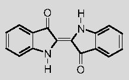

## Sodium et oxyde de sodium
### Sodium et oxyde de sodium, article du glossaire
 **Les bleus moyens et froids**

_[English text](english/intermediatecoldblues.html) [](english/intermediatecoldblues.html)_ En introduction, on dira d'abord que si l'oxyde de cobalt est le principe colorant des deux pigments, l'un, l'antique smalt ([voir ci-dessous](bleusfroids.html#lesmalt)), est siliceux (enserr� dans du verre), l'autre, le bleu de cobalt, est alumineux.

_Le bleu de cobalt_

Composition typique�: _oxyde de cobalt + oxyde d'aluminium_. On le nomme aussi, � tort para�t-il, _aluminate de cobalt_.

Concernant les synth�ses ult�rieures et actuelles, on d�crit plusieurs proc�d�s mais ils sont tous associ�s � une calcination (1300�C environ). Le principe semble en effet toujours d'enserrer du cobalt oxyd� dans une masse [d'alumine](alumine.html).

Le [cobalt](cobalts.html) oxyd� �tant l'un des plus puissants siccatif pour la peinture � l'huile, le rapport quantitatif entre masse alumineuse et cobalt est d�terminant. Dans l'ensemble, on consid�re cette couleur comme effectivement [siccative](siccatifs.html) au sens propre. Le contact entre l'oxyde de cobalt et l'huile cr�e des "diff�rentiels" de siccativation, provoquant craquelures, plissements et autres accidents. Une solution possible - parmi d'autres - � ce probl�me consiste � appliquer la p�te huile/cobalt entre deux couches de glacis isolant en respectant pour chaque couche un temps de siccativation particuli�rement "prudent".


Le bleu de cobalt est plut�t franc. Il est g�n�ralement moins violac� que [l'outremer](outremer.html) bien que sa couleur, associ�e � la proportion cobalt/alumine, ne soit pas une r�f�rence bien fix�e. [Fran�ois Perego](livres.html#perego) d�crit cependant une caract�ristique bien sp�cifique : "_il absorbe totalement du vert-jaune au rouge moyen_", ce qui peut expliquer cet "aspect franc" reconnaissable.

Certains auteurs le d�crivent comme peu couvrant, d'autres le trouvent opaque, mais la composition du pigment pourrait jouer un r�le dans ces diff�rences d'appr�ciation. En fait, le proc�d� de fabrication n�cessite un savoir-faire d�terminant grandement sa qualit�.

Pr�cis�ment, certains cobalts peuvent sembler un peu "pauvres", voire ternes, � tout le moins sans grand int�r�t. Comme l'�crit non sans euph�misme [Xavier de Langlais](livres.html#langlais), "(...) _il acquiert de la distinction dans les m�langes avec le blanc_" - � noter que le [bleu c�ruleum](bleuschauds.html#leceruleum) est lui-m�me un cobalt rehauss� le plus souvent au [blanc d'�tain](blancssynthetiques.html#blancdetain). Selon le m�me auteur, il pourrait contracter une variante de la "[maladie de l'outremer](outremer.html#maladiedeloutremer)" dans les m�mes conditions que ce pigment.

Comme dans le cas du [bleu outremer](outremer.html), la synth�se de cette couleur a fait l'objet d'un concours organis� par la Soci�t� d'Encouragement pour l'Industrie Nationale�: il fallait un bleu autorisant davantage d'emplois que le [smalt](bleusfroids.html#lesmalt). C'est Th�nard, en 1802, qui le remporta.

La distribution �largie d'imitations du bleu de cobalt (typiquement une combinaison d'aluminosilicate de sodium type outremer, d'oxyde de zinc et de phtalocyanine de cuivre) ne correspond pas � un probl�me de toxicit� mais en premier lieu � la n�cessit� de proposer un produit de couleur sensiblement �quivalente � plus faible co�t.

Il est de toute fa�on peu recommand� de se procurer un bleu de cobalt authentique _s'il n'est pas de qualit� r�ellement sup�rieure_ car il n'apportera rien de majeur par rapport aux imitations alors qu'il co�tera vraiment beaucoup plus cher et sera plus difficile d'emploi si le proc�d� utilis� est la peinture � l'huile.

Le mot cobalt proviendrait de _kobold_ ou de termes germaniques proches  
d�signant de mauvais g�nies miniers accus�s de substituer ce min�ral �  
celui recherch� par les mineurs (l'argent selon certains, le cuivre selon d'autres).  
Autre explication : la pr�sence de cobalt serait associ�e � celle d'arsenic et  
ce sont les vapeurs de celui-ci, lors de calcinations mini�res, qui seraient  
� l'origine de cette appellation.

_Le smalt ou smalte_

Synth�se � base de cobalt et de silice (� distinguer du bleu de cobalt, [voir ci-dessus](bleusfroids.html#lebleudecobalt)).

Les auteurs �voquent un relatif succ�s de cette couleur au XV�me ou au XVI�me si�cle. On peut dire, d'une certaine mani�re, qu'il rev�t deux formes � cette �poque :

> \* c'est un oxyde pour la verrerie et les gla�ures � base de phosphate ou de chlorure de cobalt
> 
> \* c'est un pigment pour la peinture, cr�� sur la m�me base : on produisait un verre teint� avec cet oxyde, apr�s quoi on le broyait. Au XVII�me si�cle, l'aspect "miroitant" du smalt �tait exploit� en peinture d�corative pour orner les m�taux. Aujourd'hui, cet aspect est totalement absent de la plupart des vari�t�s produites � cause d'un broyage devenu beaucoup trop fin, trop parfait, lui conf�rant une grande banalit�.

Cependant cette "vogue du smalt" occidentale relativement r�cente ne doit pas faire oublier des fabrications beaucoup plus anciennes. Les emplois dans les arts du feu sont tr�s anciens. On mentionne la Babylone du XVII�me si�cle BC, l'Egypte du XVI�me BC. La r�duction en poudre pigmentaire serait nettement plus r�cente (� partir du XI�me AC).

Ce pigment �tait (et demeure) tr�s co�teux et d'un emploi malais�. Sa permanence est mise en doute par certains auteurs. Dans le domaine de la peinture, l'une des argumentations est la suivante : le smalt serait produit avec du verre [potassique](potassium.html) et non [sodique](soude.html) (les raisons demeurent obscures et l'information n'est pas confirm�e), donc le potassium inclus dans le verre pourrait [saponifier](saponification.html) des [corps gras](gras.html#corpsgras) tels qu'une huile � peindre, une cire ou de l'oeuf. Quant au domaine des arts du feu, le m�me potassium aurait tendance � se dissoudre en pr�sence d'eau ou d'acide. L� aussi, l'information n'est absolument pas confirm�e et si vous disposez d'informations pr�cises, n'h�sitez pas � [nous contacter](ecrire.html).

> **\-->** Une confirmation remarquable nous est finalement parvenue. Lire [passage](courrierdeslecteurs2009c080.html#20091026ev) in Courrier des Lecteurs.

La teinte du smalt n'est pas particuli�rement plus froide que celle du lapis lazuli, contrairement � ce que certains auteurs affirment. D'autres auteurs lui attribuent une couleur plus terne que celle du bleu de cobalt mais on ne reprendra pas ces propos tant les processus de fabrication sont variables et d�terminants dans un cas comme dans l'autre. Il existe de beaux smalts, certains cobalts sont un peu banals et vice versa. De plus, les couleurs ternes ne sont pas forc�ment sans int�r�t.

Le terme _smalt_ signifie _[�mail](email.html)_ en francique

_Le cas particulier du bleu caeruleum_

Souvent consid�r� comme bleu chaud, sa composition comme sa couleur l'apparentent pourtant bien plus � un bleu moyen que par exemple le bleu de mangan�se.

Pourtant, tenant compte de l'usage (tr�s discutable) qui veut qu'il soit employ� � la mani�re d'un cyan primaire, nous l'avons class� parmi les bleus chauds. [Cliquer ici pour atteindre le texte qui lui est consacr�.](bleuschauds.html#leceruleum)

_Le lapis-lazuli, dit outremer v�ritable_

_�tymologie �:  du latin m�di�val, signifiant "pierre d'azur"_

_Introduction_

Il est encore plus cher que le [bleu de cobalt](bleusfroids.html#lebleudecobalt), ce qui explique le succ�s d'une imitation - ou plut�t d'une synth�se - devenue c�l�bre (l'outremer contemporain, [qui fait l'objet d'un article s�par�](outremer.html)). Il s'agit typiquement d'un thiosulfate de silicate d'aluminium, de sodium et de calcium�: (Na,Ca) Al, Si,O et SO, soit une formule tr�s sensiblement identique - � quelques variations pr�s, voir _[Les outremers, famille de pigments](outremers.html)_ - � la c�l�bre synth�se de Jean-Baptiste Guimet, un aluminosilicate de sodium polysulfur�. Seule la pr�sence ou l'absence de calcium ou d'autres �l�ments et surtout la quantit� de soufre diff�rent, et c'est d'ailleurs, semble-t-il, en faisant varier cette teneur en soufre que l'industrie aurait pu cr�er plusieurs type d'outremers.

Revenons � notre lapis. D'apr�s [Anne Varichon](livres.html#annevarichon), "_On lui donne le nom d'_oltramarino _(venu d'au-del� des mers) par opposition � l'[azurite](bleuschauds.html#lebleudazurditazuriteouazurdallemagne), d�sign�e jadis comme_ azzuro citramarino _(bleu venu de ce c�t�-ci de la mer)._"


Il s'agit d'une pierre semi-pr�cieuse (photo ci-contre, remerciements � [Catherine Lisack](quinoussommes.html#catherinelisack)). Elle fut extraite d�s 6000 BC dit-on, � Kokcha, une haute vall�e du Badakhshan, dans le Pamir afghan, � trois ou quatre cents kilom�tres seulement des sources de l'Indus. Mais � diff�rentes �poques, d'autres gisements auraient �t� exploit�s en Perse et jusqu'en Chine et en Sib�rie.

Dans le pass�, le co�t d'un acheminement difficile sur terre et sur mer s'ajoutait au difficile travail d'extraction. Le lapis lazuli �tait fastueux, plus co�teux que l'or, ce qui explique d'ailleurs sa pr�sence dans les bijoux et masques fun�raires des familles royales �gyptiennes.

_L'antique mine afghane_

Elle est toujours en service. La r�serve, aussi colossale que difficile � travailler, est � peu pr�s in�puisable.  
Les conditions d'exploitation sont toujours extr�mes � ce jour pour deux raisons :

> \* la r�gion demeure l'une des plus dangereuses et inaccessibles au monde, tant parce qu'il s'agit d'une zone isol�e de haute montagne qu'� cause d'une ins�curit� et d'une instabilit� politique chroniques,
> 
> \* la neige emp�che tout acc�s en dehors d'une partie de l'�t�.

Un documentaire film� lors d'une exp�dition � haut risque de Gary Bowersox (voir ci-dessous) montre quelques images d'une v�n�rable galerie qui, sur des centaines de m�tres, porte les stigmates d'un travail rudimentaire. Les parois sont couvertes de suie car les impressionnantes veines de minerai sont mises � d�couvert par projection d'eau froide sur la paroi chauff�e � l'aide d'une torche, ce qui provoque un �clatement de la roche.

**R�f�rences G. Bowersox :**

_\* Le tr�sor cach� des pharaons_ (vid�o),  
Gary Bowersox, r�al. W. Kn�pfler, Autriche 2001,  
Media Program of the European Union

\* Le site de G. Bowersox, [gems-afghan.com](http://www.gems-afghan.com/) (anglais)

La raret� du lapis lazuli sur notre plan�te n'est pas la seule raison de son co�t, quels que soient l'emplacement de la mine et les difficult�s d'acheminement : son extraction n'est gu�re rentable. Il faut, dit-on, traiter 100 kg de roche pour obtenir 3 kg de pigment (information non confirm�e). Ce qui ne doit pas, de plus, faire oublier les n�cessaires op�rations de purification, anciennement effectu�es � l'aide [d'ammoniac](ammoniac.html) notamment.

En Europe occidentale, le lapis-lazuli n'appara�t qu'au XII�me si�cle AC _via_ Byzance. Dans l'Antiquit�, Pline ne le mentionne m�me pas. Par contre, l'Orient syro-anatolien l'emploie depuis le IX�me BC pour le travail du verre. Puis, au V�me AC, des artistes le broient et s'en servent pour la premi�re fois pour peindre, en Afghanistan (informations [Anne Varichon](livres.html#annevarichon)).

L'�gypte ancienne le conna�t aussi, mais l'utilise sous forme de pierre alors que sur le plan pigmentaire, elle en r�alise une imitation (cf. [bleu d'Egypte](bleuschauds.html#lebleudegypte)). Il est vrai que le lapis-lazuli est avant tout un superbe min�ral que l'on n'a pas forc�ment envie d'employer comme pigment. On peut consid�rer le broyage de ce cristal comme une id�e originale et audacieuse qui ne vient pas facilement � l'esprit. C'est donc une v�ritable d�couverte m�thodologique majeure de la part des peintres afghans. De fait, le m�me proc�d� sera appliqu� � la [malachite](verts.html#vertmalachite), � [l'azurite](bleuschauds.html#azurite) et � la [turquoise](bleuschauds.html#laturquoise) en Asie centrale et occidentale notamment.

Le lapis-lazuli est r�put� - et "seulement" r�put� - stable _dans tous les m�langes_. Il contient du soufre et sa purification n'est pas une op�ration simple... autant de faits pouvant inciter � un peu de prudence sur ce point.

Aucun de nous ne l'a test� � ce jour et nous ne disposons d'aucun t�moignage r�ellement int�ressant. Pour nous �crire, [cliquer ici](ecrire.html).

_Broyage_

Jusqu'au XII�me si�cle AC, le proc�d� de broyage n'autorisait qu'un grain assez irr�gulier et plut�t grossier. L'invention d'un nouveau proc�d� de broyage ne fut peut-�tre pas une si bonne id�e, c'est du moins ce qui nous semble � nous qui disposons aujourd'hui d'autres pigments bleus de la m�me cat�gorie, donc d'un choix. Le lapis pourrait avoir �t� beaucoup plus beau lorsqu'il �mettait des rayons moins homog�nes, plus cristallins. Cette question est essentielle de nos jours pour qui voudrait se procurer cette rare couleur. Elle se pose de la m�me mani�re en ce qui concerne [la malachite](verts.html#vertmalachite), [l'azurite](bleuschauds.html#azurite) et la [turquoise](bleuschauds.html#laturquoise), mais aussi le [smalt](bleusfroids.html#lesmalt).

L'utilisation qui en a �t� faite vers la fin de Moyen-�ge peut d'ailleurs para�tre d�cevante. Le lapis �tait vendu en p�te devenue homog�ne, m�l� de pl�tre, de cires ou autres substances qui alt�raient sa teinte. Ce n'�tait plus qu'un produit marchand dont la quantit� �tal�e sur l'oeuvre peinte �tait sp�cifi�e par contrat (source [Anne Varichon](livres.html#annevarichon)).

[Tout t�moignage d'utilisation du lapis-lazuli sera le bienvenu.](ecrire.html)

_L'indigo, les indigos_

_Cette couleur dont le nom est devenu un enjeu commercial (il suffit de taper "indigo" sur un moteur de recherche pour s'en convaincre...) est assez particuli�re, un peu myst�rieuse. Le moins que l'on puisse dire est qu'elle a une histoire charg�e qui n'est d'ailleurs pas termin�e. Elle est encore employ�e aujourd'hui en Union Indienne comme il y a au moins 2000 ans, mais il y a plus de 1000 ans, son simple nom excitait d�j� les imaginations puisque l'on l'usurpait en Occident pour d�signer une autre substance (voir [ci-dessous](bleusfroids.html#lindigomedieval))._

Le terme indigo �tait d�j� employ� dans l'Antiquit� romaine.

Soit dit sous toute r�serve, cette substance tinctoriale aurait �t� r�duite en poudre et utilis�e par les peintres d'alors et ceux du Moyen-�ge. Cette information n'est absolument pas confirm�e. Au contraire, nous avons des raisons de penser qu'il y a confusion�:

> **l'indigo m�di�val** (en fait sans doute antique) utilis� pour les miniatures n'est pas la teinture d'origine indienne : il �tait produit � partir des feuilles d'_isatis tinctoria_, dit _la gu�de_ ou _le_ _pastel_ ([lire l'article du glossaire](pastel.html) au sujet de ce dernier mot aux multiples sens), une petite plante � fleurs jaunes. On laissait fermenter des boules de feuilles (cocagnes) r�duites en pulpe � l'aide de moulins ou de proc�d�s moins perfectionn�s dans des temps plus anciens. Les feuilles fra�ches permettraient d'obtenir un produit beaucoup plus color�, mais dans les convois commerciaux elles ont d'innombrables fois eu le temps de s�cher et de perdre leur qualit�. Le proc�d� tinctorial (la "cuve" de gu�de) fait appel � un agent biologique, une bact�rie nomm�e _Clostridium isatid_.
> 
> Certains auteurs �voquent aussi une substance myst�rieuse d'un bleu violac� tir�e d'un tout aussi myst�rieux "_folium_" ("la feuille", d'un arbre non pr�cis�) qui serait r�f�renc� dans des manuscrits m�di�vaux. Le myst�re et les confusions m�di�vales entourant les bleus violac�s provient possiblement du statut inconvenant que l'�glise d'alors r�servait au violet, couleur tr�s proche (lire [l'introduction de l'article _Violets et mauves_](violetsetmauves.html#introduction)).
> 
> Mais la gu�de ne fut pas utilis�e seulement au Moyen-�ge et en Occident. Probablement originaire de l'Asie occidentale, elle aurait �t� introduite dans d'autres r�gions au n�olithique. Elle aurait �t� connue dans une vaste zone allant de l'Europe du Nord � l'�gypte et � l'Inde d�s le II�me mill�naire BC (non confirm�).

> En �gypte, ce sont les Romains qui lui auraient substitu� l'indigo "indien". Si le pastel dispara�t progressivement d'Orient, sa pr�sence en Occident s'est install�e durablement bien que cette couleur fut d�nigr�e, voire crainte par les Latins. Les l�gions romaines auraient trembl� de peur face aux combattants celtes ou germains qui enduisaient leur peau de teinture de gu�de. Curieusement, ce bleu aurait �t� r�put�, dans le monde celto-germanique, capable de chasser certains animaux et certains esprits. Cela ressemble � une l�gende, mais quand on pense � l'importance attribu�e � la couleur dans le combat militaire il y a moins de cent ans, la peur bleue des troupes de Rome devient plausible, d'autant plus que d'autres frayeurs chromatiques, en d'autres lieux, sont bien connues des historiens.
> 
> Bien plus tard, du XIII�me au XV�me si�cle, _isatis tinctoria_, devenu tr�s en vogue gr�ce � l'instauration d'un nouveau proc�d� de teinture, fit la fortune de diff�rentes contr�es productrices en Europe (pensons par exemple au "Pays de cocagne", dans le Sud-ouest fran�ais). Initialement teinture terne et de petit [teint](teint.html) d�daign�e par les patriciens de la Rome antique, les progr�s techniques lui avaient fait acqu�rir une certaine permanence.
> 
> Des indigos en provenance d'Am�rique entr�rent ensuite en concurrence et provoqu�rent un d�clin progressif du pastel. 
> 
> _La substance pigmentaire d'_isatis tinctoria _est en fait la m�me que celle que l'on trouve dans l'_indigofera tinctoria _(l'indigo)�: c'est_ l'indican _(voir [ci-dessous](bleusfroids.html#lindican))._

Lecture conseill�e :  
[Le bleu gu�de sur Pourpre.com](http://pourpre.com/chroma/dico.php?typ=fiche&&ent=guede)

Voir aussi  
[L'argile turquoise des mayas](chap11metamateriaux.html#argileindigomaya)

L'indican n�cessite un certain traitement, certains adjuvants, pour �tre utilis� comme teinture car il est insoluble dans l'eau. La complexit� des proc�d�s traditionnels de teinture � l'indigo et surtout les diff�rences de teintes obtenues peuvent partiellement s'expliquer de cette mani�re.



L'indican est pr�sent non seulement dans _les centaines de vari�t�s [d'indigotiers](bleusfroids.html#leveritableindigo)_ (dont l'_indigofera tinctoria_ n'est qu'un repr�sentant), mais aussi dans le [pastel](bleusfroids.html#lindigomedieval), seulement il se trouve en proportion **_vingt fois moindre_** dans ce dernier. Cela pourrait expliquer l'aspect r�put� terne des teintures � la gu�de et l'aspect magnifique des teintures � l'indigo, en dehors de probl�mes de s�chage intempestif durant les transports. Si le progr�s technique dans le traitement du pastel a pu multiplier par dix son pouvoir tinctorial, il ne faisait quand m�me pas le poids.

L'indican est toujours extrait dans certaines r�gions par fermentation de feuilles humect�es. Les adjuvants, �tant donn� le nombre de cultures fabriquant des produits � l'indican et le nombre de plantes concern�es, sont innombrables et de natures �tonnamment diff�rentes. La gu�de europ�enne, d�s la p�riode celtique, connaissait un adjuvant qui d'ailleurs lui aurait donn� mauvaise r�putation � Rome�: l'urine humaine, encore utilis�e para�t-il jusqu' au XX�me si�cle AC.

La substance tinctoriale change lors de la teinture. Elle passe d'un bleu chaud assez proche du [bleu de Prusse](bleuschauds.html#lebleudeprusse) � une couleur plus violac�e.

Notons la grande similitude de la mol�cule qui constitue le principe colorant de la pourpre. [Cliquer ici.](pourpre.html#schemamoleculaire)


Le bleu [d'indanthr�ne](indanthrene.html) (C28H14N2O4, voir [_Les anthraquinones (famille)_](anthraquinones.html)), pigment azot� tr�s colorant et semi-opaque, a pratiquement supplant� l'indigo et le pastel dans le domaine de la peinture du moins sans lui ressembler v�ritablement car il n'est pas aussi violac�: plusieurs versions tirent sur le vert. Mais comme on l'a dit, l'indigo peut pr�senter des teintes assez variables en fonction de la substance utilis�e comme base et du traitement inflig�.

La question de la compatibilit� chimique avec l'huile ne se pose plus avec cette substance, pr�sente dans certaines gammes de peinture � l'huile. L'indanthr�ne bleu semble par contre d�conseill� pour la peinture � [fresque](fresque.html) (information fabricants).


Le [thio](soufre.html)\-indigo est une autre synth�se, ou plut�t un groupe, une famille de mol�cules synth�tiques. Son point commun avec les indigos semble restreint � une ressemblance structurelle � l'�chelle mol�culaire avec l'indican (comparer le sch�ma ci-contre avec [le descriptif de l'indican ci-dessus](bleusfroids.html#indicanimage)). Chaque groupement N-H de l'indican est remplac� par un atome de soufre.

La ressemblance ne va pas plus loin, semble-t-il. Les thio-indigos que nous avons observ�s ou identifi�s sont d'un _rouge froid_, mais nous n'avons certainement pas fini d'explorer tous les membres de cette famille.

M�langes contenant de l'indigo

Certaines teintes, comme le _[violet de Bayeux](violetsetmauves.html#levioletdebayeux)_ et le _gris argentin_ sont connues pour avoir contenu un bleu indigo. Il s'agissait, selon toute vraisemblance, de l'indigo occidental, le [pastel](bleusfroids.html#lindigomedieval).

Mentionnons enfin une imitation d'indigo possiblement fugace car � base de bleu [d'aniline](anilines.html).

Voir aussi _[indoph�nol](indophenol.html)_.

_Le bleu indien_

Son origine nous est inconnue (merci de [nous donner toute information � ce sujet](ecrire.html)). On pourrait supputer qu'il s'agit de [l'indigo](bleusfroids.html#lindigo), mais ce serait oublier que l'Inde conna�t aussi le [pastel](bleusfroids.html#lindigomedieval) et [l'azurite](bleuschauds.html#lebleudazurditazuriteouazurdallemagne) depuis longtemps.

Dans les gammes de peintures, il est compos� de bleu d'[indanthr�ne](indanthrene.html).

_Autres bleus froids_

Mentionnons un bleu v�g�tal d'utilisation m�di�vale fabriqu� � partir du tournesol. Il aurait produit diff�rents bleus et violets. Chose tr�s possible car si nos informations sont bonnes, c'est la m�me substance qui teinte le fameux _[papier tournesol](papiertournesol.html)_, r�actif changeant de couleur en fonction de l'acidit� des produits test�s.

Le bleu de France, dit aussi bleu royal ou bleu rex est un m�lange pigmentaire dont la composition typique est�: 3 pb28 pw4 pw6 (voir [nomenclatures pigmentaires](nomenclaturepig.html)). Il s'agit d'une vari�t� de [bleu de cobalt](bleusfroids.html#lebleudecobalt) additionn�e de blancs.


**� Bleu de France �** a �galement �t� le nom d'un diamant c�l�bre achet� par Louis XIV (6/12/1668) � un voyageur, Jean-Baptiste Tavernier, revenant de Golconde - Golkonda - en Inde (Andhra Pradesh) o� il avait �t� trouv� au XVII�me si�cle parmi les cailloux d'une rivi�re. Ce diamant fut vol� sous la Convention � l'H�tel du Garde-meubles de la Couronne par la _bande de Paul Miette_ lors d'un cambriolage l�gendaire qui dura cinq nuits pour une valeur totale estim�e de 500 millions d'euros. Certains des voleurs furent guillotin�s peu apr�s et une part importante du butin put �tre r�cup�r�e.

Notre diamant, cependant, ne r�apparut qu'en 1824 � Londres chez un joaillier, sous une forme retaill�e, passant ainsi de 67,5 [carats](carat.html) environ � 45,52, de la taille d'une noix (image ci-contre). Il fut alors achet� par Henri Philipp Hope, un banquier londonien qui lui donna son nouveau nom. Apr�s divers changements de propri�taires des deux rives de l'Atlantique, le � Hope diamond � fut gracieusement offert en 1958 par Harry Winston, un joaillier am�ricain, au Smithonian Institute de Washington.

Particularit� remarquable : il est phosphorescent durant une minute apr�s exposition aux rayons ultraviolets. Il s'illumine en rouge (image ci-dessous). Il contient, en plus de la structure carbon�e habituelle, une charge non homog�ne de [bore](bore.html). Ces diamants dits de "type IIb", localement semi-conducteurs gr�ce � ce bore, int�ressent fortement la recherche actuelle dans le domaine des mat�riaux exploitables en �lectronique. Lire [passage in Les polycycles](polycyclique.html#polycyclesnaturels) et [explications sur les semi-conducteurs](valence.html#bandes).

Ainsi, en 2010, une exp�rience men�e sur cette gemme permit d'affiner l�g�rement nos connaissances encore tr�s lacunaires sur la mani�re dont la nature a assembl� cette merveille. Dans le but, bien s�r, de reproduire le processus. Cf. [article sur le site du Smithonian Institute](http://www.smithsonianmag.com/science-nature/Testing-the-Hope-Diamond.html) (en anglais).

\[toutes informations crois�es concordantes\]


Lecture conseill�e : [Le bleu de France sur Pourpre.com](http://pourpre.com/chroma/dico.php?typ=fiche&&ent=france)

Le bleu Klein (IKB �) ressemble � une sorte [d'outremer](outremers.html). Sa composition n'est pas publique. Elle est l'objet d'un d�p�t international. Selon la l�gende (et vraisemblablement), le directeur de magasin �douard Adam, aujourd'hui retir� mais toujours bien connu de nombreux artistes parisiens, aurait contribu� � cette cr�ation.

Lecture conseill�e : [Le bleu Klein sur Pourpre.com](http://pourpre.com/chroma/dico.php?typ=fiche&&ent=klein)

Le bleu Majorelle est �voqu� dans l'article consacr� aux bleus outremer. [Cliquer ici](outremer.html#lebleumajorelle)


 [Communication](http://www.artrealite.com/annonceurs.htm) 

[](index-2.html#20131014)


```
title: Sodium et oxyde de sodium
date: Fri Dec 22 2023 11:26:17 GMT+0100 (Central European Standard Time)
author: postite
```
