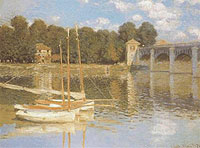
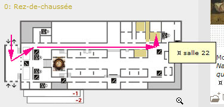
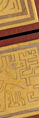

## Archives 2007 actus/blog du réseau ArtRéalité
### Archives 2007 actus/blog du réseau ArtRéalité
 Archives 2007  
**Actualités / blog des sites**

22/12/2007

Le [portail du Réseau ArtRéalité](http://www.artrealite.com/) est ouvert. La page d'accueil de ArtRéalité.com a été naturellement choisie pour l'accueillir. L'ancienne page a été transférée "juste derrière", vous pouvez l'atteindre en un clic.

Cette nouvelle structure de navigation n'est pas encore achevée mais les fonctions sont opérationnelles.

Il s'agit bien d'un portail qui vous emmène directement vers les différentes têtes de sections des sites.

La forme choisie : vidéo et "menus vivants", est une première du genre. Nous espérons qu'elle vous plaira, et surtout qu'elle vous surprendra. N'hésitez pas à [nous écrire](ecrire.html) pour nous donner votre opinion.

Joyeuses fêtes de fin d'année !

_8/12/2007_

Le réseau travaille dur à son projet de prix d'art contemporain 100% web (remise des prix en juin 2008) et à un projet de portail... un peu original que vous devriez découvrir dans les semaines à venir. Il s'agit de gros chantiers mais nous continuons à effectuer des suivis et des modifications en parallèle. Signalons notamment une nouvelle entrée dans la section « Hi-tech » consacrée aux ["pico-projecteurs"](hitech.html#picoprojecteurs). Les modifications ponctuelles sur Dotapea et ArtRéalité.com continuent, de même que les traductions et l'élaboration de nouveaux ["Dialogues de Dotapea".](dialoguesdotapea.html)

Par contre rien de neuf du côté du projet de forum et nous recherchons toujours des solutions techniques et graphiques valables de ce côté. N'hésitez pas à [nous écrire.](ecrire.html)

_25/11/2007_

Les vidéos périphériques du réseau ArtRéalité sont maintenant toutes transférées sur serveur dédié, donc bien visibles en streaming, débarrassées des problèmes de téléchargement.

Encore une fois merci d'avoir pris patience.

Un nouveau site est en cours de création. Il devrait atteindre une forme achevée en février 2008 mais il sera peut-être accessible d'ici-là.

_13/11/2007_

_Fin du premier grand chantier_

D'abord nous vous présentons nos excuses pour les anomalies que vous avez pu constater ces derniers jours en visitant Dotapea et ArtRéalité.

La première étape de la refonte de ces deux sites est terminée grâce à l'aide du talentueux webmaster de [LaCritique.org](http://www.lacritique.org/) et de nos amis de [QuidNovi](http://www.quidnovi.net/).

De quoi s'agissait-il ?

\- d'un passage en hébergement dédié.

\- d'un changement de plateforme de développement,

A quoi cela a-t-il servi ?

\- à permettre une bien meilleure diffusion vidéo. Il faudra encore quelques jours, tout au plus deux semaines, pour que les transferts soient tous effectués mais pour les habitués des inconforts vidéo du réseau ArtRéalité, voir cet [exemple déjà en ligne](players/sauteusedelange/allege/index.html) va représenter un changement notable. Qui ouvre des perspectives.

\- à quitter un hébergeur, Platine/Proregna, que l'on a trouvé efficace, réactif, agréable sur le plan relationnel dans un premier temps, infiniment moins dans un second. Ce n'était jamais que le troisième hébergeur. Nous avons dorénavant acquis davantage d'indépendance.

\- à améliorer la qualité technique de nos pages.

Quelle sera la suite des événements ?

\- l'implantation d'un portail pour tout le réseau ArtRéalité à des fins de lisibilité. Ce portail sera situé en page d'accueil de ArtRéalité.com.

\- la création d'un prix artistique.

_29/10/2007_

_Grand chantier_

Dotapea.com et ArtRéalité.com changent de plateforme de développement, l'hébergement va être placé en "dédié" et ArtRéalité.com va se transformer très profondément : une période de grands travaux s'ouvre. C'est devenu indispensable d'une part parce que ArtRéalité.com doit mûrir (et mûrira de manière littéraire), d'autre part parce que nous voulons développer considérablement l'activité vidéo de l'ensemble du réseau ArtRéalité. Au programme aussi, le fameux forum que nous vous promettons depuis longtemps.

Dotapea, Fenêtre sur sites et Pourpre ne devraient guère changer d'apparence et des mises à jour continueront à avoir lieu pendant les travaux.

Vous lisez plus de 700 000 pages chaque mois sur le réseau ArtRéalité. C'est pour nous une motivation magnifique pour développer notre initiative indépendante.

A tous, merci.

_24/10/2007_

_Un__e fleur dans l'ordure_

L'AFP a publié hier une information - peu relayée par les médias - qui ressemble à un fait divers mais qui frappe l'imagination et suscite réflexion.

Selon la dépêche, un tableau ("_Trois personnages_") de Rufino Tamayo, un grand artiste mexicain du XXème siècle, a été retrouvé par une New-Yorkaise entre deux sacs poubelles en 2003. L'heureuse découvreuse - qui devrait toucher quelques primes et intéressements car l'oeuvre va être vendue - aurait déclaré "_Je ne connais rien à la peinture contemporaine mais j'ai pensé qu'il n'était pas juste de jeter ainsi un objet d'art_".

Le tableau, peint en 1970 et acheté en 1977 avait été dérobé au Texas en 1987.

On se contentera d'un "no comment" sur cet événement bien qu'il soulève de nombreux questionnements. L'occasion pour nous de dire combien nous souhaitons créer un forum où ces sujets seraient l'objet de débats. On y travaille. Ce n'est pas simple, merci de votre patience.

_17/10/2007_

_Semaine de l'art contemporain à Paris_

Une courte période privilégiée. Il y a beaucoup de choses à voir cette semaine (jusqu'au lundi 22) dans la capitale française :

[\_Slick](http://www.slick-paris.com/) (superbe !), mais aussi [Show Off](http://www.showoffparis.com/), [les Elysées de l'art](http://www.orexpo.eu/) et la [FIAC](http://www.fiacparis.com/).

_8/10/2007_

_Belphégor au musée d'Orsay_

**_Analyse d'un fait divers_**

Cinq Belphégor

On l'entend ou on le lit sur tous les médias : une "bande" constituée d'une fille et quatre garçons décrits comme éméchés aurait pénétré par effraction le musée d'Orsay de Paris et aurait abîmé d'un coup de poing un chef d'oeuvre de Claude Monet. Tout cela sur fond de _Nuit blanche_. Une affaire rocambolesque et non dénuée de fantaisie.



Belphégor en Bruce Lee

Le tableau - un chef d'oeuvre - est peu ou prou un "[25P](chassis.html#25)", une surface déjà appréciable. Il aurait été déchiré sur dix centimètres nous dit-on par un _coup de poing_ (selon les termes de la ministre).

Un tableau n'est pas un tambourin. Le lin n'est pas de l'organdi, de la tulle ou du papier. C'est un textile extrêmement robuste, doté d'une trame et d'une chaîne (voir [article](tissage.html)). A moins que ce support fut pourri (à Orsay on peut en douter mais ce n'est pas impossible dans l'absolu), un coup de poing - ou un coup de coude, lit-on - même très violent aurait plutôt fait éclater le châssis en admettant que la toile soit extrêmement tendue et en admettant aussi que le malfaiteur ait d'abord décroché le tableau pour éviter de démolir son propre poing sur le mur, mais alors aurait-il pu le tenir assez solidement d'une seule main ? Aurait-il eu le temps de le poser habilement, en biais, contre un mur ou de demander à un comparse de le tenir à deux mains ? Ou s'est-il blessé avec le mur ?

Étant donné la surface dont il est question, cela paraît de toute façon surprenant car le lin sans être du caoutchouc est durablement élastique de même que l'enduit ([colle de peau](colledepeau.html)) et la peinture ([huile de lin](huiledelin.html)) qui le recouvrent. Pour abîmer une toile de la sorte il faut un objet contondant, a minima anguleux, ou bien peut-être le savoir-faire d'un expert en arts martiaux, ce qui n'est pas à exclure. Normalement, il n'y a qu'au cinéma que ce n'est pas le châssis qui cède, et les accessoiristes préparent la toile. Il ne s'agit pas ici de dire que ce n'est pas possible mais que cela mériterait clarification.

Belphégor en Arsène Lupin

Un second questionnement se pose avec davantage d'acuité.

Une bande de voyous éméchés qui parcourrait en pleine nuit le musée d'Orsay aller et retour dans le sens de la longueur, donc sur environ deux cent mètres au total - une bagatelle -, serait-ce vraiment possible ? Ce musée expose entre autres des Van Gogh, des Monet, des Lautrec, des Renoir, c'est-à-dire les oeuvres des artistes dont la cote est la plus élevée au monde. La valeur théorique de ce trésor national doit se compter en milliards. On peut là exprimer une certaine surprise : peut-on y déambuler, comme Belphégor au Louvres, ivre de plus, sans rencontrer gardiens, grilles, gaz, lasers et autres gadgets dissuasifs dernier cri ?

La question "comment est-ce possible ?" se pose nécessairement.



Belphégor est très rapide

La ministre déclare : "_Ils ont fait des saletés un peu partout et ont fini par mettre un coup de poing dans le tableau_". Le problème semble d'avoir le temps de le faire puisque les échappés furent apparemment repris in extremis à la sortie et ne seraient restés que trois minutes dans le musée. Certes il est possible de faire beaucoup de choses en peu de temps mais cela surprend étant donné la distance parcourue, l'état supposé des délinquants et les actes réalisés.

Belphégor in the sky with diamonds

Récemment les voleurs du tableau _Le cri_ de Munch ont été arrêtés. Si le trafic d'oeuvres de valeur modérée reste malheureusement à l'ordre du jour, ce type de tableaux est invendable pour un malfaiteur. Il faut effectivement être ivre, rêveur ou quelque peu borné à ce jour pour tenter une effraction aussi téméraire qu'inutile au musée d'Orsay.

Belphégor sur l'écran noir de quelle nuit blanche ?

Ces incroyables événements auraient eu lieu pendant la _Nuit blanche_, un événement annuel important pour l'art contemporain qui a donné lieu il y a quelques années à un attentat contre le maire de Paris. Pour autant, faut-il se faire un cinéma ?

Que cette affaire finalement sans grande importance en soi (le tableau sera réparé) ait des connotations politiques, de droit commun ou artistiques, on a voulu pointer ici certaines imprécisions ou invraisemblances naïvement relayées par les organes de presse généralistes et c'est le sens de cette intervention. Que les faits soient réels et exceptionnels est possible mais quelques éclaircissements de la part des officiels et surtout quelques précautions de la part des rédacteurs seraient bienvenus ne serait-ce que dans la perspective de rester tous crédibles. On ne veut pas livrer "brutes" des informations telles que "_Des cambrioleurs ivres ont parcouru 100 m dans le musée d'Orsay puis ont crevé un tableau d'un coup de poing et sont ressortis_". Ce n'est pas sérieux.

_6/10/2007_

_De la vidéo en régie de communication_

Sur tous les sites du réseau ArtRéalité circule pour la première fois en marge droite un visuel vidéo. La petite chouette blanche de Flavio Cury ouvre une ère annoncée dans le communiqué [ci-dessous](blog2007.html#communique20070926).

Nous avons veillé comme promis à respecter le confort de lecture mais n'hésitez pas à [nous écrire](ecrire.html) si ce changement vous paraît désagréable ou pour tout autre problème.

_3/10/2007_

_[3ème conversation de ArtRéalité.com](http://www.artrealite.com/hansbouman.htm)_

[L'impossible captation de la beauté de la nature, l'importance de la contrainte et du voyage. C'est la troisième Conversation de ArtRéalité.com, avec **Hans Bouman.**](http://www.artrealite.com/hansbouman.htm)

_26/9/2007_

_Communiqué_

Chers amis lecteurs, quelques mots sur ce qui se dessine sur le réseau ArtRéalité.

Vous avez pu constater ces derniers temps que nous effectuons de petits tests vidéo dans l'espace de communication (marge droite). Nous allons très prochainement pouvoir intégrer dans cette marge des vidéos d'artistes et des communications diverses grâce à de nouvelles collaborations.

Nous veillons scrupuleusement à préserver le confort de la lecture à la fois par la forme et par le contenu. Concrètement, la vidéo sera en petit format (120x90) pour ne pas "taper à l'oeil", la publicité n'envahira pas démesurément l'espace-temps de la régie et elle restera ciblée. Pas de pub-pollution pour les assurances auto ou les voyages Sncf, aucun changement sur ce point. Par contre nous afficherons des reportages et des créations originales. C'est pour très bientôt.

_[24/9/2007](hitechopalespolymeres.html)_

_[Les "opales polymères"](hitechopalespolymeres.html)_

[Une recherche prometteuse - non sans dimensions plastiques - sur les métamatériaux dans le domaine chromatique et tridimensionnel.](hitechopalespolymeres.html)

_9/2007_

_Peinture au plomb sur les jouets :  
nouveau rebondissement spectaculaire de l'affaire Mattel_

Et le moins que l'on puisse dire est que celle-ci devient de plus en plus opaque. Ainsi le 21, Mattel a présenté des excuses cette fois non au Congrès américain ([voir ci-dessous](blog2007.html#congres)) mais à la République Populaire de Chine.

Mais attention, l'information est relayée non sans grosses erreurs par la presse francophone voire anglophone aussi préfèrera-t-on donner une référence directe, le communiqué de presse de cette entreprise : [lien](http://www.shareholder.com/mattel/downloads/09-21-07%20China%20Meeting%20Media%20Statement.pdf) (en anglais).

La Chine continuerait - selon ce document qui est assez précis - à poursuivre des personnes isolées ("_individuals_") en relation avec des sous-traitants responsables de l'application de peintures toxiques sur des millions de joujoux.

Cependant Mattel précise que le rappel des produits ne serait pas lié à une erreur d'un fournisseur mais à un changement rétroactif de ses propres normes et c'est pour cette raison que cette firme s'excuserait auprès de la RPC pour les critiques subies suite à ce rappel.

Pour être précis, ce texte - qui arrive bien tard - n'en est pas moins complexe et pourrait soulever plus de questions qu'il n'apporte de réponses.

Voyons, le directeur d'une entreprise chinoise sous-traitante de Mattel se suicide il y a moins de quinze jours ([voir ci-dessous](blog2007.html#suicide)) mais au fond "c'était pas de sa faute" ? Et pourquoi la police chinoise pourchasserait-elle des "individuals" ?

Non, la vraie question semble maintenant naturellement concerner la motivation de Mattel à augmenter soudainement son niveau d'exigence en matière de teneur en plomb (ce qui est une information non confirmée et surtout non documentée).

18 ou 19 millions de jouets toxiques, c'est très grave évidemment. Les métaux lourds dans les peintures, ce n'est pas anodin, comme nous le disons ici et là sur ce site.

Mais combien de jouets toxiques encore dans la nature ? Mattel ne communique pas sur ce point crucial, le seul qui pourrait commencer à rétablir la confiance.

N'oublions pas une rassurante déclaration d'un dirigeant chinois : « _"Plus de 99% des produits d'exportation chinois sont sûrs", a déclaré mercredi le ministre chinois du Commerce Bo Xilai._ » (Reuters, 2/8/2007)

Bien entendu nous appelons nos chers lecteurs à la plus grande vigilance dans l'intérêt des enfants.

_18/9/2007_

[_La carnation_](carnation.html)

[Une merveille naturelle, la peau, fut et demeure l'objet des travaux parmi les plus célèbres de l'histoire de l'art.](carnation.html) [Nouvel article dédié.](carnation.html)

_13/9/2007_

_Peinture au plomb sur les jouets : suites de l'affaire_

On l'apprend dans le New York Times, Robert A. Eckert, le directeur exécutif de Mattel fait ses excuses devant le Congrès américain. "_Comme vous, je fais profondément attention à la sécurité des enfants_", dit-il. Mais la colère gronde, des membres du Sénat ne semblent pas d'accord et proposent des mesures fortes qui concernent d'ailleurs autant les industriels que les détaillants. "_Cela doit cesser, il est temps pour nous d'agir_", dit ainsi le sénateur démocrate Amy Klobuchar qui donne le ton, nettement relayé par les associations de consommateurs toujours sous le choc de cet énorme scandale international qui aurait déjà fait des victimes, à commencer par le premier responsable, un sous-traitant chinois (voir [ci-dessous](blog2007.html#suicide)).

Qu'en est-il en Francophonie où la presse généraliste semble avoir totalement déserté ce dossier que nous sommes obligés de suivre via la presse arabophone et anglophone ?

Cette affaire nous concerne tous, elle n'est absolument pas terminée. Parmi les 18 millions de jouets en cause, combien sont encore "dans la nature", y compris en Francophonie ? On n'en sait rien et Mattel ne communique pas sur ce point (à voir, la très procédurière [page que cette entreprise met à disposition](http://www.allomattel.com/allo_actualite.php?id=65)). Le [plomb](plomb.html) atteint les enfants et les adultes quel que soit leur lieu de naissance donc Dotapea recommande à tous les parents une grande prudence lors de l'achat de joujoux peints.

_6/9/2007_

[Le chapitre XXI des dialogues est en ligne](chap21resines.html) [(cliquer ici)](chap21resines.html)[. Les résines synthétiques sont-elle seulement synthétiques ou peuvent être naturelles, un simple bijou en époxy peut-il être dangereux ? Premier jet d'un texte consacré à un thème particulièrement riche et source de questionnements.](chap21resines.html)

[Par ailleurs d'importants ajouts ont été effectués dans l'article](transmutation.html) [_La transmutation_](transmutation.html)[. Qu'est-ce que la "vallée de la stabilité", en quoi un élément non-noble présente-t-il une noblesse insoupçonnée ?...](transmutation.html)

_20/8/2007_

_révision le 22_

Alors que la peinture chinoise au plomb continue à faire parler d'elle dans le monde entier (_class action_ aux États-unis où déjà des enfants auraient été atteints) et que Wikipedia présente pour d'autres comme pour nous ([voir ci-dessous](blog2007.html#wiki)) de nouveaux aspects imprévus relayés dans les différents grands journaux internationaux, Dotapea cultive son jardin et publie de nouvelles moutures de différents articles parmi lesquels on citera spécialement

\* [le papyrus](papyrus.html)

\* [le parchemin](parchemin.html)

\* ainsi que des modifications substantielles concernant le [papier](papier.html) et la [toile](toiles.html).

_13/8/2007_

_Peinture chinoise au plomb :_

_un rebondissement dramatique inattendu_

On l'apprend par le site de _Al'Jazeera_ d'après un scoop du journal chinois _Southern Metropolis Daily_  : Zhang Shuhong, le directeur de l'entreprise Lee-Der Industrial, sous-traitante chinoise responsable de « l'affaire des jouets Mattel » - des jouets peints avec une peinture toxique au plomb - s'est suicidé dans un entrepôt ce week-end.

[L'article en anglais sur AlJazeera.net](http://english.aljazeera.net/NR/exeres/01FB3605-C76B-4008-A570-59594D6FCFE8.htm)

Par ailleurs ce ne seraient pas 1,5 mais 18 ou 19 millions de jouets (selon les sources) qui seraient concernés (information non confirmée) dans cette affaire évoquée déjà sur cette page le [2/8](blog2007.html#peintureplomb).

_11/8/2007_

_[Wikipedia :](http://www.artrealite.com/edito.htm#appelvigilance)_

_[Appel à la vigilance](http://www.artrealite.com/edito.htm#appelvigilance)_

On vient de s'en apercevoir : l'article "[Paraffine](http://fr.wikipedia.org/wiki/Paraffine)" du site Wikipedia faisait de larges emprunts au nôtre ([lien](paraffine.html)).

[](http://www.artrealite.com/edito.htm#appelvigilance)

Une pratique absolument déloyale et illégale qui pourrait mener à des poursuites.

Dotapea est le fruit d'un travail considérable, de collaborations multiples. Nous entendons faire respecter nos droits d'auteurs.

Article complet et **[sérieux appel à la vigilance](http://www.artrealite.com/edito.htm#appelvigilance)** : lire [l'éditorial](http://www.artrealite.com/edito.htm) de ArtRéalité.com.

_8/8/2007_

_Ajouts et modifications_

Le sgraffito et sa forme traditionnelle de peinture à fresque. [Lien.](gratte.html#sgraffite)

La [transmutation](transmutation.html), un phénomène qui en dit long sur notre méconnaissance commune de la matière. Un sujet non dénué d'implications artistiques ou poétiques (voir fin). La science ne fait-elle pas partie de la culture ?

La dialyse permet-elle vraiment de distinguer les [cristalloïdes](cristalloide.html) des [colloïdes](colloide.html) ? L'enquête est en cours sur ces enjeux déterminants dans l'univers des "charges". [Lien.](dialyse.html)

_2/8/2007_

_La peinture au plomb n'est pas morte_

Au fil des pages, Dotapea met largement l'accent sur la sûreté des peintures et des différents produits destinés aux arts plastiques, décoratifs, etc. En ce début de mois d'Août, l'agence Reuters publie une dépêche qui vient nous rappeler à quel point ce sujet demeure d'actualité. Quelques extraits, sans commentaires :

« _Le géant américain du jouet Mattel rappelle 1,5 million de jouets fabriqués en Chine susceptibles de contenir des peintures toxiques._

_Les jouets concernés, de la marque Fisher-Price, qui comprennent notamment les personnages à succès de la série Sesame Street, ont été fabriqués par un sous-traitant chinois qui a employé un pigment contenant du plomb, a expliqué Mattel mercredi._

_Mattel demande aux consommateurs et revendeurs américains de renvoyer 967.000 jouets et rappelle également 533.000 jouets vendus au Mexique, au Canada et en Grande-Bretagne._

 »

(...)

« _"Plus de 99% des produits d'exportation chinois sont sûrs", a déclaré mercredi le ministre chinois du Commerce Bo Xilai._ »

[Le texte complet sur le site Reuters.fr](http://today.reuters.fr/news/newsArticle.aspx?type=topNews&storyID=2007-08-02T090251Z_01_MAN232512_RTRIDST_0_OFRTP-USA-CHINE-JOUETS-20070802.XML)

\[Deux nouveautés dans « Hi-tech » - [Cliquer ici](hitech.html#debuttableau)\]

**_[Les échelles](chap20echelles.html)_**

Le chapitre XX des [Dialogues de Dotapea](dialoguesdotapea.html) tente de donner des points de repère "fondamentaux" sur les dimensions des matériaux que nous manipulons... et qui nous constituent.

Vidéo en élaboration.

[Cliquer ici.](chap20echelles.html)


**_Triptyque_**

**_Électricité_**

**_oxydation_**

**_métaux_**

_Trois chapitres des Dialogues de Dotapea_

... qui abordent de multiples concepts, phénomènes et techniques :

[le chapitre XVII, L'électrolyse et les ions](chap17electrolyseions.html)

[le chapitre XVIII, L'électricité, encore un peu plus loin](chap18electriciteplusloin.html)

[le chapitre XIX, Oxydation, métaux](chap19oxydationsmetaux.html)

Au fil de cette trilogie, découvrez de très nombreux concepts et des applications méconnues dans le champ des arts plastiques.

**_Vidéos, forum :_**

_limites techniques, financières et humaines_

_mise à jour le 9/9/2007_

_Une solution se profile sur le versant vidéo_

_grâce à la location prochaine d'un serveur dédié._

_Quant au forum, les problèmes demeurent._

_On y a cru, on y croit toujours, mais les obstacles sont nombreux. Alors que d'autres secteurs de Dotapea/ArtRéalité se développent, ceux-ci restent en partie bloqués._

**En vidéo,** voici quelques mois nous avions trouvé une solution technique permettant un affichage presque instantané pour une partie de notre espace d'hébergement dont les performances baissaient. Malheureusement, cette baisse s'est radicalement accentuée.

Dit autrement, à ce jour deux tiers environ des vidéos de ArtRéalité ne sont plus en "streaming". L'affichage reste de qualité - et celle-ci demeure modulable - mais l'attente est longue et la différence entre par exemple [l'entretien avec Alain Jouffroy](players/alainjouffroy1std/index.html) (qualité supérieure) et la vidéo "[Bay water watch](players/hansbouman/leaudenhaut/allege.html)" (pourtant de qualité "allégée") est considérable.

L'hébergement des vidéos nécessite un investissement car il s'agit le plus souvent chez nous d'oeuvres originales, ce qui nous empêche de recourir à des solutions telles que DailyMotion ou YouTube sinon ponctuellement ou dans d'autres contextes.

Nous vous demandons donc, chers visiteurs, de bien vouloir patienter - et pourquoi pas [suggérer des solutions](ecrire.html) - pendant que nous étudions les meilleurs possibilités techniques et financières permettant de continuer à offrir un accès gratuit à une production audiovisuelle de qualité.

**Concernant le forum,** nous accusons un retard considérable suite à un problème technique s'ajoutant à un autre problème tout simplement humain, un impondérable auquel nous ne pouvons rien. A cette heure, nous ne pouvons garantir que ce projet aboutira alors que nous constatons votre demande et croyez que nous en sommes désolés. Les bonnes volontés sont donc bienvenues. Nous avons besoin de compétences en technique d'une part et en modération d'autre part.

[**_L'holographie a 60 ans_**](chap15holographienum.html)

[_Faisons le point sur les technologies 3d_](chap15holographienum.html)


[La première version du chapitre XV des Dialogues de Dotapea fait intervenir Dominique Sevray, une figure importante de ces techniques qui intéressent de nombreuses disciplines.](chap15holographienum.html) [Cliquer ici.](chap15holographienum.html)

[](chap16interieurexterieurchaux.html)[Intérieur, extérieur, chaux](chap16interieurexterieurchaux.html)

**[Le tadelakt et d'autres techniques aux applications multiples](chap16interieurexterieurchaux.html)**

[Beaucoup de créations particulièrement solides peuvent être effectuées à l'aide de techniques à la chaux dont certaines sont encore assez méconnues, encore peu explorées alors qu'elles ont fait leurs preuves depuis très longtemps.](chap16interieurexterieurchaux.html) [Artistes, décorateurs, amateurs, particuliers, cette conversation entre la spécialiste Clothilde, le physico-chimiste Jean-Louis et le candide Emmanuel vous donnera quelques indications sur les possibilités de ces procédés.](chap16interieurexterieurchaux.html)


```
title: Archives 2007 actus/blog du réseau ArtRéalité
date: Fri Dec 22 2023 11:26:17 GMT+0100 (Central European Standard Time)
author: postite
```
