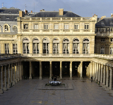
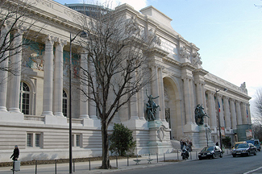
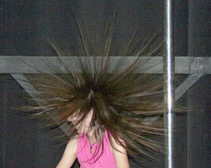

## Archives 2009-1 - Actus/blog du réseau ArtRéalité
### Archives 2009-1 - actus/blog du réseau ArtRéalité
 [](http://www.artrealite.com/jecreemapub.htm)

17/6/2009

> **Une première dans l'histoire du Réseau ArtRéalité**

Notre régie de communication vient de commencer une campagne pour le compte de Direct Beaux-arts.com. C'est le premier engagement selon la formule "Une enseigne sur un boulevard de l'art" qui fonctionne selon le principe "Je crée ma pub". Cette offre permet aux entreprises mais aussi aux artistes, aux organisateurs d'événements et à la presse de communiquer à très bas prix sur notre réseau spécialisé de sites web.

Pour l'utilisateur, rien de changé. La publicité, tout comme les autres visuels, est toujours affichée en marge de droite. Elle n'est pas tape-à-l'oeil, c'est un élément de votre environnement tout comme une enseigne réelle sur un boulevard réel.

Pour plus d'informations [cliquer ici](http://www.artrealite.com/jecreemapub.htm).

12/6/2009

> **Fausse joie**

Après la décision du Conseil Constitutionnel avant-hier (lire l'article [ci-dessous](blog20091.html#20090611)), certaines déclarations aujourd'hui font planer une nouvelle menace sur le web français.

Le texte sera vraisemblablement adopté, mais amputé de ses principales dispositions. Cependant, la nouveauté est qu'il sera possible de le compléter par la suite (d'ici fin juillet selon l'AFP), en suivant la proposition de Franck Riester, rapporteur du projet de loi, proposition qui ferait dépendre d'un "juge spécialisé" les sanctions envisagées contre les internautes.

Selon M. Riester, cette intervention des juges aura "un caractère plus dissuasif".

La question demeure : qui au juste souhaite-t-on dissuader, et de quoi, en se basant pour vous amener devant le juge sur une adresse IP qui peut être utilisée par votre stagiaire, votre collègue ou votre petit frère féru de musique, là où techniquement parlant si l'on souhaitait vraiment préserver les droits des artistes on pourrait s'attaquer directement aux trackers (pisteurs) des BitTorrents pirates ?

11/6/2009

> **HADOPI, fin d'une aventure**

oeuf !



Le Conseil Constitutionnel a censuré hier la loi Hadopi (voir notre [texte](blog20091.html#20090514) du 14 mai). Un certain nombre de dispositions de ce texte - la punition collective et sans jugement notamment - étaient en effet rien moins que des aberrations incompatibles avec notre Constitution.

Lorsque le Palais Royal - que l'on peut remercier - doit en venir à cette sanction ultime, c'est que du Palais Bourbon au Palais du Luxembourg, on a tout à fait passé les bornes.

Alors que s'est-il passé ? Des questions se posent :

> \* comment les deux chambres ont-elles pu en arriver là, quelles pressions les parlementaires ont-ils éventuellement subi de la part de lobbies ayant intérêt à matraquer le web francophone ? 
> 
> \* se rend-on bien compte au Parlement des énormes enjeux du XXIème siècle ? Souhaite-t-on bien un Internet français à la hauteur ? Si oui, ne faudrait-il pas cesser de le diaboliser et de le persécuter au travers de telles lois ou de déclarations entretenant un climat de peur irrationnelle (on fait ici référence à celles de M. Frédéric Lefèvre notamment - [lien](blog20082.html#mafia)) ?
> 
> \* notre modèle économique est encore défaillant. Mais qu'en aurait-il été de la télévision ou de la radio si elles avaient été l'objet d'un rejet aussi puissant que notre web aujourd'hui ? Ces médias n'ont-ils pas été aidés au contraire ? Les parlementaires ne font-ils pas totalement fausse route ?

Hadopi se servait du piratage comme prétexte-épouvantail pour justifier une exception juridique inacceptable qui, ce n'est peut-être pas un hasard, était un véritable cadeau offert aux autres médias musicaux et audiovisuels.

En réalité, le problème du piratage sur le web peut être réglé par quelques mesures raisonnables sans commune mesure avec l'incroyable arsenal anticonstitutionnel de Hadopi qui visait bien au-delà.

_Emmanuel Luc,_

_éditeur web_

9/6/2009

> [**Communiquer sur un agenda d'événements ou un blog**](liaisons.html)

La régie de communication ArtRéalité-QuidNovi (visuels en marge droite sur tous nos sites) est pleine de ressources. Elle lancera demain une campagne d'un genre nouveau.

Beaucoup d'artistes annoncent des expositions sur leur blog ou sur la page Actualités de leur site. Notre réseau jouit d'une forte audience parmi un public intéressé par les arts plastiques. Il peut donc se faire le relais de ces événements.

Sous réserve d'acceptation (jury), vous pouvez nous envoyer votre visuel au format 120x300 accompagné d'un lien de votre choix. Premier prix : 10€. Informations [cliquer ici](http://www.artrealite.com/jecreemapub.htm).

22/5/2009

> **[Les liaisons entre atomes](liaisons.html)**

Ce thème, clé de voûte de l'organisation de notre univers, est également désormais la clé de voûte du versant physico-chimique de Dotapea. Travail de synthèse et de vulgarisation, il nécessite un peu de temps même si le volume rédactionnel est faible. Mais in fine, la compréhension de l'ensemble des articles ne peut en être que meilleure, du moins nous l'espérons. N'hésitez pas à nous donner votre opinion.

        [Cliquer ici](liaisons.html)

14/5/2009

> **Polémique HADOPI :**
> 
> **Punition collective contre taxe inéquitable,**
> 
> **un débat au détriment du web français et de l'avenir de l'art numérique ?**

Le marché de l'oeuvre d'art numérique ne donne pas les résultats attendus depuis deux ou trois décennies. Bien que de nombreux artistes y aient été formés, l'art vidéo n'a pas « décollé ». Ceux qui en vivent se comptent sur les doigts d'une seule main. Quant à l'art cybernétique, il est pour ainsi dire inconnu du grand public. Cependant les choses peuvent changer, aussi le Réseau ArtRéalité est-il sensible à ce qui peut aujourd'hui influer sur l'avenir de l'un des terrains possibles des arts nouveaux : le web.

  
La loi HADOPI semble pouvoir modifier durablement le rapport entre le citoyen et l'Internet.  
Illustrons par un exemple banal un effet possible - en fait inévitable - de cette loi si elle devait être appliquée.

Les Dupont ont trois enfants : Pierre, Paul et Perrette, pourquoi pas. La famille n'est pas très riche. Elle ne dispose que d'un ordinateur.  
Pierre s'en sert pour ses études. Paul pour rechercher un emploi. Mme Dupont pour son travail. M. Dupont pour mettre à jour le site web de sa petite entreprise.  
Mais Perrette, elle, s'en sert pour pirater de la musique.  
Quand la sanction HADOPI tombera, c'est toute la famille qui sera pénalisée. C'est en effet l'IP, c'est-à-dire l'adresse de l'ordinateur familial qui sert à identifier l'auteur du délit. Donc adieu veau, vache, cochon, couvée, plus d'Internet chez les Dupont.

L'avenir de l'art dépendant de ses moyens de diffusion

En attendant que le web français parvienne à proposer de meilleurs modèles économiques - car il faut bien admettre que c'est là que le bât blesse -, d'autres solutions semblent possibles :

> \* quitte à pénaliser le piratage, ne serait-il pas plus simple, au lieu de couper en aveugle les accès Internet, de simplement présenter la facture aux petits pirates (le prix du contenu plus une indemnité modérée) sans ficher personne et de gérer le remboursement des artistes via la SACD ? Cela ne paraît pas plus compliqué qu'un HADOPI qualifié par certains d'usine à gaz. 
> 
> \* autre solution répressive : traquer les « trackers » des BitTorrents illicites et laisser les autres en paix. Ces machines sont en effet les pièces majeures des « torrents de données » utilisés par les « pirates » puisque elles orchestrent la distribution des transferts de contenus en « p2p ».
> 
>   
> \* Une autre solution serait d'aider les intervenants web - qui comme les artistes tirent pour la plupart le diable par la queue - à trouver des finances leur permettant d'élaborer des modèles économiquement viables. Après tout, la radio et la télévision ont fonctionné sur fonds d'Etat durant des décennies parce que le pouvoir souhaitait la diffusion de la culture.  
> M. Frédéric Lefèvre, député et porte-parole de l'UMP, affirmait pour évoquer notre média que « _La mafia s'est toujours développée là ou l'État était absent_ ». Pesante déclaration que l'on peut prendre à revers : pourquoi l'Etat est-il absent aujourd'hui plus qu'hier ?

Aujourd'hui l'Internet semble diabolisé, il fait l'objet d'attaques virulentes, démesurées. Alors qu'est-ce qui a changé, qu'est-ce qui crée obstacle à la diffusion de la culture par un média émergent que l'on taxe de mafia et dont le public est menacé de punition collective ?

_Emmanuel Luc_

_Editeur web_

1/5/2009

> **"ArtSénat, c'est bien fini"**

Moment de nostalgie après ces quelques mots d'un ami, collaborateur récurrent de ArtSénat, mais aussi de ArtRéalité.

Depuis 2004 nous communiquions grâce à la régie du Réseau ArtRéalité (dans la marge grise ci-contre à droite) sur cette manifestation unique en France, que nous soutenions vivement. Des millions de visuels ArtSénat ont ainsi été affichés.

Dans le réel, chaque année, une quarantaine d'artistes sélectionnés par des commissaires différents, prestigieux, pouvaient exposer pendant un mois dans l'Orangerie du Luxembourg et quatre mois dans le célèbre jardin pour une part d'entre eux.

Le public se comptait par centaines de milliers - voire davantage - et prenait contact gratuitement avec la création artistique contemporaine.

Pourquoi ce rêve réalisé s'est-il brutalement interrompu alors que cette manifestation, contrôlée par la Commission Financière du Sénat elle même surveillée par la Cour des Comptes, ne coûtait guère aux contribuables ? On ne peut répondre sans faire d'interprétations péremptoires car le Sénat n'a pas communiqué publiquement ses motivations. Cependant il est permis de faire un constat : c'est dès le début de la présidence de M. Gérard Larcher (succédant à M. Christian Poncelet) que la décision a été prise.

Ne soyons pas naïfs : placer la création actuelle dans l'un des lieux les plus symboliques de la République (le Président du Sénat est le n° 2 de l'État, le jardin a été donné au peuple, comme les Tuileries), cela avait un sens politique fort. L'en retirer a également un sens fort, que l'on pourrait interpréter sinon comme un déclin, a minima comme une surprenante absence. Faut-il en effet voir dans la suppression de cette vitrine aussi luxueuse que populaire, un désamour ou un désaveu de l'art contemporain ? Sans pouvoir aller jusqu'au mode affirmatif, disons que... on en jurerait et puis les faits parlent d'eux-mêmes : ArtSénat, c'est bien fini.

Il est vrai que quand on en est à demander aux hôpitaux d'être rentables (rapport de M. Larcher), l'art contemporain, que voulez-vous...

_Emmanuel Luc_

_Éditeur_

[](http://www.artrealite.com/jecreemapub.htm)20/4/2009

> **"Je crée ma pub"**

Nouveau service du Réseau ArtRéalité, "[je crée ma pub](http://www.artrealite.com/jecreemapub.htm)" permet en un minimum d'efforts et de fonds (10€ pour 15j offre simple) d'annoncer un événement sur une régie publicitaire spécialisée qui a affiché 100 millions de visuels depuis sa création en mai 2004.

Beaucoup plus efficaces qu'un dispendieux carton d'invitation sur papier ou qu'un mail collectif atterrissant dans la corbeille, VOS visuels, diffusés par notre régie, peuvent en 15 jours être affichés 375 000 fois (exemple récent de notre campagne sur la 4è journée Marguerite Duras) auprès d'un public concerné par les arts plastiques et domaines voisins.

2/4/2009

> **Petits changements dans la régie**

Vous l'avez peut-être constaté : les visuels visibles dans la marge de droite, c'est-à-dire dans la régie de communication de ArtRéalité sont maintenant réglés pour ne s'afficher que si votre fenêtre n'est pas trop étroite.

Cette disposition a été prise pour maintenir le confort de lecture en évitant les superpositions en deçà d'une largeur de 800 pixels.

Cette fonction n'est pas encore dynamique. Si vous modifiez la taille de la fenêtre il faut recharger la page (F5 sur IE, Ctrl-R sur FF) ou en changer.

Cette fonction n'est pas encore implémentée sur Pourpre.com.

1/4/2009

> **Poisson d'avril malgré nous**

Oui c'est un véritable bug qui modifie aujourd'hui l'aspect de certaines de nos pages. Nous y travaillons. Ce sera réglé normalement d'ici demain.

Avec nos excuses.

29/3/2009

> **Google et vos traces**

On n'a rien contre Google. Vraiment rien. Google a fait beaucoup pour notre média.

Cependant nous voilà dans l'obligation de vous avertir - sur demande et à notre grand regret - que **Google va vous tracer**. Vos clics, vos recherches, vos navigations, seront à partir du 8 avril 2009 consignés et conservés durant 48 heures dans les bases de données du supergéant du web dans le cadre d'un projet associé au programme Adsense/AdWords.

Le but annoncé : affiner, "connaître vos goûts" pour personnaliser les propositions publicitaires que vous voyez pour le moment en haut de nos pages.

Il est impossible de débrayer ce système. Les éditeurs affiliés tels que nous ont le choix entre laisser faire ou empêcher le google-traçage sur leurs sites, option que nous nous sommes évidemment empressés d'activer. Vous n'êtes pas tracés _chez nous_, mais les publicités Google que vous verrez apparaître tiendront quand même compte de votre activité web des derniers jours. Pour cela, on ne nous laisse pas le choix.

Le Réseau ArtRéalité a donc relancé en urgence l'étude de son propre système de communication pour revenir le plus vite possible à quelque chose de simple et non-intrusif.

Google a fait énormément pour le web mais qui aime être surveillé dans ses moindres faits et gestes ?

24/3/2009

> **Le Palais de la Découverte en danger de changement de nature**



Arts et sciences communiquent.

Chers lecteurs de Dotapea.com vous serez sûrement sensibles à une situation inquiétante pour le merveilleux Palais de la Découverte qui a su éveiller tant de vocations.

Pour plus d'informations, lire l'article de Jade Lindgaard [sur ce lien](http://www.mediapart.fr/files/Jade%20Lindgaard/_export_home1_permanents_itarf_Documents_palais_CabPecresse270308.pdf) et consulter le site [sauvonslepalaisdeladecouverte.fr](http://www.sauvonslepalaisdeladecouverte.fr/).

Un événement (soirée de soutien) est prévu ce soir même à partir de 19h. Nous n'avons pu vous l'annoncer plus tôt, n'étant pas informés. [Lien.](http://www.sauvonslepalaisdeladecouverte.fr/spip.php?article17)

Un tel lieu, unique en France, fortement fréquenté (600 000 entrées par an) et hautement symbolique car situé au coeur de Paris, presque face à l'Élysée et collé au Grand Palais, a surpris...



... et enchanté depuis 1937 beaucoup d'entre nous, dont les futurs enseignants, ingénieurs, chercheurs parfois prix Nobel qui sont aujourd'hui signataires d'une pétition de 60 000 noms.

Rendez-vous début avril. Nous saurons si un décret tranchera, et pour laquelle des deux très laides alternatives dont il est question car comme dirait un membre du Palais,

« si ce regroupement ne se fait pas, on est mort. Mais s'il se fait, est-ce qu'on survit ? »

Ce regroupement est la fusion de la Cité des Sciences et de l'Industrie (de statut EPIC, Établissement Public à caractère Industriel et Commercial, relevant du droit privé) et du Palais (jusque là EPCSCP, Établissement Public à Caractère Scientifique, Culturel et Professionnel) en une seule entité EPIC, donc de droit privé et à vocation commerciale, ce qui implique des changements radicaux, un changement de nature.

Cette fusion est présentée comme la dernière parade possible à la fermeture pure et simple du Palais, dont il a été question en 2008.

Comment avons-nous pu en arriver à une telle confusion et voir en cette institution une possible entreprise commerciale ? Pour être fortement attractif, le Palais n'est évidemment pas Disney. Quant à sa suppression, qui n'y penserait sans ressentir un profond désarroi ? Sûrement quelques centaines de milliers de personnes, voire davantage.

Venez nombreux ce soir et n'hésitez pas à faire part de votre soutien. [Pétition.](http://palais-decouverte.eitic.org/index2.php)

_Emmanuel Luc,_

_éditeur_

19/3/2009

Pourquoi la neige est-elle si lumineuse ?

Jean-Louis et Emmanuel essayent de répondre à cette question qui vient rappeler le rôle particulier de la diffusion de la lumière dans le domaine des arts plastiques.

Lire le chapitre XXIV, ["Blanche neige"](chap24blancheneige.html).

3/3/2009

Naissance de la section "[Courrier des Lecteurs](courrierdeslecteurs.html)". Elle est accessible sur tout le site depuis le petit tableau "Navigation thèmes" situé en haut de page.

Le fonds disponible est vertigineux (vos courriels et nos réponses depuis 2002 !), mais nécessite un traitement réfléchi. Aussi son développement sera-t-il progressif et sélectif.

Cette section annule et remplace notre projet de forum, inadapté à Dotapea. Ici les informations sont à 100% utiles et la modération est naturelle. Pour poser une question, il suffit de [nous écrire](ecrire.html).

Cette orientation pyramidale ne reprend pas la tendance "web v2 / socialisation", mais elle nous permet de maintenir la qualité et la fiabilité des rédactionnels ainsi qu'une totale convivialité. Pas de "trolls" dans nos pages :)

Une précision : le grand projet évoqué ci-dessous ne correspond pas à cette nouvelle section.

22/2/2009

Nous sommes désolés de notre silence persistant. Si nous ne donnons guère de nouvelles c'est que nous préparons un grand projet dont nous ne pouvons rien divulguer.

Parallèlement, nous étudions un moyen de répercuter - sur Dotapea en particulier - tous les dialogues qui ont lieu pendant ce temps par mail sur des sujets techniques.

1/1/2009

> **Bonne année à tous**

D'autres solutions
```
title: Archives 2009-1 - Actus/blog du réseau ArtRéalité
date: Fri Dec 22 2023 11:26:18 GMT+0100 (Central European Standard Time)
author: postite
```
