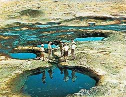

## Archives 2009-1 - Actus/blog du réseau ArtRéalité
### Archives 2009-1 - actus/blog du réseau ArtRéalité
 Archives 2009-2  
**Actualités / blog des sites**

15/12/2009

> **Le bleu « Mn-YIn »**

  
Annonce trop enthousiaste ou véritable découverte ?  
Quelques mots sur un « nouveau bleu » qui laisse perplexe. [Cliquer ici.](hitechbleumnyin.html)

26/11/2009

> **La presse artistique vue du web**

Cette page a été entièrement mise à jour. Elle n'entend pas constituer une revue exhaustive mais dresse une sorte d'état des lieux (voir édito). Rien de péremptoire ni de définitif. Réactions bienvenues.

[Cliquer ici](http://www.artrealite.com/presseenligne.htm)

23/11/2009

> **Pub : une expérience inédite**

Ces prochains jours (à partir du 24), nous expérimenterons avec Direct Beaux-arts un type de "positionnement" (à défaut d'autre mot) qui se veut utile. Simplement, sur une très petite partie du site, douze pages, les visuels publicitaires ne seront pas les mêmes en fonction des articles que vous lirez.

Aucun robot ou automatisme derrière. Ce sont des choix directs réfléchis et une expérience tout à fait inédite dans ce domaine. Quelque chose de plus humain que la publicité Google.

Sont concernés les thèmes Auxiliaires huiles, Acrylique et Dessin, soit les pages suivantes :

> \* [Essences](essences.html), [Térébenthine](terebenthine.html), [Huiles](huiles.html), [Huile de lin](huiledelin.html), [Huile d'oeillette](huiledoeillette.html), [Médiums pour l'huile](mediumspourlhuile.html),
> 
> \* [Acrylique](acrylique.html), [Produits acryliques](produitsacryl.html), [Médiums acryliques](mediumspourlacrylique.html),
> 
> \* [Procédés de dessin](procedesdessin.html), [Crayons](crayon.html), [Académies](academies.html).

7/11/2009

> [**PourInfos.org, c'est terminé**](chap26magnetisme.html#artsplastiques)

6 000 courriels envoyés à des professionnels deux fois par semaine pendant huit ans, relayés par un site bien connu pour sa rigueur et son utilité, des centaines d'offres d'emploi, appels à candidature, à résidence, appels d'offre, annonces événementielles dûment sélectionnées... voilà ce que nous ne verrons plus.


Par "suspendues", renseignement pris, il faut bel et bien entendre un euphémisme. Xavier, l'éditeur de ce site, a dû rendre les armes après des années de recherche d'aides publiques ou privées et d'expérimentation de solutions avérées peu satisfaisantes avec des stagiaires.

La tentative du CNAP (Centre National des Arts Plastiques) de constituer une activité web partiellement semblable ([lien](http://www.cnap.fr/index.php?page=infos&idCategPro=31&categorie=appels-a-projet-et-offres-d-emploi)) fait pâle figure en face de la foisonnante pleine page efficacement organisée autour d'un calendrier clair que nous offrait PourInfos. Et nulle trace de mailing-list dans cette initiative.

Pourquoi tenter de réinventer la poudre plutôt que prendre au sérieux des acteurs web expérimentés et reconnus, à l'heure où l'emploi bat de l'aile ?

5/11/2009

> **[Arts plastiques et magnétisme](chap26magnetisme.html#artsplastiques)**

Le [chapitre XXVI](chap26magnetisme.html) prend de l'ampleur. Après d'importantes précisions sur les [aimants](chap26magnetisme.html#aimants), les corps diamagnétiques et la lévitation, une prolongation plus directement liée aux utilisations artistiques est maintenant disponible.

Au programme notamment, les surprenants _ferrofluides_.

[Cliquer ici](chap26magnetisme.html#artsplastiques)

> **[Courrier des Lecteurs](courrierdeslecteurs2008b.html)**

Il s'étend aussi vers le passé, bien souvent avec de nouvelles réponses. Ainsi trouvera-t-on dans la seconde saison 2008 des dialogues sur la plasticine et un sujet toxique : vermillon et mercure. Ce texte revient notamment sur la réglementation européenne.

Ces ajouts ont été répercutés sur l'ensemble du site, suscitant la création de nouvelles pages.

Cliquer sur Wallace ou sur Gromit (la discussion vermillon/mercure est la suivante).

****

26/10/2009

> **[Essences : la nouvelle donne](essences.html)**

[](chap26magnetisme.html#artsplastiques)

[On ne parle plus d'essence de pétrole raffinée, les white spirits se sont perfectionnés et l'Union Européenne se prépare à une mutation de sa réglementation. L'occasion pour nous d'actualiser et d'approfondir le sujet des essences minérales.](essences.html)

[Aussi la page Essences et rien moins qu'une douzaine d'autres ont-elles été révisées - souvent en profondeur comme](essences.html) [celle-ci](distillationraffinage.html) [par exemple - ou ajoutées. A redécouvrir donc.](essences.html)

[Point d'entrée ici](essences.html)

21/9/2009

> **[Compléments sur le magnétisme](chap26magnetisme.html)**

Quel artiste ne s'est pas interrogé sur l'objet banal et mystérieux qu'est l'aimant ?

Le sujet, abordé en août au sein des [Dialogues](dialoguesdotapea.html), vient d'être complété. Il demeure aussi mystérieux mais cette discussion a permis d'évoquer des concepts pas toujours bien connus du public. Et pourtant... nous sommes semble-t-il partie intégrante d'un univers composé de bosons et de fermions qui ont un spin. Une constatation finalement plutôt simple.

Bien sûr elle ne l'est pas vraiment mais commençons par là.

[Cliquer ici](chap26magnetisme.html)

28/8/2009

> **[Scoop métaphysique](file:///C:/Documents%20and%20Settings/All%20Users/Documents/Documents%20publics/Mes%20sites%20Web/dotapea%20-%20ancien/chap25lumiereetmatiere.htm) et dédicace**

L'analyse des échantillons de la sonde Stardust a révélé après des années de travail ([lien Nasa, en anglais](http://stardust.jpl.nasa.gov/news/news115.html)) la présence d'un [acide aminé](file:///C:/Documents%20and%20Settings/All%20Users/Documents/Documents%20publics/Mes%20sites%20Web/dotapea%20-%20ancien/acides.htm#acidesamines), la glycine, dans une chevelure cométaire (celle de Wild 2, captée notamment par une masse [d'aérogel](file:///C:/Documents%20and%20Settings/All%20Users/Documents/Documents%20publics/Mes%20sites%20Web/dotapea%20-%20ancien/chap05aerogel.htm)). Alors que Mars fait l'objet de recherches intensives, une brique de la vie a pour la première fois été trouvée hors de notre planète.

On peut dire donc dorénavant que la vie pourrait être un phénomène plutôt commun, hypothèse déjà avancée par Giordano Bruno à qui ce site est [dédié](blog20092.html#dedicaces).

12/8/2009

> **[L'événement : une nouvelle section](chap25lumiereetmatiere.html)**

Nous avons commencé ce travail en novembre, il a impliqué cinq personnes sur un sujet très en pointe... autant dire que c'était difficile.

Mais voilà, ça y est, nous avons mis en place une véritable clé de voûte pour Dotapea puisqu"il s'agit du sujet qui est au centre des arts plastiques (et de bien d'autres disciplines) : les rapports entre lumière et matière.

Bon séjour parmi les chats fantômes, les miroirs infinis, les ondes évanescentes et les regards asymétriques, c'est notre feu d'artifice de l'été 2009.

Cliquer sur l'image ci-dessous.

[](essences.html)

[](chap25lumiereetmatiere.html)

12/7/2009

> **Le [courrier des lecteurs](courrierdeslecteurs.html) toujours en développement**

Pendant cette période estivale, le travail continue sur cette section de création récente. Vos questions sont très intéressantes et suscitent souvent l'aide d'intervenants de spécialités diverses. Elles donnent parfois lieu à une exploration inattendue sur le versant scientifique, comparable aux Dialogues de Dotapea.

Concernant [ces derniers](dialoguesdotapea.html), vous avez sûrement remarqué que peu de nouveaux chapitres furent publiés ces derniers mois. Explication : nous préparons la publication d'un ensemble dont le thème, _Matière et lumière_, s'inscrit au coeur même de ce site.

Enfin signalons un développement assez important sur le thème de l'histoire de l'invention de l'acrylique. L'écart entre les dates et lieux annoncés par les différents auteurs ne laisse pas d'étonner. Il est possible que des enjeux politiques nationaux n'y soient pas étrangers. [Cliquer ici.](acrylique.html#dates)

 

 


 

 [Communication](http://www.artrealite.com/annonceurs.htm)
```
title: Archives 2009-1 - Actus/blog du réseau ArtRéalité
date: Fri Dec 22 2023 11:26:18 GMT+0100 (Central European Standard Time)
author: postite
```
