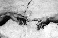

## Archives 2011 - Actus/blog du réseau ArtRéalité
### Archives 2011 - actus/blog du réseau ArtRéalité
 Archives 2011  
**Actualités / blog des sites**

29/12/2011

> Refonte du Courrier des Lecteurs
> 
> 1ère saison 2011 publiée
> 
> 25 pages web en ligne.
> 
> **[LIEN](courrierdeslecteurs2011a.html)**

 

 

27/12/2011

> Rayons atomiques
> 
> La table de Mendeleïev version Dotapea a aujourd'hui été modifiée de sorte à intégrer les données de [rayon atomique de Van der Waals](rayonsatomiques.html#vanderwaals) en provenance d'une source unique, le Laboratoire de Los Alamos.
> 
> La raison de ce choix est double : d'une part ce laboratoire met à disposition en ligne un remarquable ensemble de pages web consacré aux éléments ([lien](http://periodic.lanl.gov/list.shtml)), d'autre part le fait de disposer d'une source homogène permet d'effectuer des comparaisons, quoique sous toute réserve - ne nous laissons pas emporter par l'enthousiasme - car le calcul d'un rayon atomique donne vraiment, selon les sources, des résultats parfois éloignés. Ainsi peut-on toutefois observer que les trois records d'épaisseur atomique seraient largement détenus, en première colonne, par le francium, le césium et le rubidium. Suivent le zirconium en colonne 4 et le radium en colonne 2.
> 
> Ce sont aussi - et ce n'est sans doute pas un hasard - les lanternes rouges de l'électronégativité. Un noyau qui attire moins laisse son nuage d'électrons s'étendre. Soit dit sous toute réserve car ces chiffres sont issus de plusieurs méthodes de calculs qui, à ce jour, ne donnent pas précisément les mêmes résultats.

**[LIEN](annexe1.html#paulingetrayon)**

20/12/2011

> Tensioactivité : complément
> 
> Le brave capitaine n'en revient pas : la tension de surface, c'est quelque chose, tonnerre de Brest !
> 
> Un important complément a été apporté en annexe ([lien](tensioactivite.html#annexetensiondevapeur)) au sujet de la tension de vapeur. Des informations ont également été ajoutées en [note 1](tensioactivite.html#note1) où l'on trouvera un lien vers un très joli voyage proposé par la Nasa autour du périple de la sonde Juno.

[](tensioactivite.html#annexetensiondevapeur)

19/12/2011

> Tensioactivité
> 
> Tension de surface, tension et surface
> 
> Cet ancien article, une définition de la tensioactivité, vient d'être récrit avec une attention plus forte aux concepts de tension, de surface et... de tension de surface, non sans quelques détours exotiques par les neutrons cubiques et les astéroïdes.
> 
> La surface est un sujet sur lequel il est bon de s'étendre !
> 
> **[Lien](tensioactivite.html)**

[](tensioactivite.html)

11/12/2011

> Le chantier progresse !
> 
> Le courrier des lecteurs 2010 est maintenant disponible sous la nouvelle formule "une page par discussion"
> 
> Environ 70 articles sont en ligne. In fine, le Courrier des Lecteurs va représenter non loin de 300 pages internet. Un site dans le site.
> 
> Pendant ce temps, pour des raisons pratiques, Dotapea et ArtRéalité.com continuent à répondre à vos questions, mais par courriels.
> 
> Pardon pour l'aspect apparemment passif de cette période. La refonte du Courrier - certes guère spectaculaire mais nécessaire - n'est qu'une partie de ce que nous mettons en place pour 2012.
> 
> Mais on vous garde la surprise :)

[](courrierdeslecteurs2010c.html)

18/11/2011

(entrée complétée le 19)

> Refonte du courrier des Lecteurs
> 
> 2010 saison I publiée
> 
> Seize articles dont la majorité a été révisée.
> 
> [Cliquer ici.](courrierdeslecteurs2010a.html)
> 
> Ai Weiwei et les Qing d'aujourd'hui :
> 
> un jeu subtil autour d'une photo d'apparence banale
> 
> _Editorial_
> 
> Pornographe ! C'est la nouvelle accusation inventée par la dictature chinoise destinée à briser l'artiste dissident démocrate Ai Weiwei.
> 
> Peut-être s'agit-il cependant d'une turpitude de trop. D'ores et déjà, la situation difficile de l'artiste à qui des millions de yuans ont été réclamés par le fisc à sa sortie du lieu secret où il avait été enfermé plusieurs mois cette année, aurait suscité un notable élan de solidarité en Chine. La garantie exigée - 8,5 millions de yuans -, permettant d'interjeter un redressement de 1,7 millions d'euros, aurait en effet été réglée par des partisans solidaires à 95% chinois selon l'intéressé. Entre 20 et 30 000 donateurs dit-on (information non confirmée).
> 
> « _Tous les matins, nous ramassons de l'argent jeté dans notre cour. Parfois, les billets sont pliés en forme d'avions ou de bateaux, ou enroulés autour d'un fruit_ », raconte-t-il (source Arnaud de la Grange, Le Figaro du 8/11).
> 
> Ainsi l'effet d'intimidation recherché par le pouvoir a-t-il dirait-on fait long feu, voire peut-être (bien peut-être) renforcé l'assise populaire de l'opposition dissidente.
> 
> Cette fois, le pitoyable argument de la dictature est une photo (voir ci-contre) dont le moins que l'on puisse dire est qu'elle n'évoque guère la lubricité. Il s'agit sans doute d'un jeu beaucoup plus fin.


Un tigre, huit seins,

Ai Weiwei

> L'artiste aurait déclaré : « _S'ils voient la nudité comme de la pornographie, alors la Chine est encore dans la dynastie des Qing_ ». (« _If they see nudity as pornography, then China is still in the Qing dynasty_ » - selon ABC News).
> 
> Cette allusion aux Qing (prononcer à peu près « tschin » et non king) n'est pas innocente. En effet, cette dynastie (1644-1912) était mandchoue, donc de langue toungouse comme les Evenks. Etrangère, elle est encore globalement fort mal considérée aujourd'hui par les Hans, blessés tant par la violence déchaînée contre eux lors de l'invasion et des innombrables rébellions qui s'en sont suivies (les chiffres avancés ici ou là, non confirmés, concerneraient des dizaines de millions de mort sur l'ensemble de ces règnes) que par les humiliations subies.
> 
> Ce sont les Qing (exactement le prince Dorgon en 1645) qui contraignirent sous peine de mort les Hans à porter la célèbre natte mandchoue en signe de soumission, en plus de tenues vestimentaires mandchoues obligatoires pour différentes catégories de la population. Une grande blessure nationale. Des pays voisins subirent au long de cette période l'ultra-impérialisme mandchou qui poussa ses frontières de la Corée jusqu'à Kashgar, incluant la Dzoungarie, la Mongolie, le Tibet et Taïwan.
> 
> A partir de la moitié du XIXème siècle, sans doute à cause d'une coupure persistante des liens avec l'extérieur, le déclin de la Chine Qing devînt sensible et les puissances occidentales surent largement en tirer parti.
> 
> Ai Weiwei fait ainsi une comparaison très lourde de sens, extrêmement sérieuse car impliquant une symbolique nationale de premier plan.
> 
> Alors que signifie donc la nudité dans cette humble photo taxée par la dictature de pornographie ? Qu'est-ce donc qui paraît obscène à ces tyrans plus imperméables que jamais, et ce publiquement, à l'idée de démocratie ? Enfin, pourquoi Ai Weiwei évoque-t-il les Qing ?
> 
> On peut supposer que le maître avait une intention politique lorsqu'il a fait prendre le cliché par son malheureux assistant, aujourd'hui inquiété par la police.
> 
> Weiwei ne cherchait pas la grâce. Non. C'était peut-être une référence, discrète mais compréhensible par le peuple han, aux contraintes vestimentaires imposées par les Qing à ce même peuple.
> 
> La soi-disant obscénité de cet anodin cliché serait alors de nature politique. Il s'agirait d'un subtil piège artistique et politique, dans lequel ce régime lourdaud serait tombé.
> 
> Pure hypothèse, bien sûr. Reste d'ailleurs à comprendre pourquoi un tigre et huit seins...

> En conclusion de cet éditorial, proposons la lecture de cet article publié dans Al Jazeera le 9/11 :
> 
> > **[Lien](http://www.aljazeera.com/programmes/talktojazeera/2011/11/2011114434664695.html)** (en anglais - si ce lien venait à être rompu, merci de nous le signaler, nous disposons d'une copie de sauvegarde)
> 
> La vidéo est fort longue et insipide - ce n'est pas un reproche - mais le résumé écrit est intéressant. La personne interviewée est Jin Liqun. Ancien ministre des finances, il est actuellement superviseur de la China Investment Corporation, entité gestionnaire des investissement de la République Populaire de Chine. Citons-le :

> _Si vous regardez les problèmes qui sont advenus dans les pays européens, c'est purement dû à l'aide sociale éculée. Je pense que les lois \[les droits\] du travail sont dépassées. Les lois du travail induisent la paresse, l'indolence, plus que l'assiduité. Le système d'encouragement \[motivation\] est totalement détraqué._
> 
> _If you look at the troubles which happened in European countries, this is purely because of the accumulated troubles of the worn out welfare society. I think the labour laws are outdated. The labour laws induce sloth, indolence, rather than hardworking. The incentive system, is totally out of whack._
> 
> Les Européens sont des paresseux à cause du droit du travail, oui, _tas de tire-au-flanc_, vous l'avez bien lu et cela émane de l'un des plus hauts décisionnaires du pouvoir communiste. Ai Weiwei, dans la comparaison qu'il opère avec le pouvoir Qing et par la symbolique de la nudité, pose peut-être la question « ces gens sont-ils bien ce qu'ils prétendent ? ».
> 
> Ou ne sont-ils que d'autres Qing ?

_Emmanuel Luc,_

_éditeur_

9/11/2011

> Ocre bleue - publication d'une version courte
> 
> Un résumé de l'article « Ocre bleue : enfin une solution ? » ([chap. XXXIII](chap33ocrebleuesimulation.html) des Dialogues de Dotapea) est disponible sur le site Parlons Peinture du CRFP.
> 
> > **[Cliquer ici.](http://www.parlonspeinture.com/__download/CRFP_%20com_09-11-11_ocre%20bleue.pdf)**

[](http://www.aljazeera.com/programmes/talktojazeera/2011/11/2011114434664695.html)

Jin Liqun,

Al Jazeera 9/11/2011,

capture d'écran

4/11/2011

> Modification de certains aspects graphiques
> 
> Sur tout le site Dotapea dorénavant, les liens ne sont plus soulignés "à l'ancienne". Ce changement discret nous a demandé un travail rendu difficile par une plateforme Html un peu archaïque mais fiable et nécessaire avant que nous puissions basculer sur un autre outil qui est encore en cours de développement.
> 
> Si vous constatez des anomalies sur le site suite à cette transformation, n'hésitez pas à [nous faire signe.](ecrire.html)

> Le travail de segmentation du Courrier des Lecteurs est toujours en cours mais n'hésitez pas à nous écrire pendant ce temps. Nos réponses se font par mail, sans publication pendant la durée des travaux.

28/10/2011

> Refonte du courrier des Lecteurs
> 
> 2009 saison III publiée
> 
> Onze articles révisés.
> 
> [Cliquer ici.](courrierdeslecteurs2009c.html)

26/10/2011

> Refonte du courrier des Lecteurs
> 
> 2009 saison II publiée
> 
> Publiée après révision, c'est la règle dans ce processus.
> 
> [Cliquer ici.](courrierdeslecteurs2009b.html)

19/10/2011

> Appel aux lecteurs pour prise d'informations sur les cires de Chine
> 
> Suite au courrier envoyé par un lecteur au sujet de la (ou des) cire de Chine, nous avons modifié l'article qui est consacré à ce produit. Mais le problème n'est pas résolu car les auteurs donnent des informations en contradiction. Non seulement nous aimerions pouvoir trancher à l'aide de documents photo ou vidéo, mais au-delà, nous souhaiterions pouvoir obtenir davantage d'informations sur cette substance très fine mais encore très mal connue en Occident.
> 
> **[Lire l'article](cires.html#lesciresdechine)**

18/10/2011

> Suite de la refonte du Courrier des Lecteurs
> 
> 2009-saison I publiée (27 articles)
> 
> Une refonte qui n'est pas purement structurelle car elle est émaillée d'ajouts et de révisions.
> 
> [Cliquer ici.](courrierdeslecteurs2009a.html)

5/10/2011

> Début de la refonte du Courrier des Lecteurs
> 
> L'année 2008 publiée
> 
> Comme annoncé, le Courrier des Lecteurs ne donne pas satisfaction sous sa forme actuelle où tous les dialogues d'une saison sont entassés sur une seule page.
> 
> En effet, une recherche ne laisse pas toujours apparaître des mots-clés noyés dans cet entassement, ce qui est pour le moins dommage.
> 
> Placer chaque ensemble question/réponse sur une page séparée est un long travail.
> 
> En effet, nous en profitons pour effectuer quelques ajouts dont certains présentent une certaine importance. Par exemple : [ceci](courrierdeslecteurs2008c080.html#20081212fvajout2011), au sujet des alkydes et des oléorésines.
> 
> Les nouvelles pages seront publiées année par année. En l'occurrence nous avons pour 2008 :
> 
> > \* [2008 saison 2](courrierdeslecteurs2008b.html)
> > 
> > \* [2008 saison 3](courrierdeslecteurs2008c.html)
> > 
> > (la saison 1 n'est pas encore traitée dans le Courrier des Lecteurs)
> 
> Le lecteur peut naviguer de courrier en courrier ou en accès direct par l'index saisonnier et toujours par thèmes via [l'index général](courrierdeslecteurs.html#sommaire).
> 
> Bonne (re)lecture !

29/9/2011


> Je vois votre mémoire (visuelle)
> 
>   
> De quoi notre mémoire visuelle est-elle faite : la réponse (partielle) à cette question est un événement scientifique bouleversant mais elle souffre d'une désastreuse communication. Un remarquable travail peut se trouver voilé, partiellement gâché, par une communication inadéquate...
> 
> [Lire la suite.](hitechlirelamemoirevisuelle.html)

24/9/2011

> Réparations sur ArtRéalité.com
> 
> Problèmes d'accès aux vidéos, images manquantes... suite à ce qui ressemble à une "fausse manip", les exclusivités étaient en mauvais état. C'est réparé, mais surtout, chers amis lecteurs, n'hésitez pas à nous signaler tout problème sur les sites Dotapea et ArtRéalité.

14/9/2011

> Ocre bleue :
> 
> Edition validée
> 
> Au-delà de la version expérimentale, après ajouts d'images et de textes, et après relectures, nous en voici venus à une "version stable" sur un sujet de première importance. Présentation et lien ci-dessous.

12/9/2011

[](hitechlirelamemoirevisuelle.html)

> Ocre bleue :
> 
> publication des résultats de l'enquête
> 
> Information exclusive Dotapea
> 
> Première version d'un article qui donne une explication possible aux "mystères de l'ocre bleue et du bleu Degottex" et ouvre sur une approche contemporaine de l'emploi des charges.
> 
> Ce que nous voyons comme des colorations parasites pourrait avoir été aux yeux de l'artiste Jean Degottex l'occasion de donner plus de subtilité à un procédé déjà subtil. Genèse un peu magique où dans un sfumato l'on fait naître du bleu sans bleu, où le blanc d'ombre devient charge d'ombre et où les foraminifères (comme celui-ci, à droite) sont finalement bienvenus au profit d'une manière de peindre, voire de sculpter ou d'installer, à explorer...
> 
> Les résultats (sous forme synthétique) d'une longue enquête où deux lectrices de Dotapea ont joué un rôle de tout premier plan :
> 
> **[LIEN](chap33ocrebleuesimulation.html)**

5/9/2011

> **Scoop**
> 
> Le mystère de l'ocre bleue élucidé...
> 
> ...sous toute réserve bien sûr, car il ne s'agit que d'une simulation. Simulation cependant suffisamment convaincante pour affirmer que nous avons vraisemblablement reconstitué la très mystérieuse ocre bleue du peintre Jean Degottex.
> 
> Conclusion : c'est et ce n'est pas une ocre, c'est et ce n'est pas du bleu, mais il y a bien un "secret". Explications et implications dans un chapitre à paraître très bientôt dans les Dialogues de Dotapea, cinq ans après l'ouverture de l'enquête (cf. [chapitre X](chap10ocrebleue.html) des Dialogues de Dotapea), grâce notamment à une lectrice de Dotapea basée à Rome. Merci Isabelle !

26/8/2011

> Les nouvelles
> 
> Chers amis lecteurs, plusieurs de vos courriers suscitent des "prolongations", de même qu'un gros travail ayant un rapport avec le bleu de Degottex, entamé il y a déjà quelques années. Nouveautés et surprises sous peu, sur ces sujets et d'autres.

[](chap33ocrebleuesimulation.html)

> Pour information, la première page de notre futur nouveau site vient d'être mise en ligne dans un espace expérimental hier. Ainsi le 25 août 2011 est-il une date importante dans l'histoire du Réseau ArtRéalité. C'est un premier balbutiement. Nous ne pouvons à ce jour nous engager sur des délais concernant ce projet ambitieux donc difficile. Nous espérons pouvoir ouvrir courant 2011 mais rien de sûr. L'un des enjeux est un déplacement de Dotapea.com et de ArtRéalité.com dans cet espace indépendant, construit par nous et destiné à vous offrir de puissants services totalement nouveaux, inconnus ailleurs.
> 
> Un ovni confortable, pas dépaysant, familier. Même les Url actuelles resteront valables.

Un ovni familier

> En ces temps difficiles, il n'est peut-être pas inutile de préciser que tous nos contenus resteront accessibles gratuitement. Les nouveaux services, c'est à part, en plus. Et pas forcément payants, loin de là. Pas de pénurie ni de rupture chez nous, vive l'abondance, vive la stabilité. Dotapea fêtera bientôt ses dix ans et tout ce temps s'est écoulé sans rupture éditoriale, par des progressions simples, une production constante, c'est-à-dire en tenant le cap et c'est tout.

Gratuité, stabilité, des valeurs éditoriales très importantes

> Autre travail en cours : la segmentation du Courrier des Lecteurs. Une page par sujet. 200 sujets... c'est un travail long mais utile. Pour deux raisons : l'accessibilité via les recherches laisse actuellement à désirer et nous avons pensé que certaines des pages actuelles, groupées par saisons, étaient énormes et chaque sujet nous a semblé réduit de ce fait à être enserré par d'autres donc guère mis en valeur.
> 
> Par exemple [l'enquête sur le jaune de Van Gogh](courrierdeslecteurs2011a130.html#20110218aa), qui soulève dans la foulée des hypothèses sur la vie du peintre, mérite selon nous une page séparée. Prise dans un étau, elle étouffe les autres articles qui l'étouffent en retour.
> 
> Les contenus seront intacts et toujours accessibles par la recherche Google, la recherche thématique ou l'exploration chronologique. Nous allons simplement aérer tout cela. Il faudra un peu de temps mais ce travail a commencé.

Ventiler le Courrier des Lecteurs

> La section "Hi-tech" dort-elle ? Oui, mais ce n'est pas de notre faute. Rien cet été, dans l'actualité, ne nous a semblé concerner de près ou de loin les arts plastiques. Nous continuons la veille. Cette situation ne devrait pas s'éterniser, du moins l'espérons nous.

11/8/2011

> Courrier des lecteurs
> 
> \* [Marouflage sur trapèze](courrierdeslecteurs2011c030.html#20110809mv)
> 
> L'artiste peut-il s'affranchir des questions pratiques ?

5/8/2011

> Courrier des lecteurs
> 
> \* [Brou de noix comme fond](courrierdeslecteurs2011c020.html#20110805ccd)
> 
> L'air de rien, un sujet hi-tech se dissimule derrière un produit vieux comme Hérode. Ce colorant, que l'on prend à tort pour une encre ou une teinture n'a pas livré ses secrets.

4/8/2011

> Courrier des lecteurs
> 
> \* [Résine dure inconnue](courrierdeslecteurs2011c010.html#2011003amm)
> 
> Un mystère parfumé, l'histoire d'une substance végétale...

2/8/2011

> Courrier des lecteurs
> 
> \* [Caséine comme support pour le stuc](courrierdeslecteurs2011b240.html#20110730lb)
> 
> Un stuc mantavano sur une préparation à la caséine...
> 
> \* [Huiles de tournesol à tester](courrierdeslecteurs2011b.html#20110729kc)
> 
> Certains tests ne peuvent être réalisés aisément dans un atelier. Ce qui pose une question de méthode rendant sans doute nécessaire la collaboration avec des intervenants disposant des moyens a priori nécessaires.

27/7/2011

> Courrier des lecteurs
> 
> \* [Bleu grec](courrierdeslecteurs2011b220.html#20110726am)
> 
> S'agit-il d'une appellation authentique ? Dotapea lance un appel à informations.
> 
> \* [Fluorescence : enfin des couleurs rompues ?](courrierdeslecteurs2011b210.html#20110726ca)
> 
> L'aube d'une nouvelle ère de la fluorescence ? Une piste très intéressante à suivre de près.
> 
> \* [Support peu coûteux pour format non standard](courrierdeslecteurs2011b190.html#20110725kg)
> 
> A quelques centimètres près, il faut parfois changer de support, de procédé, de concept.

25/7/2011

> Courrier des lecteurs
> 
> \* Un message à Mme A. B. de la société G. :
> 
> nous avons bien reçu votre question concernant les substituts au E450i mais votre adresse courriel est en anomalie et nous n'avons pu vous transmettre notre réponse.
> 
> Pouvez-vous nous fournir une adresse opérationnelle s'il vous plaît ? Pour vérifier que votre serveur de mails fonctionne, il suffit de vous envoyer à vous-même un message.
> 
> \* [Peindre sur une acrylique vernie](courrierdeslecteurs2011b180.html#20110717ed)
> 
> Un vernis, même acrylique, est un vernis destiné par essence à être remplacé.

15/7/2011

> Courrier des lecteurs

Oui, "Hi-tech" dort...

> \* [Photoluminescence : histoire et matériaux](courrierdeslecteurs2011b170.html#20110713ca)  
> Des précisions sur ce fascinant sujet à la fois artistique et scientifique.

12/7/2011

> Courrier des lecteurs
> 
> \* [Tempéra, vernissage et temps de séchage](courrierdeslecteurs2011b160.html#20110710mm)
> 
> Le jaune d'oeuf est assez gras. Cela implique des précautions lorsqu'il s'agit de vernir une tempera.
> 
> \* [Vernissage et marouflage d'une gouache](courrierdeslecteurs2011b150.html#20110710pb)
> 
> La gouache devenue impasse technique pourrait devenir impasse commerciale à terme, cédant à une implacable logique autodestructrice.
> 
> \* [Latex et imperméabilité](courrierdeslecteurs2011b140.html#20110705lp)
> 
> Une difficile question sur les imperméabilisants du latex révèle que cette substance et certains autres produits sont en bonne santé.

6/7/2011

> Courrier des lecteurs
> 
> Des nouveautés :
> 
> \* [Carton détourné comme support](courrierdeslecteurs2011b130.html#20110705fl)
> 
> Seuls certains cartons peuvent être utilisés pour la peinture, du moins dans l'optique de résultats durables.
> 
> Occasion de souligner que nous sous-employons vraiment certains matériaux modernes ou contemporains.
> 
> \* [Térébenthine : normalement, elle ne jaunit pas](courrierdeslecteurs2011b120.html#20110702cb)
> 
> Déterminer ce qui, dans une peinture, provoque un jaunissement, cela nécessite une réflexion sur tous les paramètres, y compris l'environnement.
> 
> ...et un rappel :
> 
> Amis lecteurs, ne l'oubliez pas s'il vous plaît : nous recherchons toujours des informations sur "le mystère du rouge batéké" [(lire l'article)](courrierdeslecteurs2011b090.html#20110618vd). Il pourrait s'agir du _tsûla_ mais nous n'en avons pas la certitude et nos connaissances sur la préparation de cette pâte est de toute façon imprécise.

4/7/2011

[](courrierdeslecteurs2011b170.html#20110713ca)

> L'ardoise
> 
> Refonte de l'article de Dotapea
> 
> Des précisions importantes sur ce matériau un peu trop délaissé. [Lien.](ardoise.html)
> 
> Merci à Isabelle-de-Rome.
> 
> Ai Weiwei en résidence surveillée
> 
> Editorial ArtRéalité/Dotapea
> 
> Sorti des geôles secrètes pour entrer dans la prison invisible de sa résidence surveillée, le plasticien Ai Weiwei n'est plus en mesure de donner la moindre opinion. Et finalement, après cet éditorial, nous non plus nous n'insisterons pas car tout est dit.
> 
> L'art et la politique sont liés. Comment parler de Picasso sans évoquer Guernica ? Et pourquoi s'en priver ? Mais si nous nous permettons de temps en temps de l'évoquer, ce thème n'est pas central sur les sites ArtRéalité. Dans le cas présent comme dans d'autres, c'est aux politiques et aux citoyens de prendre le relais de l'artiste. Il s'agit donc ici d'une parenthèse politique liée au travail artistique d'un plasticien privé de droits.
> 
> La "libération" toute relative de l'artiste n'est pas un scoop de dernière fraîcheur. Mais une fois n'est pas coutume, ce n'est pas involontairement que nous avons tardé à relayer cette information.

[](ardoise.html)

> En effet, comme indiqué dans un éditorial publié lors de sa mise au secret ([lien](blog2011.html#20110412aiweiwei)), l'artiste, lorsqu'il en avait encore la possibilité, a eu à coeur de rappeler que si le régime chinois est devenu aussi puissant tout en restant totalitaire, c'est parce que l'Occident l'a laissé faire, et qu'en résulte-t-il ? Que cette Chine devenue plus dictatoriale que jamais continue à "_tuer des poulets pour effrayer les singes_" (cf. même lien). Entendre, et c'est bien le propos de cet éditorial comme du précédent, que les singes, c'est nous, nous tous, Orientaux et Occidentaux.
> 
> Ainsi donc, en tant que publication, ArtRéalité/Dotapea se doit de ne pas entretenir une panique. Nous avons marqué un temps d'arrêt et d'analyse critique devant cette intimidation de proportion internationale de sorte à ne pas, in fine, jouer le jeu des tyrans par un copier-coller de leurs intimidations littéralement jetées à la face du monde.
> 
> Suivons donc l'idée de l'artiste.
> 
> Tout concrètement, Bruxelles et l'OMC sembleraient effectivement porter une responsabilité partielle mais directe dans la réussite de cette dictature décomplexée. Essayons de nous hisser sur la pointe des pieds devant le mur de la politique et voyons cela.

Que nous dit l'artiste ?

> Citons un vieil article de _La libre Belgique_ (25/4/2005, sous la plume de Vincent Slits) pour nous rafraîchir la mémoire : « _Lundi, tous les regards de l'industrie européenne du textile se tourneront vers la Commission européenne. En coulisses, l'Italie et la France ont mené ces derniers jours une intense campagne (...). Objectif: dégager une majorité pour convaincre Bruxelles d'adopter des mesures de sauvegarde afin de contrer l'explosion des importations de textiles chinois en Europe. Déjà, le gouvernement chinois bombe le torse et met en garde l'Union européenne «sur les conséquences pour ses relations avec la Chine d'une décision unilatérale». Mais les chiffres sont là. Implacables. Suite à la fin des quotas dans le secteur, les exportations de textile de la Chine ont augmenté de 50 pc vers l'Europe. Le dérapage est évident. Il y a donc lieu d'agir. Sans tarder, car des centaines de milliers d'emplois sont menacés. Une telle clause de sauvegarde est légale : elle est prévue dans le cadre des engagements pris par la Chine à l'égard de l'OMC. Alors que dans certains pays européens - ne pensons qu'à la France où le « non » à la Constitution européenne reste majoritaire - il existe une réelle fracture entre les inquiétudes des citoyens et le projet européen_ ».
> 
> Il n'y a pas à commenter bien au-delà. 2005 fut une année funèbre pour le textile européen, ce n'est pas un mystère.
> 
> En 2011, alors que les Européens ont eu le temps d'évaluer la qualité desdits textiles chinois qui ont totalement submergé le marché et effectivement détruit des centaines de milliers d'emplois, peut-on dire que lesdites inquiétudes ont été écoutées ? Les parlementaires français ont de toute façon approuvé le Traité de Lisbonne par un très intriguant vote de 336 voix contre 52 (soit 87% pour) le 7 février 2008, trois ans seulement après le « non » référendaire des Français.
> 
> Quant à l'OMC, son _Accord sur le Textile et l'Habillement_ signé en 1995 prévoyait l'ouverture totale du commerce textile mondial début 2005. Tour de force : le calendrier a été respecté à quelques mois près. La Chine est entre-temps entrée dans l'OMC en 2001. Rappelons que l'OMC, selon sa propre définition ([lien externe](http://www.wto.org/french/thewto_f/whatis_f/who_we_are_f.htm)), "_C'est une organisation qui s'occupe de l'ouverture commerciale._"

L'exemple du textile chinois

> La question soulevée par Ai Weiwei semble donc toujours pertinente, voir hurlante de réalisme : quelle résistance a-t-elle été opposée au régime chinois par l'Union Européenne, par les politiques nationaux ou par les diplomates de l'OMC depuis Tian'anmen (printemps 1989) ?
> 
> Le risque d'une récupération démagogique catastrophique sur la base du "tous pourris" est énorme. Aussi préférons-nous en rester à ces quelques mots éditoriaux pas plus anodins que ceux de Ai Weiwei et ne s'immisçant pas davantage dans un débat spécialisé situé au-delà de l'articulation entre art et réalité.

_Emmanuel Luc_

_Editeur_

1/7/2011

> Courrier des lecteurs : nouveautés
> 
> Avec un appel à informations sur le rouge batéké
> 
> Les nouveaux courriers :
> 
> \* [Le rouge batéké](courrierdeslecteurs2011b090.html#20110618vd)
> 
> C'est un rouge africain, oui, mais lequel exactement ? Batéké fait référence à un peuple qui se sert de différents rouges. Alors qui peut nous dire ce que, au Congo Brazza notamment, on appelle rouge batéké ? N'hésitez pas à nous écrire.
> 
> \* [Vernir un lino peint à l'acrylique](courrierdeslecteurs2011b100.html#20110628lb)
> 
> Un support aussi inhabituel mérite réflexion. Et mise au point : par exemple, qu'appelle-t-on vitrifier, dès lors que l'on ne parle pas de verre ?
> 
> \* [Solidifier des matériaux avec de l'huile de lin](courrierdeslecteurs2011b110.html#20110629ml)
> 
> Le retour aux produits naturels impose des contraintes. Un choix lourd de conséquences qui implique en amont une réflexion sur le sens de cette "quête de naturel".
> 
> Et bonnes vacances si vous en prenez !
> 
> Dotapea et ArtRéalité dans son ensemble ne prendra ni trêve ni répit afin de vous présenter de nouvelles productions durant le second semestre.

20/6/2011

> Aujourd'hui, un petit film
> 
> Chose plutôt rare, nous voulons signaler une réalisation poétique, belle et amusante. Les lecteurs saisiront vite la raison de ce choix.
> 
>  
> 
> Tout autre chose, une nouvelle entrée du courrier des lecteurs :
> 
> \* [Enduction lustrée et tension](courrierdeslecteurs2011a230.html#20110414el)
> 
> La colle de peau tend la toile, les liants synthétiques, non. Par contre ces derniers ont une très bonne tenue. Comment tirer parti des ces deux matériaux d'enduction ?

18/6/2011

> Courrier des lecteurs :
> 
> quatre nouvelles questions/réponses
> 
> \* [Bois entoilé](courrierdeslecteurs2011b080.html#20110615cd)
> 
> Une planche de tilleul comme support est une bonne base, mais comment l'enduire ? Une jeune lectrice tente d'adapter un procédé de Xavier de Langlais à des produits plus contemporains. Des problèmes surviennent...
> 
> \* [Dammar et résistance](courrierdeslecteurs2011b070.html#20110607tg1)
> 
> Quelle résine employée pour un bois qui doit subir des contraintes importantes ?
> 
> \* [Pâte à bois caséine trop rigide](courrierdeslecteurs2011b060.html#20110607tg2)
> 
> La pâte à bois à la caséine n'est pas un support structurel mais un parement.
> 
> \* [Mayonnaise et eau oxygénée](courrierdeslecteurs2011b050.html#20110607tg3)
> 
> L'occasion d'évoquer un certain nombre de phénomènes autour d'une substance jusqu'à présent absente de Dotapea.

30/5/2011

> Chaux : précisions
> 
> Un petit mot pour signaler deux petites précisions apportées à [l'article consacré à la chaux](chaux.html). Ces modifications de peu d'ampleur ne sont signalées dans ce blog que parce que nous avons remarqué l'intérêt que vous, chers lecteurs, portez à ce liant remarquable.
> 
> En résumé, la "chaux maigre" peut être une chaux cochonnée (n'ayons pas peur des mots), on avait oublié de le dire. Mais cela ne change strictement rien aux définitions ni aux usages. [Lien.](chaux.html#chauxhydraulique)
> 
> Deuxième précision : à la fin du cycle de la chaux, lorsque celle-ci a "carbonaté", elle n'a fait que réincorporer le CO2 émis lors de la calcination initiale. Ce dernier point, évoqué mais insuffisamment souligné jusqu'à présent dans cet article, est important ([lien](chaux.html#reparerledefautoriginel)). Disons-le donc plus haut et fort : la chaux ne contribue pas à éliminer les excès de gaz à effet de serre puisqu'elle en produit initialement.

26/5/2011

> Courrier des lecteurs : début de la nouvelle saison
> 
> La deuxième saison 2011 s'ouvre par quatre courriers dont un (le dernier de cette liste) a nécessité un travail de synthèse d'une certaine importance sur ce site.
> 
> \* [La chaux aérienne comme support pour l'huile](courrierdeslecteurs2011b.html#20110519od)
> 
> Une bonne idée ? Peut-être sous certaines conditions.


Une image très célèbre : un inconnu fait face à une colonne de chars pendant la répression sanglante contre les contestataires démocrates de la place Tian'anmen à Beijing en 1989

> \* [Carnations](courrierdeslecteurs2011b030.html#20110518da)
> 
> Une couleur ne peut pas résumer une peau. Retour sur un monde bien réel où les même les tomates apparaissent parfois tout à fait noires.
> 
> \* [Alcool pour fixatif](courrierdeslecteurs2011b020.html#20110514cbp)
> 
> Les dénaturants de l'éthanol peuvent effrayer, à juste titre pour certains sans doute, mais le choix d'un alcool pour une laque ou un fixatif ne devrait pas poser de problèmes.

[](courrierdeslecteurs2011b030.html#20110518da)

> \* [Oxyder les pigments : techniques](courrierdeslecteurs2011b010.html#20110505lf)
> 
> Une question simple en soulève parfois de très essentielles !
> 
> La structure d'un nuage électronique détermine la couleur renvoyée par une molécule ou un atome. Tout l'univers chromatique répond à cette règle qui semble encore fort mystérieuse. Entre autres abordées dans ce texte court, fruit d'un travail de synthèse. Voyage tout au coeur de Dotapea...

[](courrierdeslecteurs2011b010.html#20110505lf)

9/5/2011

> Piss Christ : _ne pas s'y tromper_
> 
> Beaucoup parmi nous ont été presque "lassés d'avance" par le titre d'une oeuvre d'art contemporain : _Piss Christ_. On verra d'ailleurs ci-dessous que ce n'est pas le véritable titre de cette oeuvre.
> 
> Mais à l'origine de cette lassitude, une question se posait effectivement pour le public : s'agissait-il encore d'un fatiguant pamphlet dans la veine des caricatures du prophète de l'Islam (sAaws) ? La presse - même les grands quotidiens francophones - est restée laconique, se contentant de rapporter les destructions perpétrées en avril 2011 par un groupe d'extrémistes catholiques dans la galerie Yvon Lambert, en Avignon.

> Or, comme le rappelle à point nommé l'éditorial de LaCritique.org ([lien](http://www.lacritique.org/article-andres-serrano-notre-contemporain)) alors que l'exposition continue, l'artiste, Andres Serrano, est chrétien d'une famille hondurienne et son travail est ancré dans ses convictions, elles aussi catholiques. Il dit en effet ceci : "_Si en faisant appel au sang, à l'urine, aux larmes, ma représentation déclenche des réactions, c'est aussi le moyen de rappeler à tout le monde par quelle horreur le Christ est passé._" Voilà sa conviction, voilà le sujet de son oeuvre.
> 
> On ajoutera au passage que le titre de ce travail photographique déjà ancien (1987) n'est pas Piss Christ mais :
> 
> > _Immersion (piss Christ)_
> 
> ce qui n'est pas un détail.
> 
> L'image - belle, comme le souligne Christian Gattinoni - utilise un objet très ordinaire, un crucifix de peu de prix. Elle est pleine de sens, tout à l'opposé d'un brûlot médiatique ou d'une provocation irresponsable.
> 
> On aime ou l'on n'aime pas l'oeuvre, bien sûr, on partage ou non ces convictions religieuses, cela va de soi, mais il s'agit indéniablement d'une oeuvre d'art forgée par une inspiration originale et personnelle.
> 
> D'où l'absolue nécessité de la critique d'art. Elle permet de... _ne pas s'y tromper !_ et de ne pas voir une dérive de l'art contemporain là où il n'y a pas de dérive du tout mais surtout une grande sottise de la part des détracteurs intégristes qui se permettent de s'en prendre à une oeuvre. Oeuvre qui célèbre de plus leur propre dieu. Dans une ville d'Avignon qui doit pour le moins beaucoup aux artistes.

_Emmanuel Luc_

_Editeur_

22/4/2011 --> màj dimanche 24

> [Sable Rouge](chap31bellastock.html), pourpre et télévision
> 
> Clothilde Bernair intervient avec brio dans le Courrier des Lecteurs sur un sujet vénérable et difficile : l'enduction de la bauge.
> 
> [C'est ici.](courrierdeslecteurs2011a240.html#20110421nh)
> 
> Signalons par la même occasion l'ouverture d'une page Facebook consacrée à son entreprise, Sable Rouge.
> 
> [Lien.](http://www.facebook.com/pages/Sable-Rouge/162818690439450)
> 
> Venez nombreux !
> 
> Et demain samedi 23, deux amies de Dotapea interviennent dans le champ télévisuel :
> 
> > \* Inge Boesken Kanold, sans laquelle l'article consacré sur Dotapea à [la pourpre](pourpre.html) pourrait être considéré comme inexistant, est à 14h50 sur France 2
> > 
> > \* Clothilde Bernair est à 18h30 sur RTL TVI pour un « Reportage 'Clef sur porte': Les Salles de bain de Clothilde ». Oui, la même :)
> > 
> > Ajout dimanche 24
> > 
> > Vous pouvez retrouver cette courte mais sympathique émission [en cliquant ici.](http://www.sablerouge.be/apps/videos/videos/show/13447030-clef-sur-porte-rtl-tvi-avril-2011)

20/4/2011

[](http://www.lacritique.org/article-andres-serrano-notre-contemporain)

_Immersion (piss Christ)_

Andres Serrano, 1987

> [Bellastock, une ville en un souffle](chap31bellastock.html)
> 
> Enfin, nous tenons parole : Dotapea s'ouvre à l'architecture.
> 
> Pourquoi ? D'abord parce que c'était naturel, fut un temps.

> Michel-Ange, Brunelleschi et Vinci étaient artistes et architectes.
> 
> Une autre raison de ce choix est l'activité et le dynamisme inventif actuels du champ architectural.




Deux oeuvres de

Michelangello Buonarroti

> Pour cette entrée en matière, le festival Bellastock, au centre de ce nouveau _Dialogue de Dotapea_ nous a semblé emblématique par son formidable défi de _construire une ville_, relevé chaque année. Il s'agit, avec des moyens techniques particuliers mais comparables à ceux des plasticiens, d'une mise à l'épreuve dans le réel d'une construction sociétale inscrite dans l'espace, c'est-à-dire d'un urbanisme.
> 
> Traduit dans le vocabulaire des arts plastiques, c'est une installation plus une performance. De taille.

[](chap31bellastock.html)

> Bellastock édition 2011, on le verra au cours de cet entretien, construit une ville _en un souffle_, partant des concepts d'architecture des gonflables créés par un précurseur, Hans Walter Müller. En les adaptant à une expérience d'urbanisme, cette association prolonge un champ de recherche ouvert par lui il y a quarante ans, en pleine éclosion aujourd'hui.
> 
> Allons voir ce que font les architectes !
> 
> [Lire l'article (chapitre XXXI des Dialogues de Dotapea)](chap31bellastock.html)

[](chap31bellastock.html)

12/4/2011

Editorial : [Ai Weiwei](blog2011.html#20110412aiweiwei)

Nouveautés : [courrier des Lecteurs](blog2011.html#20110412cdl)

> **_"Tuer des poulets pour effrayer des singes"_**
> 
> **Sur la disparition de** **Ai Weiwei, artiste plasticien chinois**
> 
> En janvier déjà, l'éditorial de [LaCritique.org](http://www.lacritique.org/) nous avertissait, sous la plume de Christian Gattinoni, de nouvelles difficultés pour l'artiste dissident Ai Weiwei devant des mesures de rétorsion de l'Etat chinois : placement en résidence surveillée, destruction de son blog et démolition de son atelier de Shanghaï.


> Aujourd'hui, la presse internationale (liens ci-contre) nous apprend que le maître a littéralement disparu après son arrestation dimanche 3 avril à l'aéroport de Beijing.
> 
> Ai Weiwei est depuis détenu en un lieu tenu secret sous la suspicion de "crimes économiques", accusation usuellement retenue contre les dissidents politiques.
> 
> La police a saisi ordinateurs et documentations, interrogé les proches et les assistants sans présenter de justificatif juridique.
> 
> Le concert des nations (notamment l'UE et les USA) a bien entendu condamné ce qui ressemble en tous points à une détention arbitraire. Mais la presse internationale, pas tendre, évoque aussi une vague de fond de répression brutale dans tout le pays depuis quelques semaines.
> 
> Ai Weiwei était jusqu'alors plus ou moins protégé par sa renommée artistique, sa participation à la construction du stade des JO et sa filiation directe du poète Ai Qing, son père décédé en 1996, qui fut un grand francophile et une sorte de héros national du régime maoïste suite à son emprisonnement par le Kuomintang de Sun Yat Sen.
> 
> Mais aujourd'hui, la Chine Populaire raisonne semble-t-il en d'autres termes. A ce sujet, on citera l'article de Philippe Grangereau (in Libération du 7/4, pardon pour cette citation inhabituellement longue, justifiée par le fait qu'il s'agit sans doute du document le plus précis sur cette situation en pleine évolution) :
> 
> > " _«_ Les "guobao" \[brigadiers de protection de la sécurité intérieure, ndlr\] peuvent nous arrêter quand ils veulent, où ils veulent, nous emprisonner le temps qu'ils veulent et nous maltraiter comme bon leur semble _», déplore un professeur d'université qui préfère garder l'anonymat. Gao Zhisheng, avocat des droits de l'homme enfermé on ne sait trop où depuis deux ans, a ainsi subi des sévices indescriptibles. Selon un journaliste d'Associated Press qui a pu recueillir clandestinement ses propos l'an dernier, il a été dévêtu, attaché puis battu pendant deux jours et deux nuits par plusieurs policiers. L'avocat a également eu ses parties génitales percées par des cure-dents, selon un texte qu'il est parvenu à rendre public. «_Cette campagne de persécution a été ordonnée au plus haut niveau du Parti communiste, explique une source bien informée. L'objectif est de "tuer des poulets pour effrayer les singes"._»_
> > 
> > _Comprenez semer la terreur._
> > 
> > _Ces rafles d'opposants à la chaîne s'accompagnent d'une réaffirmation sans ambiguïté par le pouvoir de la «supériorité» de la dictature du Parti unique. «_Nous jurons solennellement que nous n'adopterons jamais le multipartisme ; que nous ne diversifierons jamais notre ligne politique ; que nous ne séparerons jamais les pouvoirs exécutif, législatif et judiciaire ; que nous n'adopterons jamais un système bipartite; que nous ne privatiserons pas_», a d'ailleurs lancé début mars, le numéro 2 du comité permanent du Bureau politique, Wu Bangguo._  "
> > 
> > Comme le signale également Le Figaro, " _Cette politique s'est encore raffermie pour contrer les appels lancés, en février, sur Internet pour une «révolution de jasmin» en Chine. D'importants moyens sont mis à la disposition des polices pour censurer Internet et réprimer efficacement tout défi, si petit soit-il, à la dictature du Parti unique._ "
> 
> S'agissant d'une célébrité telle que Ai Weiwei, le but est-il d'intimider le peuple ? Peut-être pas uniquement le peuple chinois. Ceci nous ramène à une lucide mise en garde de l'artiste (citation Ph. Grangereau ibid.) :
> 
> > " _L'embastillé Ai Weiwei a l'art de poser les bonnes questions. L'an dernier, dans un éditorial publié par le Wall Street Journal, il s'interrogeait sur le partenariat que l'Occident avait scellé avec la Chine, lui permettant de devenir la seconde puissance économique du monde tout en légitimant et en renforçant son régime répressif. «_ Comment, écrivait-il, un Etat basé sur la limitation des flux de l'information et de la liberté de parole peut demeurer puissant ? Et si cela est possible, alors, quelle sorte de monstre va-t-il devenir ? _»_ "
> 
> La réponse à ce questionnement - quelle sorte de monstre ? - est maintenant devant nous, réelle. Un tel monstre ne se contente pas de limiter l'accès à l'information : il _utilise de fait l'information pour faire peur_, c'est le moins que l'on puisse dire après l'arrestation et la _mise au secret_ d'un maître de l'art contemporain.

_Emmanuel LUC_

> **Courrier des lecteurs**
> 
> **Printemps 2011**

Revue de presse

[Le Figaro](http://www.lefigaro.fr/flash-actu/2011/04/07/97001-20110407FILWWW00360-chine-ai-weiwei-objet-d-une-enquete.php)

[Al Jazeera](http://english.aljazeera.net/news/asia-pacific/2011/04/20114565222165221.html)

[Libération](http://www.liberation.fr/monde/01012330233-pekin-ecrase-les-pousses-de-jasmin)

[The New York Times](http://www.nytimes.com/2011/04/08/world/asia/08china.html?_r=2&scp=2&sq=weiwei&st=cse)

[Der Spiegel](http://www.spiegel.de/international/world/0,1518,755114,00.html)

Si l'un des articles  
venait à manquer,  
n'hésitez pas à nous  
le signaler : des

sauvegardes sont

à disposition.

> \* [Auteurs et ouvrages](courrierdeslecteurs2011a180.html#20110321jl)
> 
> Un lecteur suscite un utile retour sur les sources d'informations pédagogiques dans le domaine de la peinture. Jean-Pierre Brazs apporte des ressources bibliographiques qui méritent notre attention.
> 
> \* [Encre de Chine défectueuse](courrierdeslecteurs2011a210.html#20110329cv)
> 
> Un support classique, une marque connue... comment de tels incidents sont-ils encore possibles ?
> 
> \* [Mastic pour arbres fruitiers et bouillie bordelaise](courrierdeslecteurs2011a200.html#20110322ar)
> 
> Flirtons avec le hors sujet puisque c'est au profit d'un débat intéressant.
> 
> \* [Enluminures](courrierdeslecteurs2011a190.html#20110321nc)
> 
> Tout d'abord, qu'appelle-t-on _enluminer_ ?
> 
> \* [Mangouste, soie et robustesse](courrierdeslecteurs2011a170.html#20110319rdr)
> 
> La mangouste, poil utilisé pour les pinceaux destinés à la peinture à l'huile, nécessite-t-elle un traitement particulier ?
> 
> \* [Dammar et méthode Wacker](courrierdeslecteurs2011a160.html#20110318jl)
> 
> Un lecteur, ancien élève de Nicolas Wacker, donne des précisions sur une méthode de préparation de la gomme dammar.
> 
> \* [Béton ou ciment coloré à l'extérieur](courrierdeslecteurs2011a150.html#20110306pc)
> 
> Ferrer n'est sans doute pas inutile.
> 
> \* [Patines sans térébenthine](courrierdeslecteurs2011a140.html#20110224mg)
> 
> Encaustiques et essences non végétales.

18/3/2011  
(mis à jour pendant la journée)

> **Les rayons atomiques**
> 
> Sujet piège, question philosophique autant que concrète :
> 
> > _quelles sont les frontières d'un atome ?_
> 
> Dotapea s'y frotte et s'y pique. Cela donne un nouvel article du glossaire.
> 
> [Cliquer ici](rayonsatomiques.html)
> 
> **L'iode, un élément dont on parle beaucoup**
> 
> L'actualité au Japon a entraîné une véritable folie planétaire autour de l'iode 131. Certains amis du réseau ArtRéalité étant eux-mêmes japonais donc concernés plus directement, nous avons développé l'article consacré à _l'élément violet_.
> 
> [Cliquer ici](iode.html)

7/3/2011

> **Noir et bleu**
> 
> L'article concernant le noir d'ivoire a été complété ([lien](noirs.html#lenoirdivoire)), de même que l'anecdote associée, "Le noir chaud qui bleuit" ([lien](noirs.html#unnoirchaudquibleut)).

[](courrierdeslecteurs2011a180.html#20110321jl)

> Occasion pour nous de rappeler que l'élucidation du mystère de l'ocre bleue de Jean Degottex attend toujours un échantillon de blanc d'ombre que nous serions prêts à analyser. Lire ou relire le [chapitre X](chap10ocrebleue.html) des Dialogues.
> 
> Lecteurs de Dotapea en voyage dans la région de Nocera Umbra (Ombrie, Italie), n'hésitez pas à [prendre contact](ecrire.html) avec nous.

1/3/2011

> **Modification du portail du réseau ArtRéalité**
> 
> Le portail du réseau A.R. n'est rien d'autre que la page qui s'affiche lorsque l'on entre dans Artéalité.com. Elle permet de découvrir les différents sites et d'effectuer une première navigation thématique.
> 
> Ce premier mars, il a fallu la modifier en retirant le dispositif vidéo qu'elle contenait et en supprimant les références à Walesgal et Fenêtre du Sites (dit Fest), en attendant d'ajouter une future référence au site Wal, en cours d'élaboration.
> 
> Walesgal, que l'on peut encore visiter pendant quelques jours ([lien](http://www.walesgal.com/)) va aisément se fondre dans Wal.
> 
> Fest sera recyclé plus tard.

24/2/2011

> **Nouveaux articles de taille dans le courrier des Lecteurs**
> 
> \* [Van Gogh, son jaune, l'ESRF et d'autres mystères](courrierdeslecteurs2011a130.html#20110218aa)
> 
> Deux articles en un, pourrait-on nous reprocher à juste titre.

[](chap10ocrebleue.html)

> > L'analyse de jaunes de chrome contenus dans deux tableaux de Van Gogh a été signalée dans la presse.
> > 
> > Nous faisons le point en nous basant principalement sur le communiqué du principal maître d'oeuvre, l'ESRF.

[](courrierdeslecteurs2011a130.html#20110218aa)

> > Tout autre chose, une [courte enquête](courrierdeslecteurs2011a135.html) (qui aurait mérité des années de travail) revient sur les zones d'ombre entourant la vie et l'oeuvre du maître précocement disparu, à la lumière de travaux récents et moins récents.

[](courrierdeslecteurs2011a135.html)

> \* [Le contraire de Dotapea](courrierdeslecteurs2011a120.html#20110212aa)
> 
> Rares sont sur Dotapea ce que l'on nomme des billets d'humeur, mais parfois une franche mise au point est nécessaire.
> 
> Ne pas savoir n'autorise pas à désinformer, certains ne l'ont pas compris.
> 
> Un article éditorial pour une fois tiré à boulets fumants.
> 
> **WALESGAL et Fenêtre sur sites (FEST) bientôt hors ligne**
> 
> Walesgal.com sera partiellement repris, sous une autre forme, dans le projet Wal.
> 
> Fenêtre sur sites disparaît après de trop nombreux problèmes techniques qui ont curieusement accompagné les déboires notables du web artistique francophone ces dernières années. Il réapparaîtra dans quelques années sous une autre apparence.
> 
> Quant à Wal, il est en cours de développement. Ce gros projet (une sorte de "Réseau ArtRéalité v2") ne sera dévoilé publiquement que progressivement durant l'année 2011.

[](courrierdeslecteurs2011a120.html#20110212aa)

2/2/2011

> **Courrier des lecteurs : Dotapea a rattrapé son retard**
> 
> Nouveautés :
> 
> \* [Atténuer la brillance d'une huile à l'aide d'une cire](courrierdeslecteurs2011a090.html#20110127ds)
> 
> Un retour sur les procédés huile/cire.
> 
> \* [Restauration d'une statue de pierre peinte](courrierdeslecteurs2011a100.html#20110127hm)
> 
> C'est un travail difficile mais indispensable que de reconstituer l'aspect initial de l'oeuvre.
> 
> Ce qui clôture ce cycle de quatorze questions/réponses correspondant à une période d'un petit mois et demi. Etions-nous donc tellement en retard ? Oui et non. Oui parce que certaines questions ne peuvent attendre une réponse si longtemps. Non parce que les urgences sont traitées hors publication et puis... le courrier des lecteurs n'est pas un forum. Les réponses nécessitent du temps, elles sont de véritables articles.
> 
> Nous allons essayer de raccourcir les délais à quinze jours maximum, autant que possible.
> 
> Bonne lecture !

1/2/2011

> **Courrier des lecteurs : Dotapea rattrape encore son retard et ce n'est pas fini**
> 
> Nouveautés :
> 
> \* [Récupérer d'anciennes toiles peintes](courrierdeslecteurs2010c330.html#20101228bb)
> 
> Un sujet presque tabou et une pratique aux résultats aléatoires.
> 
> \* [Coton : encore une toile défectueuse ?](courrierdeslecteurs2010c320.html#20101227iz)
> 
> Très probablement un énième problème avec une toile en coton.
> 
> \* [Tempera prête à l'emploi](courrierdeslecteurs2010c310.html#20101225ca)
> 
> La peinture à l'oeuf est un procédé ancien et efficace. Un conditionnement en tubes pourrait répondre à un besoin si l'information du public rendait ces produits plus séduisants que les oeufs frais.
> 
> \* [Jute : une enduction à haut risque, suite n°2](courrierdeslecteurs2010c280.html#20101126da)
> 
> Une quasi conclusion de ce dialogue consacré à l'emploi peu commun de la toile de jute.

31/1/2011

> **Courrier des lecteurs : Dotapea toujours en rattrapage !**
> 
> Les nouvelles questions et réponses :
> 
> \* [Vernissage incomplet](courrierdeslecteurs2011a030.html#20110103ca)
> 
> Corriger un vernissage insatisfaisant est une tâche délicate.
> 
> \* [Céruse : est-elle décolorante ?](courrierdeslecteurs2011a020.html#20110102sim)
> 
> Le témoignage d'une lectrice sur son expérience avec le blanc de plomb et différentes huiles de lin.
> 
> \* [Recettes danoises pour la peinture extérieure](courrierdeslecteurs2011a010.html#20110101tp)
> 
> Un document apparemment très précieux... mais à traduire de l'anglais au français.

30/1/2011

> **Courrier des lecteurs : Dotapea rattrape son retard !**
> 
> Une conjonction de bonnes et mauvaises choses a quelque peu retardé le traitement depuis décembre. Toutes nos excuses.
> 
> \* [Cuve, marbre et miscibilité](courrierdeslecteurs2011a080.html#20110126pn)
> 
> Quand le peintre recherche des peintures qui ne se mêlent pas.
> 
> \* [Droit de reproduction](courrierdeslecteurs2011a070.html#20110119fa)
> 
> Quand le plasticien a besoin de reproduire des oeuvres dans ses propres oeuvres.
> 
> \* [Signatures destructrices](courrierdeslecteurs2011a060.html#20110113ml)
> 
> Une simple signature au dos d'une toile peut attaquer ladite toile. En quelques mots, comment éviter cela.
> 
> \* [Huile d'olive retardatrice](courrierdeslecteurs2011a050.html#20110112fb)
> 
> Un retardateur pour la peinture à l'huile ? Quelques éléments de réponse.
> 
> \* [Vernis acrylique à détacher](courrierdeslecteurs2011a040.html#20110106mppv)
> 
> Une petite tache peut devenir une grande catastrophe, comme l'a prouvé Mr. Bean.
> 
> A suivre...

11/1/2011

> Notre carte de voeux :
> 
> > [](images/voeuxpublics2011.jpg)
> > 
> >        [Cliquer sur l'image](images/voeuxpublics2011.jpg)
> 
> > > _\[Acad.\] Chantier, du latin_ cantherius_, « cheval de charge », d'où « support, chevron », du grec_ kanthêlios_, « âne bâté »._
> 
> Ânes bâtés nous sommes en ce début d'année car deux chantiers sont en cours. Veuillez pardonner notre retard dans le traitement du courrier. En décembre nous fêterons le dixième anniversaire de Dotapea et pour cette occasion nous aimerions pouvoir vous présenter des réalisations appartenant à une véritable nouvelle génération.
> 
> Elles n'apparaîtrons pas d'un seul coup. Vous les découvrirez au fil du temps. A bientôt.

1/1/2011

> Bonne année dans l'art et dans la réalité à toutes et à tous !
> 
> Une confirmation : l'ouverture de Dotapea à l'architecture aura prochainement lieu.


 [Communication](http://www.artrealite.com/annonceurs.htm)
```
title: Archives 2011 - Actus/blog du réseau ArtRéalité
date: Fri Dec 22 2023 11:26:19 GMT+0100 (Central European Standard Time)
author: postite
```
