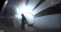
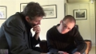
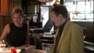
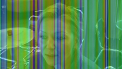
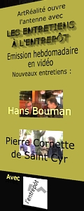
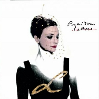

## Archives 2012 - Actus/blog du réseau ArtRéalité
### Archives 2012 - actus/blog du réseau ArtRéalité
 Archives 2012  
**Actualités / blog des sites**

27/11/2012

> Nouvel entretien filmé à l'Entrepôt :
> 
> Charles Gassot et les Cent Briques

> Un contenu exclusif, plutôt dense, parfois un rien people, où il est question de :
> 
> > \* cinéma
> > 
> > \* d'arts plastiques
> > 
> > \* de cinéma et d'arts plastiques (les deux ensemble)
> > 
> > \* d'action à Madagascar pour la sédentarisation, sur fond de décharges urbaines, de brousses en renouveau et d'une vente aux enchères exceptionnelle
> > 
> > \* d'Isabelle et son nounours.
> 
>  [](http://entrepot.artrealite.com/players/20120503/index.htm) [Cliquer ici.](http://entrepot.artrealite.com/players/20121126/index.htm)

3/11/2012

> Pardon pour les perturbations !

> Comme annoncé ci-dessous, la diffusion des sites a été fortement perturbée ce samedi.
> 
> Nous avons dû différer le changement d'hébergement pour différentes raisons qui n'ont pas de rapport avec les opérateurs. Ces travaux sont une mise en place de première importance notamment pour le développement vidéo.

31/10/2012

> Possibles perturbations cette semaine
> 
> sur le Réseau ArtRéalité

> Nous changeons d'hébergeur, ce qui peut impliquer de petits soucis techniques temporaires à la diffusion car il s'agit d'un changement structurel. La structure matérielle sera en effet plus répartie qu'auparavant.
> 
> Pourquoi ne pas poursuivre notre route avec notre serveur dédié OVH ?
> 
> Pour deux raisons :
> 
> > \* l'absence de véritable maintenance. Si vous voulez de l'aide, même dans une offre qui n'est pas l'entrée de gamme, vous devez payer. Et c'est cher.
> > 
> > Nos sites ont souffert de cela. D'autres hébergeurs sont plus sérieux. Avec Ovh nous avons l'impression d'un propriétaire qui ne réaliserait aucun entretien, sinon fortement tarifé.
> > 
> > \* le refus de mettre à niveau les systèmes pour accueillir les vidéos au format MP4. Une aberration totale.
> > 
> > Cela va loin : sur un forum d'utilisateurs Ovh, l'un d'entre eux expliquait il y a peu qu'il avait adopté l'offre dédiée au lieu du mutualisé (beaucoup moins cher) afin de diffuser plus confortablement ses vidéos. A son grand dam, il a découvert que ce format pourtant populaire n'était pas supporté.
> > 
> > Des frais engagés pour rien, beaucoup de temps perdu et surtout une énorme déception pour cette éditeur floué. Bien floué car nulle part on ne trouve mention de cette anomalie Mp4 sinon dans les plaintes sur les forums. La réponse du support est "on fait pas la vidéo". Qu'est-ce que cela veut dire en 2012 ?
> 
> De plus, dans la mesure où notre activité vidéo va s'intensifier et emploiera rapidement le format Mp4, bien meilleur que le Flv actuel, nous ne pouvons pas rester chez cet hébergeur.
> 
> Nous vous demandons donc, chers lecteurs, de ne pas trop nous en vouloir en cas d'interruption de la diffusion ou de la messagerie, particulièrement à compter du 3/11. La situation, une fois rétablie, sera plus stable et la qualité de nos vidéos bien meilleure.
> 
> Reprise des tournages
> 
> Dans une quinzaine de jours, nous entamons une nouvelle session de tournages à l'Entrepôt. Sa cadence sera bimensuelle (tous les quinze jours). Sa qualité audiovisuelle sera meilleure (MP4) et devrait par la suite s'améliorer grâce à un pré-traitement en imagerie de synthèse que nous avons testé pendant l'été.
> 
> Pourquoi "par la suite" ? La raison est simple : le gain en qualité est certes considérable mais le temps de calcul est également augmenté de manière considérable !
> 
> Aussi sommes-nous en discussion en ce moment avec des responsables, à Amsterdam et à Helsinki, pour mettre en place un système de calcul partagé, et derrière, une nouvelle manière de travailler en vidéo.
> 
> Il n'est pas impossible qu'une seconde émission apparaisse dans le courant de cette deuxième session. A confirmer encore, mais cette nouvelle production est à l'étude en ce moment même.
> 
> D'autres initiatives sont à l'étude. C'est beaucoup de travail, des enjeux assez importants pour le Réseau ArtRéalité, et pour ces raisons, ne nous en voulez pas trop de nos retards s'il vous plaît, chers lecteurs.

_Emmanuel Luc,_

_éditeur_

> Ps : nous continuons à répondre aux courriers des lecteurs, même si ces échanges ne sont plus diffusés sur Dotapea depuis quelques mois faute de temps. Dotapea va changer de structure logicielle et nous commençons à préparer ce changement. Lorsque cela sera fait, nous reprendrons la diffusion du courrier d'une manière plus confortable.
> 
> Donc n'hésitez pas à nous écrire, nous répondons dans la mesure du possible et si aujourd'hui ils nous valent du retard, nos efforts se portent précisément à l'élargissement de la mesure du possible.
> 
> :)

8/10/2012

> Pour le plaisir

> Pour le plaisir, chers amis lecteurs :
> 
> > [http://apod.nasa.gov/apod/ap120209.html](http://apod.nasa.gov/apod/ap120209.html)

20/9/2012

> Les mains sales

\[Editorial\]

> Parfois, le politique rattrape le culturel, ce qui peut nous obliger à donner quelques précisions et effectuer une mise au point.
> 
> Dans nos pages, les lecteurs trouvent de nombreuses références lexicographiques ou d'autre nature à des termes et concepts provenant de la langue arabe ou du persan.
> 
> La langue et la culture françaises et plus généralement l'Occident ont beaucoup emprunté aux langues et cultures musulmanes.
> 
> Il est donc nécessaire que nous réagissions à une actualité qui concerne ce sujet.
> 
> Le ministre français de l'intérieur, après avoir à son tour fait pourchasser des Roms sous les regards consternés de l'ONU et du Commissariat aux Droits de l'Homme de l'UE, a récemment fait ficher 174 personnes musulmanes interdites de manifester pacifiquement. Puis les autorités ont réitéré leur interdiction pour des manifestations ultérieures.
> 
> Ces interdictions sont incompatibles avec la [DUDH](http://www.google.fr/#hl=fr&gs_nf=1&cp=4&gs_id=e&xhr=t&q=dudh&pf=p&sclient=psy-ab&oq=dudh&gs_l=&pbx=1&bav=on.2,or.r_gc.r_pw.&fp=b4a7ce9f8a474d39&biw=558&bih=719).

 

 

> Dès lors il est temps, sur le Réseau ArtRéalité, de signifier un profond désaccord avec les provocateurs anti-musulmans ou anti-Roms d'Amérique ou de France et avec des autorités qui contreviennent au droit international en autorisant aux uns la liberté d'expression et en la refusant aux autres d'une manière ostensiblement partiale.
> 
> Pire : la presse annonce ce soir le démantèlement de trois camps Roms, 150 personnes au total, 2 relogées. Il n'est pas inutile de rappeler que la déportation de populations est interdite. C'est là encore une question de droit international.
> 
> La ligne éditoriale de ArtRéalité, puisqu'il faut en venir à parler de ces questions de fond paraissant un peu éloignées de nos travaux, est légaliste sur le plan international mais s'autorise de toute façon la critique, condition nécessaire à la résistance.
> 
> Au point de vue éthique, les personnes qui se rendent responsables de conflits par des déclarations odieuses ou par des pratiques illégitimes ont beau tergiverser avec le droit, elles n'en ont pas moins, et ce durablement, les mains sales.
> 
> Salam aleikoum chers amis et respect sans limite aux amis du Prophète - sAaws -, comme aux frères errants venus d'Inde à qui l'on inflige là, maintenant, un destin terrifiant pour des raisons d'un autre siècle.

_Emmanuel LUC_

_Editeur_

> Christian Gattinoni
> 
> Ouverture d'un site personnel
> 
> Un travail extraordinaire. Visite hautement conseillée.
> 
>  [](http://entrepot.artrealite.com/players/20120503/index.htm) [christiangattinoni.fr](http://www.christiangattinoni.fr/)
> 
> Chris Marker
> 
> Le cinéaste est décédé, laissant un trésor pictural que l'on n'a pas fini d'étudier ni de goûter avec bonheur. Etonnant par son caractère profondément transversal, foisonnant mais logique, naturel même, son "Sans soleil" par exemple peut être parfaitement vu en 2012 comme une série d'indications valant pour différentes disciplines, y compris, certainement, les arts plastiques. [Lien vers une recherche Google.](http://www.google.fr/#q=%22Chris+Marker%22+%22sans+soleil%22&hl=fr&lr=&prmd=imvnsuo&source=univ&tbm=vid&tbo=u&sa=X&psj=1&ei=F2QeUMqlJ8Kf0QWW_oGADg&ved=0CHgQqwQ&bav=on.2,or.r_gc.r_pw.r_qf.&fp=a0d2b593206370b8&biw=1065&bih=758)

> Salut de Syrie
> 
> Abou Naddara, un groupe d'artistes syriens, met en ligne une vidéo qui montre quelques enfants saisis malgré eux dans le vacarme des entraînements obligatoires des jeunesses baassistes.
> 
> [La vidéo complète](http://vimeo.com/24287941)
> 
> [Le site de Abou Naddara](http://www.abou-naddara.com/)
> 
> La java s'en, la java s'en va
> 
> Chers lecteurs, vous l'avez constaté, des éléments parasites troublaient la lecture de cette page. Il s'agissait d'attaques récurrentes contre notre serveur.
> 
> La presse a relayé il y a peu une information concernant une grave faille de sécurité de Java (l'applet Java que l'on trouve sur presque tous les navigateurs webs).
> 
> Depuis une semaine, nous savons que les attaques contre notre serveur étaient rendues possibles par cette faille. En effet, depuis que nous avons retiré Java de nos ordinateurs, nous n'avons plus aucun problème de ce genre.
> 
> Nous ne saurions trop conseiller nos amis lecteurs de faire de même pendant quelque temps.
> 
> Un silence prolongé
> 
> Et pourtant, pas de vacances chez nous cette année !
> 
> Oui, ce fut un silence de près de deux mois pendant lequel nous avons cependant répondu aux courriers des lecteurs.
> 
> Il y a plusieurs raisons à cela. On n'en dira guère plus sinon que quelque chose se prépare, qui aura pris du temps.
> 
> Mais chut !

29/7/2012

> Dominique Sennelier
> 
> Entretien à l'Entrepôt
> 
> En deux vidéos nous évoquons l'histoire d'une entreprise connue de longue date par les plasticiens.


> La première (15mn) évoque l'avènement puis le succès d'une initiative encore artisanale, dans le climat d'effervescence du Paris des temps modernes.

  [](http://entrepot.artrealite.com/players/20120503/index.htm)  [](http://entrepot.artrealite.com/players/20120503/index.htm)

> La seconde (24mn) fait le point sur l'évolution de Sennelier sur 125 ans d'histoire d'entreprise : quel est le secret de cette réussite ?
> 
> \[Editorial\]
> 
> Au fil de cet entretien, il apparaît qu'il n'existe pas de réponse univoque à cette question du secret, pour le moins.
> 
> N'étions-nous pas plutôt en train, d'une manière ou d'une autre, de parler d'alchimie ?
> 
> La recette alchimique. Cumuler et associer une passion des arts, des sciences, un sens de l'écoute du public et des attentes des artistes permettant d'ajuster non sans savoir-faire une production à une demande même à peine esquissée.
> 
> Mesurer aussi l'importance d'une constance résolue même quand un produit, fut-il un _cake d'amour_ pictural, n'est plus au goût du jour.
> 
> Quand l'heure est venue d'une expansion, s'ouvrir à d'autres lieux et cultures, ce qui prend le temps que la confiance fasse son nid. Ajoutons enfin - cela paraît indispensable en pareil cas - le sens des proportions.
> 
> Au-delà des pincées et soupçons, des larmes et des zestes, des pâtes montées et réagies, on cherche naturellement l'armature ou peut-être l'Adn de cette alchimie, "la chose" mystérieuse qui maintient de fait l'édifice dans un fleuve de mutations.
> 
> Une idée vient à l'esprit : qu'en serait-il si tout au fond de la cornue l'on n'avait d'abord versé quelques doubles hélices d'esprit familial ? Cela n'échappe à personne, Sennelier est une entreprise familiale, mais est-ce le secret des secrets ?
> 
> Plus concrètement, pour ArtRéalité à l'Entrepôt, cette interview est une occasion d'évoquer le rôle déterminant des intervenants situés tant à la fabrication qu'au contact du public. Ainsi s'aperçoit-on, pour ne citer que cet exemple, que le pastel gras fut créé par Henri Sennelier en réponse aux attentes de Goetz et Picasso (2nde vidéo). Un nouveau procédé pictural est une contribution rarissime.
> 
> Une précision importante : ce document est le fruit d'une production indépendante.
> 
> L'attention portée sur nos sites à tous les intervenants remonte à la fondation du Réseau ArtRéalité.

Emmanuel Luc

  [](http://entrepot.artrealite.com/players/20120503b/index.htm)  [](http://entrepot.artrealite.com/players/20120503b/index.htm)

7/7/2012

> Bellastock, festival d'architecture
> 
> Nouvel Entretien à l'Entrepôt
> 
> Après un premier travail en commun publié l'an dernier (lire le [chapitre XXXI](chap31bellastock.html) des Dialogues de Dotapea), nous publions une interview accompagnée de clips.
> 
> Une manière d'évaluer, au travers d'une manifestation très originale qui a pris une certaine dimension en quelques années, l'évolution d'une jeune génération d'architectes et d'évoquer la proximité aussi bien que les différences entre arts plastiques et architecture.
> 
>  **[Lien](http://entrepot.artrealite.com/players/20120426/index.htm)**

[](http://entrepot.artrealite.com/players/20120426/index.htm)

14/5/2012

> Vibrer avec la lumière
> 
> Un lingot d'or disparaît, des métaux "chics" changent de couleur, une vénérable coupe romaine du IVè BC fait la preuve...
> 
> C'est le 8ème Entretien à l'Entrepôt, avec Nicolas Goubet de l'UPMC. Et le premier à caractère scientifique.
> 
>  **[Lien](http://entrepot.artrealite.com/players/20120419/index.htm)**

[](http://entrepot.artrealite.com/players/20120419/index.htm)

8/5/2012

> Orcalyde, entretien en ligne
> 
> Une construction intellectuelle domine l'oeuvre d'Orcalyde sans en estomper la grâce. Entretien à l'Entrepôt.
> 
>  **[Lien](http://entrepot.artrealite.com/players/20120405/index.htm)**

26/4/2012

> Retard
> 
> Perdre son père est un événement très dur, une épreuve. Ainsi pendant quelques jours le travail a été suspendu sur le réseau ArtRéalité dont je suis le coordinateur.
> 
> Je vous prie de bien vouloir excuser ce retard qui touche essentiellement la production vidéo ([les Entretiens à l'Entrepôt](http://entrepot.artrealite.com/)).
> 
> Le travail continue cependant. L'entretien avec Grégoire Saurel, fondateur du festival d'architecture Bellastock a été filmé ce jour même. La semaine prochaine Philippe Brizon (dir. de l'Entrepôt) et moi recevons Dominique Sennelier.

[](http://entrepot.artrealite.com/players/20120405/index.htm)

> Pour vous faire patienter, un travail ludique avec Orcalyde avant son entretien complet :
> 
>  **[Lien](http://entrepot.artrealite.com/players/orcamusiquevideo/)**

_Emmanuel Luc_

19/4/2012

> Annonce d'une première
> 
> Le début d'un Dotapea en vidéo ? Il est trop tôt pour l'affirmer et chacun en jugera au fil du temps mais aujourd'hui a eu lieu le premier Entretien à l'Entrepôt consacré à un invité scientifique. C'est un "[Dialogue de Dotapea](dialoguesdotapea.html)" filmé. Nicolas Goubet, notre invité, travaille sur un sujet à cheval sur l'art et la science, les nanocristaux d'or.
> 
> Pour l'occasion, nous avons déplacé le lieu du tournage dans la galerie de l'Entrepôt afin d'obtenir un son et une image plus purs tout en maintenant la "nudité vivante" de l'enregistrement. Nous allons continuer à utiliser ce lieu.
> 
> Diffusion dans quelque temps, après l'entretien avec l'artiste Orcalyde, en cours de montage.
> 
> L'entretien du 29/3 avec Lauri Bounatirou, fondateur de Fine-ArtTv.Tv va nécessiter un tournage complémentaire.
> 
> Prochain invité scientifique : Michel Menu, chef du département Recherche du C2RMF le 31/5. D'ici-là, le programme est sur le site des Entretiens. [Lien.](http://entrepot.artrealite.com/)
> 
> Après avoir pris beaucoup de retard au début - nous avons essuyé des plâtres, c'était prévu -, notre émission commence à s'approcher du rythme de diffusion hebdomadaire nominal.

[](http://entrepot.artrealite.com/players/orcamusiquevideo/)

16/4/2012

> Pierre Cornette de Saint Cyr :
> 
> un entretien frais tourné en diffusion publique
> 
> La mise en place d'une émission ne va pas sans difficultés techniques, ce qui explique un rythme de diffusion encore heurté, mais tout se passe comme prévu.
> 
> Un nouveau "format court" filmé à l'Entrepôt, Paris XIVème et consacré au célèbre commissaire-priseur est en ligne.
> 
> [Cliquer ici](http://entrepot.artrealite.com/)

13/4/2012

> Entretiens à l'Entrepôt : quelques nouvelles
> 
> C'est une semaine de relâche, mais nous continuons le travail. L'entretien avec Pierre Cornette de Saint Cyr est prêt à être diffusé publiquement mais nous sommes en attente de l'autorisation de Thierry Ardisson, contacté mercredi dernier, pour une citation vidéo de son émission _Tout le monde en parle_. Il est normal de lui laisser le temps de prendre connaissance du sujet mais comme l'émission est nominalement hebdomadaire, une diffusion publique temporaire aura lieu à partir de lundi, sous réserve de modification du contenu.
> 
> Hacking sur Dotapea
> 
> Comme si l'on n'avait pas assez de travail, nous devons subir les attaques de hackers.
> 
> La page Index, celle que vous lisez à cet instant, est sous haute surveillance mais vous pouvez constater des anomalies. Nous travaillons sur ce sujet. Une plainte sera déposée.

[](http://entrepot.artrealite.com/)

3/4/2012

> Ai Weiwei, un appel du pied ?
> 
> Révolté par la surveillance, les fouilles et les perquisitions dont il est victime, l'artiste assigné à résidence force le trait et installe des caméras connectées dans sa maison. Ce qui fait suite à la démolition de son atelier, au paiement d'une monstrueuse caution et à sa détention arbitraire durant des mois dans un lieu secret l'an dernier.
> 
> L'artiste entend protester contre un pouvoir qui de fait ne change rien à sa politique ouvertement anti-démocratique. Ce qui n'est pas sans résonance en Occident. Citons à nouveau (après [l'éditorial du 12 avril 2011](blog2011.html#20110412aiweiwei)) Philippe Grangereau :
> 
> > " _L'embastillé Ai Weiwei a l'art de poser les bonnes questions. L'an dernier, dans un éditorial publié par le Wall Street Journal, il s'interrogeait sur le partenariat que l'Occident avait scellé avec la Chine, lui permettant de devenir la seconde puissance économique du monde tout en légitimant et en renforçant son régime répressif. «_ Comment, écrivait-il, un Etat basé sur la limitation des flux de l'information et de la liberté de parole peut demeurer puissant ? Et si cela est possible, alors, quelle sorte de monstre va-t-il devenir ? _»_ "
> 
> Cela donne a réfléchir car oui, effectivement, l'Etat chinois continuerait à entretenir ses laogaï, camps de travail obligatoire, où des millions de personnes (de 2 à 10 millions selon les sources) fabriqueraient, au moment où vous lisez ce texte, dans des conditions apparemment innommables (information non confirmée), des objets que l'Union Européenne laisserait entrer. Mais restons humbles : nous n'avons pas les preuves de tout cela. [Lien vers une recherche Google.](http://www.google.fr/#hl=fr&sclient=psy-ab&q=%22industrie+textile%22+chine+2005&tbs=%23hl=fr&sclient=psy-ab&q=%2522industrie+textile%2522+2005&oq=%2522industrie+textile%2522+2005&aq=&lr=&as_filetype=&oq=%22industrie+textile%22+ch) Cependant, l'appel du pied d'un très grand artiste n'est pas anodin. Il est au contraire essentiel.
> 
>  **[Lien vers la webcam de Ai Weiwei.](http://weiweicam.com/)**
> 
> Concernant le laogaï, on peut aussi voir un reportage de la NRK, télévision publique norvégienne, sur Harry Wu, célèbre dissident. [Lien (en anglais).](http://www.youtube.com/watch?v=1lDE68s0KNg)

_Emmanuel Luc_

_Editeur_

31/3/2012

> Entretiens à l'Entrepôt : la fête continue avec l'interview de Hans Bouman en ligne en version définitive
> 
> Nous rattrapons progressivement notre retard après une sérieuse mise au point de la chaîne de production.
> 
> Cette émission aborde l'art de Hans Bouman sous l'angle de l'intensité : d'où l'intensité ou la "présence" d'une oeuvre artistique provient-elle ?
> 
>  **Voir [Les entretiens à l'Entrepôt](http://entrepot.artrealite.com/)**

30/3/2012

> En retard - Pardon, mes lèvres sont mortes à minuit
> 
> Toutes nos excuses : l'émission hebdomadaire n'est pas très hebdomadaire en ce moment. Et pourtant, les tournages le sont. La raison de notre retard est technique. Un problème de synchronisation nous a fait réviser la chaîne de production/diffusion. C'est maintenant réglé mais nous avons plus de deux semaines de retard.
> 
> Les prochaines diffusions seront annoncées sur ce blog, sur le [Rss](rss.html) (fil d'infos) et bien sûr sur [entrepot.artrealite.com](http://entrepot.artrealite.com/).
> 
> Chose importante : pendant la mise en place de cette émission, nous n'arrivons plus à faire face à la demande en termes de courrier des Lecteurs. Pardonnez-nous s'il vous plaît. La charge de travail actuelle est considérable.


> En attendant que tout soit rétabli, pourquoi ne pas découvrir ou redécouvrir une oeuvre grandiose, à cette adresse :
> 
> [http://www.youtube.com/watch?v=hojQoER5WvU&feature=related](http://www.youtube.com/watch?v=hojQoER5WvU&feature=related)
> 
> ou celle-là :
> 
> [initiale-l.com](http://www.initiale-l.com/)
> 
> Et une autre splendeur :
> 
> [http://www.youtube.com/watch?v=7H2zyv4tzlo&feature=related](http://www.youtube.com/watch?v=7H2zyv4tzlo&feature=related)
> 
> Ce ne sont pas des tableaux, pas des installations, des photos ni des sculptures, mais l'exception crée la règle et parfois il est spécialement doux d'ouvrir les portes des arts, avec un émerveillement précieux car rarissime - le mot est faible - lorsqu'une somptueuse poétesse sort de sa chrysalide, vous enchante d'un tour de phrase, vous écarquille les lobes frontaux, traverse les siècles pour vous tirer la langue et vous fait verser des larmes d'ivresse. Peut-être la poésie est-elle le langage commun des arts. Sans doute oui et sur tous les modes, mais par quelle audace ou par quel miracle renaît-elle devant nos yeux, la poésie, dans cette obscure période de déclin ?
> 
> > _« (...) ta peau de nacre noir, la courbe de ton cul.  
> > Ce bruit des bracelets que tu colles à tes pas qui écrivent à chaque fois mon corps en pointillés, et puis tes yeux surtout et leur drôle de lueur, ma petite, ma douceur, je me souviens de tout. »_
> > 
> > _« Mes lèvres sont mortes à minuit au premier son du carillon dont les douze coups m'ont réduite en une pluie de cotillons »_
> 
> Merci L pour cette bonne surprise du retour de la langue - nous y tenons, à la langue - dans un univers artistique qui avait besoin de renaître. Merci pour cette profonde splendeur.
> 
> Pardon chers lecteurs pour notre retard. Comme le dit l'artiste, "mes lèvres sont mortes à minuit". Mais elles repoussent, nous allons de l'avant. Cela s'appelle essuyer les plâtres.

_Emmanuel Luc_

_Editeur_

[](http://www.initiale-l.com/)

"L" dans son album "Initiale"

19/3/2012

> QUE LA FÊTE COMMENCE !
> 
> L'événement annoncé le 29/2 se réalise :
> 
> > _Ouverture d'antenne avec_
> > 
> > _les Entretiens de l'Entrepôt_
> 
> Il s'agit d'une émission hebdomadaire filmée à l'aide de technologies dernier cri au sein de l'Entrepôt (à la fois centre culturel, biosphère, haut lieu culturel fondé par Frédéric Mitterrand en 1975), dans une atmosphère vivante, en compagnie d'intervenants des mondes des arts et des sciences.
> 
> Ceci ouvre l'antenne du réseau ArtRéalité.
> 
> Le site, les trois premières émissions au format dvd 16:9 et le programme :
> 
> > [entrepot.artrealite.com](http://entrepot.artrealite.com/)
> 
> L'éditorial, qui indique le sens de tout cela, est [ici](http://entrepot.artrealite.com/edito2012.htm).
> 
> N'hésitez pas à [nous donner votre opinion](ecrire.html).

29/2/2012

> Evénement programmé
> 
> Non, après trois semaines de silence (sauf messages directs pas encore publiés, dans le cadre du Courrier des Lecteurs), non ArtRéalité ne dort pas, c'est le moins que l'on puisse dire.
> 
> Cette dépêche est destinée à annoncer un événement très important qui aura lieu dans quelques jours.
> 
> Sans donner de précisions pour garder la surprise.
> 
> RSS : centralisation
> 
> Les fils d'informations vont être centralisé dans le RSS de Dotapea. Lire notre communiqué dans la page consacrée aux fils d'actualité.
> 
>  [Lien](rss.html)

8/2/2012

> Visualisation des sciences
> 
> C'est un projet expérimental qui a une dimension esthétique, pédagogique et scientifique.
> 
> Il s'agit de demander des photographies et des images de synthèse donnant visibilité à la recherche scientifique. C'est un projet américain, de la NFS, le "Visualization challenge".
> 
> Il y a bien sûr à prendre et à laisser, mais ce sont de très beaux voyages visuels.
> 
> Attention : c'est en anglais scientifique, mais la visite vaut la peine. Et la démarche est très intéressante.
> 
>  [Lien](http://www.nsf.gov/news/special_reports/scivis/index.jsp)

26/1/2012

> Le fin mot d'une intrigante affaire de conservation
> 
> Lors de la vente d'une oeuvre, un problème de conservation peut prendre des proportions extravagantes. Il est essentiel d'anticiper faute de quoi l'acheteur pourrait être découragé. Une question déontologique.
> 
> > **[Lien](courrierdeslecteurs2011c030.html#finmot)**

20/1/2012

> Le fil RSS de Dotapea est réactivé
> 
> Les nouveautés Dotapea/ArtRéalité seront à nouveau consignées publiquement sur les deux fils de sorte à transmettre immédiatement les événements de l'année 2012.
> 
>  **[Lien](rss.html)**

19/1/2012

> Un courrier des lecteurs maintenant rénové
> 
> Des mois de travail, mais c'est fait et nous espérons que cela améliorera l'ergonomie de cette importante section du site Dotapea ainsi que l'efficacité des recherches en ligne.
> 
>  **[Lien](courrierdeslecteurs2011c.html)** (sections 2 et 3 de 2011)
> 
> Il reste cependant à publier les échanges de courriers qui ont eu lieu pendant les travaux. Plus l'on travaillait sur la refonte, plus on accumulait de courrier non en retard mais impubliable à cause de ladite refonte !
> 
> Mais comment faire autrement ?
> 
> Nouvelles publications en vue ces prochaines semaines, donc.

1/1/2012

> Meilleurs voeux en vidéo !

[](http://www.artrealite.com/players/autres/2012voeux/)

> Pour évoquer la nouvelle année, ArtRéalité/Dotapea vous propose un petit voyage dans un flocon de neige. Lien sur l'image.

[](http://entrepot.artrealite.com/)


 [Communication](http://www.artrealite.com/annonceurs.htm)
```
title: Archives 2012 - Actus/blog du réseau ArtRéalité
date: Fri Dec 22 2023 11:26:20 GMT+0100 (Central European Standard Time)
author: postite
```
