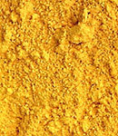
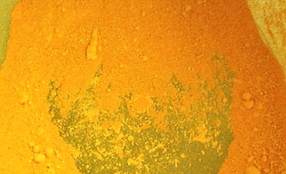
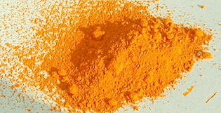

## Les jaunes de cadmium
### Les pigments jaunes au cadmium, usage en arts plastiques
 **Les cadmiums jaunes**




Il s'agit de [sulfures](annexe1.html#s) de [cadmium](annexe1.html#ca). A cause de la présence de soufre dans ces pigments, ceux-ci peuvent présenter _des incompatibilités avec les substances contenant du plomb_. La qualité du lavage est en ce domaine essentielle. Un pigment de bonne qualité ne pose pas ce problème.

Ces jaunes, qui bénéficient des remarquables propriétés générales des cadmiums, sont particulièrement réussis et précieux. Ils semblent communiquer leur clarté autant que leur teinte, contrairement aux habituels jaune organiques (généralement [azoïques](azoiques.html)).

Il en existe quatre catégories principales :

> \* le jaune de cadmium citron. Il serait peu permanent selon certaines sources - auquel cas il constituerait une exception parmi les couleurs au cadmium qui affichent des performances remarquables dans ce domaine - mais cette information n'est pas du tout confirmée. Délaissé par plusieurs fabricants, il semble cependant non dépourvu d'intérêt car _il est le seul jaune citron couvrant_. Ceci ne suffit pas à en faire un pigment d'importance majeure car son positionnement chromatique n'est pas "stratégique" .



> \* le jaune de cadmium clair (photo ci-dessus à droite), proche du jaune primaire théorique, quoiqu'un peu plus chaud. C'est une référence parmi les pigments. Bien supérieur au jaune primaire azoïque à plusieurs points de vue, il constitue une base essentielle pour un grand nombre de mélanges.
> 
> \* le jaune de cadmium moyen (photo ci-contre, à gauche), couleur de grande valeur, aussi magnifique pure qu'en mélange. Plutôt chaude mais bien jaune, elle est d'une intensité remarquable.
> 
> \* le jaune de cadmium foncé (voir photo ci-dessous, à droite), presque orangé, secret de mélanges aussi subtils que puissants.



En dehors de ces variétés habituelles il existe quelques variations sans grand intérêt. Certains fabricants proposent par exemple des jaunes de cadmiums rehaussés au blanc de [zinc](annexe1.html#zn).


 [Communication](http://www.artrealite.com/annonceurs.htm) 

[](index-2.html#20131014)


```
title: Les jaunes de cadmium
date: Fri Dec 22 2023 11:26:22 GMT+0100 (Central European Standard Time)
author: postite
```
