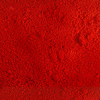

## Les rouges de cadmium
### Les pigments rouges au sulfo-séléniure de cadmium, usage en arts plastiques
 **Les cadmiums rouges**

[__](pigments.html#compatibilitesetincompatibilites)

_Les rouges de cadmium se distinguent, tout comme les [oranges de cadmium](oranges.html#cadmiums), des [jaunes de cadmium](cadmiumsjaunes.html) par l'apport de [sélénium](selenium.html). Entre cadmium et sélénium, il se produit des échanges électrochimiques._

_Tous ces pigments sont associés à du [soufre](soufre.html) et peuvent donc présenter des incompatibilités avec les substances contenant du plomb s'ils sont mal lavés (présence de soufre libre). Un pigment de bonne qualité ne pose aucunement ce problème._

_Le [cadmium](annexe1.html#cd), métal lourd, est nocif en lui-même._

_Pour ces raisons et aussi parce qu'il est fort coûteux, de nombreuses imitations [azoïques](azoique.html) sont proposées aux peintres. L'original présente cependant un facteur couvrant et une luminescence exceptionnels. Les imitations reproduisent parfaitement les nuances mais pas les autres propriétés._

_Un véritable rouge de cadmium ne communique pas seulement sa couleur, mais aussi sa luminosité._

Les rouges de cadmium font partie de ces couleurs dont les déclinaisons (clair, moyen, foncé) révèlent des différences de teintes majeures et non une simple variation de luminosité.



> \* **_Le rouge de cadmium clair_**, en terme de couleur, est proche du rouge vermillon - ou légèrement plus orangé. Certaines imitations de vermillon ont pour base un rouge de cadmium clair. Très lumineux, il est propice aux mélanges en l'absence de plomb (siccatif).
> 
> \* **_Le rouge de cadmium moyen_** est effectivement ce que l'on pourrait nommer un rouge moyen. Intense et remarquablement couvrant, il est un peu moins employé que les deux autres cadmiums.
> 
> \* **_Le rouge de cadmium foncé_** (_voir photo ci-contre_) appartient à la catégorie des pigments dont il est difficile de se priver. Il est... puissant. Assez sombre, il n'est absolument pas froid, il reste d'un rouge pur. Il est assez difficile de le qualifier. Il semble irradier. Il faut le voir. L'employer en mélange, c'est un peu le gâcher. Il est plus pertinent de le couvrir éventuellement d'une [laque](laques.html), d'un [glacis](glacis.html).


 [Communication](http://www.artrealite.com/annonceurs.htm) 

[](index-2.html#20131014)


```
title: Les rouges de cadmium
date: Fri Dec 22 2023 11:26:22 GMT+0100 (Central European Standard Time)
author: postite
```
