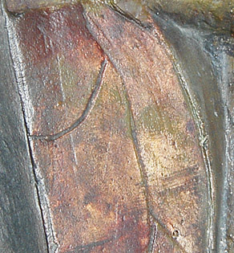

## Le Caparol (r)
### Le liant caparol, usage en arts plastiques
 **Le Caparol ®**

Comportement sur les surfaces grasses --> [lire passage in liants vinyliques](vinyle.html#surprise).

> > Il est chimiquement neutre.

Pur, il est plutôt brillant - disons entre satiné et brillant - et glissant, sans excès (voir photo ci-dessous : plusieurs couches de liant pur ont été appliquées par-dessus la couche peinte).

> > Comme les liants acryliques, il n'est absolument pas [réversible](liants.html#reversibilite).

Son odeur est très discrète et non agressive. Par contre, certaines personnes réagissent de manière manifestement allergique (très bénigne) en sa présence. Ce produit contient-il le fameux agent conservateur "isothiazolinone" (voir [toxicité](toxicite.html)), présent dans d'autres produits de la même marque ?



**Le Caparol ® comme liant à peindre**

Il n'autorise pas les empâtements (craquelures) mais là n'est pas sa vocation. Pour le situer dans la famille des liants, on peut l'apparenter à l'aquarelle, dans le sens où il [réticule](reticulation.html) parallèlement à la surface peinte, protégeant fort bien pigments et surface. La comparaison s'arrêt là : ce produit ne peut reproduire la délicatesse florale de la [gomme arabique](gommearabaquar.html) car là n'est pas sa vocation.

Lié en proportion soutenue aux pigments, il est d'un beau satiné. En plus faible proportion par rapport à l'eau et aux pigments, il devient aussi mat une fois sec que n'importe quelle peinture à l'eau. Rappelons cependant que les pigments ont eux-mêmes leur propre brillance (voir [_brillance_ in _Les pigments, les couleurs_](pigments.html#7brillance)) et qu'il ne s'agit que d'un point de vue très général.

Préparations :

> \* (facultatif) pour épaissir la pâte (ce qui n'est pas forcément nécessaire), adjoindre entre 20 et 80% de [liant méthylcellulosique](methylcellulosiqueliant.html), _déjà lié avec le pigment_. Attention lorsque vous définissez les dosages en fonction de l'emploi : ce liant additionnel est [réversible](liants.html#reversibilite). Plus vous en ajouterez, plus vous rendrez difficile le travail en glacis superposés, sans parler du risque de fragiliser la peinture.
> 
> \* ajout classique de 5 à 20% d'eau et même davantage en fait. Le Caparol ® autorise des jus très dilués, surtout si ce liant est utilisé en forte proportion par rapport au pigment. Il n'existe en effet pas de médiums pour cette peinture à notre connaissance, ce qui oblige le peintre à augmenter légèrement la quantité proportionnelle de liant pour obtenir des transparences bien solides. _En d'autres termes, le Caparol ® peut offrir des transparences tout à fait extraordinaires à condition de ne pas jouer que sur l'eau._
> 
> \* adjonction de pigment. Il est possible de mêler en premier lieu un peu d'eau au pigment puis d'incorporer le mélange au liant avant de diluer davantage si nécessaire. Comme nous l'écrivions ci-dessus, la quantité proportionnelle de pigment ne doit pas être excessive lorsque le peintre souhaite travailler en transparence, ce qui est fréquent dès lors que l'on choisit ce procédé de peinture. Dans ce cas donc, nous conseillons l'adjonction d'une proportion de pigment largement inférieure à la normale (qui est en moyenne, très grossièrement, de deux parts de pigments pour une de liant).

Le Caparol ® se vend en pots d'un litre ou de cinq litres.

Selon certains, quelques pigments seraient incompatibles avec ce produit. Nous les citons avec les réserves d'usage  :

> \* _le bleu de Prusse_
> 
> \* _le blanc d'argent_
> 
> \* _le jaune de chrome_
> 
> \* _le jaune de baryte_
> 
> \* _le blanc de zinc_

(risque d'épaississement ou d'efflorescence, dit-on).

_Seul véritable inconvénient du Caparol ® utilisé comme liant à peindre : il a une légère tendance à jaunir, nous l'avons constaté. Notons que c'est un phénomène discret. Nous n'avons détecté ce petit problème que sur des zones où le liant était présent pur. Après une première période de jaunissement, le phénomène semble se stabiliser._ 

**L'utilisation du Caparol ® comme colle** a des limites. S'il est bien capable d'incruster des objets très légers dans un tableau, il joue assez mal le rôle de colle à [maroufler](marouflage.html) - ce pour quoi il n'a pas été créé. Pour cette opération comme pour tout collage d'objets un peu massifs, il faut lui préférer une vraie colle polyvinylique, voire polyacrylique (lire l'article sur [les colles](colles.html)) ou bien certains liants acryliques.

**L'utilisation du Caparol ® comme enduit** est très répandue et présente de nombreux avantages.

A ce sujet, lire [_Enduits et apprêts_](enduits.html).

**Un conseil utile**

Allez savoir pourquoi, certaines mycoses et bactéries se délectent de l'acétate de vinyle (tout comme de l'acrylique d'ailleurs).

Pour éviter de voir apparaître des moisissures dans le pot,

> \* ne trempez jamais rien dans le pot : ni spatule, ni brosse, ni rouleau
> 
> \* ne versez jamais d'eau dans le pot

... sans quoi en quelques semaines, voire en quelques jours, c'est l'infection garantie. Versez de préférence la quantité de Caparol ® qui vous est nécessaire dans l'instant dans un autre récipient. Si vous faites des coulures sur le bord ou l'extérieur du pot, n'essayez surtout pas de les remettre à l'intérieur.

De cette manière, vous pouvez conserver votre liant bien au-delà d'un an. Ce conseil est valable pour tous les liants vinyliques et acryliques.


 [Communication](http://www.artrealite.com/annonceurs.htm) 

[](index-2.html#20131014)


```
title: Le Caparol (r)
date: Fri Dec 22 2023 11:26:24 GMT+0100 (Central European Standard Time)
author: postite
```
