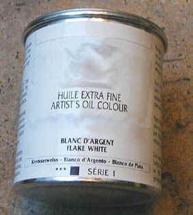

## La céruse
### La céruse, usage en arts plastiques
 **La céruse**  

_Longtemps unique blanc couvrant disponible, la céruse, produit toxique et polluant notoire, est-elle abandonnée ?_

_Comme un gangster recherché, elle a changé de nom plusieurs fois. "Céruse", "blanc de plomb", "blanc de Saturne", "blanc d'argent" et "white lead" sont bien des carbonates de plomb (formule [basique](base.html) C2H2O8Pb3, formule neutre CO3Pb). Ils peuvent tuer, provoquer des maladies, réagissent violemment à différents matériaux et se décomposent à basse température (≈300-400°C) en dégageant des fumées toxiques. Ce sont très probablement des produits cancérigènes. Ils pourraient être responsables de déformations congénitales. Leurs effets pathogènes, regroupés sous l'intitulé "saturnisme", sont de toute façon nombreux et puissants, parfois sournois._

Sommaire

[Fabrication, distribution, qualités](ceruse.html#fabricationdistribution)

\- [La fabrication, les qualités](ceruse.html#fabricationqualites)

\- [Folie et conservatisme](ceruse.html#foliehumaineconservatisme)

\- [La distribution](ceruse.html#distribution)

[Particularités techniques](ceruse.html#particularites)

[Utilisations](ceruse.html#utilisations)

[1\. Peinture](ceruse.html#peinture)

[2\. Arts du feu](ceruse.html#artsdufeu)

[3\. Ebénisterie](ceruse.html#ebenisterie)

_Les procédés de fabrication peuvent différer de même que les conditionnements, en pâte ou en poudre. De nos jours, la céruse en poudre est surtout destinée aux arts du feu (voir [ci-dessous](ceruse.html#artsdufeu)), mais des peintres l'utilisent ainsi que quelques enseignants en peinture (un cas de ce type nous a été signalé dans un cours de peinture à Mexico). Sous cette forme pulvérulente, l'emploi de céruse est particulièrement malsain._

_Quels que soient leur composition précise et leur conditionnement, la manipulation de ces produits nécessite un appareil respiratoire approprié. De plus, en raison de leurs incompatibilités, leur stockage doit être surveillé._


Lire l'article sur la [toxicité](toxicite.html)

Autre lecture conseillée : [La céruse sur Pourpre.com](http://pourpre.com/chroma/dico.php?typ=fiche&&ent=ceruse)

Fabrication, distribution



La fabrication, les qualités

_Des lamelles de plomb sont dégradées à l'acide, anciennement au [vinaigre](vinaigre.html), puis dans un milieu fermentant (fumier de cheval, ou [tannée](tanner.html), pendant plusieurs semaines) apportant le CO2, révélant finalement une poudre blanche que l'on nomme "fleur de plomb". En fait, une première combinaison produit de [l'acétate](acetate.html) de plomb (à cause du vinaigre), qui est transformée en carbonate de plomb dans un second temps sous l'action de l'acide carbonique._

Dans le domaine de la peinture artistique, la version chimiquement neutre de la céruse, CO3Pb, serait préférable à la version basique C2H2O8Pb3, moins pure. Dans le domaine des arts du feu, ce point ne semble pas avoir tellement d'importance.

Le carbonate de plomb existe aussi à l'état naturel. De Smyrne (Izmir, Turquie) à l'Iran, on s'est servi de cette ressource pour enduire les coques des navires, bien avant l'invention du terme "peinture [antifouling](antifouling.html)".

Folie et conservatisme

_En Égypte ancienne et en Mésopotamie, puis en Occident de la Rome antique au XVIIIème siècle, ce produit, naturel ou manufacturé, a été utilisé en cosmétique (fards) ! Il servait à blanchir le teint et à effacer les petites rides. De fait, il avait deux manières de blanchir le teint : par sa couleur propre et par la pâleur morbide qu'il entraînait. Il pourrait ainsi avoir de véritables_ fashion victims _à son actif._

_Notons au passage que l'un des symptômes induits par l'intoxication à la céruse est le bleuissement des gencives._

_Enfin, des emplois en arts plastiques sont encore pratiqués de nos jours. Ce produit est toujours en vente. Faut-il le redire ? Le carbonate de plomb est un horrible poison et un polluant bien connu._

_Et pourtant, même [Xavier de Langlais](livres.html#langlais), dont l'oeuvre écrite est admirable, mentionne un bien étrange "marouflage à la céruse" (p. 103). Dans ce procédé, on rend la pâte de carbonate de plomb «_plus siccative par l'adjonction de 3%, en poids, de siccatif liquide au plomb et manganèse et de 10% de vernis (du type "Colle d'or" Lefranc, ou "Eburit")_». Il est permis de se demander comment un auteur aussi excellent pouvait donner au XXème siècle une telle recette dans laquelle l'oxyde de plomb s'ajoute purement et simplement à l'oxyde de plomb - l'Eburit ® étant une sorte de diluant adjoint des mêmes siccatifs métalliques - pour former rien moins qu'une horrible sauce. Le poids des traditions aurait-il joué un rôle dans ce qui pourrait sembler un contre-exemple exceptionnel de la pertinence extraordinaire de son enseignement ?_

La distribution

La céruse est toujours fabriquée par plusieurs entreprises proposant par ailleurs des produits de grande qualité. Elle est distribuée par de grandes enseignes en France. Les produits sont (en principe) pourvus de l'étiquette obligatoire - voir le [pictogramme ci-dessus](ceruse.html#tetedemort) - qui implique légalement la consignation de chaque vente sur un _livre d'apothicaire_ (voir [toxicité](toxicite.html)). Une obligation rarement respectée.

L'affirmation de [Kevin Mac Cloud](livres.html#maccloud) : "_\[ce produit est\] aujourd'hui partout interdit, sauf dans les demeures historiques (...)_", ne s'applique pas en France. N'importe qui peut se procurer cette substance : la loi n'interdit rien dans ce domaine, se contentant d'obliger en théorie les détaillants, comme on vient de le dire, à notifier les achats et les coordonnées des acheteurs.

Les acheteurs sont vraiment très, très rares mais _attachés au produit depuis longtemps_. Le chiffre de vente est très faible, à tel point qu'il est permis de s'interroger sur l'intérêt commercial de continuer à distribuer ce poison.

Une variété un peu moins toxique a été distribuée dans le commerce pendant un temps, le sulf[ate](uresiresates.html) de plomb. Un mélange tout aussi douteux qui a d'ailleurs disparu, semble-t-il.

Particularités techniques

Les céruses sont très grasses par elles-mêmes et peuvent être utilisées sans liants additionnels : il suffit de les imbiber d'eau. Elles seraient néanmoins incompatibles avec diverses peintures à l'eau (information non vérifiée). Avec le temps, elles tendraient à devenir "crayeuses" et réversibles (une information non confirmée mais plausible étant donné que les peintures au plomb semblent attirer les enfants, victimes du saturnisme, qui retirent bien de la matière en léchant tout simplement ces substances au goût de bonbon).

Elles seraient cependant d'excellents bouche-pores. Information non confirmée.

Elles auraient la propriété de décolorer l'huile de lin. Cette combinaison ne jaunirait pas. Il s'agit peut-être là d'une légende. N"hésitez pas à [nous contacter](ecrire.html) si vous disposez d'informations fiables à ce sujet.

Elles sont incompatibles avec les acides et réagissent violemment au contact de fluor (information [RepTox](liensutiles.html#csst)).

L'association de céruse avec des huiles cuites à la "litharge d'or" (en fait, [litharge](litharge.html) de plomb, un gangster qui change de nom, parmi tant d'autres), avec le [siccatif](siccatifs.html) de Courtrai blanc ou tout médium siccatif au plomb est inutile, voire déconseillée. Cette substance a évidemment en elle-même des propriétés siccatives. Il est d'ailleurs possible d'exploiter celles-ci en en ajoutant une très petite quantité à certaines couleurs (voir ci-dessous) pour accélérer leur [siccativation](sechagesiccativation.html).

Au Moyen-âge, bien avant la découverte des huiles à peindre, on liait la céruse à [l'oeuf](oeuf.html) et on la combinait sans hésiter au [minium](vermillons-2.html), parfois au [réalgar](realgar.html), sans omettre d'ajouter "_une miette de la cire qui se trouve dans les oreilles de l'homme_" (le cérumen). Sans commentaires.

La céruse servait d'adjuvant, dit-on, à de nombreux pigments que l'on estimait sans éclat. Très souvent, on utilisait de tels mélanges en première couche avant d'ajouter la couleur pure par-dessus. Avec un peu de distance, notamment celle que nous a apporté le [blanc de titane](blancssynthetiques.html#leblancdetitane), on peut dire que tout pigment placé sur une surface blanche, lumineuse, prend de l'éclat. Et donc que la céruse n'était pas un adjuvant.


Comme toute substance contenant du plomb, la céruse est fortement incompatible avec les pigments et autres substances qui contiennent du soufre libre.

Les céruses sont très couvrantes et d'un blanc éclatant.

Elles sont extrêmement lourdes (comme du plomb !). C'est leur poids qui aurait convaincu les maîtres vénitiens d'adjoindre de la [cire](cires.html) dans leurs pâtes pour stopper les coulées ([médium vénitien](mediumspourlhuile.html#mediumgelvenitien)) - information douteuse : la présence de [litharge](litharge.html) dans les [jus](jus.html) à l'[huile noire](huiledenoix.html#lhuilenoire) pourrait aussi bien avoir motivé ces grands peintres.

Elles attaqueraient violemment le papier. Elles seraient d'ailleurs utilisées dans l'industrie papetière pour provoquer des réactions.

Elles ne se combineraient que fort mal avec beaucoup de couleurs, sauf la [garance](garance.html) qu'elles auraient tendance à fixer ainsi que les terres et les noirs (sans garanties). Comme signalé ci-dessus, il est prudent d'éviter les associations avec les couleurs sulfurées (noircissement radical, d'autant plus si le pigment est "mal lavé", encore trop chargé de soufre libre). A proscrire dans ce type de cas : le [vermillon](vermillons-2.html) véritable, [l'outremer](outremer.html), les [cadmiums](cadmiums.html), le [jaune de Naples](jaunedenaples.html), etc., mais aussi la plupart des bleus et des jaunes, le [vert anglais](verts.html#vertsprussiquesouanglais) et les pigments contenant de l'[antimoine](antimoine.html).

Utilisations

1\. Peinture

En peinture, souvent utilisée dans la [fabrication des gessos](fabriquerungesso.html), la céruse était mêlée de blancs naturels qui compensaient son glissant, son poids et sa blancheur trop intense. Il fallait cependant lui adjoindre de l'huile de lin en quantité suffisante pour éviter les réactions avec les couches supérieures ou inférieures. Autant dire qu'il fallait un véritable film isolant !

Quant à son utilisation dans le tableau proprement dit, elle ampute la palette de très nombreuses couleurs à cause des risques d'interactions.

_**Les vertus de la céruse sont mises en échec par les contraintes que son emploi induit.**_

_**Ce produit est dangereux pour l'être humain et pour l'environnement. Il peut être remplacé avantageusement**_

 _- en peinture et en ébénisterie, par des pigments sans toxicité comme le blanc de titane, très couvrant également_,

 _- pour certains traitements des bois, par différentes résines de substitution ou, là aussi, par le blanc de titane associé à un liant quelconque._

2\. Arts du feu

Comme la plupart des produits employés dans ce domaine, c'est sous la forme d'une poudre très fine que se présente la céruse. Elle constitue la source d'oxyde de plomb la plus employée. En effet, le carbone qu'elle contient est éliminé lors de la cuisson, facilitant semble-t-il la fusion à très basse température. Elle est encore fort utilisée comme [fondant](fondant.html) bien que quelques oxydes métalliques commencent à la détrôner, sans parler des [frittes](fritte.html) modernes au plomb, théoriquement non toxiques.

Il faut préciser que l'oxyde de plomb a réellement apporté des qualités aux glaçures, émaux divers et verres comparativement aux différents autres fondants. Son emploi avait une raison d'être, surtout dans le passé, lorsque la liste des substances disponibles était plus restreinte et les températures de cuisson plus basses.

_**Nous déconseillons l'emploi de céruse, surtout à l'état pulvérulent !!!**_

3\. Ébénisterie

L'emploi ancien de céruse en ébénisterie se justifiait par la capacité de cette substance à boucher les pores du bois ou, [on l'a vu](ceruse.html#coques), à protéger les coques des navires. Mises à part quelques rares exceptions liée à des contextes très particuliers, son utilisation a heureusement été abandonnée dans ce secteur d'activités.


 [Communication](http://www.artrealite.com/annonceurs.htm) 

[](index-2.html#20131014)


```
title: La céruse
date: Fri Dec 22 2023 11:26:27 GMT+0100 (Central European Standard Time)
author: postite
```
