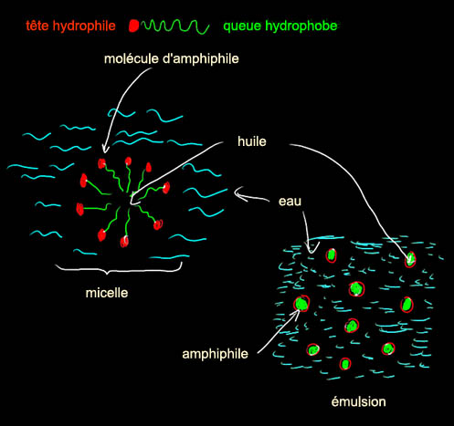
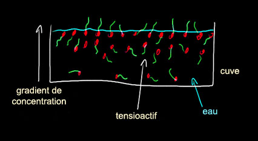
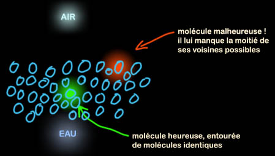
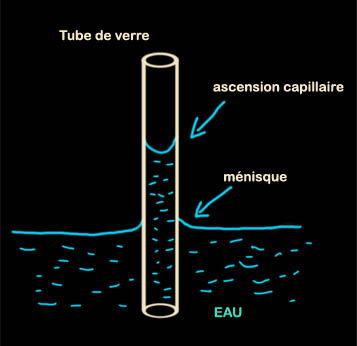

## A propos des liants - Les dialogues de Dotapea - Chapitre I
### A propos des liants - Les dialogues de Dotapea - Chapitre I
 Navig. page/section

[](dialoguesdotapea.html)  
[](chap02bullessiccativation.html)

\_\_\_\_\_

**Pages soeurs**

I, A propos des liants  
[II, Bulles, siccativ., struct. élec.](chap02bullessiccativation.html)  
[III, Caséine, phosphore, dissociation](chap03caseine.html)  
[IV, Les orbitales](chap04orbitales.html)  
[V, L'aérogel](chap05aerogel.html)  
[VI, Polarisation de la lumière](chap06polaris.html)  
[VII, Sfumato et diffusion Rayleigh](chap07rayleigh.html)  
[VIII, Les interférentielles](chap08interferences.html)  
[IX, Dextrine, farine et chiralité](chap09dextrine.html)  
[X, L'ocre bleue](chap10ocrebleue.html)  
[XI, Les métamatériaux](chap11metamateriaux.html)  
[XII, Le jaunissement](chap12jaunissement.html)  
[XIII, Laser etc.](chap13laser.html)  
[XIV, L'holographie](chap14holographie.html)  
[XV, L'holographie numérique](chap15holographienum.html)  
[XVI, Extérieur, intérieur, chaux](chap16interieurexterieurchaux.html)  
[XVII, L'électrolyse et les ions](chap17electrolyseions.html)  
[XVIII, L'électricité, un peu plus loin](chap18electriciteplusloin.html)  
[XIX, Oxydation, métaux](chap19oxydationsmetaux.html)  
[XX, Les échelles](chap20echelles.html)  
[XXI, Nature et évolution des résines](chap21resines.html)  
[XXII, Le mouillage pigmentaire](chap22mouillage.html)  
[XXIII, La molette](chap23molette.html)  
[XXIV, Blanche neige](chap24blancheneige.html)  
[XXV, Lumière et matière](chap25lumiereetmatiere.html)  
[XXVI, Magnétisme](chap26magnetisme.html)  
[XXVII, Ambre et vieilles branches](chap27ambre.html)  
[XXVIII, L'origami miroir](chap28origamimiroir.html)  
[XXIX, Le feu](chap29feu.html)  
[XXX, Peau du métal](chap30peaudumetal.html)  
[XXXI, La ville en un souffle](chap31bellastock.html)  
[XXXII, Oxyder des matériaux](chap32oxydermateriaux.html)  
[XXXIII, Ocre bleue, une solution](chap33ocrebleuesimulation.html)

\_\_\_\_\_

Copyright © www.dotapea.com

Tous droits réservés.  
[Précisions cliquer ici](droitscopie.html)

**Les dialogues sur la physique-chimie  
appliquée aux arts**

**Chapitre I**

**A propos des liants**

[](dialoguesdotapea.html#notecornelis)

dial   dial   dial

_[English text](english/chap01binders.html) [](english/chap01binders.html)_  

Commençons les [Dialogues de Dotapea](dialoguesdotapea.html) par une discussion entre Jean-Louis, physico-chimiste au CNRS, Anne, une savonnière et cuisinière professionnelle - [voir son site](http://www.madamanne-savons.com/) - et un candide, Emmanuel.

Les personnages sont réels, la discussion aussi. Elle peut reprendre à tout moment et ce texte peut s'allonger.

Emmanuel : (à Jean-Louis) Je vais te poser une question qui m'est venue en faisant une mayonnaise. Je te préviens : je l'ai posée aussi à une cuisinière chevronnée pour avoir un autre point de vue.

Les cuisiniers évoquent des [liants](liants.html) qui effectivement se retrouvent en peinture (oeuf, farine, gélatine, etc.) et rien n'empêche de [peindre à la mayonnaise](autreshuiles.html#mayonnaise) ou de faire une sauce poulette [a tempera](tempera.html). Pourtant, parfois le liant des cuisiniers ne lie pas grand-chose de précis. Il ne semble pas enrober mais plutôt s'intercaler à la manière d'une simple charge [colloïdale](colloide.html) (je me demanderait ce que donnerait une blanquette à la silice colloïdale), alors qu'en peinture il enrobe le pigment, le maintient en place. Par contre, dans les deux disciplines, le liant semble avoir des propriétés [plastiques](plastique.html).  
Je finis par me demander ce qui définit vraiment ce terme de liant. Ses propriétés plastiques, ses propriétés collantes et colloïdales, à quelle réalité physique cela correspond-t-il, finalement ? A moins qu'il ne s'agisse que d'un terme grossier, d'un fourre-tout. Et pourtant, ce sont sensiblement les mêmes produits que l'on trouve dans ces disciplines.

Qu'en dit un spécialiste des interfaces ?  
Et une cuisinière chevronnée ? Qu'est-ce qu'un liant culinaire ?

Anne : Hum, le liant permet de lier vois-tu ? De lier deux ou plusieurs éléments qui sans son aide refuseraient de se mélanger. Le liant peut être un [tensioactif](tensioactivite.html), un [émulsifiant](emulsion.html) (le jaune d'oeuf par exemple). Mais le liant peut aussi être ce qui donne du corps à une préparation. Un épaississant comme de la farine, de la fleur de maïs.  
Voilà ce qui me vient à l'esprit.

Jean-Louis : Comme toujours, rien n'est simple. Le seul terme de liant ne rend pas compte de tout ce qui se passe "derrière". En résumant on peut dire qu' il y a deux familles de problèmes : 1) rendre miscibles deux produits qui ne le sont pas (ex. eau et huile) ou stabiliser des suspensions (ex. [l'encre de Chine](encredechine.html)) ; 2) coller (lier, agglutiner, enrober, ....) des grains solides sur un support (peinture).

Premier problème :

L'exemple célébrissime de la vinaigrette, si on mélange de [l'huile](huile.html) et du [vinaigre](vinaigre.html), les deux constituants se séparent dès qu'on cesse de remuer. Magie : si on rajoute de la moutarde, c'est déjà plus stable. Avec du [jaune d'oeuf](oeuf.html) ça donne même de la mayonnaise. Autre exemple célèbre : si on disperse de la suie dans de l'eau on obtient une encre magnifique, mais très rapidement les grains de suie s'agglutinent, tombent au fond de l'encrier et c'est fichu.

**I. Miscibilité :**

**Amour, haine et amphiphiles**

Magie : si on ajoute de la [gomme arabique](gommearabaquar.html), ça reste stable ([encre de Chine](encredechine.html) - voir aussi [noir de fumée et noir de suie](noirs.html#lenoirdefumee)). Pourquoi ?

Empédocle (450 BC) puis Aristote estimaient qu'il suffisait de deux forces pour rendre compte de tous les phénomènes naturels : l'Amour et la Haine. L'Amour provoquait le rapprochement des objets (ex. la pierre d'aimant), la Haine provoquait leur éloignement. Cette théorie a connu du succès pendant quelques siècles.

Et encore aujourd'hui, avouons-le, elle pourrait rester tentante, les interactions moléculaires se résumant souvent à des interactions attractives ou répulsives, et il existe des molécules mi-partites, faites d'amour et de haine, les [savons](saponification.html) ou **amphiphiles** (du grec : qui aime les deux).

Un amphiphile est un composé moléculaire dont une partie de la structure est [polaire](electronega.html#liaisonpolaire) (ou hydrophile, qui aime l'eau et les liquides dits polaires) et une autre aime les corps gras - qui sont apolaires -, dite lipophile ou hydrophobe. Les graines de moutarde, le [jaune d'oeuf](oeuf.html#oeufethuiledoeuf), contiennent de telles molécules amphiphiles. Lors du mélange, les amphiphiles se mettent à l'interface entre l'eau et l'huile, ce qui stabilise la sauce, on a alors une [émulsion](emulsion.html). En général on émulsifie l'huile dans l'eau, on a donc la structure suivante :



L'amphiphile (en agro-alimentaire on dit souvent émulsifiant) du jaune d'oeuf est la [lécithine](lecithine.html). On en trouve aussi dans le [soja](soja.html), c'est un produit essentiel de nombreuses préparations (lire les étiquettes !), par exemple des sauces, mayonnaises et autres chocolats. Les savons sont des amphiphiles, leur partie grasse solubilise la saleté (qui est souvent grasse) et la formation de [micelles](m.html#micelle) permet la dispersion dans l'eau.

De par leur nature, les amphiphiles sont des molécules qui préfèrent les interfaces. Contrairement à ce qu'on pourrait croire, un savon est peu soluble dans l'eau, et ses molécules se placent plutôt à la surface. Les savons sont des _tensioactifs_ [\[lien\]](tensioactivite.html), ils modifient la tension superficielle des liquides où ils sont dispersés. C'est pour cette raison que l'on peut ensuite faire des bulles....



Pour ce qui est de l'encre de Chine, le problème qui est à l'origine de la [floculation](floculation.html) est que les particules d'encre sont chargées électriquement et s'attirent mutuellement. La [gomme arabique](gommearabaquar.html) (extraite de la sève de l'acacia) est un polymère hydrosoluble qui joue à la fois un rôle de neutralisation des charges électriques (le [polymère](polymere.html) s'enroule autour des particules) et de solubilisation (la gomme arabique est aussi utilisée dans l'industrie comme émulsifiant. Cf. [apega.bf/gomar.htm](http://www.apega.bf/gomar.htm)).

\[ndlr : on connaît mal le liant de l'encre de Chine - voir [texte](encredechine.html#preparationtraditionnelle) -, mais la gomme arabique peut donner une très bonne encre\]

Deuxième problème :

Faire tenir sur une surface un produit généralement pulvérulent : le [pigment](pigments.html). Dans le cas ou le support solide est la peau humaine, on cherche généralement une action décorative réversible, le liant est donc un [corps gras](gras.html#corpsgras) quelconque. Si on cherche la pérennité, on va utiliser un liant susceptible de devenir insoluble. Plusieurs possibilités !

En étant un peu réducteur, on peut dire que le phénomène physique mis en oeuvre est celui de la **réticulation**. La [réticulation](reticulation.html) est le phénomène par lequel des chaînes de polymère initialement indépendantes les unes des autres (elles "coulent") se lient les unes aux autres pour former une masse solide ou extrêmement visqueuse (qui ne coule plus). On distingue réticulation physique (réversible) et chimique (irréversible).

Réticulation physique : souvent des polymères naturels ([gélatine](gelatine.html), [colle de peau](colledepeau.html), [colle d'os](colledos.html), colle de nerfs, ...). En refroidissant, une solution de gélatine "prend" et forme un gel qui ne coule plus. Idem pour les colles animales. Si on réchauffe, les chaînes de polymère reprennent leur liberté, ces colles sont réversibles.

Réticulation chimique : sous l'action de l'air, des ultraviolets, de la température, les chaînes polymères se lient (liaison chimique vraie) les unes aux autres. Exemple : [l'huile de lin](huiledelin.html). Ce n'est plus réversible, il faut littéralement casser la structure pour revenir en arrière. Certaines peintures (ex. [acryliques](acrylique.html), [vinyliques](vinylegloss.html), [époxy](epoxy.html)) peuvent rentrer dans cette catégorie, bien qu'au sens strict la réaction mise en oeuvre soit alors une polymérisation et non pas une réticulation.

Réticulation : de longues chaînes polymères initialement indépendantes se lient les unes aux autres pour former un réseau tridimensionnel (on parle de gel ou d'élastomère). Très souvent les chaînes individuelles sont toujours fluides dans l'état réticulé, mais le fait qu'elles soient toutes solidaires les empêche de couler.

Polymérisation : des petites molécules ([monomères](polymere.html#monomeres)) se mettent bout à bout pour former des chaînes de plus en plus longues (polymère). L'augmentation de la taille entraîne une augmentation de la [viscosité](viscosite.html), à terme c'est tellement visqueux que c'est comme un solide. La plupart des matériaux plastiques qui nous entourent sont de tels "liquides visqueux". (Le [verre](verre.html) à vitre n'est pas formé d'un polymère mais c'est un liquide visqueux !)

Je reviens à la peinture : le peintre va avoir envie de disperser son pigment dans un matériau susceptible de "durcir" (au sens large). Il lui faut donc au minimum un pigment et un médium apte à se figer (gélatine), à réticuler (huile) ou à polymériser (latex, acrylique,...). Souvent, pour améliorer la dispersion de son pigment dans la matrice il faudra ajouter un surfactant, mais ce n'est pas indispensable. On peut ensuite ajouter des produits texturants qui vont donner du corps à la peinture, par exemple des particules de [silice](silicepeinture.html) qui font que la couche picturale ne dégouline pas ([thixotropie](thixotropie.html)) et garde la touche. 

**II. Réticulation, polymérisation : une problématique pigmentaire aux frontières du fluide et du solide**

Cas des fresques : c'est un cas un peu particulier, puisque dans ce cas les couleurs sont appliquées sur une surface maçonnée encore fraîche, c'est-à-dire qui n'a pas encore fini de durcir, de prendre. Lorsque la matière minérale de l'enduit ([chaux](chaux.html), [plâtre](platre.html), [ciment](ciment.html)) se solidifie, elle emprisonne les particules de pigment qui ont été appliquées et qui diffusent sur quelques dixièmes de millimètre. On peut dire que le médium, le liant, c'est le mur !

Pour ce genre de peintures, on utilise évidemment des liants à base d'eau pour qu'elles soient compatibles avec l'enduit qui est aussi à base d'eau. Le peintre ajoutera souvent de [l'oeuf](oeuf.html) ou de la [caséine](caseine2.html), pour que sa peinture ait un peu de tenue lors du travail pictural (on ne peint pas à [l'aquarelle](gommearabaquar.html) sur les murs), pour améliorer la densité des couleurs et éviter que la diffusion dans l'enduit soit trop profonde ou inégale.

\[ndlr : la peinture murale à l'aquarelle n'est pas courante mais [Kevin Mc Cloud](livres.html#maccloud) signale un procédé à la gomme arabique\]

Emmanuel : J'en reviens maintenant à la mayonnaise.

Sur les dernières recommandations d'Anne, j'ai trouvé un article où un cuisinier fait intervenir Hervé This. J'essayais de trouver des réponses à la question : "faut-il la fouetter ?" (ou "peut-on la fouetter ?"), qui vraiment ne va pas de soi selon les sources. Eh bien oui, on la fouette. Voir [l'article "parent"](http://www.chefsimon.com/mayo.htm) et la [recette proprement dite](http://www.chefsimon.com/mayo1.htm) (liens externes, nouvelles fenêtres). Ca n'est pas sans rapport avec notre propos. Hervé This affirme que ce ne sont pas les [phospholipides](phospholipide.html) qui sont responsables de la bonne tenue de l'émulsion, mais les [protéines](proteine.html). Qu'en penses-tu ?

Jean-Louis : S'il le dit. La plupart des molécules organiques, et surtout les très grosses comme les protéines ont des parties hydrophiles et des parties hydrophobes. Elles peuvent donc servir de surfactant au même titre que les phospholipides.

Lire [passage plus détaillé](chap03caseine.html#phospholipidesetproteines) in Chapitre III

**Où l'on en revient à la mayonnaise**

Emmanuel : C'est la deuxième fois que tu utilises le terme "surfactant". Comment le définis-tu ?  
 

Jean-Louis : Une question quasi-philosophique. C'est une molécule qui est capable de modifier les énergies interfaciales, les [tensions de surface](tensioactivite.html). Une molécule, donc, qui aime les interfaces entre deux corps. Les molécules d'un corps donné, le plus simple est de l'imaginer liquide, aiment rester les unes avec les autres. Une molécule située au coeur du liquide est heureuse, tous ses voisins sont comme elle, une molécule située "au bord" n'est pas heureuse, la moitié de ses voisins sont d'une nature différente. Les molécules de la surface ont donc envie que ses copines viennent l'entourer, et cette force attractive crée la tension de surface.



Sur Terre la gravité contrarie leurs efforts, la surface des liquides est plane. En l'absence de gravité les liquides forment des sphères car pour un volume de liquide donné, la forme géométrique qui a la plus petite surface est la sphère. C'est la forme qui génère le plus petit nombre de molécules de surface "malheureuses".

  
La tension de surface ([voir illustration](tensioactivite.html#tensiondesurface)) est ce qui permet de faire des bulles de savon. Elle est aussi responsable des phénomènes de capillarité, ce qui permet entre autres aux plantes de faire circuler la sève.



  
Un surfactant est une molécule généralement [amphiphile](chap01liants.html#amphiphile) qui modifie les "rapports de forces" entre deux corps en contact : liquide-liquide (émulsion), liquide-gaz (bulles, mousses), liquide-solide (mouillage et capillarité).

Mais ce que tu cherches, au fond, c'est évaluer la siccativité de la mayonnaise...?

Emmanuel : Oui, et explorer des sujets proches par la même occasion. On y revient dans le chapitre suivant.

**Le surfactant,**

**une histoire d'affinités électives**

[La suite : chapitre II](chap02bullessiccativation.html)


 

 [Communication](http://www.artrealite.com/annonceurs.htm) 

[](index-2.html#20131014)


```
title: A propos des liants - Les dialogues de Dotapea - Chapitre I
date: Fri Dec 22 2023 11:26:29 GMT+0100 (Central European Standard Time)
author: postite
```
