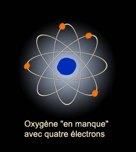
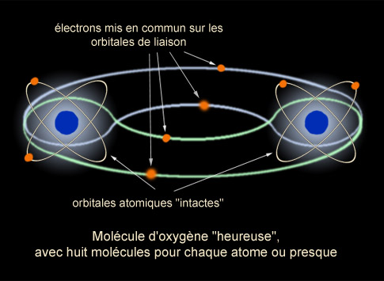

## Bulles, siccativation et structure électronique - Les dialogues de Dotapea - Chapitre II
### Bulles, siccativation et structure électronique - Les dialogues de Dotapea - Chapitre II
 Navig. page/section

[](chap01liants.html)  
[](dialoguesdotapea.html)  
[](chap03caseine.html)

\_\_\_\_\_

**Pages soeurs**

[I, A propos des liants](chap01liants.html)  
II, Bulles, siccativ., struct. élec.  
[III, Caséine, phosphore, dissociation](chap03caseine.html)  
[IV, Les orbitales](chap04orbitales.html)  
[V, L'aérogel](chap05aerogel.html)  
[VI, Polarisation de la lumière](chap06polaris.html)  
[VII, Sfumato et diffusion Rayleigh](chap07rayleigh.html)  
[VIII, Les interférentielles](chap08interferences.html)  
[IX, Dextrine, farine et chiralité](chap09dextrine.html)  
[X, L'ocre bleue](chap10ocrebleue.html)  
[XI, Les métamatériaux](chap11metamateriaux.html)  
[XII, Le jaunissement](chap12jaunissement.html)  
[XIII, Laser etc.](chap13laser.html)  
[XIV, L'holographie](chap14holographie.html)  
[XV, L'holographie numérique](chap15holographienum.html)  
[XVI, Extérieur, intérieur, chaux](chap16interieurexterieurchaux.html)  
[XVII, L'électrolyse et les ions](chap17electrolyseions.html)  
[XVIII, L'électricité, un peu plus loin](chap18electriciteplusloin.html)  
[XIX, Oxydation, métaux](chap19oxydationsmetaux.html)  
[XX, Les échelles](chap20echelles.html)  
[XXI, Nature et évolution des résines](chap21resines.html)  
[XXII, Le mouillage pigmentaire](chap22mouillage.html)  
[XXIII, La molette](chap23molette.html)  
[XXIV, Blanche neige](chap24blancheneige.html)  
[XXV, Lumière et matière](chap25lumiereetmatiere.html)  
[XXVI, Magnétisme](chap26magnetisme.html)  
[XXVII, Ambre et vieilles branches](chap27ambre.html)  
[XXVIII, L'origami miroir](chap28origamimiroir.html)  
[XXIX, Le feu](chap29feu.html)  
[XXX, Peau du métal](chap30peaudumetal.html)  
[XXXI, La ville en un souffle](chap31bellastock.html)  
[XXXII, Oxyder des matériaux](chap32oxydermateriaux.html)  
[XXXIII, Ocre bleue, une solution](chap33ocrebleuesimulation.html)

\_\_\_\_\_

Copyright © www.dotapea.com

Tous droits réservés.  
[Précisions cliquer ici](droitscopie.html)

**Les dialogues sur la physique-chimie  
appliquée aux arts**

**Chapitre II**

**Bulles, siccativation et structure électronique**

[](dialoguesdotapea.html#notecornelis)

dial   dial   dial

_[English text](english/chap02bubbles.html) [](english/chap02bubbles.html)_ 

Ce chapitre II des [Dialogues de Dotapea](dialoguesdotapea.html) est une discussion entre Jean-Louis, physico-chimiste au CNRS, et un candide, Emmanuel. Anne, savonnière et cuisinière, a aussi joué un rôle.

Les personnages sont réels, la discussion aussi. Elle peut reprendre à tout moment et ce texte peut s'allonger.

Emmanuel : Si j'incorpore de petites bulles d'air dans ma peinture (à savoir d'abord comment faire), est-ce qu'elle a une chance de [siccativer](siccatifs.html) plus rapidement ?  
Tu sais, cette question est essentielle en peinture, surtout de nos jours parce que les peintres rechignent de plus en plus à utiliser des oxydes de métaux lourds comme "[siccatifs](siccatifs.html)", comme oxydants. Remarque qu'il y a la solution des huiles soufflées, mais leurs applications pour le moment sont uniquement déco ou industrielles. Je ne sais pas trop pourquoi. A ton avis ?

Jean-Louis :

Comment incorporer de petites bulles d'air dans ta peinture ? En la fouettant avec un "agent moussant". La pâte a-t-elle une chance de siccativer plus vite ? Oui et non. Si on parle de peinture à l'huile, la peinture en contact avec l'oxygène va effet sécher plus vite. Mais le volume d'oxygène d'une petite bulle étant faible, ça n'ira sans doute pas très loin. Et ensuite, la structure alvéolaire de la peinture va considérablement freiner la diffusion ultérieure de l'oxygène atmosphérique. Et l'évaporation des solvants. En tout cas, c'est ce que je crois. Il faudrait essayer....

Emmanuel : Mais qu'est-ce que c'est, cette chose qui mousse, cet "agent moussant" ? Et puis au fait, à propos de siccativation, une question brute : pourquoi [l'oxygène](oxygene.html) et pas un autre élément ?

Jean-Louis : "L'agent moussant" est un produit que l'on rajoute quand on veut faire des émulsions ou des mousses très stables. Il empêche la [coalescence](coalescence.html) des bulles. Par exemple pour certains feux d'hydrocarbures les pompiers utilisent de la mousse pour éteindre, pas de l'eau. Et ils mélangent de l'agent moussant à leur eau. A la base, c'est un bête savon, genre Mir, mais on en trouve des spécifiques pour le béton (fabrication du [béton cellulaire](betoncellulaire.html)), les plastiques (pour faire des mousses), les dentifrices, etc... A l'opposé, on a des agents anti-moussants que l'on met par exemple dans les lessives pour machine à laver. Je ne connais pas de produit "simple" que tu pourrais essayer. Je regarde ce que je trouve....

Sur ta question "pourquoi l'oxygène", c'est le seul composé "actif" de l'air. [L'azote](azote.html) est essentiellement inerte aux températures habituelles. La vapeur d'eau peut jouer un rôle pour certaines peintures, surtout les peintures "à l'eau", naturellement.

**Bulles, oxygène et siccativation**

Emmanuel : Pourquoi par exemple avec les siccatifs pour l'huile, est-ce l'oxygène qui vient se coller sur les doubles liaisons ([voir _La saturation_](saturation.html)) et pas le métal lourd ou n'importe quoi d'autre ?

Jean-Louis : Pour des raisons chimiques. Certaines réactions sont possibles, d'autres pas, et toutes ne produisent pas un effet "intéressant". Un [métal](metal.html) réagira avec un [acide](acides.html) pour donner un [sel](formationdesels.html), avec l'oxygène pour donner un oxyde, mais ne permettra pas de former des liaisons intermoléculaires. L'oxygène, lui, peut être "pontant", c'est à dire qu'il peut lier chimiquement deux molécules. D'où son pouvoir siccativant, au moins en partie.

Il peut aussi servir d'activateur, l'oxydation de deux molécules les rendant réactives et aptes à se lier entre elles. La présence de métaux (par exemple le manganèse dans des médiums ou des siccatifs du genre "[de Courtrai](siccatifs.html#lescourtrai)") est souvent liée à leur effet [catalytique](catalyse.html). Ils favorisent les réactions d'oxydation/polymérisation sans s'en trouver prisonniers.

Emmanuel : Pourquoi un élément est-il plus "pontant" qu'un autre ?

  
Jean-Louis : C'est dans sa nature chimique, donc _in fine_ dans sa structure électronique. Si je rentre dans ces détails, ça va devenir très technique...

Emmanuel : Mais quels sont les éléments que tu identifierais comme les plus "pontants"  ?

  
Jean-Louis : Alors là... Ca dépend en fait du système considéré. Si tu as déjà utilisé des colles [époxy](epoxy.html), un des tubes contient une résine (un polymère), l'autre contient un durcisseur. Le durcisseur établit des ponts chimiques entre les molécules de résine. Pour les peintures à l'huile, c'est l'oxygène qui ponte ou aide à ponter.

Emmanuel : D'accord. Mais en termes d'éléments simples ?  
L'oxygène est pontant dans l'huile entre autres, c'est d'accord, mais dans d'autres contextes, est-ce que d'autres éléments simples peuvent jouer ce type de rôles ? Je ne sais pas, du carbone, du soufre, du phosphore, de l'azote ??? Mais peut-être ne s'agit-il pas des mêmes échelles structurelles ?

Jean-Louis : Ca devient franchement chimique et pas forcément simple. La chimie [organique](organique.html) réalise précisément des assemblages plus ou moins bizarres et exotiques entre différents éléments.

**Avec quelles pierres bâtir le pont ?**

Le principe de base est que les propriétés chimiques des éléments dépendent de leur structure électronique, notamment des électrons dits "des couches externes". Ces couches externes sont formées des électrons les moins liés au noyau et occupent des "couches" généralement incomplètes. Cette incomplétude est énergétiquement défavorable et pousse les éléments à engager des liaisons électroniques (donc in fine, chimiques) avec d'autres éléments.

**IMPORTANT**

**Ces éléments sont développés dans le [chapitre IV](chap04orbitales.html)**

L'oxygène n'a que quatre électrons dans sa couche externe mais aimerait en avoir six. Le gaz oxygène résout ce problème en associant deux atomes d'oxygène dans une molécule de di-oxygène (celle que l'on respire sans le savoir, M. Jourdain  !). Cette molécule est formée par "la mise en commun" de deux électrons qui fait que techniquement, chaque atome en possède six de temps en temps et est donc heureux.



...et une association beaucoup plus heureuse :



Il est évidemment possible que des éléments différents s'associent, par exemple un oxygène et deux hydrogènes, ça donne de l'eau, deux oxygènes et un carbone, ça donne du gaz carbonique. Ces exemples sont des molécules simples, mais on peut évidemment faire des choses très compliquées. Cependant, les choses compliquées se font généralement de façon... compliquée et ne se réaliseront pas spontanément (ou presque) sur une toile à peindre par exemple.

Donc oui, le carbone, l'azote, le soufre peuvent potentiellement se lier et "ponter", mais pas toujours dans des conditions réalistes. Par exemple le soufre ponte les longues chaînes polymère du [caoutchouc naturel](latex.html), mais seulement si on chauffe le mélange. [L'azote](azote.html) pourrait techniquement oxyder des huiles ou des métaux (il n'a que cinq électrons dans sa couche externe) mais l'atome d'azote est engagé dans la molécule d'azote N2 qui est extrêmement stable, et on ne peut pas facilement obtenir de l'azote atomique. Un des défis que la chimie moderne a longtemps cherché à relever était précisément celui de l'obtention d'azote atomique à partir de l'air ambiant pour fabriquer des engrais azotés.

Emmanuel : Existe-t-il des _[métaux](metal.html)_ "pontants" ? J'ai la vague impression qu'ils rechignent un peu en général.

  
Jean-Louis : C'est techniquement possible. On sort un peu de mon domaine... 

Emmanuel : En ce qui concerne les huiles à peindre, pourquoi les oxydes de certains métaux n'ont-ils pas d'effets siccatifs ? Par exemple le fer semble inopérant mais pas le manganèse ni le cobalt pourtant très proches par leur poids atomique et leur électronégativité.

Jean-Louis : Comme précédemment, ça tient à leur nature chimique, donc à leur structure électronique. Un électron de plus ou de moins peut faire une énorme différence. Pour ce qui est de l'activité catalytique, c'est plus compliqué et je ne sais pas si tout est même compris. Par exemple, le platine est souvent utilisé comme catalyseur, pourtant c'est un métal noble donc quasi-inerte chimiquement. Son activité ne passe a priori donc pas par ses électrons. Mais je ne suis pas expert en catalyse...

**L'oxygène dans tous ses états**

Emmanuel : J'en reviens aux savons. On utilise pas mal en peinture décorative - voire "artistique" - le savon noir, notamment pour réaliser des "détrempes" et des émulsions ([lire recette](liantsemulsions.html#emulsionenduitausavonnoir)), mais aussi pour nettoyer les pinceaux ([passage _in Les nettoyants_](nettoyage.html#savonnoir)). Je te copie-colle un extrait de dialogue avec Anne :

> "J'émets une hypothèse un peu pachydermique : le savon noir agirait fortement sur les esters parce qu'il serait très alcalin. Donc pas surgras  Oui !   Cela expliquerait peut-être l'existence de savons noirs communs beaucoup plus chargés en huile (genre 50%, que l'on trouve dans les quincailleries), pour un usage plus banal comme le nettoyage des sols, et à côté, des versions plus "orthodoxes" à 3%."

Comment ça se passe pour l'agent moussant ? Dans quels cas doit-il être surgras ? Ou pas trop gras dans d'autres cas ? A quoi ça sert selon toi, comment un artiste peut-il gérer ces paramètres ?

**Le mystère du savon noir**

Jean-Louis : N'étant pas de la partie, je ne connais pas grand chose aux savons, même surgras. Le principal usage du savon surgras semble être de préserver la peau des fesses des jolies filles et des bébés. Rajouter trop de gras dans un savon finira par faire de la peinture à l'huile.

Emmanuel : Comme conclusion temporaire en forme de question, si un peintre utilisant le savon noir dans sa peinture (cf. par exemple _[recette d'émulsion](liantsemulsions.html#emulsionenduitausavonnoir)_) lit ce texte, il est chaleureusement invité à nous dire pour quelle(s) raison(s) :

> \* pour saponifier une huile, un peu comme dans le cas de la cire saponifiée (voir _[recette](cires.html#ciresaponifiee)_), mais d'une manière beaucoup plus douce. Il s'agirait d'obtenir une sorte d'émulsion.
> 
> \* pour créer un effet de surface (donner du "[tendu](liants.html#etalementtendu)" ?)
> 
> \* pour d'autres raisons.

Amis savonnistes, merci d'avance !

La savonnerie requiert bien souvent les mêmes huiles que celles que les peintres utilisent communément. Des informations à usages multiples ont été intégrées dans l'article _[La saponification/](saponification.html#mesures)_

[La suite : chapitre III](chap03caseine.html)


 

 [Communication](http://www.artrealite.com/annonceurs.htm) 

[](index-2.html#20131014)


```
title: Bulles, siccativation et structure électronique - Les dialogues de Dotapea - Chapitre II
date: Fri Dec 22 2023 11:26:29 GMT+0100 (Central European Standard Time)
author: postite
```
