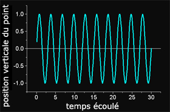
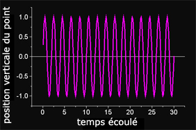
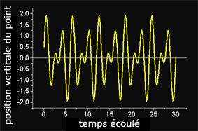
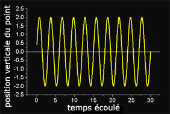
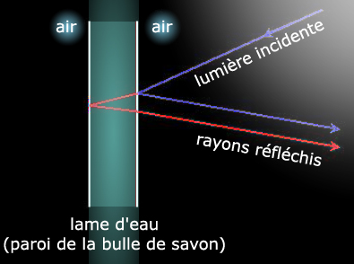

## Les interférentielles
### Les interférences ondulatoire, phénomènes importants pour les arts plastiques
 Navig. page/section

[](chap07rayleigh.html)  
[](dialoguesdotapea.html)  
[](chap09dextrine.html)

\_\_\_\_\_

**Pages soeurs**

[I, A propos des liants](chap01liants.html)  
[II, Bulles, siccativ., struct. élec.](chap02bullessiccativation.html)  
[III, Caséine, phosphore, dissociation](chap03caseine.html)  
[IV, Les orbitales](chap04orbitales.html)  
[V, L'aérogel](chap05aerogel.html)  
[VI, Polarisation de la lumière](chap06polaris.html)  
[VII, Sfumato et diffusion Rayleigh](chap07rayleigh.html)  
VIII, Les interférentielles  
[IX, Dextrine, farine et chiralité](chap09dextrine.html)  
[X, L'ocre bleue](chap10ocrebleue.html)  
[XI, Les métamatériaux](chap11metamateriaux.html)  
[XII, Le jaunissement](chap12jaunissement.html)  
[XIII, Laser etc.](chap13laser.html)  
[XIV, L'holographie](chap14holographie.html)  
[XV, L'holographie numérique](chap15holographienum.html)  
[XVI, Extérieur, intérieur, chaux](chap16interieurexterieurchaux.html)  
[XVII, L'électrolyse et les ions](chap17electrolyseions.html)  
[XVIII, L'électricité, un peu plus loin](chap18electriciteplusloin.html)  
[XIX, Oxydation, métaux](chap19oxydationsmetaux.html)  
[XX, Les échelles](chap20echelles.html)  
[XXI, Nature et évolution des résines](chap21resines.html)  
[XXII, Le mouillage pigmentaire](chap22mouillage.html)  
[XXIII, La molette](chap23molette.html)  
[XXIV, Blanche neige](chap24blancheneige.html)  
[XXV, Lumière et matière](chap25lumiereetmatiere.html)  
[XXVI, Magnétisme](chap26magnetisme.html)  
[XXVII, Ambre et vieilles branches](chap27ambre.html)  
[XXVIII, L'origami miroir](chap28origamimiroir.html)  
[XXIX, Le feu](chap29feu.html)  
[XXX, Peau du métal](chap30peaudumetal.html)  
[XXXI, La ville en un souffle](chap31bellastock.html)  
[XXXII, Oxyder des matériaux](chap32oxydermateriaux.html)  
[XXXIII, Ocre bleue, une solution](chap33ocrebleuesimulation.html)

\_\_\_\_\_

Copyright © www.dotapea.com

Tous droits réservés.  
[Précisions cliquer ici](droitscopie.html)

**Les dialogues sur la physique-chimie  
appliquée aux arts**

**Chapitre VIII**

**Les interférentielles**

[](dialoguesdotapea.html#notecornelis)

dial   dial   dial

Ce chapitre des [Dialogues de Dotapea](dialoguesdotapea.html) est une discussion entre Jean-Louis, physico-chimiste au CNRS, et un candide, Emmanuel.

Les personnages sont réels, la discussion aussi. Elle peut reprendre à tout moment et ce texte peut s'allonger.

Emmanuel : Des fabricants de pigments proposent des produits "interférentiels". De fait, on constate des phénomènes chromatiques étranges, assez difficiles à maîtriser d'ailleurs. Que peux-tu dire sur cette capacité propre aux ondes de pouvoir être interférentielles ? A quoi correspondent physiquement ces phénomènes bien sensibles, voire spectaculaires ?

Jean-Louis : Une onde qui se propage est une perturbation périodique du milieu où elle se propage. Si par exemple on trace la position d'un point situé sur une surface d'eau lors du passage de vagues (la perturbation) on a une courbe de ce genre  :



(En toute rigueur le mouvement des vagues est un peu plus compliqué, mais on peut faire une approximation.)

On peut imaginer que deux perturbations (voire un nombre arbitraire) se propagent simultanément dans le même milieu.



**La danse des ondes**

Un point du milieu subira alors plusieurs influences et son mouvement, donc sa position, sera fonction des caractéristiques des deux perturbations:



Dans le cas où les deux perturbations (les deux ondes) ont la même fréquence et la même amplitude, il peut arriver que leur action sur le point d'observation soit cumulative:



On note que l'amplitude du mouvement est double de ce qu'elle est quand il n'y a qu'une onde (voir la position verticale du point).  
Et il peut arriver que l'action des deux perturbations soit au contraire minimale, l'une des deux contrariant exactement le mouvement de l'autre :


On a volontairement conservé une amplitude non-nulle pour l'illustration, mais on peut tout à fait parvenir à un déplacement, une perturbation très exactement nulle.  
 

L'interaction de deux ondes (ou davantage) de même fréquence et de même amplitude s'appelle "interférence". Les interférences peuvent donner lieu à des perturbations résultantes d'amplitude nulle, on parle d'interférences destructives, et si la perturbation résultante est au contraire maximisée on parle d'interférences constructives.  
On observe des interférences avec toutes les ondes périodiques : mécaniques (vibrations), optiques (lumière), sonores. Dans les casques anti-bruits dits "actifs", un micro capte le bruit au niveau du pavillon de l'oreille, un montage électronique recrée le signal exactement opposé qui est envoyé au haut-parleur. Le signal de bruit et le signal recalculé s'annulent exactement au niveau de l'oreille, on n'entend plus rien !

La lumière est aussi un phénomène ondulatoire qui donne lieu aux phénomènes d'interférences. Les irisations d'une couche d'huile dans une flaque d'eau, des bulles de savon, des élytres de certains scarabées, des ailes de certains papillons (les bleus du Brésil, je connais pas leur nom), la nacre des coquillages, la couleur des opales : des phénomènes interférentiels !

Dans les cas que je viens de mentionner, le point commun de tous ces systèmes est d'être stratifiés. Ils possèdent au minimum une couche de matériau. C'est la réflexion de la lumière sur les différents interfaces qui multiplie les ondes, ces ondes peuvent ensuite interférer, mais il faut au minimum deux ondes pour qu'il y ait des interférences. 

 

**Une véritable question de rythme**

Prenons l'exemple de la paroi d'une bulle de savon. C'est une lame d'eau stabilisée par des molécules de [tensioactif](tensioactivite.html) (savon). Un rayon de lumière incident (bleu, voir schéma [ci-dessous](chap08interferences.html#schemabulle)) va se partager à chaque interface en un rayon réfléchi (bleu) et un rayon transmis (rouge). Le rayon transmis (on dit aussi [réfracté](refraction.html)) se réfléchit à son tour à chaque interface, il va donc générer le rayon rouge qui ressort parallèlement au rayon bleu, mais décalé, et surtout retardé : il a "perdu" du temps dans la bulle par rapport au rayon bleu qui s'est réfléchi "tout de suite".

Ces deux rayons, ces deux perturbations, issues d'un même rayon, sont maintenant temporellement décalées. On dit qu'elles sont déphasées. Le déphasage est fonction des propriétés optiques du milieu traversé, son indice de réfraction et son épaisseur. Selon la valeur du déphasage, et donc de l'épaisseur de la lame d'eau, les interférences des deux rayons seront constructives ou destructives (voir ci-dessus). Complication : l'indice de réfraction d'un matériau n'est pas le même pour toutes les radiations, l'indice pour le bleu n'est pas égal à l'indice pour le rouge. Donc le déphasage varie en fonction de la longueur d'onde de la lumière incidente.



En lumière blanche, on peut donc avoir des interférences destructives pour une couleur et constructives pour une autre, les interférences sont donc colorées : les irisations de la bulle de savon. En outre, le déphasage varie en fonction de l'angle d'incidence des rayons, les couleurs varient donc en fonction de l'angle d'incidence ou d'observation. C'est dû au fait que l'épaisseur apparente de la lame n'est pas la même si on la regarde de face ou de biais.

 

**Réfraction et bulle de savon**

Quelques précisions dans un courrier des Lecteurs : [cliquer ici.](courrierdeslecteurs2009a270.html)

Cas des pigments dits "interférentiels" : si le milieu est stratifié, formé d'une multitude de plans, d'interfaces, le phénomène d'interférences est accentué en ce que certaines couleurs (longueurs d'ondes) seront très efficacement renforcées ou éliminées. Le matériau a alors une couleur plus homogène, par exemple les ailes de ces fameux papillons bleus ou les élytres de ces scarabées verts. Le fait que la coloration résulte d'un phénomène physique d'interférences et non pas d'absorption \[ndlr : absorption spectrale classique, voir [_Un pigment n'est pas une couleur_ in _Les pigments, les couleurs_](pigments.html#9unpigmentnestpasunecouleur)\] par un pigment donne à ces couleurs leur aspect particulier. Dans le cas de ces milieux stratifiés, ce qui détermine la couleur de la lumière réfléchie est essentiellement la périodicité des plans, c'est-à-dire leur épaisseur. Si on augmente l'épaisseur des plans, les couleurs vont vers le rouge, elles vont vers le bleu si on la diminue. Un procédé historique de photographie en couleur a utilisé ce phénomène : le procédé Lipman. Il fonctionnait par interférences, sans aucun pigment. Très élégant!

Emmanuel : Tu écris : "_Si on augmente l'épaisseur des plans, les couleurs vont vers le rouge, elles vont vers le bleu si on la diminue_". Cela fait un peu penser à la [diffusion Rayleigh](chap07rayleigh.html). Est-ce qu'il y a un rapport ?

Jean-Louis : Non, c'est sans rapport.

Emmanuel : Les fabricants de pigments interférentiels insistent sur deux points : le changement chromatique en fonction de l'angle d'observation (c'est vrai, ça marche, tu passes du vert au violet par exemple) et l'importance du fond noir ou clair. Qu'en penses-tu ?

Jean-Louis : Le changement de couleur en fonction de l'angle est lié au fait que si tu regarde une lame de matériau sous une incidence oblique, son épaisseur apparente augmente. Comme les interférences sont fonction de l'épaisseur du matériau diffractant, la couleur change avec l'angle.

Emmanuel : D'accord. Plastiquement, c'est intéressant.

Jean-Louis : Je vois deux choses  : un fond coloré va modifier les couleurs, par exemple si tu mets un pigment interférentiel vert sur un fond rouge, "ça ne marchera pas", tu verras du noir.

Et les interférences (donc ici la couleur), sont idéalement observables si on maximise le contraste. J'aurais tendance à dire que les fonds noirs sont meilleurs, on évite la dilution de la couleur par la lumière simplement diffusée par le fond clair.

 

**Ce qui donne aux pigments interférentiels un aspect si particulier**

\[Lire aussi un article consacré directement aux pigments interférentiels - [cliquer ici](interferentielspigments.html)\]

Emmanuel : J'ai reçu une question qui m'a semblé très intéressante, pragmatique. C'est au sujet d'une vieille déco murale dans une maison ancienne en Bourgogne qui aurait un aspect... "nacré" (interférentiel ?). A priori, le pigment est une argile prise dans le jardin, mais la même argile utilisée avec un lait de chaux classique ne donne pas cet aspect. On a donc employé une autre substance a priori.

Ça soulève une question : avant de faire des assemblages de mica micro ou nanométriques sur les pigments, comment a-t-on pu s'y prendre dans le passé pour créer des effets interférentiels avec des matériaux simples ?

Jean-Louis : Certaines argiles forment des phases lamellaires de type [cristal liquide](cristal.html#cristauxliquides). Ça peut donner des interférences. Par exemple, dans certaines flaques d'eau de forêt on voit souvent des irisations qui ressemblent à celles que produit l'essence et les hydrocarbures. On prend cela pour de la pollution mais ce n'est que de l'argile!! Pour la peinture, donc, pourquoi pas, mais les phases lamellaires dont je parle exigent une bonne quantité d'eau pour être stables. Donc l'explication est plus compliquée que le simple mélange d'argile et de pigments.

Lire aussi un [passage](chap11metamateriaux.html#interferencesopale) concernant les interférences  
renvoyées par l'opale in _Chapitre XI, les métamatériaux._

 

**Les anciennes interférences**

[La suite : chapitre IX](chap09dextrine.html)


 

 [Communication](http://www.artrealite.com/annonceurs.htm) 

[](index-2.html#20131014)


```
title: Les interférentielles
date: Fri Dec 22 2023 11:26:30 GMT+0100 (Central European Standard Time)
author: postite
```
