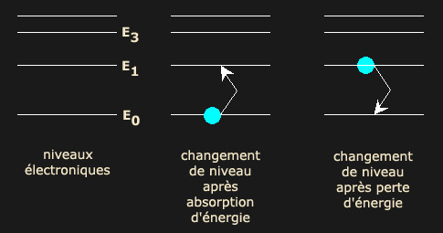
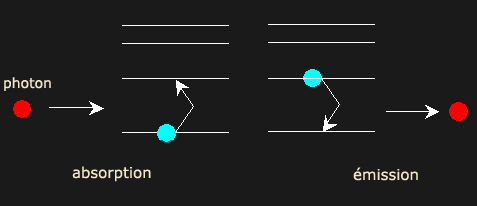
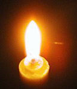
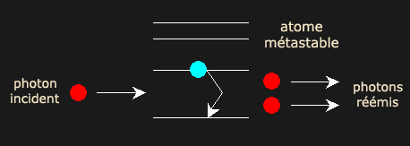

## Le laser - Chapitre XI des Dialogues de Dotapea
### Le laser - Le laser, la cohérence et certaines propriétés de la lumière - Chapitre XI des Dialogues de Dotapea
 Navig. page/section

[](chap12jaunissement.html)  
[](dialoguesdotapea.html)  
[](chap14holographie.html)

\_\_\_\_\_

**Pages soeurs**

[I, A propos des liants](chap01liants.html)  
[II, Bulles, siccativ., struct. élec.](chap02bullessiccativation.html)  
[III, Caséine, phosphore, dissociation](chap03caseine.html)  
[IV, Les orbitales](chap04orbitales.html)  
[V, L'aérogel](chap05aerogel.html)  
[VI, Polarisation de la lumière](chap06polaris.html)  
[VII, Sfumato et diffusion Rayleigh](chap07rayleigh.html)  
[VIII, Les interférentielles](chap08interferences.html)  
[IX, Dextrine, farine et chiralité](chap09dextrine.html)  
[X, L'ocre bleue](chap10ocrebleue.html)  
[XI, Les métamatériaux](chap11metamateriaux.html)  
[XII, Le jaunissement](chap12jaunissement.html)  
XIII, Laser etc.  
[XIV, L'holographie](chap14holographie.html)  
[XV, L'holographie numérique](chap15holographienum.html)  
[XVI, Extérieur, intérieur, chaux](chap16interieurexterieurchaux.html)  
[XVII, L'électrolyse et les ions](chap17electrolyseions.html)  
[XVIII, L'électricité, un peu plus loin](chap18electriciteplusloin.html)  
[XIX, Oxydation, métaux](chap19oxydationsmetaux.html)  
[XX, Les échelles](chap20echelles.html)  
[XXI, Nature et évolution des résines](chap21resines.html)  
[XXII, Le mouillage pigmentaire](chap22mouillage.html)  
[XXIII, La molette](chap23molette.html)  
[XXIV, Blanche neige](chap24blancheneige.html)  
[XXV, Lumière et matière](chap25lumiereetmatiere.html)  
[XXVI, Magnétisme](chap26magnetisme.html)  
[XXVII, Ambre et vieilles branches](chap27ambre.html)  
[XXVIII, L'origami miroir](chap28origamimiroir.html)  
[XXIX, Le feu](chap29feu.html)  
[XXX, Peau du métal](chap30peaudumetal.html)  
[XXXI, La ville en un souffle](chap31bellastock.html)  
[XXXII, Oxyder des matériaux](chap32oxydermateriaux.html)  
[XXXIII, Ocre bleue, une solution](chap33ocrebleuesimulation.html)

\_\_\_\_\_

Copyright © www.dotapea.com

Tous droits réservés.  
[Précisions cliquer ici](droitscopie.html)

**Les dialogues sur la physique-chimie  
appliquée aux arts**

**Chapitre XIII**

**triptyque laser et 3d**

**première partie :**

**Le laser**

**et certaines propriétés de la lumière**

[](dialoguesdotapea.html#notecornelis)

dial   dial   dial

Ce chapitre des [Dialogues de Dotapea](dialoguesdotapea.html) est le premier volet d'un **triptyque**. Il s'agit comme précédemment d'une discussion entre Jean-Louis, physico-chimiste au CNRS, et un candide, Emmanuel, mais si le [chapitre suivant](chap14holographie.html), consacré à l'holographie, fait intervenir les mêmes personnes, le troisième donne largement la parole à un expert de la restitution tridimensionnelle. Parution sous peu.

Le laser est utilisé de plusieurs façons en art. Nous aborderons dans ce texte ses particularités et potentialités "picturales" (voir ci-dessous ["L'aspect du laser"](chap13laser.html#aspect)). Cependant, nous ne nous priverons pas d'aborder également des concepts plus généraux, notamment la cohérence ondulatoire, la photoluminescence et l'incandescence.

Une utilisation artistique possible du laser est abordée dans le court-métrage

_"Laser, matériau transparent et vidéo"_

[](players/laser030/index.html)

[Cliquer ici](players/laser030/index.html)

A lire également, un ensemble de documents associés aux « fontaines laser » et à leur utilisation dans le cadre des célébrations du cinquantenaire du laser. [Cliquer ici](hitechfontaineslaser.html) (section Hi-tech).

Emmanuel : Au fond, le laser qu'est-ce que c'est?

Tout le monde a entendu dire que c'est une « lumière cohérente » mais on ne sait guère ce que ces mots intrigants signifient. Peux-tu nous parler de ce phénomène d'une manière plus claire, quitte à partir de la base pour que l'on comprenne enfin ce qui distingue cette lumière des autres ?

Jean-Louis : Partons des électrons. Ils sont astreints à posséder certaines énergies très précises qui sont dites quantifiées.

  
Emmanuel : Est-ce que ces niveaux correspondent aux « orbitales » dont nous avons déjà parlé [\[lien\]](chap04orbitales.html) ou bien est-ce tout autre chose ?

Jean-Louis : Non, c'est lié. De façon très schématique, les orbitales sont des familles de niveaux. Les orbitales sont une vision un peu géométrique, elles possèdent des caractéristiques de symétrie spatiale. Une même orbitale regroupe un ou plusieurs niveaux électroniques.  
Seuls ces niveaux énergétiques sont accessibles aux électrons, mais ils peuvent passer de l'un à l'autre en gagnant ou perdant la différence d'énergie qui sépare les niveaux.



Fig. 1

De façon générale les électrons absorbent ou restituent l'énergie sous forme de photons.  
L'absorption d'un photon suffisamment énergétique fait monter l'électron sur un niveau d'énergie supérieure, la désexcitation d'un électron et son retour vers un niveau inférieur entraîne l'émission d'un photon.

**La diffusion de la lumière : apport et restitution d'énergie**

Emmanuel : Dans le cas du laser c'est de la photoluminescence si je ne m'abuse.

Jean-Louis : C'est le même phénomène, oui docteur. _Mais toutes les émissions de photons fonctionnent sur le même principe,_ elles ont juste reçu un nom différent selon les détails exacts, par exemple la durée de vie de l'état excité.

Emmanuel : D'accord. D'ailleurs je relis la définition de l'incandescence par rapport à la photoluminescence et… elle ne me semble pas satisfaisante \[ce texte a été modifié entre-temps - [lien](photoluminescence.html)\]. Comment distinguerais-tu ces deux phénomènes ?

  
Jean-Louis : Une différence de cause : _un matériau incandescent est excité thermiquement,_ par une source de chaleur. Les physiciens parlent de "phonons" qui sont des quanta d'excitation vibrationnelle, la chaleur d'un corps étant directement liée aux "vibrations" de ses atomes/molécules constitutifs.

  
Un matériau luminescent est excité par des photons \[plus de détails voir [ci-dessous](chap13laser.html#bonsphotons)\]. Une différence de résultats : un matériau incandescent rayonne un continuum de photons, de l'infrarouge au visible, toutes les longueurs d'onde étant possibles. Un matériau luminescent (fluorescent, phosphorescent) ne réémet qu'un seul type de photons (monochromatique).

  
Si tu achètes une petite lampe UV (on en trouve facilement dans les magasins qui vendent des light-show pour les boums du samedi soir, 15€), tu peux regarder chez toi quels sont les corps fluorescents outre tes dents et ton T-shirt en coton. Certains objets colorés (les dinosaures de mon fils ou ses petites voitures) donnent souvent des résultats surprenant, une voiture jaune apparaissant soudain rouge.

  
Particularité : ces processus ont une efficacité maximale quand l'énergie du photon incident est exactement égale à la différence d'énergie entre les niveaux électroniques, E1-E0 en [figure 1](chap13laser.html#fig1). Un photon trop ou trop peu énergétique ne sera pas absorbé, les photons réémis ont tous la même énergie.



**Incandescence et luminescence : où se situe la différence ?**

Les niveaux énergétiques accessibles aux électrons sont dépendants de la structure électronique du corps, et sont donc très spécifiques.

  
C'est ainsi que la couleur dominante émise par un corps excité est typique de ce corps, et peut permettre son identification. Exemples : le sodium excité émet une couleur jaune très typique, c'est le jaune des lampes à sodium de l'éclairage urbain, la couleur jaune que prend la flamme d'une bougie où l'on fait tomber du sel de cuisine (chlorure de sodium).

  
Emmanuel : Effectivement la flamme tourne au jaune lorsque l'on asperge une bougie de sel de cuisine (soit dit en passant, le sel, ininflammable, a tendance à éteindre la bougie). Ce n'est pas très spectaculaire mais c'est sensible.

  
Jean-Louis : Le cuivre donne une couleur bleue, le strontium une couleur rouge, le baryum du vert, calium orangé, potassium violet. C'est en mettant ces éléments (cuivre, sodium, strontium, etc...) dans les feux d'artifice qu'on les colore.  
Un atome excité ne reste pas excité, sauf si on continue à lui fournir de l'énergie en permanence.

**Couleur des corps excités**

En principe, cette désexcitation est rapide et spontanée. Dans certains cas, l'état excité peut rester stable un certain temps (on dit métastable), et il faut que l'atome reçoive une petite pichenette pour se désexciter. On parle alors d'émission stimulée. Idéalement, c'est un photon de la bonne énergie qui passe par là et qui déclenche le processus.



  
Particularité très intéressante de cette situation, l'atome réémet un photon absolument identique à celui qui a déclenché l'émission. On a "photocopié" le photon incident. Les deux photons ont alors la même énergie (i.e. même couleur, même longueur d'onde) et de plus ils sont "en [phase](onde.html#phase)" (on dit cohérents).

**"Émission stimulée"**

Emmanuel : Nous y voilà !

Jean-Louis : La lumière (et chaque photon) étant une [onde](onde.html), elle se propage comme les vaguelettes créées par la grenouille qui saute dans la mare, comme dans un haïku célèbre.

 


Courtoisie de Suzue HATTORI ©

**_f__u-ru-i-ké-ya  
ka-wa-zu-to-bi-ko-mu  
mi-zu-no-o-to_**

_d__ans le vieil étang  
une grenouille saute  
un ploc dans l'eau_

Si plusieurs grenouilles ordinaires sautent dans l'eau, ça fait plus de vagues, mais elles n'ont aucune relation particulière entre elles, elles sont incohérentes. Si les grenouilles laser sautent de telle façon que le sommet des vagues créées par chacune se produise au même moment que ceux de sa voisine, on a des vagues "en phase" ou cohérentes". Ca reste une image grossière, bien entendu, mais c'est l'idée.

  
[](players/laser010/index.html)

Emmanuel : Est-ce que dans le cas de la cohérence « photonique » on veut dire qu'à un instant _t_, les courbes des photons émis sont à la même « hauteur » de la vague ?…

  
Jean-Louis : Au sens strict, c'est pas "les courbes des photons", c'est la variation temporelle du champ électrique associé. Mais oui.

  
Emmanuel : … ou bien plus simplement qu'ils ont la même longueur d'onde ?

Jean-Louis : Non. Ils ont aussi la même longueur d'onde mais c'est pas la même notion. Même longueur d'onde veut dire même couleur, monochromatique. 

**La phase et la cohérence**

Le principe d'un laser est donc "simple" : on réunit un ensemble d'atomes excités métastables, le premier qui se désexcite émet un photon qui stimule l'émission de tous les autres atomes. Les photons qui sortent sont tous identiques. On a une lumière monochromatique cohérente.  
Le milieu actif peut être un gaz (CO2, Argon, Hélium+Néon)…

  
Emmanuel : Hélium + néon… Ca veut dire qu'il y a deux longueurs d'ondes dans ce cas ?

  
Jean-Louis : Non, c'est plus compliqué que ça. En fait on se sert des électrons d'un des gaz pour faire un transfert d'énergie vers l'autre gaz, dont les atomes se désexcitent alors en émettant la lumière rouge monochromatique.

  
Emmanuel : D'accord. Pareil dans le CO2, quel(s) atome(s) émet(tent) les photons ? C'est marrant, l'idée que le banal gaz carbonique puisse émettre de la lumière laser.

  
Jean-Louis : Ben c'est comme ça. Je pourrais pas vraiment t'expliquer pourquoi, c'est un matériau qui convient, c'est tout.

**Quelles substances dans un émetteur laser ?**

Si tu veux tout savoir, il ne suffit pas d'envoyer les électrons sur un niveau supérieur et de les faire retomber. Il faut réaliser ce qui s'appelle une inversion de population ce qui signifie que contrairement au régime normal, on a plus d'électrons excités que d'électrons "calmes". On dit que l'on pompe le milieu laser. Et c'est la désexcitation soudaine de cette population qui donne l'émission laser. On ne peut pas réaliser ce pompage et cette inversion de population avec n'importe quoi, il faut que les niveaux électroniques soient au bon endroit, et ça dépend des molécules.

 

Dans l'amplification, un photon en donne deux, mais le deuxième photon vient d'un électron que tu as péniblement excité en injectant de l'énergie dans ton laser (lorsque tu "pompes ta cavité"). Il n'y a pas création d'énergie, tu pompes beaucoup plus que tu ne récupères de photons.

L'acronyme LASER signifie en anglais Light Amplification by Stimulated Emission of Radiation : Amplification de la lumière par émission stimulée de radiation.

\[ajout 9/2013\] C'est une réaction en chaîne, un photon en induit deux qui en induisent quatre, qui en induisent huit, etc... Et ça recommence et ça continue. C'est d'ailleurs pour ça que la longueur de cohérence de la lumière obtenue est globalement égale à la longueur de la cavité laser. \[fin ajout\]

**Parenthèse sur le pompage laser et l'amplification**

**Longueurs d'onde**

Avant le laser, il y eut le maser (avec un m pour microwave, micro-onde), qui date de 1953. Basé sur le même principe que le laser, il émettait sur des fréquences plus basses que celles de la lumière visible.

Le  premier laser (1960) était rouge. Obtenir la longueur d'onde la plus courte possible pour un coût modéré n'a cessé d'être un enjeu scientifique, technologique et commercial, particulièrement pour les technologies DVD. Le laser bleu ou bleu-violet à bas prix permet en effet de graver les informations sur un espace plus réduit qu'un laser rouge

Le milieu actif peut aussi être un solide (YAG, rubis, semiconducteur).

  
Emmanuel : Qu'est-ce que c'est, YAG, Jean-Louis ?

  
Jean-Louis : Yttrium Aluminum Garnet... Un grenat ("rubis") [d'yttrium](annexe1.html#y) et [d'alumine](alumine.html).  
Concernant le milieu actif, il peut aussi s'agir d'un liquide (lasers à colorant).

  
Emmanuel : Lasers à colorant ?

  
Jean-Louis : Des molécules colorées organiques en solution.

  
Emmanuel : Très curieux. Quel est le principe ?

**D'autres substances**

Jean-Louis : C'est exactement le même principe, le milieu laser est juste liquide, des molécules en solution. Un des avantages c'est que les molécules de colorant ont beaucoup plus de niveaux électroniques que des atomes ou des corps simples, on peut donc accorder ces lasers sur un certain domaine pour avoir le choix de la longueur d'onde émise. 

L'excitation du milieu actif peut se faire par irradiation lumineuse (des flashs ou un autre laser), énergie thermique, énergie électrique \[voir [amplification](chap13laser.html#amplification) ci-dessus\].

  
Emmanuel : Si j'ai bien compris, l'important est que ça cadre avec le niveau d'excitation que l'on veut obtenir dans le corps concerné. Si c'est la même chose qu'avec certains matériaux photoluminescents, ça dépend de pas mal de particularismes, non ?

  
Jean-Louis : Ca c'est _si on veut optimiser._ En pratique on gaspille beaucoup en envoyant un tas de photons dont très peu sont utiles. Le rendement énergétique des lasers est très faible.

L'émission "luminescente" nécessite comme pour toute émission de lumière un apport initial d'énergie. A une spécificité près : il s'agit, quel que soit le type d'apport initial (en l'occurrence renouvelé), de provoquer l'émission des "bons photons", ceux qui sont capables de produire une luminescence.

Pour bien sentir la différence avec une source "classique" : une lampe à incandescence émet une lumière blanche, polychromatique, quand on chauffe son filament avec un courant électrique.

**Accorder son laser**

Dans un laser, la source de lumière est atomique, donc très petite, donc très brillante, monochromatique, et toute l'énergie étant concentrée dans une seule longueur d'onde on a beaucoup d'énergie lumineuse.

En prime, mais ça sert pas tous les jours ni à tout le monde, cette propriété de cohérence sert pour des applications métrologiques ou très particulières comme l'holographie.

Tous les atomes de tungstène du fil sont excités, un peu sur tous les niveaux possibles (d'où l'émission d'une lumière non-monochromatique), ils ne sont pas en phase (aucune cohérence entre les photons émis aléatoirement), la source de la lumière est un objet macroscopique, le fil, et surtout le rendement est minable, on produit beaucoup plus de chaleur que de lumière.

**L'aspect du laser**

**Produire moins de chaleur et plus de lumière**

C'est cette même cohérence qui donne aux spots laser leur aspect particulier. Une surface éclairée par un laser prend un aspect grumeleux, inhomogène (on parle de _speckle_), dû au fait que la lumière cohérente se prête excellemment à la production d'interférences. Dans le cas du speckle, les interférences sont le fait des inhomogénéités de la surface. Ca sert précisément en métrologie pour quantifier les rugosités…

  
Wikipédia indique : « Le speckle (ou encore _tavelures_ en français) est l'aspect granuleux que prend un écran réfléchissant qui diffuse la lumière lorsqu'il est éclairé par un faisceau de lumière cohérente spatialement (un laser par exemple). »

  
Ce phénomène est dû au fait qu'il y a interférence entre les rayons diffusés par chaque point de l'écran. Ces interférences donnant de manière aléatoire des points lumineux ou sombres l'écran prend un aspect granuleux avec une image qui « fourmille ».

Comme ça j'ai appris le nom français....

**Le speckle ou tavelure**

Emmanuel : Il y a d'une part les tavelures, d'autre part les problèmes mécaniques des miroirs. Les deux phénomènes joints donnent des images que l'on identifie facilement.  
La technique d'affichage laser par projection simple, directe, reste surtout exploitée dans les concerts rock et les boîtes de nuit, pas dans les salons.

  
Jean-Louis : L'aspect "typique" des lasers est inévitable. Il est précisément lié à la cohérence de la lumière. On n'aura que très difficilement, je pense, des aspects naturels.

Les miroirs mobiles utilisés pour les shows laser ont effectivement des limites, mais ce que l'on arrive à faire est tout de même spectaculaire, non ?

Emmanuel : D'accord. Autre chose, admettons que dans le but d'obtenir de la couleur, je place du néon, de l'hélium, du grenat et du CO2, enfin une bonne soupe dans le lieu d'amplification et que j'envoie tous les rayons qu'il faut pour que chaque élément soit excité. Comment ça se passe ? Mal, j'imagine.

  
Jean-Louis : Oui, ça se passera mal car tous ces corps n'ont pas les mêmes exigences, et si on met trop de matière l'absorption domine et tue l'émission.

\[Note : pour obtenir des effets polychromes

on est donc obligé d'employer plusieurs lasers\]

\*\*\*

**Les miroirs et l'apparence**

Emmanuel : Avec le tube cathodique on détourne les électrons là où on veut, mais quand le rayonnement à traiter est déjà photonique, on dirait qu'il se fiche complètement des champs et que c'est pour ça que l'on doit utiliser des miroirs. C'est une question de charge ?

  
Jean-Louis : Ben oui, les photons ne sont pas chargés et pas magnétiques.

  
Emmanuel : Je suis un photon. Je me cogne sur un électron, bing. Schématiquement, j'accrois son énergie qu'il va relâcher soit presque immédiatement (en 10\-15 sec., disais-tu - [lien](chap09dextrine.html#tempsduphenomeneoptique)) soit un peu plus tard sous la forme d'un nouveau photon. Pendant ce temps, j'ai modifié quelque chose que l'on nomme un champ, ou plusieurs. Pourtant moi-même je suis insensible à ce type de champs.

Est-ce que le tableau est correct ? Souhaites-tu corriger ou ajouter des précisions ? 

**Bing !**

Jean-Louis : Tu poses les bonnes questions  ! Quand un photon rencontre un électron, il peut se passer plusieurs choses : le photon est absorbé à jamais, son énergie est convertie en chaleur par le milieu qui l'a absorbé. Le photon est diffusé par l'électron en gardant son énergie (diffusion élastique), c'est le plus courant. Le photon est diffusé avec une énergie inférieure (diffusion inélastique), c'est plus rare (statistiquement) mais utile par exemple pour l'analyse spectroscopique des oeuvres d'art. Ensuite il y a les phénomènes de luminescence, fluorescence, émission stimulée…

  
Emmanuel : Que se passe-t-il lorsque le rayon laser touche la surface rugueuse, en comparaison avec d'autres lumières ? Y a-t-il une relation avec les angles de réflexion qui changeraient en fonction des longueurs d'ondes si celles-ci étaient variées et non cohérentes ?

Jean-Louis : Non, c'est plutôt les variations locales d'épaisseur, je crois. C'est pas de la dispersion puisque la lumière est monochromatique. 

**Les deux destins du photon**

Emmanuel : Pourquoi une lumière cohérente « tient-elle la route » beaucoup plus longtemps que les autres dans un milieu comme par exemple l'air ou l'eau ? C'est étrange !

  
Jean-Louis : Ca c'est pas directement lié à l'effet laser. C'est parce que la lumière est produite dans une cavité (on parle de cavité laser, c'est comme ça) qui a des propriétés optiques particulières qui font que le faisceau émergent est bien collimaté et très peu divergent.

  
Emmanuel : D'accord. Partant de là, il y aurait un sujet à part entière. Tu as expliqué qu'il y avait une sorte d'autostimulation dans un milieu qui semble confiné. Comment est-ce que l'on confine les photons engendrés et comment est-ce qu'on les libère ?

  
Jean-Louis : La cavité est limitée par deux miroirs, l'un parfait, l'autre réfléchissant à ~98%. On a donc en gros 98% des photons qui sont confinés dans la cavité et 2% qui s'échappent, le rayon laser.

  
On ne peut pas faire pareil avec une lampe ordinaire à cause de la taille macroscopique du filament émetteur. Il faudrait que ça soit ponctuel, au sens mathématique du terme. Un filament c'est des millimètres. Une lampe à arc c'est déjà beaucoup mieux, un atome c'est le top.

**Vertus de la cavité laser :**

**confinement et échappement**

Emmanuel : Encore autre chose pour finir : on se représente le rayon comme un tube de lumière. Comment fait-on ça et serait-on obligé de le faire ? On se demande pourquoi on ne produirait pas un cône.

  
Jean-Louis : Au sens strict c'est un cône très faiblement divergent. Idéalement ça devrait être un cylindre, mais rien n'est parfait... Comme dit, c'est une conséquence de la géométrie de la cavité laser. Les gros lasers scientifiques ont des cavités qui font parfois 1m de long, ils sont très bien collimatés. Les petits pointeurs lasers ont une cavité de l'ordre du millimètre, la divergence du faisceau est très visible.

**Cône laser**

**Une mise en perspective** pour terminer : les petits lasers que l'on achète un peu partout ont une puissance de quelques milliwatts qui peut déjà mettre en danger la vue s'ils sont orientés vers les yeux. Mais nous évoquons dans un autre chapitre d'autres lasers qui sans être exceptionnels sont plus puissants. Ils sont employés dans le cadre de techniques holographiques. Certains déploient une énergie de six watts qui, comparée à une ampoule électrique banale, paraît plus qu'anodine. Et pourtant, comme le dit Dominique Sevray dans le chapitre XV des Dialogues de Dotapea ([lien](chap15holographienum.html#watts)), cela brûle tout.

Évoquons maintenant le projet français en partie militaire nommé [Mégajoule](http://www-lmj.cea.fr/html/cea.htm). Sachant qu'un watt est un joule par seconde on peut imaginer la puissance d'un laser portant un tel nom.

Un laser peut être éminemment dangereux ou extrêmement utile (on citera les applications médicales par exemple), ou les deux à la fois comme beaucoup d'autres outils.

Mentionnons enfin les incroyables "pico-projecteurs" intégrables sur téléphones mobiles ou sur boîtiers séparés. [Lire article](hitech.html#picoprojecteurs) court et lien dans « Hi-tech ».

[Chapitre suivant](chap14holographie.html)


 

 [Communication](http://www.artrealite.com/annonceurs.htm) 

[](index-2.html#20131014)


```
title: Le laser - Chapitre XI des Dialogues de Dotapea
date: Fri Dec 22 2023 11:26:31 GMT+0100 (Central European Standard Time)
author: postite
```
