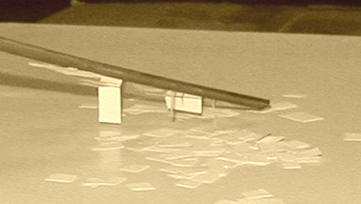
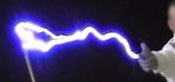

## L'électricité, encore un peu plus loin - Chapitre XVIII des Dialogues de Dotapea
### L'électricité, encore un peu plus loin - Questionnements et applications - Chapitre XVIII des Dialogues de Dotapea
 Navig. page/section

[](chap17electrolyseions.html)  
[](dialoguesdotapea.html)  
[](chap19oxydationsmetaux.html)

\_\_\_\_\_

**Pages soeurs**

[I, A propos des liants](chap01liants.html)  
[II, Bulles, siccativ., struct. élec.](chap02bullessiccativation.html)  
[III, Caséine, phosphore, dissociation](chap03caseine.html)  
[IV, Les orbitales](chap04orbitales.html)  
[V, L'aérogel](chap05aerogel.html)  
[VI, Polarisation de la lumière](chap06polaris.html)  
[VII, Sfumato et diffusion Rayleigh](chap07rayleigh.html)  
[VIII, Les interférentielles](chap08interferences.html)  
[IX, Dextrine, farine et chiralité](chap09dextrine.html)  
[X, L'ocre bleue](chap10ocrebleue.html)  
[XI, Les métamatériaux](chap11metamateriaux.html)  
[XII, Le jaunissement](chap12jaunissement.html)  
[XIII, Laser etc.](chap13laser.html)  
[XIV, L'holographie](chap14holographie.html)  
[XV, L'holographie numérique](chap15holographienum.html)  
[XVI, Extérieur, intérieur, chaux](chap16interieurexterieurchaux.html)  
[XVII, L'électrolyse et les ions](chap17electrolyseions.html)  
XVIII, L'électricité, un peu plus loin  
[XIX, Oxydation, métaux](chap19oxydationsmetaux.html)  
[XX, Les échelles](chap20echelles.html)  
[XXI, Nature et évolution des résines](chap21resines.html)  
[XXII, Le mouillage pigmentaire](chap22mouillage.html)  
[XXIII, La molette](chap23molette.html)  
[XXIV, Blanche neige](chap24blancheneige.html)  
[XXV, Lumière et matière](chap25lumiereetmatiere.html)  
[XXVI, Magnétisme](chap26magnetisme.html)  
[XXVII, Ambre et vieilles branches](chap27ambre.html)  
[XXVIII, L'origami miroir](chap28origamimiroir.html)  
[XXIX, Le feu](chap29feu.html)  
[XXX, Peau du métal](chap30peaudumetal.html)  
[XXXI, La ville en un souffle](chap31bellastock.html)  
[XXXII, Oxyder des matériaux](chap32oxydermateriaux.html)  
[XXXIII, Ocre bleue, une solution](chap33ocrebleuesimulation.html)

\_\_\_\_\_

Copyright © www.dotapea.com

Tous droits réservés.  
[Précisions cliquer ici](droitscopie.html)

**Les dialogues sur la physique-chimie  
appliquée aux arts**

**Chapitre XVIII**

**L'électricité,**

**encore un peu plus loin**

**Questionnements et applications**

[](dialoguesdotapea.html#notecornelis)

dial   dial   dial

Ce chapitre des [Dialogues de Dotapea](dialoguesdotapea.html) est une discussion entre Jean-Louis, physico-chimiste au CNRS, et un candide, Emmanuel..

De l'expérience scolaire basique à la téléportation ce second texte du triptyque Electricité/métaux précise des concepts en complément des chapitres [XVII](chap17electrolyseions.html) et [XIX](chap19oxydationsmetaux.html). Des applications artistiques sont évoquées.

_Article [avec vidéo externe](chap18electriciteplusloin.html#videoexterne)_

Emmanuel : Quelle différence y a-t-il entre champ électrique et champ électromagnétique ? 

Jean-Louis : Un champ électrique c'est juste un champ électrique, et c'est purement statique. Par exemple la règle en plastique que tu frottes avec un pull et qui attire des petits papiers, c'est un champ électrique statique.



On peu très facilement créer des champs électriques intenses. Un pull que tu enlèves génère des milliers de volts. 

**L'électricité statique...**

Les champs électriques intenses se créent très facilement par « effet de pointe ». Si tu as une pointe, c'est-à-dire un objet avec un rayon de courbure faible, les charges s'accumulent en ce point et le champ électrique y est donc maximal. C'est cet effet qui est responsable de l'efficacité des paratonnerres ou de l'apparition des "feux de Saint Elme" sur les objets pointus lors des ambiances orageuses. 

**...un phénomène non dénué de dimensions sensitives**

Emmanuel : Il y a peut-être là des applications artistiques, même avec des moyens limités.  
Que peut-on produire, finalement ? On a parlé des lampes à plasma et de l'effet Kirlian dans l'article sur les phases de la matière \[[lien](gazliquidessolides.html#lampesplasma)\], il y a les [aurores polaires artificielles](phosphofluo.html#auroresboreales) (mais là, l'effet est-il bien [électrostatique](electricite.html#electrostatique) ?). Sûrement d'autres choses, qu'en penses-tu ? Et si je peux produire des milliers de volts avec un pull, comment puis-je utiliser ensuite « plastiquement » cette énergie ? (sans me prendre pour une centrale électrique, comme disait le capitaine Haddock)

Jean-Louis : Quelques exemples d'applications sur [mgvolt.com](http://www.mgvolt.com/t-20spk5.htm), [menzelphoto.com](http://www.menzelphoto.com/gallery/big/lightning3.htm), [hvfx.co.uk](http://www.hvfx.co.uk/)

et en particulier [ceci](https://cbonvin.fr/sites/www.hvfx.co.uk/video/lightningman.html) (vidéo) :

[](http://www.hvfx.co.uk/stunts.php)

Les décharges électriques sont toujours spectaculaires et impressionnantes, notamment à cause du bruit (la foudre dans un salon...). Je ne sais pas si des plasticiens ont déjà utilisé ce genre de ressource. C'est facile à faire, il y a "juste" le problème de la sécurité. Ces montages ne sont pas destinés à fonctionner en permanence, non plus.

Emmanuel : Là on est dans le domaine de la performance. Très intéressant, notamment dans un environnement "en décalage" comme un salon. C'est sûrement peu exploité et il faudrait peut-être explorer aussi ce que l'on peut faire dans le domaine de l'installation avec des phénomènes comme le feu de Saint Elme. Autant de pistes.

**Des applications artistiques ?**

**L'électromagnétisme :**

**photon et mouvement**

Emmanuel : Donc quand tu dis statique, c'est par opposition à ondulatoire ? Parce que à strictement parler dans l'électricité statique il y a bien un mouvement des corps chargés, non ?Jean-Louis : Les papiers bougent mais pas le champ.  
Statique s'entend par opposition à propagatif. Ça peut être statique et oscillant.  
Disons que statique, c'est limité à un coin d'espace.Emmanuel : Comme dans l'expérience de la règle et des papiers. Comme pas mal d'écoliers je pense, je ne l'ai jamais comprise. En plus à l'époque on nous faisait plutôt frotter un bout d'ébonite avec une peau de chat, quelle horreur ! Bref, ça échappe un peu à la compréhension parce que le papier paraît plutôt neutre alors pourquoi réagit-il à un champ électrique ?

**Mais qu'est-ce qui bouge ?**

Jean-Louis : Tout n'est jamais vraiment exactement neutre au point de vue des charges électriques, donc ça peut déjà expliquer les papiers qui sont attirés. Mais surtout, un champ électrique peut facilement charger un corps neutre, même à distance, ça s'appelle"électrisation par influence". Donc le champ de la règle arrache quelques charges aux papiers, qui du coup sont attirés par la règle.Emmanuel : D'accord.  
Une chose m'intrigue : quel est l'agent de "l'électrisation par influence" ? Tu écrivais que les photons sont les vecteurs des champs électromagnétiques, mais quand c'est statique ?Jean-Louis : Un champ électrique statique suffisamment intense exerce des forces sur toutes les charges du voisinage, celles qui ne sont pas assez bien attachées s'envolent. C'est ce qui fait que tu as des étincelles ou des arcs électriques, par exemple. L'air, en principe neutre et isolant, devient ionique et donc conducteur parce que le champ arrache des électrons au molécules d'azote et d'oxygène. Du coup le courant passe.Emmanuel : Bien. Mais je n'arrive pas à comprendre ce que c'est qui arrache les électrons ni du coup à quoi correspond l'intensité d'un champ.

**Électrisation par influence**

Jean-Louis : L'accumulation de charges électriques crée un champ, et si tu approche un morceau de matière de ce champ, dans un premier temps il « polarise », ce qui veut dire que les charges qui y sont subissent l'influence du champ extérieur et se déplacent. Si le champ que tu approches est très fort, il arrache des électrons à la matière qui « s'ionise ».Emmanuel : D'accord.  
Donc se trouver dans un champ [électrostatique](electricite.html#electrostatique), ça veut dire être soumis à une sorte de « force de mouvement », à une motion. Une sorte de « réorganisation » en fonction d'une polarisation. Est-ce que je chauffe ?

**Polarisation et déplacement**

Jean-Louis : Une charge électrique crée un champ. D'un point de vue einsteinien on dira qu'elle modifie le continuum autour d'elle et que du coup les autres charges perçoivent sa présence et réagissent.

D'un point de vue moins métaphysique,

un physicien des particules dira que deux charges interagissent en échangeant des photons, qui sont le vecteur des interactions électromagnétiques statiques ou dynamiques.Un « électricien  » dira qu'une charge crée « un champ » et que ce champ « fait  » que d'autres charges subissent une « force ».

**Trois points de vue**

Ne sois pas troublé de ne pas tout comprendre, parce que pour résumer : on ne sait pas ce que c'est qu'un électron, on ne sait pas ce que c'est qu'une charge, on ne sait pas ce que c'est qu'un champ et on ne sait pas ce que c'est qu'une force. Et si quelqu'un te dit le contraire, il ment !

C'est comme le temps... Il n'y a pas si longtemps si tu regardais la définition du temps dans le Larousse on te répondait « durée », et si tu regardais « durée » on te répondais « espace de temps ». Ouh la la...

Emmanuel : C'est le vecteur, dans le cas de l'électricité statique, qui pose peut-être le plus violemment question. Notamment à cause de l'expérience des bouts de papier. On voit ce mouvement, c'est « palpable ». Et c'est très déstabilisant de voir à quel point l'explication du physicien des particules est opposée aux deux autres.

Veux-tu ajouter quelque chose sur ce point ?

Jean-Louis : En me répétant, je redis en préliminaire qu'on ne sait pas ce que c'est qu'une force, même si on sait en produire et que l'on en subit en permanence. Cela ne doit pas nous empêcher d'expérimenter et de théoriser.

Le vecteur, l'agent de la force, c'est encore un mystère. Le mystérieux graviton qui est censé être le médiateur de la gravité n'a encore jamais été trouvé, ce qui n'empêche pas la gravité de nous coller au plancher. On pense que les photons sont le vecteur des forces électromagnétiques, pourquoi pas. Mais déjà, les photons ne sont pas sensibles aux champs électromagnétiques... Quant aux autres forces fondamentales de la nature (interaction forte, interaction faible) elles ont aussi leur vecteur, mais c'est pas pour ça que l'on comprend mieux comment ça marche...

**Que comprend-on vraiment ?**

Les photons se déplacent dans le vide à la vitesse de la lumière, dans la matière à une vitesse inférieure qui dépend de l'indice de réfraction de cette matière. L'information est véhiculée par le champ électrique, à une vitesse qui ne peut donc pas être supérieure à celle de la lumière.  
Dans les fils électriques, les électrons sont freinés par les choc sur les atomes immobiles du fil, mais ils subissent en permanence l'accélération du champ électrique.

Dans l'exemple du tuyau d'arrosage \[voir [passage](chap17electrolyseions.html#arrosage) in Chap. XVII\], ce qui fait avancer l'eau du tuyau, c'est la pression que tu mets quand tu oeuvres le robinet. Cette pression se transmet dans le tuyau à la vitesse non pas de la lumière mais du son. Néanmoins, l'eau ne sort pas à 1500 mètres par seconde mais seulement quelques m/s. C'est comme pour les électrons.

Emmanuel : Dans le cas du fil électrique \[voir [passage](chap17electrolyseions.html#filelectrique) in Chap. XVII\], la charge (ou peut-être le champ électrique) semble se déplacer sur des distances bien plus importantes que dans le modèle statique, qui, si je te suis, est de portée locale. Mais j'ai bien du mal à imaginer des photons « transporter » le champ dans du métal. Comment ça se passe ?  
 

**Comment l'information se transmet-elle ?**

Jean-Louis : Il n'y a pas d'impossibilité physique à avoir des photons n'importe où. Les protons et les électrons des atomes de cuivre du fil électrique "se parlent" en échangeant des photons. Je ne pense pas qu'il faille voir le champ électrique entre les deux bouts du fil comme le champ propagatif d'une antenne de téléphone portable. Le plus simple c'est de dire qu'une machine (une grosse génératrice chez EDF) pompe des électrons dans le fil et que ça engendre un mouvement collectif des électrons dans ton fil chez toi. C'est vraiment l'analogie du robinet, le tuyau est mis sous pression "à l'usine" et quand tu ouvres chez toi, ça coule. EDF met une "pression" (une différence de potentiel) dans les fils et cette pression fait "couler" les électrons dans ton aspirateur.

**Des photons pour se parler dans le métal**

Emmanuel : J'ai lu quelque part que dans les expériences plus ou moins récentes liées à la téléportation une information était transmise sans aucun délai, quelque chose qui a un rapport avec le spin de particules appariées ou quelque chose comme ça je crois. Donc je me demandais s'il y avait un rapport entre la vitesse de transmission de l'information et l'apparition d'un champ : pas de délai=pas de champ, un délai=un champ... ou bien si c'est une idée complètement à côté de la réalité !Jean-Louis : La téléportation, on ne sait pas trop encore ce que c'est. On ne peut téléporter qu'un "état quantique", pas de la matière. Les objets quantiques ont la particularité de fonctionner par probabilités (tu as entendu parler du chat de Schrödinger ?). Emmanuel : Oui. Pauvre minou. \[[lien externe sur le chat de Schrödinger](http://www.astronomes.com/c7_bigbang/p754_chat.html)\]Jean-Louis : Une certaine chance qu'il soit ici, une certaine chance qu'il n'y soit pas, et ceci pour toutes les propriétés : position, vitesse, polarisation, spin, moment magnétique, etc, etc... On peut créer des particules liées, c'est-à-dire que l'état de l'une est fonction de l'état de l'autre. Par exemple deux électrons au même endroit ont forcément des spins opposés.Emmanuel : Ca a un rapport avec les cases de ton [schéma sur les orbitales](chap04orbitales.html#couches), ça aussi, non ?Jean-Louis : Oui... fascinantes, ces petites cases, hein ?

Tant que l'on ne mesure pas les spins, on ne sait rien, et si on mesure le premier, on connait forcément celui de l'autre. Donc tu lies deux électrons, sans les mesurer, tu les sépares à un grande distance. Ce n'est qu'au moment où tu mesureras le spin d'un des électrons que celui de l'autre sera déterminé, même si il est "infiniment" loin. En tout cas c'est ce qu'on pense, et ça pose beaucoup de problèmes philosophiques...

**Perspectives quantiques...**

**un premier survol**

[Article suivant](chap19oxydationsmetaux.html)


 

 [Communication](http://www.artrealite.com/annonceurs.htm)
```
title: L'électricité, encore un peu plus loin - Chapitre XVIII des Dialogues de Dotapea
date: Fri Dec 22 2023 11:26:33 GMT+0100 (Central European Standard Time)
author: postite
```
