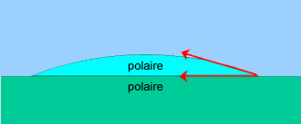
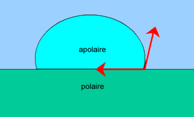
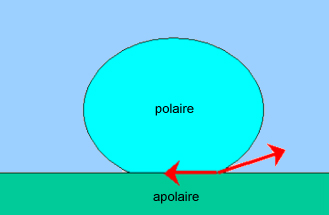
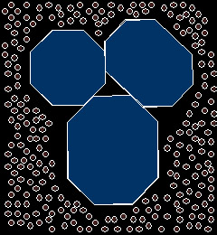
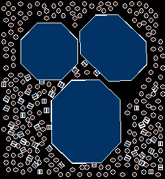
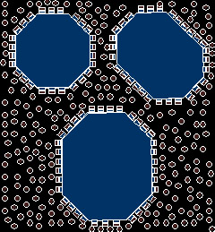

## Le mouillage pigmentaire - Chapitre XXII des Dialogues de Dotapea
### Le mouillage pigmentaire - Chapitre XXII des Dialogues de Dotapea
 Navig. page/section

[](chap21resines.html)  
[](dialoguesdotapea.html)  
[](chap23molette.html)

\_\_\_\_\_

**Pages soeurs**

[I, A propos des liants](chap01liants.html)  
[II, Bulles, siccativ., struct. élec.](chap02bullessiccativation.html)  
[III, Caséine, phosphore, dissociation](chap03caseine.html)  
[IV, Les orbitales](chap04orbitales.html)  
[V, L'aérogel](chap05aerogel.html)  
[VI, Polarisation de la lumière](chap06polaris.html)  
[VII, Sfumato et diffusion Rayleigh](chap07rayleigh.html)  
[VIII, Les interférentielles](chap08interferences.html)  
[IX, Dextrine, farine et chiralité](chap09dextrine.html)  
[X, L'ocre bleue](chap10ocrebleue.html)  
[XI, Les métamatériaux](chap11metamateriaux.html)  
[XII, Le jaunissement](chap12jaunissement.html)  
[XIII, Laser etc.](chap13laser.html)  
[XIV, L'holographie](chap14holographie.html)  
[XV, L'holographie numérique](chap15holographienum.html)  
[XVI, Extérieur, intérieur, chaux](chap16interieurexterieurchaux.html)  
[XVII, L'électrolyse et les ions](chap17electrolyseions.html)  
[XVIII, L'électricité, un peu plus loin](chap18electriciteplusloin.html)  
[XIX, Oxydation, métaux](chap19oxydationsmetaux.html)  
[XX, Les échelles](chap20echelles.html)  
[XXI, Nature et évolution des résines](chap21resines.html)  
XXII, Le mouillage pigmentaire  
[XXIII, La molette](chap23molette.html)  
[XXIV, Blanche neige](chap24blancheneige.html)  
[XXV, Lumière et matière](chap25lumiereetmatiere.html)  
[XXVI, Magnétisme](chap26magnetisme.html)  
[XXVII, Ambre et vieilles branches](chap27ambre.html)  
[XXVIII, L'origami miroir](chap28origamimiroir.html)  
[XXIX, Le feu](chap29feu.html)  
[XXX, Peau du métal](chap30peaudumetal.html)  
[XXXI, La ville en un souffle](chap31bellastock.html)  
[XXXII, Oxyder des matériaux](chap32oxydermateriaux.html)  
[XXXIII, Ocre bleue, une solution](chap33ocrebleuesimulation.html)

\_\_\_\_\_

Copyright © www.dotapea.com

Tous droits réservés.  
[Précisions cliquer ici](droitscopie.html)

**Les dialogues sur la physique-chimie  
appliquée aux arts**

**Chapitre XX****II**

**Le mouillage pigmentaire**

[](dialoguesdotapea.html#notecornelis)

dial   dial   dial

Ce chapitre est une discussion entre Jean-Claude, physico-chimiste spécialiste des propriétés optiques des matériaux hétérogènes, à qui on souhaite bienvenue aux [Dialogues de Dotapea](dialoguesdotapea.html), Jean-Louis, physico-chimiste au CNRS, et le candide, Emmanuel.

Nous commençons très fort avec Jean-Claude car il est question ici d'un sujet majeur dans le domaine des arts picturaux. Majeur et difficile : la rédaction de ce texte s'est étalée sur plus de quatre mois.

L'entrée en matière, en particulier, n'a pas été facile à mettre en place. Plus nous avancions, plus nous découvrions qu'il fallait remonter loin en amont si nous voulions rester aussi cohérents et explicites que possible. Nous avons d'ailleurs dû créer un [important document annexe](chap22momentpoles.html) tant le sujet se ramifiait. Bien sûr on n'y parvient peut-être pas autant que nous voudrions et c'est pour cette raison que ce chapitre reste ouvert à des modifications ultérieures.

Emmanuel : Jean-Louis je crois que tu veux aborder en premier lieu certaines propriétés plutôt fondamentales de la matière qui sont au coeur de ce sujet.

Jean-Louis : Oui. Aborder la question du mouillage sera plus naturel, je crois, si l'on commence par poser le problème du gras et du pas gras, de l'hydrophile et de l'hydrophobe.

Les molécules (en général, ça inclut les solvants entre eux, les liquides et les solides) peuvent être classées en fonction de leur [polarité](electronega.html#liaisonpolaire). La polarité c'est, pour simplifier un peu, la présence ou l'absence d'un moment dipolaire. Un moment dipolaire, c'est une charge + et une charge - à côté l'une de l'autre, pas au même endroit.

Plus globalement nous avons les cas suivants :

> \* les apolaires :
> 
> > \* pas de charges, pas de champ électrique,
> > 
> > \* deux charges égales et opposées au même endroit, pas de champ non plus (les deux champs s'annulent),
> 
> \* les polaires :
> 
> > \* deux charges égales et opposées très proches, existence d'un champ faible dit "dipolaire", les deux champs s'annulent "presque" car ils sont décalés.

Les molécules polaires aiment les molécules polaires, les apolaires aiment les apolaires.

Imagine un sac avec des billes de verre et des aimants. Si tu secoues un peu le sac (=agitation thermique) tu auras tous les aimants collés ensemble, et des billes sans aimants. Si tu mets un liquide polaire (= eau) dans un non-polaire (huile), le dipôle de chaque molécule d'eau va se chercher un petit copain [dipôle](dipole.html), et rapidement toutes les molécules d'eau vont se retrouver collées ensemble.

Quelques cas typiques. Polaires : eau, alcool, acétone. Apolaires : alcanes (hexane, heptane,...), benzène, éther. Si on essaie de mêler les deux, par exemple eau + hexane, ça ne se mélange pas, ça donne toutes sortes de choses généralement instables comme la vinaigrette ou le lait.

 

**Sur les concepts  
de moment et de  
polarité, lire  
le document en annexe pour  
une bonne compréhension  
de ce chapitre.**

[](chap22momentpoles.html)

**[Cliquer ici](chap22momentpoles.html)**

Si on fait maintenant interagir un solide et un liquide, on voit apparaître assez naturellement la notion de mouillage et d'angle de contact.

Une goutte d'eau pure sur une plaque de verre propre s'étale parfaitement bien. On dit que l'on a mouillage, l'angle de contact tend vers zéro. Le verre est en effet polaire, comme l'eau.



Une goutte d'huile sur une plaque de verre ne s'étale pas : liquide apolaire sur solide polaire.



Une goutte d'eau sur une plaque de paraffine solidifiée ne s'étale pas, c'est la situation inverse.



Dans ces deux derniers cas il n'y a pas mouillage, l'angle de contact est de l'ordre de 90°, voire supérieur : goutte de mercure sur une plaque de verre, quasi 180° !

**Le principe du mouillage expliqué par l'image**

Si on passe maintenant au mouillage des pigments solides par des liquides, le problème se complique car on n'a pas affaire à des surfaces lisses idéales mais à des petits grains irréguliers, et généralement pas très propres d'un point de vue physico-chimique. L'origine de ces molécules étrangère est diverse, elles sont généralement apportées par l'air ambiant. Selon sa nature propre, polaire ou non c'est-à-dire hydrophile ou hydrophobe, chaque grain de pigment aura une tendance naturelle à capter des molécules ayant la même affinité.

Ainsi une surface hydrophile poreuse sera littéralement gorgée d'eau. Cette eau absorbée sur la surface et dans les pores sera généralement très liée et quasi-impossible à extraire, sauf à employer des moyens puissants comme un chauffage au delà de 100°C, éventuellement sous vide. De la même façon, un grain de pigment apolaire (hydrophobe) n'aura aucun mal à se couvrir de "gras".

 

**Du principe à la réalité**

On comprend qu'il soit ensuite difficile de disperser un pigment polaire dans l'huile et un pigment apolaire dans l'eau. Il faudra donc, comme pour se laver les mains, utiliser un [tensioactif](tensioactivite.html) qui joue le rôle d'entremetteur et prend à sa charge les conflits d'énergies de surface. La molécule de tensioactif, un peu schizophrène avec sa partie polaire (on dit souvent "tête polaire") et sa partie hydrophobe ("queue hydrophobe") va rendre compatibles les deux espèces. La partie polaire du [surfactant](chap01liants.html#surfactant) ira par exemple s'accrocher aux molécules d'eau de la surface du pigment, laissant la partie extérieure hydrophobe libre d'interagir avec l'huile.  
 

Emmanuel : Comment est-ce que tu situes ces tensioactifs par rapport aux amphiphiles dont tu parlais dans le chapitre I ?

Jean-Louis : c'est sensiblement la même chose. Ce sont des molécules qui aiment les interfaces (_amphi-philos_).

 

Au sujet des tensioactifs, lire aussi un [passage](chap01liants.html#amphiphile) sur les « amphiphiles » _in_ chap. I, _A propos des liants_

Globalement on peut encore tourner la question autrement.

Le pigment est très souvent un solide, donc difficile à étaler.

On a depuis les origines cherché quelque chose qui facilite l'étalement (eau, graisse, huile, cire, oeuf...), qui disperse le pigment (fabrication de mélanges, couleurs plus ou moins saturées) et qui stabilise l'ensemble (une encyclopédie de stabilisants !). Après il y a le cas des pigments liquides ou solubles, mais je présume que ceux-là, on les exclut de la discussion puisque forcément, il n'y a pas mouillage s'il y a dissolution.

 

**Comment étaler le pigment, une question primordiale**

Jean-Claude [(\*)](quinoussommes.html#jeanclaude)  : Pour appréhender les processus physico-chimiques liés au mouillage, il me paraît intéressant de replacer le phénomène dans le contexte de la formulation d'une peinture.

En général, les pigments arrivent sur le site de production sous forme de poudre emballée dans des sacs dont les dimensions peuvent aller jusqu'à un mètre cube. Les distributions en taille de ces poudres sont contrôlées et garanties par les fabricants au moment de leur production. Cependant, les conditions de transport et stockage de ces sacs (pression, température, humidité) conduisent généralement à la formation d'agrégats compacts qui peuvent contenir de petits volumes d'air enfermés dans des interstices.

En absence de tensioactif (figure ci-dessous), le pigment lyophobe [\[voir plus loin\]](chap22mouillage.html#lyo) n'est que (par définition) très faiblement compatible avec le solvant dont les molécules ne parviennent pas à interagir favorablement avec la surface des particules.



En migrant aux interfaces pigments / solvant (ci-dessous), les surfactants qui possèdent une partie lyophile et une autre lyophobe, vont permettre d'activer le processus de [solvatation](diluantssolvants.html#solvatation) de chaque particule.



A l'échelle moléculaire, les surfactants créent un "pont" entre la surface du pigment et le plus gros du solvant, permettant ainsi d'abaisser [l'énergie de surface](tensioactivite.html). Le mouillage progressif de toutes les interfaces conduit à la dissociation des agrégats et le cas échéant à la libération des volumes d'air emprisonnés.



Lorsque le processus de mouillage est terminé (image ci-dessus), la présence des surfactants absorbés sur les surfaces de chaque particule permet une incorporation optimum de tous les pigments dans le solvant. Pour faciliter ce processus, le mélange (solvant + surfactants + pigments) est simultanément mélangé.

 

**L'état du pigment**

La structure des surfactants dépend du type de pigments et de la nature du solvant. Les systèmes de tensioactifs ne sont effectivement pas les mêmes pour des systèmes aqueux et des solvants organiques.

C'est d'ailleurs un problème majeur dans l'industrie des peintures où pour des raisons économiques, il est souhaitable de créer des [colorants "universels"](colorantsuniversels.html) c'est-à-dire pouvant être utilisés dans des peintures blanches à l'huile ou à l'eau et sur tous les types de pigments. Malheureusement il est difficile d'obtenir de tels colorants dans une grande gamme de couleurs car généralement les systèmes de tensioactifs fonctionnant en base aqueuse ne fonctionnent pas (ou moins bien) pour des bases organiques (et inversement).

Dans les systèmes aqueux, la partie hydrophile du tensioactif peut être [ionique](ion.html) (cationique ou anionique) alors que la partie hydrophobe est une chaîne carbonée (voir les alkyl ethercarboxylate ou les alkyl ethersulfate). Dans ce cas là je crois que l'on peut parler de [polymères](polymere.html) mêmes si le nombre de [monomères](polymere.html#monomeres) est très faible.

Jean-Louis : Beaucoup de tensioactifs ne sont pas de nature polymère et par ailleurs ils ne sont pas forcément indispensables. On peut très bien s'en passer par exemple dans la peinture à l'huile traditionnelle (huile+pigment+solvant).

Jean-Claude : D'autres points importants :

 

**Surfactants et colorants universels**

1) Le mouillage n'est que le processus précurseur à une phase plus importante qui est celle de la stabilisation des pigments qui garantira les bonnes performances de la peinture. En effet, une fois les pigments correctement mouillés, on utilise des polymères de haut poids moléculaire pour ralentir les phénomènes de [floculation](floculation.html) et de sédimentation qui sont malheureusement inévitables dans un système [colloïdal](colloide.html).

Cette stabilisation se fait par répulsions ioniques et [stériques](sterique.html) dans des bases aqueuses uniquement pour des bases organiques. Il apparaît ensuite des phénomènes de compétitivité sur les interfaces entre les différents tensioactifs présents (modificateurs [rhéologiques](rheologie.html) inclus) qui peuvent altérer la qualité de la peinture, car l'absorption étant un équilibre dynamique, un tensioactif peut en déplacer un autre.

2) Il est primordial de n'introduire que la juste quantité (ni plus ni moins) de surfactants nécessaire pour couvrir tous les pigments.

Si cette quantité est insuffisante, certaines interfaces "pigments / solvant" ne seront pas couvertes, et il restera de nombreux pigments dont la compatibilité ne sera que partielle voire totalement nulle avec le solvant.

Par contre si cette quantité est trop importante, l'excès de surfactant prendra la forme de [micelles](m.html#micelle) dont la présence peut entraîner un amoindrissement de certaines propriétés de la couche de peinture une fois appliquée. Le calcul de cette juste quantité se fait par des approches semi- empiriques.

 

**Le mouillage n'est qu'un début**

Emmanuel : Jean-Claude, tu nous parlais hors-texte d'autres concepts, la lyophilie et la lyophobie, à comparer avec l'hydrophobie et l'hydrophilie.Jean-Claude : "Lyo" provient du Grec et signifie "fluide". Par conséquent, lyophobie et lyophilie sont les termes généraux que l'on utilise pour caractériser un élément qui n'a pas d'affinité ou au contraire qui à une très forte affinité avec le milieu liquide dans lequel il est dispersé. Lorsque le milieu est de l'eau, on préfère utiliser les termes plus spécifiques et plus connus qui sont l'hydrophobie et l'hydrophilie ("hydro" signifiant "eau" en grec).  

Emmanuel : Tu esquissais aussi une approche de la question du mouillage par la compétition entre forces de cohésion et forces d'étalement. Ça fait penser au phénomène de [tensioactivité](tensioactivite.html), est-ce que cela a un rapport ?  
Peux-tu en dire un peu plus sur ces différents sujets ?

Jean-Claude : C'est plus complexe, mais en effet on peut déjà dire que le mouillage est un phénomène lié à la tensioactivité.

A partir des explications que Jean-Louis nous a données, on comprend que si l'on dépose une goutte de liquide sur une surface solide, le système peut évoluer de deux façons différentes : ou bien en s'étalant, ou bien en se "rétractant". Le sens de l'évolution du système est donné par le rapport de toutes les forces en présence.

 

**Lyo ou hydro ?**

Prenons l'exemple d'une mêlée dans un match de rugby. Au moment de l'introduction du ballon, chaque équipe pousse dans une direction opposée. Au final, la mêlée se déplacera dans le sens de la poussée la plus forte. Pour le phénomène de mouillage c'est un peu la même chose, sauf que l'origine des forces en présences n'est évidemment pas musculaire.

> \* D'un côté nous avons les forces de cohésion du liquide responsables de la tension de surface ou encore appelée énergie superficielle. Rappelons brièvement que la matérialisation macroscopique de ces forces est la résistance du fluide à augmenter l'aire de son interface avec sa phase gazeuse. Autrement dit, parce que chaque molécule est énergétiquement plus stable lorsqu'elle est entourée de ses congénères, il faut fournir de l'énergie au système si l'on veut apporter une molécule vers la surface.
> 
> \* De l'autre côté, il y a les forces d'interaction entre les molécules du solvant et les molécules se trouvant à la surface du solide. Elles ont les mêmes origines quantique et électrique que les forces de cohésion mais le fait des les distinguer au niveau macroscopique permet une meilleur compréhension du phénomène de mouillage dans sa globalité.

Maintenant, sachant que pour être à l'équilibre, l'énergie totale du système doit être minimal, deux cas peuvent se produire :

> 1) La force de cohésion du fluide est supérieure à la force d'interaction entre les molécules du fluide et les molécules de la surface. Dans ce cas, pour minimiser l'énergie totale le fluide minimisera sa surface de contact avec le solide.
> 
> 2) La force de cohésion du fluide est inférieure à la force d'interaction entre les molécules du fluide et les molécules de la surface. Dans ce cas, toujours pour minimiser l'énergie totale, les molécules de fluides voudront s'entourer d'un maximum de molécules du solide et le fluide s'étalera pour maximiser sa surface de contact. L'étalement de la goutte s'arrêtera lorsque la force de cohésion pourra de nouveau contrebalancer toutes les autres forces en présence. Il est d'ailleurs possible de calculer un coefficient d'étalement (_spreading coefficient_ en anglais) si l'on connaît la tension superficielle du fluide et l'énergie de surface du solide.

 

**Comment les forces en présence dans le fluide en modifient la forme au contact du solide**

Ce que j'ai préalablement et maladroitement appelé force d'étalement correspond en fait à ce que l'on appelle la force de montée capillaire que l'on peut observer lorsque qu'un liquide mouille les parois d'un tube. Dans ce cas la montée capillaire s'arrête lorsque la force d'interaction favorisant l'interaction entre les molécules du fluide et celle de la paroi sont contrebalancées par la force de gravité et la force de cohésion du fluide.

 

**La « force d'étalement » comme « effet capillaire »**

Il doit être bien clair que le phénomène de mouillage met en jeu l'interaction entre les molécules du liquide et les molécules se situant à la surface du solide et non celles se trouvant dans son volume. Par conséquent, comme l'a indiqué précédemment Jean-Louis, une contamination de la surface par des molécules étrangères peut altérer le rapport des forces en présences et modifier le sens de l'évolution du système. Cette extrême sensibilité à la constitution chimique de la surface pose de nombreux problèmes dans la formulation de peintures.

Prenons l'exemple du [dioxyde de titane](blancssynthetiques.html#leblancdetitane) (TiO2).


C'est le pigment le plus utilisé dans la formulation de peintures blanches. Il a l'extrême désavantage de réagir fortement aux rayonnements lumineux en libérant des électrons (effet photocatalytique). La présence de ces électrons libres favorise la création de radicaux libres (eux aussi) qui vont fragiliser le réseau tridimensionnel polymère du film de peinture.

 

**Les impuretés changent le rapport de force**

Pour limiter cet effet indésirable, les fabricants de TiO2 recouvrent la surface des pigments d'une ou plusieurs couches [d'oxyde de zinc](blancdezinc.html) (ZnO) ou / et [d'alumine](alumine.html) (Al2O3) et qui permettent de capturer les électrons libérés par le TiO2 avant qu'ils ne migrent vers la résine polymère.

 

Au sujet du pigment enrobé, lire [passage](hitechcimentautonet.html#pigmentenrobe) in _Les ciments et peintures autonettoyants_

Chaque fabriquant possède sa propre solution miracle et par conséquent l'épaisseur et la constitution chimique des couches d'additifs varient d'un fournisseurs à l'autre. Pour le formulateur de peinture c'est un casse-tête supplémentaire.

En effet si le département des achats de sa compagnie décide de changer de fournisseur de TiO2 afin de réaliser des économies d'échelle sur le prix du pigment au kilo, il y a de fortes chances pour que le système de tensioactifs permettant le mouillage ne fonctionne plus et doive être de nouveau optimisé.

 

**Problèmes concrets des mouilleurs de pigments**

Notons également que c'est l'absence de mouillage sur un substrat qui est la propriété principale que l'on cherche à maximiser dans l'élaboration de peintures anti-graffitis. L'idée est de recouvrir les surfaces à protéger d'une fine pellicule d'un matériel qui soit fortement [lyophobe](chap22mouillage.html#lyo) à tous les types de solvant présent dans les stylos ou peintures utilisés par les "tagueurs".

 

**Le mouillage n'est pas toujours recherché !**

Finalement, il est important de mentionner que pour faciliter l'explication microscopique du phénomène de mouillage, il a fallu passer sous silence la notion d'entropie qui est pourtant primordiale en physico-chimie.

En effet, les énergies d'interactions, ne sont pas les seules composantes de l'énergie totale d'un système. Il existe également un terme définit comme le produit de la température T par l'entropie S (TS ayant la dimension d'une énergie).

L'entropie est une mesure du désordre du système et la deuxième loi de la thermodynamique nous dit que la variation d'entropie va toujours en augmentant. Par exemple, on a tous déjà vu un verre chuter depuis une table et se briser en mille morceaux sur le sol. Par contre personne n'a encore jamais vu ces mêmes morceaux se rassembler spontanément pour reconstituer le verre.

Emmanuel : Il y a un autre exemple que j'aime bien aussi, même si je ne suis pas sûr de bien le restituer :

Je roule à vélo et je freine pour m'arrêter. Toute mon énergie cinétique est transformée en chaleur au niveau du patin de frein. Par contre je n'aurais jamais le moyen de transformer l'intégralité de cette énergie thermique en énergie cinétique.

J'espère que nous aurons l'occasion de revenir sous peu sur ce sujet.

 

**Nous avons fait une impasse**

[Lire le document annexe](chap22momentpoles.html)

[Chapitre suivant](chap23molette.html)


 

 [Communication](http://www.artrealite.com/annonceurs.htm)
```
title: Le mouillage pigmentaire - Chapitre XXII des Dialogues de Dotapea
date: Fri Dec 22 2023 11:26:34 GMT+0100 (Central European Standard Time)
author: postite
```
