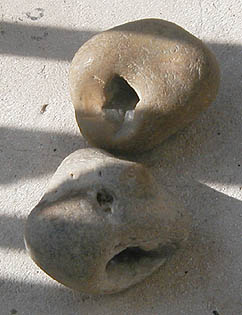

## La molette pigmentaire - Chapitre XXIII des Dialogues de Dotapea
### La molette pigmentaire - Chapitre XXIII des Dialogues de Dotapea
 Navig. page/section

[](chap22mouillage.html)  
[](dialoguesdotapea.html)  
[](chap24blancheneige.html)

\_\_\_\_\_

**Pages soeurs**

[I, A propos des liants](chap01liants.html)  
[II, Bulles, siccativ., struct. élec.](chap02bullessiccativation.html)  
[III, Caséine, phosphore, dissociation](chap03caseine.html)  
[IV, Les orbitales](chap04orbitales.html)  
[V, L'aérogel](chap05aerogel.html)  
[VI, Polarisation de la lumière](chap06polaris.html)  
[VII, Sfumato et diffusion Rayleigh](chap07rayleigh.html)  
[VIII, Les interférentielles](chap08interferences.html)  
[IX, Dextrine, farine et chiralité](chap09dextrine.html)  
[X, L'ocre bleue](chap10ocrebleue.html)  
[XI, Les métamatériaux](chap11metamateriaux.html)  
[XII, Le jaunissement](chap12jaunissement.html)  
[XIII, Laser etc.](chap13laser.html)  
[XIV, L'holographie](chap14holographie.html)  
[XV, L'holographie numérique](chap15holographienum.html)  
[XVI, Extérieur, intérieur, chaux](chap16interieurexterieurchaux.html)  
[XVII, L'électrolyse et les ions](chap17electrolyseions.html)  
[XVIII, L'électricité, un peu plus loin](chap18electriciteplusloin.html)  
[XIX, Oxydation, métaux](chap19oxydationsmetaux.html)  
[XX, Les échelles](chap20echelles.html)  
[XXI, Nature et évolution des résines](chap21resines.html)  
[XXII, Le mouillage pigmentaire](chap22mouillage.html)  
XXIII, La molette  
[XXIV, Blanche neige](chap24blancheneige.html)  
[XXV, Lumière et matière](chap25lumiereetmatiere.html)  
[XXVI, Magnétisme](chap26magnetisme.html)  
[XXVII, Ambre et vieilles branches](chap27ambre.html)  
[XXVIII, L'origami miroir](chap28origamimiroir.html)  
[XXIX, Le feu](chap29feu.html)  
[XXX, Peau du métal](chap30peaudumetal.html)  
[XXXI, La ville en un souffle](chap31bellastock.html)  
[XXXII, Oxyder des matériaux](chap32oxydermateriaux.html)  
[XXXIII, Ocre bleue, une solution](chap33ocrebleuesimulation.html)

\_\_\_\_\_

Copyright © www.dotapea.com

Tous droits réservés.  
[Précisions cliquer ici](droitscopie.html)

**Les dialogues sur la physique-chimie  
appliquée aux arts**

**Chapitre XX****III**

**La molette**

**pigmentaire**

[](dialoguesdotapea.html#notecornelis)

dial   dial   dial

Ce chapitre est une discussion entre Jean-Claude, physico-chimiste spécialiste des propriétés optiques des matériaux hétérogènes, Jean-Louis, physico-chimiste au CNRS, et le candide, Emmanuel.

Cette discussion est partie de l'intervention d'une internaute au sujet de la molette pigmentaire. Avant de commencer cette lecture il est conseillé de lire un passage de l'article consacré à la molette afin de resituer le questionnement (en particulier l'addendum). [Le passage](molette.html#liageaffine) - [L'article molette](molette.html)

Emmanuel : Jean-Louis, à ton avis, l'action de la molette peut-elle réellement relever du broyage ou bien s'agit-il de mouiller le plus intimement possible le pigment ? Ou les deux ?

Jean-Louis : Les deux, peut-être, mais je pense que c'est plus pour réduire la taille des grumeaux. Les poudres solides fines sont très réactives et les grains ont une tendance naturelle forte à se coller ensemble. Si en plus le liant est aqueux et le pigment est [hydrophile](h.html#hydrophilephobe), par exemple l'outremer, c'est accentué par les forces [capillaires](c.html#capilarite) dues à l'eau. Donc en "broyant" à la molette on désagrège et on imbibe. Si le pigment est très tendre, il est possible qu'on réduise un peu sa granulométrie, mais j'y crois pas trop.

Emmanuel : Moi non plus. Les problématiques du mouillage (lire absolument le [chapitre XXII](chap22mouillage.html)) semblent bien plus déterminantes et beaucoup plus impliquées dans ce procédé. On imagine mal de toute façon qu'un broyage manuel surpasse un broyage industriel. Il y a de quoi douter de l'aptitude d'une mollette de marbre ou de porphyre tenue par une main humaine à briser les pigments, en particulier minéraux, surtout quand ils ont une granulométrie contemporaine, c'est-à-dire déjà très fine.

La molette semble selon moi un instrument de mouillage et non de broyage. Comme il s'agit d'un objet ressemblant à un pilon, on a pu trouver des analogies agricoles ou culinaires, ce qui a pu mener à une confusion avec le broyage de grains, de matières tendres.

  
Jean-Claude : Je crois que la réponse à ta question initiale dépend de l'image que l'on a du broyage et donc de la définition que l'on veut bien lui donner.

D'abord il faut prendre en compte le fait que les pigments [inorganiques](organiquesvsinorganiques.html#inorganique) ont des tailles de cristaux intrinsèques qui dépendent du procédé chimique d'obtention.

**Mouillage ou broyage ?**

Ensuite que cette poudre est constitué d'agglomérats et d'agrégats. Les premiers sont liés par de faibles forces, donc faciles à rompre alors que les deuxièmes sont liés par des liaisons fortes qu'il est à mon avis difficile voire impossible de rompre avec une molette.

Donc, la réponse dépend de la conception du broyage comme fragmentation des agglomérats ou bien des agrégats.

Il faut aussi à mon avis insister sur le fait que la rupture des agglomérats et le mouillage sont deux mécanismes liés dans un même cycle. Lorsque les agglomérats sont rompus sous l'effet d'une force mécanique, la surface totale en pigment augmente. Une plus grande surface accessible aux liant et additifs permet une meilleure humectation. Et finalement une meilleure humectation facilite la rupture des agglomérats.

Donc finalement, l'utilisation de la molette entraînerait deux effets :

> \* briser les agglomérats et peut-être une partie des agrégats en  utilisant la force mécanique qui varie en fonction de la forme de  l'outil.  
> \* permettre une meilleure humectation des pigments.

 

**Agglomérats et agrégats**

sur les agrégats, lire aussi [passage](pateschargesagreg.html#agregats) in _Pâtes, charges et agrégats_.

Un exemple d'agrégat (certes de grande taille) est un caillou.



[Chapitre suivant](chap24blancheneige.html)


 

 [Communication](http://www.artrealite.com/annonceurs.htm)
```
title: La molette pigmentaire - Chapitre XXIII des Dialogues de Dotapea
date: Fri Dec 22 2023 11:26:34 GMT+0100 (Central European Standard Time)
author: postite
```
