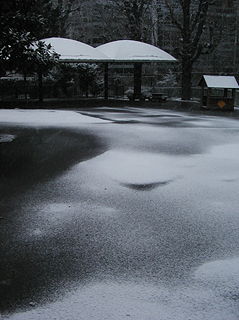

## Blanche neige - Chapitre XXIV des Dialogues de Dotapea
### Blanche neige - Chapitre XXIV des Dialogues de Dotapea
 Navig. page/section

[](chap23molette.html)  
[](dialoguesdotapea.html)  
[](chap25lumiereetmatiere.html)

\_\_\_\_\_

**Pages soeurs**

[I, A propos des liants](chap01liants.html)  
[II, Bulles, siccativ., struct. élec.](chap02bullessiccativation.html)  
[III, Caséine, phosphore, dissociation](chap03caseine.html)  
[IV, Les orbitales](chap04orbitales.html)  
[V, L'aérogel](chap05aerogel.html)  
[VI, Polarisation de la lumière](chap06polaris.html)  
[VII, Sfumato et diffusion Rayleigh](chap07rayleigh.html)  
[VIII, Les interférentielles](chap08interferences.html)  
[IX, Dextrine, farine et chiralité](chap09dextrine.html)  
[X, L'ocre bleue](chap10ocrebleue.html)  
[XI, Les métamatériaux](chap11metamateriaux.html)  
[XII, Le jaunissement](chap12jaunissement.html)  
[XIII, Laser etc.](chap13laser.html)  
[XIV, L'holographie](chap14holographie.html)  
[XV, L'holographie numérique](chap15holographienum.html)  
[XVI, Extérieur, intérieur, chaux](chap16interieurexterieurchaux.html)  
[XVII, L'électrolyse et les ions](chap17electrolyseions.html)  
[XVIII, L'électricité, un peu plus loin](chap18electriciteplusloin.html)  
[XIX, Oxydation, métaux](chap19oxydationsmetaux.html)  
[XX, Les échelles](chap20echelles.html)  
[XXI, Nature et évolution des résines](chap21resines.html)  
[XXII, Le mouillage pigmentaire](chap22mouillage.html)  
[XXIII, La molette](chap23molette.html)  
XXIV, Blanche neige  
[XXV, Lumière et matière](chap25lumiereetmatiere.html)  
[XXVI, Magnétisme](chap26magnetisme.html)  
[XXVII, Ambre et vieilles branches](chap27ambre.html)  
[XXVIII, L'origami miroir](chap28origamimiroir.html)  
[XXIX, Le feu](chap29feu.html)  
[XXX, Peau du métal](chap30peaudumetal.html)  
[XXXI, La ville en un souffle](chap31bellastock.html)  
[XXXII, Oxyder des matériaux](chap32oxydermateriaux.html)  
[XXXIII, Ocre bleue, une solution](chap33ocrebleuesimulation.html)

\_\_\_\_\_

Copyright © www.dotapea.com

Tous droits réservés.  
[Précisions cliquer ici](droitscopie.html)

**Les dialogues sur la physique-chimie  
appliquée aux arts**

**Chapitre XX****IV**

**Blanche neige**

[](dialoguesdotapea.html#notecornelis)

dial   dial   dial

Ce chapitre est une discussion entre Jean-Louis, physico-chimiste au CNRS, et le candide, Emmanuel.

Un texte très court sur une question toute naturelle pour un hiver 2008-2009 un peu plus frais que les précédents. N'hésitez pas à nous poser des questions complémentaires.

Emmanuel : Je viens de prendre une pause sur le balcon, entre terre et ciel si l'on peut dire, et quelque chose m'a frappé : le blanc de la neige au sol semblait presque plus lumineux que le ciel (gris). J'imagine bien sûr que la neige n'est pas une source de lumière, mais comment parvient-elle à la concentrer et la restituer de manière si intense ?

Par curiosité j'ai pris un flacon de pigment [blanc de lithopone](lithopone.html) (faute de retrouver mon [titane](blancssynthetiques.html#leblancdetitane)) et j'ai comparé sa luminosité. Il était terne. Avec le blanc de titane (finalement retrouvé) c'était beaucoup plus proche mais la neige semblait bleue en comparaison. C'est peut-être l'explication de cette impression de luminosité. Un blanc bleuté semble illuminer davantage.  
Qu'en penses-tu ?

**La neige est bleue**

Jean-Louis : J'imagine que le pouvoir réfléchissant de la neige vient de plusieurs choses :  
 

1.  d'une part elle n'est blanche que par diffusion, à cause des variations locales de [l'indice de réfraction](refraction.html#refraction) (d'où l'aspect bleuté, d'ailleurs, c'est typique). Il n'y a aucune absorption et toute la lumière qui y entre ressort.  
     
2.  ensuite comme il y a beaucoup d'air, ce n'est pas seulement la couche superficielle qui renvoie de la lumière, comme avec ton pigment opaque, mais toute une épaisseur.  
     
3.  enfin, je pense que la surface des cristaux est lisse et donc réfléchit bien, alors que ton blanc de titane a sûrement une surface rugueuse.  
    La lithopone n'est pas un bon pigment, c'est juste une charge.  
     

Emmanuel : Donc l'aspect bleuté, c'est encore [l'effet Rayleigh](chap07rayleigh.html) si je comprends bien. La neige est un "matériau diffusif".

Je serai un petit peu moins sévère que toi concernant le blanc de lithopone. Certes ce n'est pas un grand pigment, il coûte même un petit peu cher au regard de son [facteur couvrant](pigments.html#1facteurcouvrantopposetransparence) (probablement à cause du [blanc de zinc](blancdezinc.html) qu'il contient), mais il est stable s'il est de bonne facture.

Si dans la neige toute la lumière qui entre ressort, on voit mal un pigment la concurrencer vraiment. La diffusion n'est accessible dans les arts plastiques que par certains glacis, les verres, certaines résines et des [métamatériaux](chap11metamateriaux.html) tels que [l'aérogel](chap05aerogel.html). Très présente dans la nature, elle n'est qu'assez peu exploitée en peinture ou en sculpture. Et pourtant la neige comme le ciel nous rappellent l'originalité et la puissance de ce phénomène.

 



[Chapitre suivant](chap25lumiereetmatiere.html)


 

 [Communication](http://www.artrealite.com/annonceurs.htm)
```
title: Blanche neige - Chapitre XXIV des Dialogues de Dotapea
date: Fri Dec 22 2023 11:26:34 GMT+0100 (Central European Standard Time)
author: postite
```
