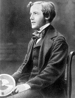

## Une évanescence ? in chapitre XXV des Dialogues de Dotapea
### Une évanescence ? in chapitre XXV des Dialogues de Dotapea
   

**1\. Une évanescence ?**

dial   dial   dial

Cette page qui fait partie du [chapitre XXV](chap25lumiereetmatiere.html) est une discussion entre Jean-Claude, physico-chimiste spécialiste des surfaces picturales, Jean-Louis, physico-chimiste (CNRS), et Emmanuel, candide.

Cette page tente d'illustrer comment, à partir de points de vue scientifiques, on en vient très vite aux conséquences dans l'univers pigmentaire.

Commençons par une précision apportée par Jean-Claude à un [passage](chap06polaris.html#transverse) du chapitre VI, « La polarisation de la lumière », lié à la nature transversale de la lumière.

Faisons à cette occasion un court rappel vidéo sur la manière dont la lumière traverse l'espace. Cliquer sur l'image. C'est un simple schéma animé de quelques secondes.

> [](players/propalumiere/index.html)

Jean-Claude nous explique ici - et ce thème reviendra sous d'autres angles dans ce chapitre - qu'une onde électromagnétique pourrait ne pas être uniquement « transverse ».

Et de fournir quelques explications.

Jean-Claude : Dans l'électromagnétisme classique la propagation de la lumière dans un matériau est gouvernée par les équations de Maxwell et les relations de constitution. Ces relations imposent, entre autres, aux champs électriques et magnétiques d'être transverses \[soit perpendiculaires, cf. animation ci-dessus, ndlr\] à la direction de propagation de la radiation.

Cependant, d'après la recherche bibliographique que j'ai effectuée, il semblerait qu'il existe différentes situations qui pourraient contredire cette exclusive transversalité des ondes électromagnétiques :

> \* la théorie quantique des champs prédirait en effet la présence de champs [longitudinaux.](chap06polaris.html#longitudinales) Cette contradiction avec les résultats des [équations de Maxwell](chap25evanescence.html#equationsmaxwell) serait résolue en considérant que ces ondes longitudinales n'ont pas de réalité physique mais qu'elles doivent être prises en compte dans le formalisme mathématique.
> 
> **Note**  
>   
> Ce type de démarches n'est pas unique en physique. Par exemple il existe une approche de l'électromagnétisme classique qui consiste à introduire la notion de charge magnétique libre de manière à rendre symétrique l'écriture des équations de Maxwell : une sorte de "dualité électrique / magnétique" \[la question récurrente de la symétrie sera abordée au fil de ce chapitre, notamment [ici](chap25symetrie.html)\]. Cependant cette idée séduisante en reste au formalisme mathématique car de telles "charges magnétiques" _(monopôles_ [\[1\]](chap25evanescence.html#note1)_)_ n'ont jamais été observées.
> 
> **\*\*\***
> 
> \* Dans un [colloïde](colloide.html), la moyenne sur tout l'espace des charges superficielles induites sur la surface des particules pourrait engendrer des ondes longitudinales.
> 
> \* dans le cas des [métaux](metal.html) et pour un vecteur de faible longueur d'onde, la réponse optique devient non-locale et là aussi il y aurait la possibilité d'exciter des ondes longitudinales.
> 
> \* Finalement, la théorie classique de la diffusion de la lumière par un objet de forme quelconque dont les dimensions sont de l'ordre de grandeur de la longueur d'onde de la radiation incidente, montre que le champ diffusé possède une composante longitudinale non négligeable, en plus de la composante transverse habituelle. Cependant, elle disparaît d'autant plus rapidement que l'on s'éloigne de la particule.

**Maxwell**

**Deux mots sur un génie moderne**

Les équations de James Clerk Maxwell sont une description de l'univers électromagnétique qui date de 1864, donc d'avant la relativité, la physique quantique, etc.

Elles ne sont pas la seule contribution de ce grand savant puisque sans ses travaux sur la TSF et sur l'ensemble du thème énergie, information et « feedback », notre monde ne ressemblerait sans doute pas à ce qu'il est. En théorie, sans Maxwell, ni télé ni ordinateur.



**\*\*\***

**Les équations de Maxwell**

Les équations de Maxwell sous leur représentation différentielle sont des équations aux dérivées partielles des variables d'espace et de temps des champs électrique et magnétique microscopiques, présents dans un milieu quelconque. Celui-ci peut être le vide, un matériau homogène ou hétérogène, linéaire ou non linéaire, isotrope ou anisotrope. 

Cependant, seules deux des quatre équations de Maxwell sont indépendantes. Pour déterminer complètement les quatre vecteurs, il est nécessaire d'introduire deux équations supplémentaires. Ce sont les relations de constitution qui caractérisent le milieu de propagation.

De curieux champs longitudinaux

On retrouve ce genre de situations dans l'interaction entre les poussières interstellaires et le rayonnement cosmique ou encore des pigments colorés dispersés dans la matrice polymère d'une peinture.

La présence de cette composante transverse en champ proche peut être interprétée de deux manières.  
D'abord sous un angle mathématique/technique en rappelant que les équations de Maxwell \[[voir encadré](chap25evanescence.html#equationsmaxwell)\] stipulent que c'est la divergence du champ électrique qui doit être égale à la densité de charges électriques et non explicitement que le champ électrique doit être transverse. Par conséquent, la présence de la composante longitudinale ne contredit pas les relations de Maxwell.

Ensuite avec une analyse plus physique du phénomène en considérant que la composante longitudinale serait la résultante de l'onde évanescente crée par les charges induites présentes dans la particule diffusante.  

Cependant, je suis loin d'être un expert dans ces domaines et peut être qu'un lecteur documenté pourrait apporter un commentaire.

[\[nous écrire\]](ecrire.html)

Sur le même sujet lire aussi

_Lumière, chats et miroirs_ dans le même chapitre

[lien](chap25lumierechatsmiroirs.html)

Emmanuel : Jean-Claude tu disposes d'une expertise sur ce sujet très compliqué qu'est le comportement de l'interaction électromagnétique en champ proche ou relativement proche, en particulier dans le domaine pigmentaire, pictural.

Quelle est au juste la prévisibilité de ces phénomènes ?

Pour en revenir aux arts plastiques

Jean-Claude : Les théories actuelles permettent de prédire assez correctement les propriétés optiques d'un milieu hétérogène lorsque la concentration volumique en pigments reste faible car on peut considérer que ceux-ci sont situés dans une zone de champ lointain les uns par rapport aux autres. Les champs sont alors approximés par des ondes sphériques transverses.

Tant que les ondes sont transverses, on reste dans un modèle classique...

Lorsque la fraction volumique en pigment augmente comme par exemple dans des peintures blanches fortement chargées en [oxyde de titane](blancssynthetiques.html#leblancdetitane) la distance entre particules devient très petite. Dans ce cas chaque pigment « voit » la composante en champ proche des pigments qui l'entoure. Ce cas est beaucoup plus problématique. Mais il n'est pas non plus très clair si la difficulté provient de la forme complexe du champ, ou de la nécessité de prendre en compte la diffusion multiple.

[](blancssynthetiques.html#leblancdetitane)

...mais quand le matériau nous ramène au champ proche...

Emmanuel : Jean-Louis et toi, vous m'avez averti hors-texte que ce sujet est à la fois très en pointe et très difficile. Il ouvre sur une multitude de sujets où apparemment la science n'a pas fini son exploration.

  
Avant d'aller plus loin dans ce chapitre, peut-on dire que les théories, qui s'opposent quant aux échelles qu'elles concernent, sont toutes fausses ? N'a-t-on pas besoin de synthèse ou d'unification et cela correspond-il à un nouvel axe de la recherche contemporaine ?

Jean-Claude : Je ne crois pas. Rien a voir avec la tentative d'unification des lois de la physique, de l'infiniment grand et de l'infiniment petit.

Je ne dirais pas que les théories sont fausses. Elles représentent à mes yeux une tentative de modélisation de la réalité, qui tient compte du développement des connaissances scientifiques du moment. Chaque modèle possède un domaine d'application. Il faut juste avoir conscience des limites de ces modèles quand ont veut les utiliser.

Jean-Louis : Je suis d'accord avec Jean-Claude. Les théories sont ce qu'elles sont, elles ont toutes un domaine d'application. Il y a des tournevis pour les horlogers et des tournevis pour les garagistes. Chaque outil est adapté à ce qu'il doit faire. Les études actuelles en champ proche ne résultent pas d'un désir - inaccessible et inutile - d'unification mais sont motivées par des problèmes expérimentaux nouveaux. 

[Suite](chap25formesmotsechelles.html)

\_\_\_\_\_

\[1\] On dit parfois _unipôles_.

Pour revenir au corps du texte, cliquez sur le bouton "Précédent" de votre navigateur

Mesure des théories


 

  [Communication](http://www.artrealite.com/annonceurs.htm)
```
title: Une évanescence ? in chapitre XXV des Dialogues de Dotapea
date: Fri Dec 22 2023 11:26:34 GMT+0100 (Central European Standard Time)
author: postite
```
