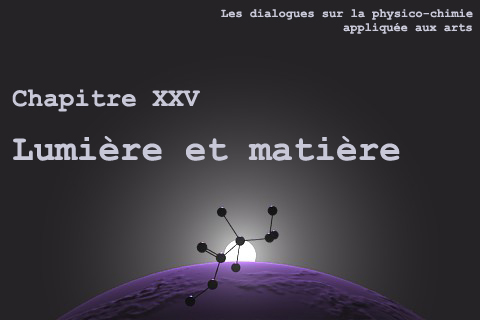
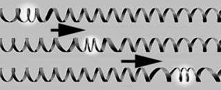
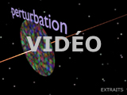

## Formes, mots et échelles in chapitre XXV des Dialogues de Dotapea
### Formes, mots et échelles in chapitre XXV des Dialogues de Dotapea
   

**2\. Formes, mots et échelles**

dial   dial   dial

Cette page qui fait partie du [chapitre XXV](chap25lumiereetmatiere.html) est une discussion entre Jean-Louis, physico-chimiste (CNRS), et Emmanuel, candide.

Emmanuel : Jean-Louis, les termes employés dans ce domaine posent un problème : ils semblent entrer fortement en conflit au niveau du sens avec les définitions académiques. Pourtant ils sont ici très précis. Peux-tu revenir sur le concept d'onde pour en venir à ceux d'onde transverse, d'onde plane et d'onde longitudinale ?

Jean-Louis : Une onde c'est une perturbation. Electrique, mécanique, magnétique, ce que tu veux. Elle se propage, sur son passage le milieu est temporairement perturbé, hors de son équilibre.

L'ensemble des points de l'espace qui subissent cette perturbation à un instant t définit " le front d'onde". Il peut avoir de une à trois dimensions.

Si l'ensemble des "points perturbés à un instant t" est un plan, l'onde est dite "plane". Si l'ensemble des points perturbés à un instant t est une sphère (au sens mathématique, c'est-à-dire une surface, pas un volume), l'onde est sphérique.

  
En tout point on peut définir une direction de propagation pour l'onde. Si la perturbation est parallèle à cette direction locale, l'onde est longitudinale.

Exemple d'onde longitudinale, un simple ressort à boudin :



  
Si l'onde est unidimensionnelle et longitudinale, elle perturbe le milieu selon cette même ligne. Si c'est une onde plane, elle perturbe le milieu en avant et en arrière de ce plan, si c'est un onde sphérique, la perturbation est perpendiculaire à la surface de la sphère, en avant et en arrière.

  
Si la perturbation est perpendiculaire à la direction locale, l'onde est transverse.

Emmanuel : On en revient à notre schéma animé pour la deuxième fois.

[](players/propalumiere/index.html) 

Jean-Louis : Pour les particules de colorants, on attendrait une onde transverse donc en principe aucune composante radiale \[ndlr : aussi bien, longitudinale\]. Le fait d'avoir quand même une composante radiale implique que l'onde n'est pas purement transverse.

Quelques définitions.

En complément lire l'article consacré à _l'onde_

[Cliquer ici](onde.html)

Autre complément très important, le [chapitre XXX](chap30peaudumetal.html), _La peau du métal_

Selon l'étude de D. Courjon et C. Bainier [\[1\]](chap25formesmotsechelles.html#note1), pour une lumière à 632nm (rouge), ça n'est vrai que si tu es à moins de 100nm du dipôle. Après, c'est purement transverse. Ils indiquent en outre que dans ces conditions de "champ proche", on n'a pas d'onde propagative.

  
Il s'agit donc bien de conditions très particulières. La lumière est bien une onde propagatrice à polarisation transversale dans 99,99% des cas.

Emmanuel : Est-ce que tu veux dire qu'à ces distances "transitionnelles", très très courtes, on n'est plus du tout en présence du même phénomène ?

 

Mesure des aires concernées par les deux types d'ondes

Jean-Louis : Toutes les théories sont des approximations de la réalité. On a donc des théories adaptées aux petites distances et des théories adaptées aux grandes distances. Depuis la Terre, les rayons du soleil paraissent parallèles. Près du Soleil, ils ne le semblent évidemment plus.

De toutes façons, il faut bien être conscient du fait que l'on ne sait toujours pas ce que c'est qu'un photon et que les théories sont adaptées à l'usage que l'on veut en faire. Le [magnétisme](chap26magnetisme.html) par exemple est un phénomène PUREMENT relativiste. Si on considère l'absorption de la lumière, ce ne sont plus des ondes mais des particules et des probabilités.

[Suite](chap25symetrie.html)

\_\_\_\_\_

\[1\] "Nier field microscopy and nier field optics", URA 214 CNRS, Université de Franche-Compté, Besançon, France, 1994, p. 1001

Pour revenir au corps du texte, cliquez sur le bouton "Précédent" de votre navigateur

 

Mesure des théories

 


 

  [Communication](http://www.artrealite.com/annonceurs.htm)
```
title: Formes, mots et échelles in chapitre XXV des Dialogues de Dotapea
date: Fri Dec 22 2023 11:26:35 GMT+0100 (Central European Standard Time)
author: postite
```
