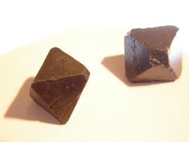
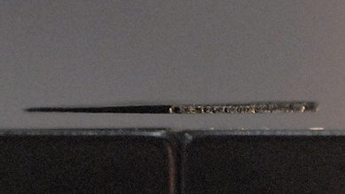

## Magnétisme - Chapitre XXVI des Dialogues de Dotapea
### Magnétisme - Chapitre XXVI des Dialogues de Dotapea


**Pages soeurs**

[I, A propos des liants](chap01liants.html)  
[II, Bulles, siccativ., struct. élec.](chap02bullessiccativation.html)  
[III, Caséine, phosphore, dissociation](chap03caseine.html)  
[IV, Les orbitales](chap04orbitales.html)  
[V, L'aérogel](chap05aerogel.html)  
[VI, Polarisation de la lumière](chap06polaris.html)  
[VII, Sfumato et diffusion Rayleigh](chap07rayleigh.html)  
[VIII, Les interférentielles](chap08interferences.html)  
[IX, Dextrine, farine et chiralité](chap09dextrine.html)  
[X, L'ocre bleue](chap10ocrebleue.html)  
[XI, Les métamatériaux](chap11metamateriaux.html)  
[XII, Le jaunissement](chap12jaunissement.html)  
[XIII, Laser etc.](chap13laser.html)  
[XIV, L'holographie](chap14holographie.html)  
[XV, L'holographie numérique](chap15holographienum.html)  
[XVI, Extérieur, intérieur, chaux](chap16interieurexterieurchaux.html)  
[XVII, L'électrolyse et les ions](chap17electrolyseions.html)  
[XVIII, L'électricité, un peu plus loin](chap18electriciteplusloin.html)  
[XIX, Oxydation, métaux](chap19oxydationsmetaux.html)  
[XX, Les échelles](chap20echelles.html)  
[XXI, Nature et évolution des résines](chap21resines.html)  
[XXII, Le mouillage pigmentaire](chap22mouillage.html)  
[XXIII, La molette](chap23molette.html)  
[XXIV, Blanche neige](chap24blancheneige.html)  
[XXV, Lumière et matière](chap25lumiereetmatiere.html)  
XXVI, Magnétisme  
[XXVII, Ambre et vieilles branches](chap27ambre.html)  
[XXVIII, L'origami miroir](chap28origamimiroir.html)  
[XXIX, Le feu](chap29feu.html)  
[XXX, Peau du métal](chap30peaudumetal.html)  
[XXXI, La ville en un souffle](chap31bellastock.html)  
[XXXII, Oxyder des matériaux](chap32oxydermateriaux.html)  
[XXXIII, Ocre bleue, une solution](chap33ocrebleuesimulation.html)

\_\_\_\_\_

Copyright © www.dotapea.com

Tous droits réservés.  
[Précisions cliquer ici](droitscopie.html)

**Les dialogues sur la physique-chimie  
appliquée aux arts**

**Chapitre** **XXVI**

**Magnétisme**

[](dialoguesdotapea.html#notecornelis)

dial   dial   dial

Ce chapitre est une discussion entre Jean-Louis, physico-chimiste au CNRS, et Emmanuel, candide.

Accès direct

magnétisme et arts plastiques

[Cliquer ici](chap26magnetisme.html#artsplastiques)

Emmanuel : Il est semble-t-il plutôt difficile de comprendre ce qu'est le magnétisme. Même l'Académie semble avoir quelques difficultés :

> \* "_Magnétisme. (...) PHYS. Ensemble des phénomènes propres aux matériaux aimantés._"
> 
> \* "_Aimanter. (...) Donner à un corps les propriétés d'un aimant._"
> 
> \* "_Aimant. (...) Corps possédant un champ magnétique extérieur (...)_"

Une belle boucle pour un phénomène banal. Banal mais lorsque l'on interroge son entourage ou les dictionnaires, on s'aperçoit que personne n'y comprend goutte, moi compris.

Une définition difficile et beaucoup d'errances

Autre exemple. Devant un public conséquent massé à la Salpetrière, à Paris, le professeur Charcot (1825-1893) s'est dit capable de modifier le comportement de ses patientes hystériques sous hypnose à l'aide d'un aimant [\[1\]](chap26magnetisme.html#notecharcot). Aimant, mot dont l'étymologie, selon l'Académie française, est un simple participe présent du verbe aimer.

On a donc dit un peu n'importe quoi sur le sujet, c'est le propos de ce préambule. Mais que peut-on avancer plus sérieusement sur le magnétisme aujourd'hui Jean-Louis ?

Jean-Louis : Le magnétisme est un effet purement relativiste qui stipule que toute particule chargée qui se déplace produit un champ magnétique. Les électrons qui tournent dans une bobine produisent donc un champ magnétique. Les électrons qui tournent dans les atomes aussi.


Une leçon clinique à la Salpêtrière

André Bouillet, 1887

> Emmanuel : Est-ce que dans le principe c'est comme les vases communicants ? Soit l'immobilité, soit le magnétisme mais pas les deux ensemble ?
> 
> Jean-Louis : Comme toujours, oui et non. Les particules peuvent posséder un moment magnétique intrinsèque qu'on appelle "spin". Un électron au repos possède un [moment](chap22momentpoles.html#moment) magnétique. Initialement on pensait que ce moment venait de ce que l'électron était une petite boule chargée électriquement qui tournait rapidement sur elle même (_to spin_, en anglais) et que cette rotation créait un champ magnétique. Non seulement c'est faux, mais une particule sans charge comme le neutron possède aussi un moment magnétique.
> 
> C'est intrinsèque, c'est quantique, et on sait pas trop pourquoi. Sinon, oui, pour créer un champ magnétique au sens usuel, il faut une charge en mouvement.

  
Spin et moment magnétique

> Et les aimants ? Eh bien les charges en mouvement ce sont les électrons qui tournent autour des noyaux dans la matière de l'aimant.

**Les aimants**

Emmanuel : Dans les [liaisons métalliques](liaisons.html#metalliques), les électrons circulent autour d'un grand nombre de noyaux. Est-ce ce vaste mouvement qui rend ce type de matériaux "aimantés" et qui fait que l'aimantation demeure un phénomène assez durable ?Jean-Louis : Ce ne sont pas les mêmes électrons qui sont responsables de la conduction métallique et du magnétisme. Les uns sont effectivement délocalisés, les autres restent sur leur atome. Il existe cependant une forme spéciale de magnétisme où les électrons mobiles "transportent" l'information magnétique d'atome à atome mais c'est un peu compliqué.

Après, tu as aussi le magnétisme "purement quantique" qui te dit que les particules qui ont un spin multiple de 1/2 ont un [moment](chap22momentpoles.html) magnétique intrinsèque (protons, neutrons...) \[[lien](http://www-phlam.univ-lille1.fr/pub/f/themas/spec/copdil/le_spin.htm) sur le site de l'université de Lille\]. En ce qui me concerne je n'ai jamais compris d'où ça vient, et je ne dois pas être le seul...

Emmanuel : Mais quand même, quel est le rapport avec la relativité ?

Est-ce que tu emploies ce mot pour marquer une distinction entre relativité et physique quantique ?

Jean-Louis : L'apparition du magnétisme est une conséquence des équations de la relativité. Ca vient "naturellement". Si on n'avait pas connu le magnétisme avant d'inventer la théorie de la relativité, cette théorie aurait permis sa prédiction. Comme les [équations de Maxwell](chap25evanescence.html#equationsmaxwell) ont prédit les ondes radio avant qu'on ne les découvre.

**Bosons et fermions**

Emmanuel : L'histoire du spin multiple de 1/2, est-ce que ça n'a pas un rapport avec la distinction entre bosons et fermions ?

Jean-Louis : Oui, oui. Les bosons ne peuvent pas avoir de moment magnétique. \[sur le concept de moment, lire [l'annexe](chap22momentpoles.html) au chapitre XXII\]

**Magnétites**



Monocristal naturel de magnétite - taille environ 15mm

La magnétite magnétique, celle dont le magnétisme est assez fort pour attirer des objets ou faire des boussoles, a sans doute été magnétisée par la foudre. Le champ terrestre est vraiment trop faible, même si il aimante les roches, c'est un effet mesurable mais peu visible.

Pour tous les aimants, il existe une température limite dite "température de Curie" au delà de laquelle ils se désaimantent si on les chauffe. Tous les aimants sont cristallins (polycristallins), c'est indispensable. Un monocristal ne retient pas l'aimantation, sauf dans un domaine de tailles très précis, ni trop gros ni trop petit. Les octaèdres de la photo sont attirés pas les aimants mais ne conservent pas d'aimantation. Trop gros.

Un aimant est constitué de petits domaines micrométriques (domaines de Weiss) séparés par des parois (parois de Bloch). Dans un matériau polycristallin non magnétisé les domaines sont orientés dans tous les sens, donc pas de résultante magnétique globale. Si on aimante le matériau, on déplace les parois, certains domaines grandissent, d'autres diminuent, et au final le matériau se magnétise dans la direction du champ appliqué.


Polycristal naturel de magnétite (poli) - 30x10mm

Lire aussi ci-dessous [Les ferrofluides](chap26magnetisme.html#ferrofluides).

Emmanuel : J'ai lu plusieurs textes pas terribles, enfin j'en ai tiré des impressions vagues. Au résultat est-ce que je dis une sottise énorme si je propose qu'un boson (spin entier) est un agent d'échange là où les fermions (spin demi-entier) sont plutôt passifs ?

Jean-Louis : Je crois en effet que tous les médiateurs d'interactions sont des bosons. Mais c'est pas mon domaine...

> Emmanuel : Il y a les bosons et les fermions. En apparence les uns sont massifs, les autre guère, les uns ont un spin de x\*0,5, les autres non, du coup certains engendrent des forces magnétiques qui orientent des mouvements autour d'eux dès qu'ils bougent alors que les autres ne le peuvent pas, bien qu'ils soient beaucoup plus rapides, parce qu'ils sont trop légers.
> 
> Est-ce que l'on peut raisonnablement décrire un monde en partant de ce genre de bases ? Ce serait d'une simplicité séduisante.
> 
> Jean-Louis : Et ben non ma bonne dame. Il y a des fermions lourds et légers, des bosons massifs et ténus. Et comme dit, aucune particule ne peut tout faire. Pour créer un champ électromagnétique les fermions "électrons" utilisent des bosons "photons".
> 
> Emmanuel : Rien n'est simple.

(Jean-Louis - suite)

C'est tout le mystère des "champs". Un champ c'est une modification de l'espace-temps qui fait que les objets présents y subissent des forces. C'est modélisé mais on ne sait pas ce que c'est. Au sens strict un champ magnétique ne peut pas mettre un objet en mouvement. Il peut seulement dévier la trajectoire d'une particule chargée qui est déjà en mouvement. Les gradients de champ magnétique (i.e. les champs magnétiques inhomogènes) peuvent, eux, mettre des objets en mouvement.

Emmanuel : Je n'ai pas bien compris ce qu'est un champ magnétique inhomogène et nous y reviendrons j'espère car il y a peu d'informations claires sur le web. Au-delà pour tenter une mise en perspective, est-ce que le fait de "tirailler" les électrons suffit à déplacer tout un atome, toute une molécule ?

  
Jean-Louis : Ca dépend comment tu tires et sur quoi tu tires. Tu as tous les cas de figure entre "le noyau suit les électrons" et "le noyau regarde partir les électrons sans bouger".

> Emmanuel : Je trouve très intéressant ce lien que tu fais avec le moment, l'impulsion, dont nous avons déjà eu l'occasion de parler et qui semble un concept plutôt primordial semble-t-il ([lien](chap22momentpoles.html#moment)).
> 
> Donc le magnétisme, cela ne fait pas bouger mais ça oriente. Sauf quand les champs ne sont pas homogènes. Est-ce que tu peux donner un exemple s'il te plaît ?
> 
> Jean-Louis : Un aimant permanent crée un champ inhomogène. Donc si tu approches un trombone ou un autre aimant, tu peux les mettre en mouvement, il y a attraction ou répulsion. Les champs magnétiques homogènes ne sont pas répandus dans la vie courante, de même que les particules chargées en mouvement... J'ai pas vraiment d'exemple.

L'hétérogénéité du champ est la condition nécessaire pour la mise en mouvement

> Emmanuel : Plus globalement, dans le chapitre XX ([lien](chap20echelles.html#electrostatique)) tu décris les forces [électrostatiques](electricite.html#electrostatique) comme très puissantes et tu dis qu'elles sont une force de cohésion indispensable car ce sont elles qui attirent les électrons vers le noyau, mais finalement, comparativement, quel est le rôle du magnétisme ?
> 
> Jean-Louis : Au niveau "structure et cohésion de la matière", je ne crois pas que les forces magnétiques jouent un rôle majeur. Comme il s'agit en quelque sorte d'un effet relativiste secondaire, le magnétisme a une influence, mais ce n'est pas une force "fondamentale". J'espère ne pas dire de bêtise. Le magnétisme joue par contre un rôle majeur dans beaucoup de phénomènes astrophysiques (étoiles, trous noirs,...). Même au niveau de notre Terre, je crois les transitions magnétiques de certains matériaux du coeur jouent un certain rôle, mais je ne suis pas géologue.

Impact du magnétisme

Emmanuel : La conclusion de ce chapitre se fera naturellement sur les possibilités plastiques du magnétisme, en commençant par une autre contribution de Jean-Louis, ci-dessous.



Il s'agit d'une plaque de graphite diamagnétique en lévitation au-dessus de plusieurs aimants puissants. Un tel phénomène peut être considérablement accentué par l'emploi de supraconducteurs.

Ces mots (diamagnétique [\[2\]](chap26magnetisme.html#notediamagnetisme), supraconducteur [\[3\]](chap26magnetisme.html#notesupraconducteurs)) et cette image, exemple parmi d'autres de possibilités d'agir sur la matière, illustrent le fait que l'artiste qui souhaite accroître ses capacités de réalisation formelle doit soit apprendre à manipuler des concepts physiques auxquels il est le plus souvent étranger, soit dialoguer avec des personnes qui ont ces connaissances, ce que nous faisons ici en souhaitant susciter au sein du public le même type de démarches.

Les connaissances sur le magnétisme ont longtemps balbutié, on l'a dit en début d'article, mais il s'agit quand même d'un phénomène assez bien connu aujourd'hui.  
Malheureusement, soit on le perçoit comme un jeu, un "gadget", soit comme un phénomène tellement incompréhensible qu'il en est inaccessible. Ainsi, il n'est pour ainsi dire jamais exploité par les artistes.

Et pourtant... sustentation, assemblages vertigineux (dont on voit immédiatement l'intérêt pour les sculptures et installations), tracés, mouvements discrets, pulsations, combinaisons avec des techniques classiques ou non, avec d'autres phénomènes physiques, tout cela avec des moyens tantôt frustes tantôt conséquents, voilà un vaste champ d'exploration généreusement offert par la nature qui demeure tristement à l'état de friche \[je me contredirai un peu plus loin dans cet article\].

Jean-Louis : Le problème du magnétisme c'est que c'est souvent petit, pour des raisons de coût, et instable. Les aimants puissants coûtent très chers et sont fragiles et dangereux, les électro-aimants encore plus chers et encombrants. On a du mal à ne pas les voir.

Enfin, les effets les plus spectaculaires sont souvent dynamiques, attraction/répulsion. Pas facile de faire léviter quelque chose en vol stationnaire. Je comprends que les artistes ne s'y lancent pas.

  
Emmanuel : Oui c'est vrai. Mais quelquefois il suffit de peu de moyens. Le magnétisme peut même passer un peu au second plan, devenir très discret. Certains artistes font des installations particulièrement délicates, parfois de grande taille, par exemple des objets suspendus, très légers. Eh bien ce serait possible d'utiliser des champs modulables même peu intenses pour obtenir des effets qui auraient du sens. Des mouvements, quels qu'ils soient.

Cela n'est adapté qu'à des mises en scènes particulières. Ce n'est pas applicable partout, et pas du tout dans une majorité de cas.

Magnétisme et arts plastiques

Un autre exemple, les mises en scène avec des ferrofluides.

> Voir [lien](http://video.google.fr/videosearch?q=ferrofluids&hl=fr&emb=0) vers recherche Google Vidéo
> 
> [](http://video.google.fr/videosearch?q=ferrofluids&hl=fr&emb=0)

C'est très spectaculaire, effrayant souvent, repoussant même parfois. A ce titre, c'est plastiquement intéressant. Mais la lassitude peut survenir devant ces pointes grouillantes hérissées qui finalement se ressemblent peut-être un peu trop.

[](http://www.freymartin.de/en/projects/snoil)

Un emploi plus discret et peut-être plus prometteur de ces techniques est le travail du designer [Martin Frey](http://www.freymartin.de/en/projects/snoil).

Beaucoup de techniques artistiques naissantes ont été l'objet de véritables démonstrations de puissance, c'est bien normal. Ensuite vient le temps de la maturation. Mais encore faut-il que l'information circule !

En France, ce champ de recherches plastiques ne semble guère exploré.

Des précisions sur ces matériaux sont disponibles dans la section _Modelage, moulage, taille_. [Lien.](ferrofluides.html)

 

Les ferrofluides

[Chapitre suivant](chap27ambre.html)

\_\_\_\_\_

\[1\] Charcot a cependant fourni par ailleurs une piste beaucoup plus sérieuse qui ne fut pas sans répercutions sur l'histoire de la psychologie et de la psychanalyse (le fameux "c'est la chose génitale" rapporté par Sigmund Freud qui rencontra cet homme avant de partir à Nancy où il travailla avec Bernheim, donc avant même la naissance de la psychanalyse - source Marthe Robert entre autres).

Jean-Martin Charcot, dont on sait assez peu de choses, aurait par ailleurs provoqué un important changement dans la manière de percevoir l'influence du médecin sur le symptôme, selon les travaux de Michel Foucault notamment.

\[2\] Tous les corps interagissent avec les aimants, et les diamagnétiques, bien qu'ils interagissent peu, ont la particularité d'être repoussés pas les aimants (quel que soit le pôle de l'aimant). \[s. Jean-Louis\]

\[3\] La supraconductivité est un sujet difficile. Elle pourrait à elle seule faire l'objet d'un article complet sur Dotapea. Pour le moment, on peut mentionner le résumé en ligne d'un article paru dans _La Recherche_ ([lien](http://www.larecherche.fr/content/recherche/article?id=23531)) qui explique brièvement le phénomène, ses enjeux, les avancées réalisées et les questionnements toujours d'actualité.

Pour revenir au corps du texte, cliquez sur le bouton "Précédent" de votre navigateur


 

  [Communication](http://www.artrealite.com/annonceurs.htm)
```
title: Magnétisme - Chapitre XXVI des Dialogues de Dotapea
date: Fri Dec 22 2023 11:26:35 GMT+0100 (Central European Standard Time)
author: postite
```

    
    