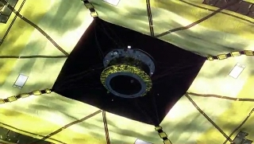
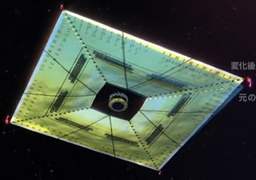
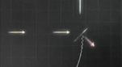
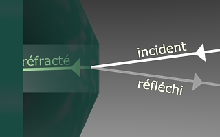
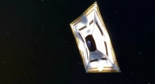
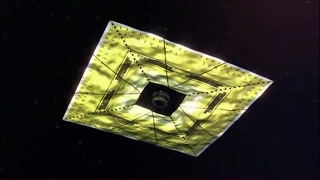
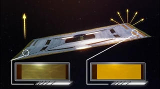
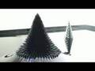
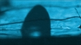
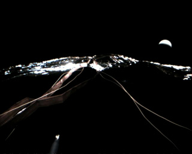

## L'origami miroir - Chapitre XXVIII des Dialogues de Dotapea
### L'origami miroir - Chapitre XXVIII des Dialogues de Dotapea
 Navig. page/section

[](chap27ambre.html)  
[](dialoguesdotapea.html)  
[](chap29feu.html)

\_\_\_\_\_

**Pages soeurs**

[I, A propos des liants](chap01liants.html)  
[II, Bulles, siccativ., struct. élec.](chap02bullessiccativation.html)  
[III, Caséine, phosphore, dissociation](chap03caseine.html)  
[IV, Les orbitales](chap04orbitales.html)  
[V, L'aérogel](chap05aerogel.html)  
[VI, Polarisation de la lumière](chap06polaris.html)  
[VII, Sfumato et diffusion Rayleigh](chap07rayleigh.html)  
[VIII, Les interférentielles](chap08interferences.html)  
[IX, Dextrine, farine et chiralité](chap09dextrine.html)  
[X, L'ocre bleue](chap10ocrebleue.html)  
[XI, Les métamatériaux](chap11metamateriaux.html)  
[XII, Le jaunissement](chap12jaunissement.html)  
[XIII, Laser etc.](chap13laser.html)  
[XIV, L'holographie](chap14holographie.html)  
[XV, L'holographie numérique](chap15holographienum.html)  
[XVI, Extérieur, intérieur, chaux](chap16interieurexterieurchaux.html)  
[XVII, L'électrolyse et les ions](chap17electrolyseions.html)  
[XVIII, L'électricité, un peu plus loin](chap18electriciteplusloin.html)  
[XIX, Oxydation, métaux](chap19oxydationsmetaux.html)  
[XX, Les échelles](chap20echelles.html)  
[XXI, Nature et évolution des résines](chap21resines.html)  
[XXII, Le mouillage pigmentaire](chap22mouillage.html)  
[XXIII, La molette](chap23molette.html)  
[XXIV, Blanche neige](chap24blancheneige.html)  
[XXV, Lumière et matière](chap25lumiereetmatiere.html)  
[XXVI, Magnétisme](chap26magnetisme.html)  
[XXVII, Ambre et vieilles branches](chap27ambre.html)  
XXVIII, L'origami miroir  
[XXIX, Le feu](chap29feu.html)  
[XXX, Peau du métal](chap30peaudumetal.html)  
[XXXI, La ville en un souffle](chap31bellastock.html)  
[XXXII, Oxyder des matériaux](chap32oxydermateriaux.html)  
[XXXIII, Ocre bleue, une solution](chap33ocrebleuesimulation.html)

\_\_\_\_\_

Copyright © www.dotapea.com

Tous droits réservés.  
[Précisions cliquer ici](droitscopie.html)

**Les dialogues sur la physique-chimie  
appliquée aux arts**

**Chapitre** **XXVIII**

**L'origami miroir**

[](dialoguesdotapea.html#notecornelis)

dial   dial   dial

Une réalisation spatiale avant-gardiste japonaise est l'occasion d'aborder sur le mode du dialogue le thème de la réflexion de la lumière au fil d'une discussion parsemée d'images et de digressions, entre Jean-Louis, physico-chimiste au CNRS, et Emmanuel, candide.

Emmanuel : Jean-Louis je sais pas si tu as vu passer cette information : les Japonais ont lancé une voile solaire vers Vénus, "Ikaros". Apparemment c'est une mise à l'épreuve technologique difficile et prometteuse.

  
Quelques liens ci-contre ->Jean-Louis : Sympa, la voile. LA question c'est le déploiement. C'est ça qui risque d'échouer.Emmanuel : Oui, c'est un peu un origami finalement.

Comme cet objet doit atteindre la planète Vénus dont l'orbite est plus proche que la notre du soleil, il va en quelque sorte contre le vent. Sans coque, sans dérive, sans quille et sans eau, il ne peut procéder comme un navire sur l'océan. Il doit recourir à la mécanique céleste, mais pour cela il lui faut une certaine puissance, ou bien une impulsion initiale.

**\[sur Ikaros\]**

[Un bon article](http://directory.eoportal.org/presentations/330/10002509.html) sur EOportal.org

[Une vidéo](http://www.youtube.com/watch?v=7_6HOqBkP2o&feature=player_embedded#at=341) en japonais, certes, mais permettant de se faire visuellement une idée du projet, la deuxième moitié en particulier.

Le [descriptif d'Ikaros](http://www.jspec.jaxa.jp/e/activity/ikaros.html) sur le site de la Jaxa

  


Ikaros - Images JAXA - Diffusion publique YouTube

La voile d'Ikaros - dont la diagonale n'est que de 20m - n'est pas recensée dans la documentation comme devant être utilisée comme un moteur.

Dans les années 70/80, alors que ce mode de propulsion commençait à être envisagé, on évoquait d'immenses surfaces (comptées en centaines de km2 a minima) n'autorisant pourtant que de modestes accélérations par rapport aux moteurs fusées. On tablait sur la constance. Mais les capacités techniques nécessaires à ces projets grandioses était hors de portée.

Le mérite de l'agence spatiale japonaise, la JAXA, semble de commencer humblement et astucieusement. La petite voile de la sonde expérimentale est dépliée - ce qui est un exploit, on l'a dit -, après quoi son principal rôle est de manoeuvrer, autre exploit.



  
Elle le remplit, ce rôle, de manière fort originale : en modifiant sa propre réflexivité grâce à des cristaux liquides situés pour ainsi dire dans la voile.  
Cela pose naturellement différentes questions.  
Commençons par celle-ci : entre un objet absorbant et un objet réfléchissant, lequel est le plus propulsé en arrière à l'impact d'un photon ?Jean-Louis : Un photon réfléchi transmet deux fois plus d'impulsion qu'un photon absorbé.Emmanuel : D'accord. Maintenant, parlons de l'angle. Dans la vidéo référencée [ci-dessus](chap28origamimiroir.html#video), on trouve ce schéma (la voile est le plan incliné à peu près au centre) :

 

L'angle d'incidence semble déterminer la direction de la propulsion, ce qui n'est pas une évidence car on parle là d'énergie poussant de la matière et non de deux solides comme au billard. Cette propriété doit être bien utile lorsqu'il s'agit de voguer à contrevent car cela permet de freiner, donc à terme de tomber.

Finalement, comment un photon est-il réfléchi ?

  
Jean-Louis : Quand tu as une interface entre deux matériaux, la lumière qui traverse est toujours [réfractée](refraction.html) et réfléchie.



Et selon l'angle d'incidence, il y a plus ou moins de l'un et de l'autre.

Emmanuel : Seulement l'angle d'incidence ? Un miroir ne reflète-t-il pas autant quelle que soit la position relative de la source de lumière ? 

Jean-Louis : Les miroirs sont un cas un peu à part, même si ce que je dis reste vrai. Je précise tout de suite que dans les conducteurs électriques, c'est à dire les métaux (dont on fait les miroirs), il ne peut pas y avoir de champ électrique, donc pas de lumière qui est précisément un champ électromagnétique.

**\[on ne passe pas\]**

Sur le rapport entre métaux et réflexion, voir aussi [passage](chap19oxydationsmetaux.html#eclatmetallique) in chap. XIX.

En toute rigueur il y a "un petit quelque chose" qui s'appelle une onde évanescente, et qui ne pénètre pas plus que "l'épaisseur de peau", quelques nanomètres pour la lumière visible.

Mais même pour les miroirs, donc, la quantité de lumière réfléchie est dépendante de l'angle de réflexion et de la [polarisation](chap06polaris.html) de la lumière incidente.

**\[la peau du métal\]**

Sur tous ces points, lire le [chapitre XXX](chap30peaudumetal.html), La peau du métal

Sinon, pour les matériaux dits "diélectriques" (verres, plastiques,...) on a la loi de Descartes qui donne les relations géométriques entre rayon incident et rayon réfracté. La proportion de lumière réfléchie est fonction de l'indice de réfraction du matériau et du milieu dans lequel se propage l'onde incidente (eau, air, autre matériau transparent).

Sur la réfraction, lire [l'article consacré](refraction.html)

Là encore c'est fonction de la polarisation, il y a en outre modification de cette polarisation lors de la traversée de l'interface. Je ne parle pas des paramètres triviaux tels que l'état de surface (rugueux, poli...). 

Le [chapitre VI](chap06polaris.html) est consacré à la polarisation de la lumière



L'impulsion transférée est perpendiculaire à la surface, donc si tu changes l'angle, tu changes la direction de poussée. Mais évidemment, plus tu t'écartes de la normale moins c'est efficace. Tu perds une partie du flux et le transfert de moment va comme le sinus de l'angle.

  
\[toujours sur l'aspect de l'impulsion, deux explications :\]

  
La courte : la boule de billard photon subit un choc élastique sur un mur et repart en arrière. Si elle a une impulsion +mv [\[1\]](chap28origamimiroir.html#notemv), il faut -mv pour l'arrêter, et encore -mv pour qu'elle reparte. Donc le mur reçoit un choc de 2mv.

  
La longue : l'onde photon est absorbée par les électrons du mur. Toujours. Les électrons du mur rayonnent en retour un champ électromagnétique.

**\[retour sur l'impulsion\]**

Selon les caractéristiques du mur (transparent, métallique,....) cette onde possède un maximum de probabilité devant, dans ou derrière le mur. En fait aux trois endroits avec une probabilité (une amplitude) plus ou moins grande. En simplifiant, bien sûr. (pas d'atténuation, pas d'effets non linéaires, changement de fréquence, etc....)

En marge on peut lire [quelques  mots](chap25lumierechatsmiroirs.html#effettunnel) sur "l'effet tunnel" (chap. XXV)



**\[Digressions\]**

Emmanuel : Est-il juste de dire que pour un miroir dit "sans [tain](tain.html)", la couche réfléchissante doit être assez fine ou assez clairsemée afin que des photons puissent passer entre les champs qui lui interdisent le passage ?

Jean-Louis : Un miroir est généralement constitué d'une vitre de bonne qualité (de la "glace") recouverte d'argent ou d'un amalgame d'un côté, avec une couche de peinture (le tain) qui protège l'argent. De nos jours l'argent est remplacé par de l'aluminium.

Une glace sans tain joue effectivement sur une métallisation suffisamment mince pour laisser encore passer une certaine quantité de lumière. C'est ce qu'on fait sur les verres de certaines lunettes de soleil à aspect métallique.

Contrairement à ce qu'on croit souvent, une glace sans tain n'est pas unidirectionnelle, il y a toujours autant de lumière qui passe dans les deux sens. Le côté "diode" est dû au fait que si ce miroir sépare deux pièces, l'une est dans le noir quand l'autre est très éclairée (là où sont les suspects dans les films policiers....). 

Le miroir sans tain

Emmanuel : Une autre question : selon toi, les cristaux liquides de la voile d'Ikaros deviennent-ils réflexifs ou non à cause d'une modification de leurs champ électroniques ou à cause d'un changement de structure stimulé par un petit coup de courant ?

Jean-Louis : Sans avoir les détails techniques, je pense que le contrôle électrique des cristaux liquides permet à la lumière d'atteindre ou pas un miroir placé derrière les cristaux liquides. Comme dans un afficheur de calculette.

  
Emmanuel : Si je te montre ce schéma :



comment réagis-tu ?

Jean-Louis : C'est comme un écran de calculette. C'est réfléchissant à gauche et diffusant (i.e. opaque, éteint, ...) à droite.

Emmanuel : Il est curieux qu'à droite ce ne soit pas absorbant. Peut-être pour éviter que ça chauffe ?

Jean-Louis : Imagine ça comme un miroir qui pourrait être dépoli électriquement. C'est l'idée, je pense. Il y a aussi, bien sûr, forcément de l'absorption.

Emmanuel : D'accord. Donc le rôle des cristaux liquides est de diffuser localement un peu dans tous les sens, de manière "dépolie" comme tu dis, au lieu de renvoyer tout droit. Et ça doit aussi absorber un peu. In fine, l'écart est suffisant pour manoeuvrer.

Qu'en est-il des cristaux liquides d'Ikaros ?

Troisième digression.

Ces cristaux - ceux-ci ou aussi bien ceux d'une calculette ou d'un écran -, ne se déplacent pas, contrairement à ce que pourrait laisser penser l'adjectif "liquide". Leurs propriétés de réflexion sont juste modifiées sur place. Bien sûr, instinctivement, lorsque l'on entend "liquide", on pense mouvement et c'est une erreur.

Cependant - et c'est là l'objet de cette digression -, il existe au moins deux possibilité d'animer des fluides (hormis la pesanteur lorsqu'il y en a) :

Animer des liquides

> \* les [ferrofluides](chap26magnetisme.html#ferrofluides). Intéressants. Sans doute ont-ils des capacités plastiques restant à explorer. Peut-être pourrait-on aussi utiliser des métaux moins performants que le fer du point de vue magnétique, mais plus intéressants sous d'autres rapports.

[](chap26magnetisme.html#ferrofluides)

> \* la microfluidique. Très avant-gardiste, encore en friche sur le plan artistique, elle est évoquée dans un article de la section « Hi-tech » publié en même temps que celui-ci. [Cliquer ici](hitechmarchedesgouttes.html)

Cristaux liquides, ferrofluides et microfluidique demain sont des ressources auxquelles les plasticiens pensent rarement aujourd'hui par manque d'informations. L'utilisation de cristaux liquides par la Jaxa - une invention datée mais remise en avant - montre que les scientifiques ont une capacité de réemploi, de recyclage, qui comparativement peut sembler encore un peu trop rare en art.

[](hitechmarchedesgouttes.html)

Un autre questionnement en marge : la petite quantité de mouvement conférée par la lumière que nous évoquions au sujet de la voile d'Ikaros est une forme d'énergie. Est-elle exploitée par les technologies de type photovoltaïque ?

  
Jean-Louis : Non. Pour le photovoltaïque il faut absorber le photon. Il doit être converti en paire électron/trou.

  
Emmanuel : Cette énergie cinétique pourrait-elle être exploitée dans l'espace par exemple ? On pourrait imaginer un grand rotor...

  
Jean-Louis : Le problème est que le rotor va s'éloigner du soleil au fur et à mesure :)

  
Emmanuel : Oui, il s'éloignerait ! Alors il faudrait des rotors jetables qui se jetteraient dans l'atmosphère de Jupiter :)

Bon, d'accord, c'est un peu compliqué à mettre en oeuvre.

Bon voyage à Ikaros en tout cas. Il parviendra aux alentours de Vénus le 12 décembre de cette année.

Pourrait-on exploiter l'énergie cinétique de la lumière ?

\[Ajout 2011\]

La mission Ikaros semble avoir été une totale réussite. Ci-dessous, une vue prise en fin de mission, à proximité de Vénus dont on voit le croissant.



\[Fin ajout\]

\_\_\_\_\_\_

\[1\] m=masse, v=vitesse (celle de la lumière en l'occurrence)

Pour revenir dans le corps du texte, cliquez sur le bouton "précédent" de votre navigateur

[Chapitre suivant](chap29feu.html)


 

  [Communication](http://www.artrealite.com/annonceurs.htm)
```
title: L'origami miroir - Chapitre XXVIII des Dialogues de Dotapea
date: Fri Dec 22 2023 11:26:36 GMT+0100 (Central European Standard Time)
author: postite
```
