## Bellastock - Chapitre XXXI des Dialogues de Dotapea
### Bellastock - Chapitre XXXI des Dialogues de Dotapea
 Navig. page/section

[](chap30peaudumetal.html)  
[](dialoguesdotapea.html)  
[](chap32oxydermateriaux.html)

\_\_\_\_\_

**Pages soeurs**

[I, A propos des liants](chap01liants.html)  
[II, Bulles, siccativ., struct. élec.](chap02bullessiccativation.html)  
[III, Caséine, phosphore, dissociation](chap03caseine.html)  
[IV, Les orbitales](chap04orbitales.html)  
[V, L'aérogel](chap05aerogel.html)  
[VI, Polarisation de la lumière](chap06polaris.html)  
[VII, Sfumato et diffusion Rayleigh](chap07rayleigh.html)  
[VIII, Les interférentielles](chap08interferences.html)  
[IX, Dextrine, farine et chiralité](chap09dextrine.html)  
[X, L'ocre bleue](chap10ocrebleue.html)  
[XI, Les métamatériaux](chap11metamateriaux.html)  
[XII, Le jaunissement](chap12jaunissement.html)  
[XIII, Laser etc.](chap13laser.html)  
[XIV, L'holographie](chap14holographie.html)  
[XV, L'holographie numérique](chap15holographienum.html)  
[XVI, Extérieur, intérieur, chaux](chap16interieurexterieurchaux.html)  
[XVII, L'électrolyse et les ions](chap17electrolyseions.html)  
[XVIII, L'électricité, un peu plus loin](chap18electriciteplusloin.html)  
[XIX, Oxydation, métaux](chap19oxydationsmetaux.html)  
[XX, Les échelles](chap20echelles.html)  
[XXI, Nature et évolution des résines](chap21resines.html)  
[XXII, Le mouillage pigmentaire](chap22mouillage.html)  
[XXIII, La molette](chap23molette.html)  
[XXIV, Blanche neige](chap24blancheneige.html)  
[XXV, Lumière et matière](chap25lumiereetmatiere.html)  
[XXVI, Magnétisme](chap26magnetisme.html)  
[XXVII, Ambre et vieilles branches](chap27ambre.html)  
[XXVIII, L'origami miroir](chap28origamimiroir.html)  
[XXIX, Le feu](chap29feu.html)  
[XXX, Peau du métal](chap30peaudumetal.html)  
XXXI, La ville en un souffle  
[XXXII, Oxyder des matériaux](chap32oxydermateriaux.html)  
[XXXIII, Ocre bleue, une solution](chap33ocrebleuesimulation.html)

\_\_\_\_\_

Copyright © www.dotapea.com

Tous droits réservés.  
[Précisions cliquer ici](droitscopie.html)

**Les dialogues sur la physique-chimie  
appliquée aux arts**

**Chapitre** **XXXI**

**Bellastock**

**La ville en un souffle**

[](dialoguesdotapea.html#notecornelis)

dial   dial   dial

Bellastock est une association qui organise chaque année un festival d'architecture. 2011 est la sixième édition.

Il s'agit à chaque fois d'un défi impressionnant. Les participants construisent réellement une ville éphémère à partir d'un choix matériel. Pour exemples la palette (pas celle du peintre) en 2009, le sac de sable en 2010, et cette année « (...) l'architecture gonflable, une architecture d'air et de "textile", flottante et onirique (...) ». C'est « Une ville en un souffle », titre de cette manifestation.

Dotapea : Ce qui frappe le candide que je suis, en 2011, c'est précisément l'émergence au niveau international de projets architecturaux ayant cette dimension flottante et onirique. Par exemple les Floating Observatories de la future Taiwan Tower de Taichung (images ci-contre), sortes de bulbes transparents gonflés à l'hélium évoluant au long d'un genre de tour Eiffel, projet sur lequel nous allons publier un dossier.

Avant d'en venir à la manière dont cette évolution s'inscrit dans l'histoire de l'art - il y a trop à dire pour une entrée en matière -, je voudrais aborder les questions pragmatiques, le "Comment ça marche ?". C'est d'ailleurs le moment de donner le sommaire de cet article qui peut être lu de manière linéaire ou par accès direct aux différentes approches.

> [Comment ça marche ?](chap31bellastock.html#commentcamarche)
> 
> [Organisation et intentions](chap31bellastock.html#organisation)
> 
> [Esthétique, histoire et avenir](chap31bellastock.html#esthetiqueethistoire)
> 
>     [Une digression sous-marine](chap31bellastock.html#digressionsousmarine)

[](images/chap31taiwantower0060.jpg)[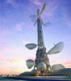](images/chap31taiwantower0060.jpg)

[](images/chap31taiwantower0020.jpg)[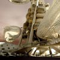](images/chap31taiwantower0020.jpg)

[](images/chap31taiwantower0010.jpg)[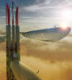](images/chap31taiwantower0010.jpg)

Floating Observatories

Cliquer sur les images

pour les agrandir

[](images/chap31grattemer.jpg)[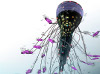](images/chap31grattemer.jpg)

_Water-scraper,_

Sarly Adre Bin Sarkum

**\[Comment ça marche ?\]**

  
Les observatoires de la tour de Taïwan sont gonflés à l'hélium mais les cabines sont normalement oxygénées. L'hélium a été envisagé comme complément respirable dans le cadre d'anciens projets de villes sous-marines, afin que les habitants supportent la pression ambiante sans quoi ces ouvrages auraient dû être maintenus à une pression de surface, ce qui obligeait à les concevoir blindés comme des bathyscaphes.

Malheureusement, respirer de l'hélium ne s'est pas avéré anodin, ce qui limite certains projets tout à fait actuels d'habitations sous-marines, comme le gracieux « Gratte-mer » du Malaisien Sarly Adre Bin Sarkum (voir en marge ci-contre), mais aussi la possibilité de maintenir une ville « gonflée en un souffle ».  
Comment, sans hélium, avec juste de l'air, allez-vous maintenir gonflée cette cité, même éphémère ?

Bellastock : Effectivement, Bellastock propose cette année à ses participants d'ériger une "ville en un souffle", autrement dit une ville éphémère constituée de micro architectures gonflables réalisées à partir de PVC souple.

A l'inverse de projets comme les Floating Observatories de la future Taiwan Tower de Taichung ou le « Gratte-mer » de Sarly Adre Bin Sarkum, "la ville en un souffle" ne sera pas alimentée par l'hélium qui, en effet, présente des caractéristiques difficilement gérables pour un événement de la sorte.  
L'air insufflé par une soufflerie électrique suffira à faire tenir "la ville en un souffle".

Voici comment nous fonctionnerons : 

Deux types de structures seront présentes : celles en simple membrane, et celles en double membrane comme indiqué dans le schéma ci-contre.

Il s'agira selon le cas :

> \- de gonfler les structures en simple membrane comme on gonfle un ballon,
> 
>   
> \- ou bien les structures en double membrane verront l'air circuler entre les deux membranes qui formeront la paroi, mais pas à l'intérieur même de la structure.

[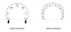](images/chap31schema1.jpg)

Schéma 1

Cliquer pour agrandir

Dtp : L'assemblage se fait ensuite à l'aide de cerceaux (voir schéma 2). Les cerceaux, ce sont des sortes de lieux de passage ?

  
Bellastock : Absolument.  
Le cerceau d'une structure s'insère dans le cerceau d'une autre afin de :

> 1/ permettre à l'air de circuler en continu, et donc gonfler et garder gonflée chaque structure ;
> 
> 2/ permettre l'accès aux structures. 

[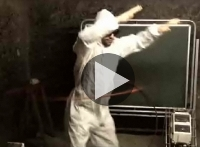](players/bellastockcerceaux/index.html)

Le système des cerceaux, vidéo

  
La pression sera plus forte dans les structures en double membrane car l'air doit, dans ce cas, être plus comprimé, dans un espace plus réduit (entre les deux membranes), afin d'assurer la stabilité de la structures. A l'image d'un chambre à air de vélo.

[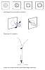](images/chap31schema1cerceau.pdf)

Schéma 2 (format pdf)

Cliquer pour agrandir

Dtp : D'accord.

Comment faites-vous le choix local entre simple et double membrane ?

  
Bellastock : Tout dépend du projet.  
Par exemple si un groupe veut faire des arches, il est évident qu'il vaut mieux opter pour la double membrane.  
L'avantage de la double membrane, c'est que la structure sera plus évidemment modulable (schéma 3 ci-contre).

[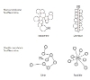](images/chap31schema3.jpg)  
Schéma 3

Cliquer pour agrandir 

Pour insuffler l'air :

> \- Les structures en double membrane posséderont un système alliant une gaine et une valve (schéma ci-contre) permettant un accès adéquat à l'air.
> 
>   
> \- Les structures en simple membrane seront dotées de cerceaux qui se "clipseront" les uns aux autres assurant la possibilité aux personnes de pénétrer la structure et l'arrivée constante d'air dans toute la structure.

En effet, une structure en simple membrane nécessite une ouverture plus grande pour permettre à l'air de l'envahir ; alors qu'en double membrane, la place réservée à l'air est bien plus restreinte. 

[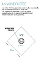](images/chap31schema2valve.pdf)

Schéma 4 (format pdf)

Cliquer pour agrandir

D'autres outils sont bien décrits dans le [dossier d'inscription](http://www.bellastock.com/dossier_inscription_bellastock_2011.pdf).

**\[Organisation et intentions\]**

Dtp : Comment organisez-vous les interventions des uns et des autres ? Le festival met-il à disposition des espaces complètement indépendants ou bien faut-il tout planifier, comment ça se passe avec les participants ? 

Bellastock : Les participants nous proposent un projet. On évalue sa faisabilité puis à l'issue de délibérations plus ou moins longues, ils ont carte blanche tant en terme de mise en ouvre que de localisation de leur structure sur le site. 

Comme nous fonctionnons par « lips gates », sources d'alimentation en air, il leur faut évidemment pouvoir se relier à une autre structure ou à une « lips gate ». Ce qui indéniablement limite la liberté d'implantation.  
Ils ont à charge de s'arranger entre équipes pour se partager l'espace. Voilà un autre enjeu important du festival. Le « vivre ensemble » est un leitmotiv du Bellastock. Il sera très intéressant, donc, d'observer de quelle manière les participants s'approprient le terrain, se le partagent, afin de pouvoir vivre ensemble.  
C'est là qu'intervient la dimension sociologique du projet.Dtp : D'accord. Bellastock va en effet beaucoup plus loin que ce que l'on a l'habitude de voir (maquettes, imagerie virtuelle) ! C'est la mise à l'épreuve en réel de tout un environnement qui se construit.  
Y a-t-il eu des précédents avant Bellastock ou parallèlement ?  
Pouvez-vous en dire un peu plus sur cette dimension expérimentale ? Par exemple êtes-vous en train de théoriser tout cela ?

  
Bellastock : La notion de ville éphémère est présente depuis le début de Bellastock, c'est à dire 2006. A taille humaine, il s'agit en effet de penser la ville de sorte à accueillir l'ensemble des participants. Comme le thème change chaque année, le matériau de base aussi. La dimension expérimentale est donc nécessaire pour concrétiser, confirmer la faisabilité du projet.

  
Si des prototypes permettent cela, la ville en général reste de l'ordre de l'expérimental, car les moyens de mise en ouvre sont restreints : c'est un festival, non un projet financé ou à but lucratif.  
De fait, théoriser est compliqué dans la mesure où l'aboutissement de la ville se compare aisément à un ensemble de prototypes.  
La ville éphémère peut par contre largement servir de base à la réflexion et donc à la théorisation du thème abordé ; ici, l'habitat gonflable.  
Nous nous sommes, qui plus est, déjà basés sur certaines théories pour imaginer le projet : en effet, à travers ceux de l'architecte Hans Walter Müller, encore une fois, qui vit dans un gonflable ; ou le projet du « radeau des cimes » de Gilles Ebersolt.

[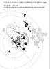](images/chap31schema3bis.pdf)

Schéma 5 (format pdf)

Cliquer pour agrandir

Il s'agit d'une structure gonflable posée sur la canopée d'une forêt pour en étudier l'inexploré jusque là pour des raisons pratiques - En effet, étudier la faune et la flore à 50 mètres de hauteur, c'est compliqué ; et le « radeau des cimes », à l'image (de départ) d'un radeau flottant sur l'eau, vient se poser sur la canopée, permettant aux chercheurs un accès direct à celle-ci.  
Là où la dimension sociologique entre en jeu, c'est pour la question du vivre ensemble. Elle se fait spontanément et reste de l'ordre de l'observation extérieure. Il s'agira d'observer la manière dont les participants, jeunes architectes, se sont appropriés et partagés l'espace pour l'occuper de sorte à vivre ensemble.  
Cette contextualisation directe leur servira sur le plan empathique : elle les aidera peut-être à se mettre dans la peau de leurs futurs clients, selon les espaces qui leur seront donnés d'investir.  
Une sociologue, Lynda Bouhitem apportera un regard extérieur de sociologue, en analysant ces comportements.

Bien que Bellastock cherche à pérenniser l'utilisation de ces micro architectures en les prêtant pour des événements, festivals, etc., il n'est, pour le festival, pas question d'ériger des structures permanentes.

Cependant, nous soulignons que le gonflable de ce type peut être une solution d'habitat permanent.  
A l'image de la maison de l'architecte Hans Walter Müller, parrain du festival et spécialiste incontesté du gonflable, il est tout à fait possible qu'une structure soit gonflée en permanence et habitée.

[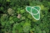](http://www.radeau-des-cimes.org/)

_Le radeau des cimes_

Cliquer sur l'image pour visiter le site de l'association en charge de ce projet

Hans Walter Müller a en effet pensé sa maison autour du gonflable : elle est alimentée en permanence par une soufflerie.  
La question de la consommation électrique se pose alors : il faut savoir qu'une soufflerie consomme la même énergie qu'un système de ventilation en double flux, utilisé dans une maison lambda.Dtp : La météo révèle en France certains dangers depuis les années 90. Les structures gonflables sont-elles plus ou moins fiables que celles « en dur » devant d'éventuelles menaces météorologiques ?

Bellastock : Évidemment, le gonflable est plus fragile face aux intempéries.  
Le vent est le plus redoutable, en tout cas pour un événement comme « la ville en un souffle ».  
Il s'agit de prendre ses précautions : nous lesterons chaque structure avec des sacs de sable pour limiter au maximum l'envol. 

Dtp : On peut toujours dégonfler... ou plutôt cesser de gonfler. Cela semble imparable ! 

Bellastock : Effectivement, c'est imparable. Cependant il faudra également penser la ville en fonction des possibles contraintes abordées précédemment. C'est un défi qui relève complètement de l'organisation des participants.

[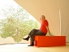](images/chap31hwmuller.jpg)

Hans Walter Müller dans son installation au CIAP de l'île de la Vassivière.

Cliquer pour agrandir

Une intéressante documentation (dossier enseignants) est disponible sur le site du CRDP Limousin. [Lien (.pdf)](http://www.crdp-limousin.fr/IMG/pdf/Modules_gonflables_CIAP.pdf).

Ces structures ne seront pas faites pour être exploitées en permanence ET sur le long terme.  
En revanche elles seront assez robustes pour être réutilisées à diverses occasions (festivals, événements culturels, etc.). C'est d'ailleurs l'un des objectifs principaux à prendre en considération par les participants pour la réalisation de leur structure.  
Ceci dit, pour citer à nouveau Hans Walter Müller, l'on peut certifier que le gonflable est apte à nous abriter des aléas météorologiques, puisque depuis 40 ans, lui et sa femme vivent en pleine forêt dans une maison gonflable.  
En 40 ans, il a juste dû faire face à la tempête de 1999 qui l'a contraint de changer une partie de la toile qui avait été arrachée.

Dtp : M. Müller décrit ses structures gonflables comme une simple peau entre l'intérieur et l'extérieur. Comme une peau humaine - et comme tout édifice finalement -, on peut imaginer qu'il y a de l'entretien et différentes possibilités de modifier l'apparence. Il faut laver, parfois soigner (rustines ?), mais on peut aussi éclairer, colorer, voire instiller des parfums à l'intérieur... Cela semble un « médium », finalement, un matériau au même titre que la pierre, le métal, le bois, le béton, etc., avec ses spécificités.  
Déjà, de quoi s'agit-il, de quoi cette « peau » est-elle constituée ?  
Et comment comptez-vous la mettre en scène ? Certaines photos, sur votre site, semblent montrer un grand attachement aux dimensions esthétiques...  
Enfin, pensez-vous qu'il serait un peu ou beaucoup plus difficile de réaliser une telle ville sous l'eau, à faible profondeur ? Quels problèmes cela poserait-il ? Et sur l'eau, en surface ?

Bellastock : Monsieur Müller a en effet cette vision du gonflable. A l'image de tout autre matériau, la membrane agit selon certains critères qui font l'essence d'une structure habitable : protection contre les aléas extérieurs, intimité, etc.  
L'avantage du gonflable est en effet son aspect modulable ; pourquoi pas, oui y diffuser des odeurs, permettre de faire marcher certains sens.  
Pour l'entretien, C'est en effet très « simple ». Des rustines peuvent servir en cas de fuite, effectivement. Nettoyer se fait facilement avec de l'eau.  
Pour le festival « la ville en un souffle », nous avons opté pour du PVC de type M1 - norme de sécurité contre le feu -, sous deux déclinaisons : l'un opalescent, l'autre transparent, pour jouer, selon les envies des concepteurs, avec les entrées de lumière, etc.

**\[Esthétique, histoire et avenir\]**

L'aspect esthétique est important, comme pour tout projet architectural. Il est dans l'esprit de tout architecte de s'adapter à l'environnement d'implantation, même si l'on en n'a pas toujours l'impression, que certains projets architecturaux dénotent trop, voire sont moches ! Tout est question de goût.  
Mais l'esthétique prend bien sa place dans un tel projet.  
Quant à réaliser une ville gonflable sous l'eau, pourquoi pas. L'enjeu du Bellastock étant tout autre, ce type de réflexions n'a pas été abordé. Mais certains projets à priori fous prouvent la faisabilité ! vous abordiez le « Gratte-mer » de Sarly Adre Bin Sarkum. Bien qu'onéreux, cela semble réalisable ! Rien à voir là avec du gonflable, mais le gonflable pourrait être une alternative pour exploiter l'océan comme espace de vie. Il faudrait entamer là un débat qui susciterait sûrement de vives polémiques.Dtp : On reproche sans doute à juste titre au « Gratte-mer » le fait qu'à 50m de profondeur, c'est déjà le noir complet. Une ville "à la Bellastock" paraît donc ouvrir des perspectives. Ouvrons une petite parenthèse.

\[Digression sous-marine - [Pour passer à la suite cliquer ici](chap31bellastock.html#suitedigressionsousmarine)\]

[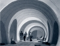](images/chap31ibiza.jpg)

_Instant city,_

congrès ICSID Ibiza 1971. F. Benito, C. Ferrater, J. Prada ©

Cliquer pour agrandir.

> D'autres projets comme Turbine City, cette fois en surface au large de la Norvège, ou la Lilypad de Vincent Callebaut ne vont peut-être pas soulever l'enthousiasme des foules pour des raisons diverses.  
> Par contre, l'Océan Indien et le Pacifique regorgent d'atolls naissants ou finissants qui affleurent la surface de l'eau, notamment des possessions françaises associées à de vastes domaines maritimes. Sans parler des archipels habités en danger d'inondation comme Tuvalu, Andaman, Nicobar, les Maldives, .
> 
> En avril 2011, la Chine vend 176 îles inhabitées et un entrepreneur français, Bruno Kerrien, continue à faire fortune en Russie en vendant lui aussi des îles.
> 
> L'occasion d'un mini-dialogue avec [Jean-Louis](quinoussommes.html#jeanlouis), physico-chimiste au CNRS.
> 
> _Dtp : Que faire des déchets ? Dans l'espace on sait les recycler intégralement mais cela coûte extrêmement cher.Jean-Louis : C'est très exactement un des problèmes quasi-insolubles.  
> Et pour les éléments sous-marins tu oublies le coût de l'air respirable._
> 
> _Dtp : Ne pourrait-on pas ajouter une cloison pour emprisonner un peu d'hélium afin qu'au moins la fonction de gonflage soit assurée ? Le reste ne serait du coup qu'une climatisation._
> 
> _  
> Jean-Louis : Tout ce qu'il faut c'est un gaz sous pression. L'hélium n'ajoute rien.  
> L'hélium ne supprimera pas la pression. Il a un autre problème, c'est que quasiment rien n'est étanche à l'hélium. Donc fuites. Et il est très cher et ce n'est pas une ressource renouvelable._ 
> 
> Ces problèmes de pression sont assez terribles sous l'océan. Ils sont induits par les marées.
> 
> Sous l'eau, la pression est environ de 1 bar + 1 bar tous les 10m. Donc en plongeant de la surface à 10m de profondeur, on double la pression subie par notre corps. Raison pour laquelle les accidents à faible profondeur ne sont pas rares [\[1\]](chap31bellastock.html#note1). Raison aussi pour laquelle il faut attendre 24h avant de prendre l'avion après une plongée.
> 
> Or un marnage moyen en marée de vive eau est de 10 à 11m.
> 
> Donc une habitation gonflable en milieu océanique ne va pas sans problèmes. Par contre en méditerranée, près d'une rivière ou d'un lac, peut-être plus près de la surface, cela paraît possible quoique à étudier attentivement.
> 
> Pardon pour cette digression. 

[](images/chap31turbinecity.jpg)

_Turbine city,_

projet de cité faite d'éoliennes flottantes habitées - 120 000 foyers, 31 500 m2 - par le cabinet d'architectes On Office (Portugal), pour la côte de Stavanger, Norvège

Cliquer pour agrandir

[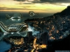](images/chap31lilypad.jpg)

 _Lilypad,_

(nénuphar-habitacle),

Vincent Callebaut

Cliquer pour agrandir

Dtp : H.W. Müller faisait partie, dans les années 1960, du mouvement de l'art cinétique. Un autre grand architecte visionnaire, Nicolas Schöffer, a travaillé en direction d'une architecture gigantesque (cf. son fameux projet démiurgesque de tour robotique à La Défense), métallique donc rigide - quoique mouvante - et particulièrement « centralisante » là où Müller rechercha, par ses gonflables, une « architecture sans pesanteur », potentiellement itinérante et d'une grande souplesse.  
Peut-on donc dire que Müller et Schöffer sont deux « pôles opposés » de cette branche de l'architecture contemporaine ?

Bellastock : On peut en effet à priori parler de pôles opposés.  
En apparence, entre le gonflable et une structure métallique le débat n'a pas lieu d'être. Léger contre lourd, mobile contre sédentaire, etc.  
Ce qui les oppose est évidemment le choix d'un matériau mais leurs intentions peuvent se rejoindre, voire se mêler. 

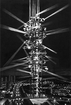

_Tour cybernétique_

Nicolas Schöffer,

projet pour La Défense,

Paris, 1970

Le gonflable s'ajoute au dur afin d'équilibrer le tout, comme le projet du magasin TSUM à Moscou : l'agence d'Axel Schoenert (Paris 1er), en plus de l'architecture d'intérieur, a érigé une membrane transparente de 3000m² à partir d'un coussin gonflable ETFE, afin de créer une sorte de verrière abritant le restaurant de l'édifice et offrant une vue impressionnante de la ville.  
C'est là l'exemple que le gonflable s'adapte à une structure fixe et que l'alliance équilibre les volumes et allège l'architecture.  
Schöffer et Müller se rejoignent dans leurs approches architecturales respectives.  
Tous deux inspirés par des pratiques artistiques, ils cherchent l'esthétique du mouvement.  
Müller s'inscrivant dans la mouvance « cinétique », il a beaucoup travaillé avec des images retranscrites (projetées) de manières très aléatoires grâce au relief du gonflable.  
Schöffer lui, s'intéresse au « cybernétique » : la science des analogies entre organisme et machines. Dans le projet de la tour robotique, l'agencement de miroirs mobiles est le résultat d'une réflexion sur l'esthétique du mouvement directement inspirée de son rapport à la création artistique.  
La polyvalence (urbanisme, architecture, arts plastiques) les rapproche dans l'appréhension d'un projet architectural, mais le résultat est très différent. 

  
Dtp : Comment les concepts de Müller ont-il fait surface après tant d'années ?

Bellastock : Dès 1963, Müller remporte un vif succès avec sa "_machine cinétique_", cet écran mobile qui déforme l'image qui y est projetée, utilisant le gonflable.  
Si on ne peut parler d'émergence internationale et d'un statut populaire particulier, on ne peut pas nier que Müller a, depuis ses débuts, marqué les esprits. Très vite il est invité - ou de sa propre initiative - à réaliser des projets en gonflables importants : une église de 32 kg pouvant abriter 200 personnes, par exemple.  
Il est d'ailleurs, dans les années 60, lauréat de la biennale de Paris (1965) et du pavillon allemand à l'exposition internationale de Montréal (1967). 

  
Dtp : Les cerceaux et, plus globalement, toute la conception modulaire et articulée permettant la construction d'une véritable ville, est-ce une invention de H.W. Müller ou bien de Bellastock ? Müller avait-il initialement cette « vision d'ensemble » ?

Bellastock : L'idée des cerceaux est née d'une réflexion commune entre les fondateurs de Bellastock et des intervenants extérieurs, amis, etc.  
Il s'agissait de limiter la présence des souffleries, nécessaires pour gonfler les structures.  
Les souffleries étant coûteuses, bruyantes et encombrantes, Bellastock ne pouvait pas se permettre d'en proposer une par structure, sachant qu'elles seront plus de 170 sur le site.  
Connecter les structures pour faire circuler l'air était donc la solution la plus plausible. S'imposant, cette idée a poussé l'équipe à réfléchir sur « comment connecter ces structures » de manière « solide » ?  
Le cerceau est une solution pratique : peu coûteux et permettant, en plus de la circulation de l'air, le passage des personnes d'une structure à l'autre.  
Cette vision d'ensemble, de « ville éphémère », est le propre de Bellastock, ce depuis 2006. Hans Walter Müller nous a permis de confirmer sa faisabilité, de par son expérience du gonflable et suite à de précieux conseils quant à la manipulation du PVC pour optimiser la conception.

Dtp : Bravo et bonne chance pour cette édition 2011. Une dernière question : pourquoi ce nom, Bellastock ?

Bellastock : L'association est née de l'envie commune d'anciens étudiants de l'école d'architecture ENSA de Belleville, Grégoire Saurel, Antoine Aubinais et Baptiste Furic.  
L'école disposait d'une association étudiante, Bellasso, et les fondateurs ont pensé à une contraction de Belleville et de Woodstock, référence historique dans le panorama des festivals. Ca a donné Bellastock.  
Si le sérieux est de rigueur dans la conception du projet Bellastock, la dimension « Woodstock » y est bien présente : convivialité, partage, réflexion commune, nature, vivre ensemble, fête..

Dtp : Merci !

> Pour toute information, voir le site [Bellastock.com](http://www.bellastock.com/)

\_\_\_\_\_

\[1\] _Physiologie du sport : bases physiologiques des activités physiques et sportives_, Hugues Monod, Henry Vandewalle, Roland Flandrois, Masson 2007, Paris, p. 207.

Pour retourner au corps du texte, cliquez sur le bouton "Précédent" de votre navigateur

[](images/chap31projetmagasintsummoscou.jpg)

_Projet pour le magasin Tsum_, Moscou

Cliquer pour agrandir

L'ETFE (éthylène tétrafluoréthylène) est un polymère léger et très transparent

[Chapitre suivant](chap32oxydermateriaux.html)


 

  [Communication](http://www.artrealite.com/annonceurs.htm)
```
title: Bellastock - Chapitre XXXI des Dialogues de Dotapea
date: Fri Dec 22 2023 11:26:37 GMT+0100 (Central European Standard Time)
author: postite
```
