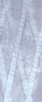
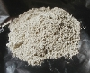
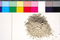
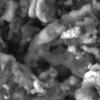
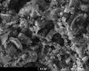
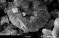
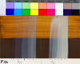
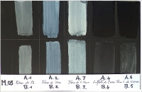

## Ocre bleue, la solution ? - Chapitre XXXIII des Dialogues de Dotapea
### Ocre bleue, la solution ? - Chapitre XXXIII des Dialogues de Dotapea
 Navig. page/section

[](chap32oxydermateriaux.html)  
[](dialoguesdotapea.html)

\_\_\_\_\_

**Pages soeurs**

[I, A propos des liants](chap01liants.html)  
[II, Bulles, siccativ., struct. élec.](chap02bullessiccativation.html)  
[III, Caséine, phosphore, dissociation](chap03caseine.html)  
[IV, Les orbitales](chap04orbitales.html)  
[V, L'aérogel](chap05aerogel.html)  
[VI, Polarisation de la lumière](chap06polaris.html)  
[VII, Sfumato et diffusion Rayleigh](chap07rayleigh.html)  
[VIII, Les interférentielles](chap08interferences.html)  
[IX, Dextrine, farine et chiralité](chap09dextrine.html)  
[X, L'ocre bleue](chap10ocrebleue.html)  
[XI, Les métamatériaux](chap11metamateriaux.html)  
[XII, Le jaunissement](chap12jaunissement.html)  
[XIII, Laser etc.](chap13laser.html)  
[XIV, L'holographie](chap14holographie.html)  
[XV, L'holographie numérique](chap15holographienum.html)  
[XVI, Extérieur, intérieur, chaux](chap16interieurexterieurchaux.html)  
[XVII, L'électrolyse et les ions](chap17electrolyseions.html)  
[XVIII, L'électricité, un peu plus loin](chap18electriciteplusloin.html)  
[XIX, Oxydation, métaux](chap19oxydationsmetaux.html)  
[XX, Les échelles](chap20echelles.html)  
[XXI, Nature et évolution des résines](chap21resines.html)  
[XXII, Le mouillage pigmentaire](chap22mouillage.html)  
[XXIII, La molette](chap23molette.html)  
[XXIV, Blanche neige](chap24blancheneige.html)  
[XXV, Lumière et matière](chap25lumiereetmatiere.html)  
[XXVI, Magnétisme](chap26magnetisme.html)  
[XXVII, Ambre et vieilles branches](chap27ambre.html)  
[XXVIII, L'origami miroir](chap28origamimiroir.html)  
[XXIX, Le feu](chap29feu.html)  
[XXX, Peau du métal](chap30peaudumetal.html)  
[XXXI, La ville en un souffle](chap31bellastock.html)  
[XXXII, Oxyder des matériaux](chap32oxydermateriaux.html)  
XXXIII, Ocre bleue, une solution

\_\_\_\_\_

Copyright © www.dotapea.com

Tous droits réservés.  
[Précisions cliquer ici](droitscopie.html)

**Les dialogues sur la physique-chimie  
appliquée aux arts**

**Chapitre** **XXX****III**

**Ocre bleue :**

**enfin une solution ?**

[](dialoguesdotapea.html#notecornelis)

Note : une version résumée de cet article

est en ligne sur le site Parlons Peinture du CRFP.

[Lien](http://www.parlonspeinture.com/__download/CRFP_%20com_09-11-11_ocre%20bleue.pdf)

Ce procédé est une [vélature](velature.html), une technique de glacis réalisés à l'aide d'un pigment blanc, décrite déjà (forcément partiellement, Lord Rayleigh étant né beaucoup plus tard) par Léonard de Vinci [\[1\]](chap33ocrebleuesimulation.html#note1) dont on connaît l'art du _sfumato_, et employée par d'autres peintres de son époque.

Il est assez peu employé et peu enseigné de nos jours. Cependant, un usage contemporain particulier et original nous a permis d'identifier, cinq ans après le [début de l'enquête](chap10ocrebleue.html), un procédé pictural pouvant peut-être ouvrir des perspectives (voir [Ouvertures, implications](chap33ocrebleuesimulation.html#ouverturesimplications)).

**Exposé**



Le peintre contemporain Jean Degottex, aujourd'hui décédé, a réalisé "sans bleu" - entendre ici sans pigments bleus - des tableaux d'un bleu voilé de blanc (détail ci-contre) à l'aide de pigments décrits comme ceci par une étudiante, Caroline, à ce jour doctorante en Sorbonne (histoire de l'art) :

> \* pour le fond, des ocres de Roussillon (c'est-à-dire des pigments de type [terres](terrespigments.html) achetés dans une entreprise bien connue du Sud de la France)
> 
> \* un "blanc Umber" par-dessus [\[2\]](chap33ocrebleuesimulation.html#note2), soit un "blanc d'ombre" une terre d'apparence claire extraite dans la région de Nocera Umbra (Ombrie, Italie).

Le liant était l'acrylique.

**De l'analyse à la compréhension**

Isabelle, une lectrice de Dotapea.com résidant à Rome a très aimablement répondu aux appels publics lancés sur Dotapea.com depuis la publication du [chapitre X](chap10ocrebleue.html) déjà consacré à ce sujet mais resté en suspens. Elle a bien voulu se rendre en Ombrie et enquêter in situ. Ainsi avons-nous pu :

> 1) disposer d'un échantillon de cette terre fine, utilisée par ailleurs par l'industrie cosmétique (e.g. Samiang, Eupharma, Dior, Vuitton et des sociétés américaines) sous une forme purifiée que l'on trouve également dans les magasins de Nocera Umbra. La variété ci-dessous provient directement d'un extracteur local.

[](images/chap33blancdombrenoceravw.jpg)

[](images/chap33nocerascan.jpg)

Terre de Nocera Umbra, photo non calibrée

Dotapea.com © copyright

Version 9Mo, charte Kodak

Jean-Pierre Brazs © copyright

Cliquer sur les images pour les agrandir

> 2) analyser cette terre au microscope électronique à balayage (MEB) au CNRS. La composition s'est avérée la suivante : un mélange de [calcite](calcite.html) (fossiles de foraminifères) et de [feldspath](feldspath.html) calcique, des traces locales de [barytine](baryum.html#barytineetwhitherite) et un peu d'oxyde de fer. La granulométrie est fine comme on peut le constater sur ces images qui révèlent des coquillages infimes :

[](images/chap33meb02.jpg)

[](images/chap33meb03.jpg)

[](images/chap33meb05.jpg)

Terre de Nocera Umbra, images MEB - 13/5/2011

Cliquer sur les images pour les agrandir - CNRS © copyright

> 3) effectuer différents tests grâce à l'aide de Jean-Pierre Brazs, artiste plasticien et spécialiste des techniques picturales. Jean-Pierre réalise notamment des échantillons pour des laboratoires étudiant les matériaux picturaux (C2RMF, le laboratoire du Louvre ou l'Institut des nanosciences de l'UPMC par exemple). Son savoir-faire et ses connaissances se sont avérés particulièrement précieux dans cette enquête.
> 
> Ses échantillons, sur une série de fonds terreux et noirs, nous ont en effet permis d'établir que la terre dite blanche de Nocera Umbra a un pouvoir colorant sensiblement limité à la présence de fer (oxyde jaune) et _constitue en réalité une charge picturale finement teintée de jaune, non un pigment blanc,_ du moins pas dans un liant ordinaire. Nous reviendrons sur ce point essentiel.

Ainsi - et c'est la réponse que nous proposons -, _la charge n'étant pas blanche, il fallait lui adjoindre un blanc véritable_ pour obtenir le fameux "bleu Degottex" par diffusion Rayleigh. Il ne restait plus qu'à effectuer une telle manipulation pour tenter de simuler (non reconstituer, cf. [Réserves](chap33ocrebleuesimulation.html#reserves)) le procédé du peintre disparu.

**La simulation**

Celle-ci a eu lieu le 3 septembre 2011. Les tests ont permis d'obtenir un éventail de nuances très proches de celles des tableaux bleus de Jean Degottex (voir partie basse de l'image ci-dessous, à agrandir).

Ces vélatures sont agrémentées d'une légère "note jaune" propre à la charge qui est inhabituelle, la terre de Nocera Umbra. Cette coloration, ici plus présente que dans [l'image ci-dessus](chap33ocrebleuesimulation.html#detailtableaudegottex) montrant un détail de tableau, peut bien sûr être ajustée en fonction des volumes respectifs de la charge et du blanc.

[](images/chap33m08.jpg)

Echantillon M 08, 3/9/2011 (liant acrylique)

avec charte Kodak

Cliquer sur l'image pour l'agrandir (6Mo)

Jean-Pierre Brazs / CRFP © copyright

Ici, le ratio est de 1 volume de pigments pour 6 de charge. La coloration jaune est donc sensible mais la charge demeure étonnamment transparente.

Cette transparence permet par exemple d'observer que le blanc de zinc, à gauche, est beaucoup moins couvrant que l'autre blanc (de titane), comme on peut le constater en particulier dans la moitié supérieure, claire, de l'image où il apparaît "presque fantomatique", pour des ratios égaux. Ces différences d'opacité pigmentaire entre les deux blancs sont bien connues.

Enfin, on constate que le jaune et le bleu du fond et la vélature bleutée ne donnent pas un vert, phénomène qui apparaît quelquefois dans les glacis très diffus, un point apparemment accessoire mais sur lequel nous aurons l'occasion de revenir dans les conclusions.

**Données de l'expérimentation** (ECH.M 08)

**Source : Centre de Recherche sur les Faits Picturaux**

Echantillon vélatures  
Vélatures blanches sur terre d'ombre naturelle  
N° inventaire ECH.M 08 date réalisation 3 septembre 2011  
Localisation Atelier C, Paris  
Opérateur Jean-Pierre Brazs

Dimensions : 14 x 22 cm  
Support : Medium 3mm

  
Préparation : enduit très absorbant (Caparol, liant cellulosique / blanc de titane, blanc de Meudon)

  
Fond sombre : 1,5 ml pigment : terre d'ombre naturelle (Chypre) (CH.HG) DOLCI TR 0274 (JPB 000-56) + 1 ml eau + 3ml liant vinylique Marin 11 dilué dans 10% eau

  
Fond clair : idem + 3ml eau

  
Vélatures :

  
Liant : liant acrylique Marin 35 + 10% eau

> \* \[gauche\] blanc de zinc / Blanc de Nocera  
> Pâte picturale : 1,5 ml blanc de zinc , 9 ml Blanc de Nocera + 4 ml eau + 15 ml liant  
> (1 couche / 2 c. / 3 c. / 4 c. / 5c.
> 
>   
> \* \[droite\] blanc de titane / Blanc de Nocera  
> Pâte picturale : 1,5 ml blanc de titane, 9ml Blanc de Nocera + 4 ml eau + 15 ml liant  
> (1 couche / 2 c. / 3 c. / 4 c. / 5c.

**Conclusions**

_Un sérieux problème de vocabulaire_

Le terme "blanc de Nocera" et quelques autres tels "blanc de baryum" sont abusifs au point d'induire en erreur de par les habitudes mentales (associations) qu'ils sollicitent, même lorsque l'on sait qu'ils sont presque transparents. Notre réflexion aurait été grandement simplifiée si leur usage avait été abandonné et remplacé par les appellations "terre de ..." ou mieux : "charge de...". En effet, il aurait été plus facile de comprendre pourquoi Jean Degottex aurait non pas "ajouté du blanc à du blanc pour en faire un bleu" mais "ajouté un blanc _à une charge_ pour en faire un bleu". On passe en effet d'une affirmation absurde à l'énoncé cohérent d'un problème.

Parenthèse. Concernant le "[blanc de baryum](blancssynthetiques.html#lesblancsdebaryumetdesilice)" (ou de barytine plus précisément, on le nomme également "blanc fixe") qui est aussi un bon exemple, François Perego lui attribue un [indice de réfraction](refraction.html) proche de celui d'un liant "réfringent", ce qui explique qu'il se comporte dans celui-ci comme une charge (citation en note [\[3\]](chap33ocrebleuesimulation.html#note3)).

D'autres échantillons réalisés par Jean-Pierre Brazs, par exemple celui qui est montré ci-dessous, ont confirmé cette affirmation et il en va sensiblement de même pour la charge de Nocera, bien que leurs compositions soient très différentes.

[](images/chap33m03.jpg)

Echantillon M 03, 3/9/2011

Cliquer sur l'image pour l'agrandir - Jean-Pierre Brazs / CRFP © copyright

Dans cet échantillon où le fond visible est une terre d'ombre brûlée de Chypre, les couleurs liées à l'huile sont en haut et les acryliques en bas.

On constate le manque évident de coloration de la barytine et de la terre de Nocera.

Comme l'indiquent les images MEB [(lien)](chap33ocrebleuesimulation.html#imagesmeb), la charge ombrienne appartient à la famille des "blancs de calcaire", c'est-à-dire des [craies](craie.html) et des calcaires qui certes sont sensiblement blancs ou clairs, mais à l'état sec. Et pourtant, l'on continue à utiliser ces termes sans discernement.

Donc notre première conclusion est la suivante :

Les termes blanc de Nocera, blanc de baryum, blanc de calcaire, voire blanc de silice (?) et possiblement quelques autres devraient sans doute, selon nous, être abandonnés par les auteurs, en particulier dans le contexte des utilisations classiques en peinture, afin d'éviter les confusions qui sont aujourd'hui démultipliées par les moyens de communication.

Par ailleurs, comme nous allons le voir c'est proprement une approche véritablement contemporaine de l'emploi des charges qui est en jeu au-delà de ce balbutiement lexical trompeur.

_Ouvertures, implications_

1. Notre enquête ouvre sur une autre enquête : les maîtres italiens ont-ils utilisé cette même terre de Nocera ? A l'époque (à partir du XVIème siècle), le seul blanc couvrant comparable à ceux dont nous disposons aujourd'hui était la [céruse](ceruse.html) (mis à part le blanc de zinc qui était déjà disponible mais très coûteux avant les procédés industriels). Comparable seulement pour le facteur couvrant car elle implique des contraintes de par son caractère siccatif pour les huiles. L'acrylique n'existait pas. Il s'agit donc, pour compléter l'enquête, d'expérimenter l'emploi conjoint d'huile à peindre, de céruse et de charge de Nocera Umbra.

2. L'emploi de cette charge légèrement teintée ouvre sur une approche particulière de la pratique de la peinture. En effet il est particulièrement original d'employer une charge pour sa coloration et non pour son volume. C'est l'inverse qui est presque toujours recherché : on veut supprimer la couleur, vue comme "parasite", de ce type de matériaux.

Jean Degottex avait tout loisir d'employer un gel acrylique incolore plutôt qu'une terre teintée. Il a semble-t-il préféré une autre solution.

_La grande subtilité de cet artiste est ([sous toutes réserves](chap33ocrebleuesimulation.html#reserves)) d'avoir retourné le problème_ pour obtenir in fine une gamme de teintes à la fois riches et fines car dans les tons très clairs, en glacis, on n'obtient pas les mélanges de couleurs auxquels notre oeil est habitué. En l'occurrence, le bleu de la vélature ne s'ajoute pas au jaune de la charge de Nocera pour donner un vert comme on aurait pu s'y attendre [\[4\]](chap33ocrebleuesimulation.html#note4).

Cette pratique ouvre donc un champ de recherches picturales :

> \* quels résultats obtiendrait-on avec une "craie" de type Nocera, mais teintée de cuivre ou d'un autre élément et non de fer ? Pourrait-on constituer une palette de charges naturellement et subtilement colorées ? [\[5\]](chap33ocrebleuesimulation.html#note5)
> 
> \* ou encore, comment mettre à profit par exemple l'aspect grisé donné par la [silice colloïdale](chargesincolores.html#silicecolloidale) que l'on peut employer en peinture à l'huile ou acrylique. La question se pose en effet aussi bien pour les charges synthétiques contemporaines.

D'autres matériaux qui sont aujourd'hui rejetés, mal aimés ou oubliés à cause de leur coloration, peuvent à l'inverse être mis à profit dans des perspectives comparables dans le principe à cette élégante technique qu'est la vélature "à la Degottex". La vélature est de plus elle-même un champ de recherche à part, trop ignoré et pourtant ouvert et passionnant car il peut bénéficier de connaissances et de matériaux contemporains. Ce sujet est abordé dans un autre article ([lien](velature.html#velaturecontemporaine)) où il est notamment question des vélatures "chaudes", basées sur une autre conséquence de la diffusion Rayleigh.

**Réserves**

Les informations en relation avec la méthode et les intentions de Jean Degottex sont données sous toute réserve puisqu'il ne s'agit ici que de simulations. Une certitude ne pourrait être acquise que par l'analyse scientifique directe de ses toiles.

Nous avons seulement démontré que l'artiste a pu employer ce procédé, ce qui peut expliquer :

> 1° la référence qu'il fit au "blanc Umber",
> 
> 2° la richesse chromatique de ses tableaux bleus.

_Emmanuel Luc,_

_éditeur internet,_

_le 9/9/2011_

**Remerciements**

à :

> \* Isabelle-de-Rome, dont l'aide a été majeure et féconde. Il n'est pas exagéré de dire, même si la formule paraît convenue, que sans elle rien n'aurait été possible,
> 
> \* Caroline pour l'acuité de ses questionnements, ses informations et sa ténacité,
> 
> \* Jean-Pierre Brazs, qui a "fait la preuve" et a activement contribué à la réflexion comme à la mise à l'épreuve des hypothèses nées au fil de cette enquête,
> 
> \* Jean-Louis et son confrère Jacques du CNRS pour l'analyse qui nous a permis de franchir un cap important. Merci aussi pour la beauté de ces images déconcertantes de coquillages du monde de l'infime.

\_\_\_\_\_\_\_

\[1\] Léonard de VINCI, Traité de la peinture. 1478-1518. Trad. André Chastel. Editions Berger-Levrault. Paris, 1987. (p.202)

\[2\] Cette information capitale est confirmée. Une référence écrite sera prochainement donnée.

\[3\] « _L"indice de réfraction moyen n = 1,640-1,641 ; il est donc semi-transparent dans les liants comme l'huile, où il se comporte alors comme une charge (...)._ », p. 93, Dictionnaire des matériaux du peintre, François Perego, Belin, Paris, janvier 2005.

\[4\] Ce phénomène pourrait faire l'objet d'une prochaine enquête.

\[5\] Le fait d'utiliser un composé qui s'est constitué géologiquement n'est pas équivalent à la juxtaposition de quelques éléments constitutifs. Même les structures sont différentes. Une terre faisant oeuvre de charge et étant porteuse de couleur est un mélange intime qui ne peut pas être confondu avec une charge mêlée de pigments sur la palette, tout comme une terre de Sienne ne ressemble pas à un mélange d'oxydes de fer et de manganèse réalisé par le peintre.

D'une certaine manière, la terre de Nocera peut être vue aussi bien comme une charge colorée que comme un pigment ultra-transparent entièrement original.

Dès lors, la perspective de mettre à l'épreuve d'autres charges colorées devient envisageable.


 

  [Communication](http://www.artrealite.com/annonceurs.htm)
```
title: Ocre bleue, la solution ? - Chapitre XXXIII des Dialogues de Dotapea
date: Fri Dec 22 2023 11:26:37 GMT+0100 (Central European Standard Time)
author: postite
```
