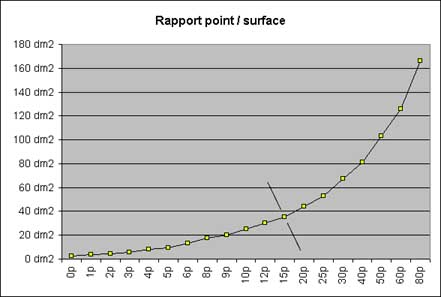
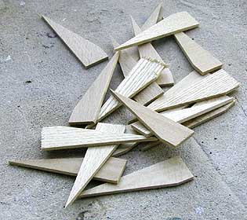

## Les châssis
### Les châssis de tableaux, usage en arts plastiques
 **Les châssis**

Le choix d'un format est essentiel dans la composition d'une oeuvre. A ce sujet, lire [passage _in La composition, éléments pour un débat_](composition.html#positionnement) et _[Les nombres spéciaux](nombresspeciaux.html)_.

Commençons par les formats rectangulaires. Il existe trois formats classiques :

> \* le format "figure", noté "F" (25 F signifie "_format figure, 25 points_"  ; il s'écrit 25 figure et non 25 figures), dont largeur et hauteur (ou longueur, si l'on préfère) sont les plus proches. Il est très utilisé, c'est le plus commun. Il est _en principe_ basé sur la juxtaposition de deux Marines, c'est-à-dire sur une multiplication par deux du [nombre d'or](nombresspeciaux.html#nombredor).
> 
> \* le format "paysage", noté "P", légèrement plus allongé. Il respecte théoriquement les proportions de la [porte d'harmonie](nombresspeciaux.html#portedharmonie).
> 
> \* le format "marine", nettement allongé. Ses dimensions sont censées respecter [la règle d'or](nombresspeciaux.html#nombredor).

Les rapports entre dimensions de chaque type ne sont pas réellement identiques en fonction de la taille du châssis (nombre de "points"). En fait, le passage au système métrique a pu entraîner une certaine confusion en raison de la persistance de mesures anciennes, ce qui explique les disparités. Celles-ci sont aujourd'hui si ancrées dans les habitudes que plus personne ne songe à les normaliser.

**Nb. points**

**Grand côté**

**Petit côté**

Figure

Paysage

Marine

0

18 cm

14 cm

12 cm

10 cm

1

22 cm

16 cm

14 cm

12 cm

2

24 cm

19 cm

16 cm

14 cm

3

27 cm

22 cm

19 cm

16 cm

4

33 cm

24 cm

22 cm

19 cm

5

35 cm

27 cm

24 cm

22 cm

6

41 cm

33 cm

27 cm

24 cm

8

46 cm

38 cm

33 cm

27 cm

9

50 cm

40 cm

35 cm

30 cm

10

55 cm

46 cm

38 cm

33 cm

12

61 cm

50 cm

46 cm

38 cm

15

65 cm

54 cm

50 cm

46 cm

20

73 cm

60 cm

54 cm

50 cm

25

81 cm

65 cm

60 cm

54 cm

30

92 cm

73 cm

65 cm

60 cm

40

100 cm

81 cm

73 cm

65 cm

50

116 cm

89 cm

81 cm

73 cm

60

130 cm

97 cm

89 cm

81 cm

80

146 cm

114 cm

97 cm

89 cm

100

162 cm

130 cm

114 cm

97 cm

120

Voir ci-dessous

_Le 120 a une dimension atypique, plus allongée. Il ne répond pas au "standard" de rapports hauteur/largeur. Pour cette raison, nous ne souhaitons pas le mentionner car il représente un risque d'erreur pour le calcul des rapports dimensionnels de surfaces plus grandes.  
Son petit côté est identique à celui du 100, à type de format identique.  
Il n'est pas du tout exclu que ses dimensions, très proches de celles de l'être humain adulte, "à un ou deux pieds sous la toise [(1)](chassis.html#note1)", aient soulevé un problème particulier lors du passage au système métrique._

Par ailleurs, il n'est pas rare d'évoquer des dimensions telles que 200 ou 300 Figure. Ces mesures sont en principe extrapolées à partir des règles anciennes évoquées ci-dessus.

Note : seul le 15P correspond précisément à un format de papier : le format [raisin](raisin.html).

Quelques considérations pratiques

Le nombre de points sert, pour de nombreux artistes, galeristes et intervenants du marché de l'art, à évaluer le prix d'un tableau, en lui appliquant une cote. Un moyen comme un autre puisqu'il faut bien une estimation de base. Cependant, le rapport point / surface n'est vraiment pas homogène, ce qui ne facilite pas les calculs ! Surtout, à partir de 15 points (petite ligne transversale), sa progression s'infléchit considérablement alors que ces formats sont actuellement les plus utilisés par les professionnels, parmi la gamme standard du moins.



En fait, le décimètre carré est beaucoup plus fiable, d'autant plus que Figures, Paysages et Marines ne sont pas les seuls formats qu'utilisent les artistes. Pourtant, il faut admettre que savoir qu'un 60 Figure est estimé à 2 000 €, 20 000 € ou 200 000 €, c'est assez parlant, tant à la vente qu'à l'achat évidemment, pour qui a l'habitude de raisonner en points.

Les autres formats

Les voici :

> \* le carré, qui se mesure en centimètres
> 
> \* le double carré, le triple, le quadruple, les multiples carrés, dont les deux dimensions sont mentionnées en centimètres également
> 
> \* le rond, dont le diamètre est indiqué en centimètres
> 
> \* l'ovale, dont le plus court et le plus long diamètres sont annoncés.

Tous les autres formats nécessitent un travail de menuiserie à façon ou bien l'emploi de châssis spéciaux, extensibles dans une certaine mesure. Le recours à la confection est de plus en plus courant, notamment parce que les artistes travaillent maintenant souvent sur de grandes surfaces aux dimensions non standard.



**Les clés**

Ce sont de petites pièces de bois à peu près triangulaires dont l'angle le plus aigu peut être glissé dans de petits orifices prévus à cet effet, disposés par paires à chaque angle intérieur du châssis (cadre et croisées).

Ce dispositif permet de retendre une toile détendue sous l'effet des années, par quelques tapotements légers, rien de plus.

En principe, les clefs d'un tableau exposé ne devraient être qu'à peine enfoncées pour permettre à l'acheteur de retendre la toile le plus longtemps possible. 

**Le bois**

Nous reconnaissons aisément les bois de conifères, très blancs. Certains fabricants proposent des variétés beaucoup trop jeunes, suant encore la résine, qui ont vite fait de polluer ou de pourrir toiles et oeuvres, sans parler du risque de _casse de bois vert_ lors de fortes tensions à la colle de peau. Nous disposons de témoignages concernant ce genre de cas finalement pas si rares qui nous poussent à inciter nos lecteurs à la plus grande vigilance : certaines réputations de savoir-faire, certaines renommées ne correspondent plus à la réalité, aux faits, c'est une chose constatée.

Les châssis faits de bois moins blancs sont effectivement plus fiables mais aussi beaucoup plus chers.

\_\_\_\_\_

(1) La toise était une mesure de l'ordre de deux mètres correspondant à la hauteur de l'instrument du même nom, servant à la mesure de la taille des humains.

Pour retourner au corps du texte, cliquer sur le bouton "Précédent" de votre navigateur.


 [Communication](http://www.artrealite.com/annonceurs.htm) 

[](index-2.html#20131014)


```
title: Les châssis
date: Fri Dec 22 2023 11:26:38 GMT+0100 (Central European Standard Time)
author: postite
```
