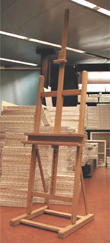
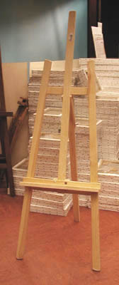
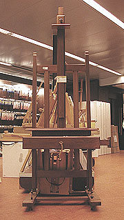

## Le chevalet
### Le chevalet, usage en arts plastiques
 **Le chevalet**



> Ils peuvent être pourvus d'une crémaillère plus ou moins perfectionnée - mais qui doit être solide ! -, d'un plateau à deux étages, et peuvent même, parfois, être disposés à l'horizontale. Ils peuvent généralement porter des châssis très grands.
> 
> Contrairement à une idée reçue, la plupart de ces chevalets peuvent être repliés et occupent alors très peu d'espace. Ils ne coûtent pas forcément très cher - c'est la nature et la qualité du bois qui détermine le positionnement dans les gammes de prix.  
> Il existe des chevalets de table à patins pouvant rendre de grands services.
> 
> \* **Les chevalets à quatre pieds**  
> Assez stables, certains sont particulièrement pratiques pour le travail à l'horizontale. Les modèles que nous connaissons n'autorisent cependant pas les travaux sur châssis de taille vraiment importante.  
> Leur prix est assez modéré.  
> Certains chevalet-boîtiers en bois ou en métal ont quatre pieds mais leur robustesse n'a rien de commun avec les chevalets d'ateliers à quatre pieds.



\* **Les trépieds** (photo ci-contre à gauche).  
Ils ont peu de stabilité mais rendent des services.  
Certains, en bois précieux, vernis, coûtent plus cher que de bons chevalets à patins. Ils ne semblent offrir qu'un intérêt décoratif.  
Les chevalets-trépieds de campagne les plus robustes sont probablement les modèles métalliques simples un peu lourds, donc plus stables (éviter l'aluminium et les boîtiers en fer blanc).

\* **Les chevalets sans pieds, dits « lutrins »**  
Le lutrin est un support destiné aux livres et non aux tableaux, l'Académie française et les dictionnaires sont bien clairs sur ce point.  
Pour des raisons pratiques, le chevalet sans pieds n'autorise que des usages limités - mais pas inexistants - puisqu'il requiert un meuble permettant de le poser à hauteur satisfaisante, ce qui pose un triple problème de fixité, de transportabilité et de dimension des tableaux et dessins. Il peut par contre faire office de présentoir, ce qui est la vocation du véritable lutrin sur lequel on pose généralement des livres précieux.

_Synthèse_

Les trépieds sont utilisé pour des études, dans des cours, sur le motif, ou bien comme accessoires décoratifs.

Les autres chevalets sauf la version sans pieds sont plutôt destinés à l'atelier.

La qualité des mécaniques et des bois (le sapin étant le plus médiocre), la finition des pas de vis, des mécaniques et l'ergonomie du chevalet sont des facteurs déterminants à l'achat.

Enfin, la taille et certains accessoires ou particularités peuvent déterminer l'usage possible :

> \* certains petits chevalets à patins peuvent être posés sur une table et rendre des services, y compris à l'extérieur.
> 
> \* pourvus de boîtes de rangement tenant lieu de socle - effectivement stable - se substituant aux patins, ils sont surtout destinés à être transportés.
> 
> \* les trépieds désignés comme "chevalets de campagne", avec ou sans boîtier, sont en bois ou en métal. Le poids est un facteur de choix très important pour ces modèles, pas tant du point de vue du confort lors du transport que de celui de la stabilité en cours de séance. Les modèles en aluminium ont à peu près disparu mais l'entrée de gamme continue à être constitué de chevalets légers, en bois. On ne peut pas peindre sur un support instable. Les modèles en métal d'un certain poids et d'une certaine robustesse sont finalement les plus confortables. 
> 
> \* certains trépieds de taille normale, en bois précieux, dûment vernis, ne peuvent être considérés que comme des objets décoratifs car il existe des modèles à quatre pieds ou à patins qui sont beaucoup plus pratiques pour un coût inférieur.
> 
> \* les modèles à patins, en chêne, dont les mécaniques autorisent l'emploi à l'horizontale, sont presque des objets d'art et à coup sûr des chef-d'oeuvres d'ingénierie et de savoir-faire. Ils donnent à l'artiste une grande liberté mais leur plein usage est limité à l'atelier. 



**Pour le rêve**, évoquons un type de chevalets splendides. A patins réglables - que l'on peut pourvoir de roulettes - leur flèche est double et peut atteindre une hauteur impressionnante. En chêne ou en hêtre, toujours vernis, leurs plateaux sont pourvus de tiroirs. Rien à voir avec des chevalets d'apparat : ces outils permettent réellement de travailler avec un grand confort, même s'ils n'autorisent pas absolument tous les formats. Leur coût n'est pas si élevé et peut généralement être discuté. Voir photo ci-contre.


 [Communication](http://www.artrealite.com/annonceurs.htm) 

[](index-2.html#20131014)


```
title: Le chevalet
date: Fri Dec 22 2023 11:26:38 GMT+0100 (Central European Standard Time)
author: postite
```
