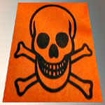

## Le chloroforme
### Le chloroforme, dissolvant, usage en arts plastiques
 **Le chloroforme**

_De [chlore](chlore.html) et (acide) [formique](formique.html)._

Sa structure moléculaire (formule brute CHCl3) est celle d'un [aldéhyde](aldehyde.html) dont l'oxygène est remplacé par trois atomes de chlore ou tout aussi bien une molécule de méthane - apparemment un précurseur courant - où trois hydrogènes auraient été remplacés par trois chlores.

Ancien anesthésique de très mauvaise qualité - peut-être encore utilisé marginalement de nos jours -, ce produit nauséabond est notamment obtenu par action du [chlore](annexe1.html#cl) sur [l'alcool](alcool.html), mais aussi par différents autres moyens.



C'est un produit globalement nocif et même, plus spécifiquement, très toxique par inhalation ou ingestion, pouvant aussi devenir cancérigène (informations [RepTox](liensutiles.html#csst)). Généralement gavé d'impuretés, c'est un polluant, notamment de l'air et des eaux où il ne se dégrade que lentement (particulièrement dans les eaux souterraines).

Il est d'ailleurs parfois extrait de l'eau de mer, mais plus souvent issu de combinaisons hydrocarbonées diverses, associées à du chlore. Ses usages les plus importants sont l'emploi comme gaz réfrigérant (le monochlorodifluorométhane, l'un des trop fameux CFC) et la transformation en toutes sortes de produits à base de macromolécules parfois fluorées, incluant notamment des colorants.

Le chloroforme est fortement [réfringent](refraction.html#refringent).

**Emplois en arts plastiques et domaines voisins**

Il faut tout d'abord préciser que la manipulation et le stockage du chloroforme nécessitent de grandes précautions.

Hormis la fabrication de colorants par des transformations complexes, il permettrait - c'est notable - de dissoudre [l'ambre](resinessolach.html#lambre), employé conjointement à de [l'essence de térébenthine](essences.html#essencedeterebenthine). Peut-être cette dissolution est-elle un peu trop intégrale : ce genre de procédés donnerait, selon [Xavier de Langlais](livres.html#langlais), "_des vernis assez médiocres_".

Le chloroforme ne semble pas non plus dans l'ensemble être un dissolvant particulièrement remarquable des autres résines.

On nous signale une possible utilisation de ce produit à des fins de soudure de plaques de plexiglas et d'autres verres organiques non déterminés. Nous manquons cependant d'informations au sujet de cette pratique.

Nous sommes à la recherche d'informations concernant les utilisations possibles du chloroforme en arts plastiques et décoratifs. [Toute information sera bienvenue.](ecrire.html)

\--> une information venant d'un lecteur précise que :

> "_Le chloroforme permet de "souder" les polystyrènes non extrudés comme l'OPS. Le collage est très résistant, immédiat et invisible.  
> Ce qui permet de faire des maquettes de conceptions très rapidement avec un fini blanc très propre.  
> Tout comme pour les plexis.  
> Je l'utilise pour réaliser des maquettes de mobiliers et en architecture._"

On rappellera que le chloroforme est un toxique et que ce type de manipulations ne peut être effectué que dans un environnement totalement sécurisé. Par ailleurs il existe des colles spéciales pour les polystyrènes.

Note : le chloroforme est une "fausse clé" enzymatique. Lire un [passage du chapitre IX des Dialogues de Dotapea.](chap09dextrine.html#chloroforme)


```
title: Le chloroforme
date: Fri Dec 22 2023 11:26:39 GMT+0100 (Central European Standard Time)
author: postite
```
