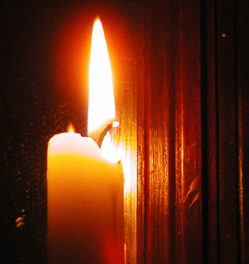
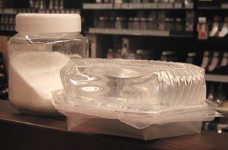
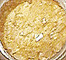

## La cire de bougie ou cire minérale
### La cire de bougie ou cire minérale, usage en arts plastiques
 **La cire de bougie  
et les cires minérales :  
cires et sculpture**

Toutes ces cires (sauf liquides, évidemment) doivent être fondues - généralement au bain-marie - pour être moulées.

Densité approximative : 0,9. Ce chiffre permet de mesurer la quantité de cire correspondant à un moule que vous aurez rempli d'eau pour en calculer le volume : compter environ 9/10èmes du poids d'eau.

.Les cires minérales peuvent être mêlées à des cires végétales ou animales afin d'en modifier :

> \* les propriétés plastiques
> 
> \* le point de fusion. [La cire de carnauba](cires.html#laciredecarnauba), par exemple, peut notablement élever ce point de fusion. Note  : cela peut rendre nécessaire une cuisson à feu direct.
> 
> \* la coloration, l'aspect.
> 
> > La coloration d'une cire peut aussi être artificielle. **Il y a tout à gagner à la réaliser "dans la masse".** La plupart des pigments peuvent être utilisés tant que la température de fusion est modérée (60-70°C environ).  
> > Les bougies sont un cas particulier et nécessitent des précautions. Il est dangereux d'utiliser du pigment pur : chauffé à quelques centaines de degrés à proximité de la flamme, il pourrait provoquer des émanations nocives ou d'autres réactions incontrôlables. Il existe des colorants spécifiquement adaptés.
> > 
> > Précisons de toute manière qu'une cire "liante", comme [la cire d'abeilles](cires.html#laciredabeilles) ou [la cire de carnauba](cires.html#laciredecarnauba), protègera beaucoup mieux le pigment qu'une cire trop chargée en [paraffine](paraffine.html).  
> > Avec une cire plus saturée telle qu'une cire minérale habituelle, le risque est que l'oeuvre se comporte elle-même comme... un gros pastel gras de mauvaise qualité ! Il faut trouver la bonne proportion. Faire quelques tests est facile. 
> > 
> > Enfin, au chapitre de la couleur toujours, précisons que les affirmations de certains auteurs, selon lesquels "_la cire peut être recouverte de peinture à l'huile_" sont plus que hasardeuses. Comme l'indique [Kevin Mac Cloud](livres.html#maccloud), une seule substance adhère à coup sûr à une cire : la même cire et éventuellement certaines autres cires. Nous ajouterons que cela n'est même pas garanti sans un réchauffement permettant une fusion, une soudure, comme dans le cas de la [paraffine](paraffine.html) par exemple.  
> > Il n'est quand même pas exclu _a priori_ qu'une cire saponifiée ou une encaustique adhèrent un peu à une cire modérément chargée de paraffine. A vrai dire, plus la cire du "support" est liante (cire d'abeille, de carnauba, mixage avec de l'huile de lin), plus la couche picturale a des chances d'accrocher - théoriquement. A l'inverse, plus une cire est chargée de paraffine (cire [saturée](saturation.html)), plus elle est un support misérable, y compris pour elle-même.  
> > Dans tous les cas, il faut impérativement réaliser des tests. Lors de ces tests, des variations provoquées de la température et des immersions prolongées dans l'eau tiède permettent de détecter d'éventuels points faibles.

**_Les cires et la sculpture_**

Sur Dotapea.com, nous essayons d'éviter autant que possible la segmentation du savoir (voir _[Thèmes](themes.html)_). Toutes les techniques peuvent contribuer à la réalisation d'oeuvres artistiques de qualité.

Cependant, il faut faire quelques distinctions.

Les cires peuvent être destinées à des emplois extrêmement différents :

> \* le coulage de métaux tels que le bronze (_cire perdue_) dans le but de créer une statue. L'original est entouré d'un matériau tel que la terre, qui jouera le rôle de moule. Il est percé de deux orifices. L'un sert à l'évacuation de la cire fondue, l'autre à l'introduction du métal en fusion. Cette technique est d'une grande complexité (voir notamment ci-dessous, _[Ajout de la cire autour d'un noyau](ciredebougie.html#inclusionnoyau)_).
> 
> \* le moulage d'une statue de cire suivi du coulage d'une autre matière (plâtre, barbotine, résine, etc.)
> 
> \* le coulage de matériaux à basse température dans des moules en cire.
> 
> \* la fabrication d'objets en cire tels que des bougies, bien sûr, mais aussi certaines oeuvres d'art éphémères.



**_Un exemple d'utilisation des cires minérales : la cire de bougie_**

Composition typique :

\* 80 à 90% de [paraffine](paraffine.html) (voir [image plus bas](ciredebougie.html#photoparaffine)), sous n'importe quelle forme (morceaux d'un centimètre, paillettes, cristaux), ou d'une imitation gélatineuse (à droite sur la photo ci-dessous) destinée aux bougies semi-liquides transparentes.

\* 10 à 20% de [stéarine](stearine.html) (poudre à gauche sur la photo ci-dessous) ou d'un mélange de stéarine et, dans le cas des imitations gélatineuses, de "cire minérale" (voir ci-dessous) en grains à parts égales.

Le produit qui a pour nom commercial (très imprécis, voire abusif) "cire minérale" chez certains fabricants - en fait, il s'agit d'une variété de [paraffine](paraffine.html) traitée - joue le rôle d'opacifiant qui diminue les coulées. Sont rôle est important lors de l'utilisation de gels.

Pour réaliser des bougies ou s'initier au moulage (voir ci-dessous), il est parfaitement possible d'utiliser comme matière première des bougies blanches toutes simples achetées en lots de dix dans un supermarché ou une droguerie. Il suffit de faire fondre les bougies dans une casserole (feu bien doux ou bain-marie) et de "pêcher" les mèches dans la cire en fusion à l'aide d'une fourchette. De cette manière, vous disposez d'emblée du matériel nécessaire et rien ne vous empêche d'ajouter des colorants, des opacifiants, etc.

On peut très bien s'initier aux problématiques du moulage (voir [Dépouille et contre-dépouille _in_ Le Moulage](moulage.html#depouilleetcontredepouille)) en travaillant avec :

> \* un peu de plâtre qui servira à prendre l'empreinte d'objets de formes diverses ([voir Le plâtre, mode d'emploi](platresculpt.html#leplatreemploicarac)). Utilisez de préférence pour commencer des modèles ayant une forme évasée (cela facilite le démoulage). Par la suite, moulez des objets plus complexes et travaillez en plusieurs pièces, par portions successives que vous laisserez sécher à chaque fois. Vous pouvez maintenir les pièces à l'aide d'élastiques ou de [chapes](moulage.html#chape).  
> N'oubliez pas d'enduire le modèle et le dessus des pièces déjà moulées avec un peu de [vaseline](vaseline.html) (par exemple) pour faciliter le démoulage. N'employez pas d'originaux coûteux ou fragiles ! N'essayez surtout pas de mouler le vivant directement avec du plâtre. Cette opération-là est beaucoup plus difficile et dangereuse qu'il n'y paraît de prime abord.  
> Note : si vous rencontrez trop de difficultés avec le plâtre, essayez peut-être l'argile.
> 
> \* de la cire de bougie préalablement fondue que vous coulez dans le moule enduit d'un peu de vaseline ou d'eau. A ce moment, n'oubliez pas la mèche si c'est une bougie que vous souhaitez réaliser ! Il existe un moyen très simple de se fournir en mèches et en cire de bougie : [voir ci-dessus](ciredebougie.html#simpleetpascher).
> 
> \* une fois la cire sèche, vous pourrez vous initier aux joies du démoulage final ! Heureusement, les cires minérales sont peu coûteuses et peuvent être réutilisées à volonté.

Avec ce matériel et ce type de procédés simples, vous pouvez explorer à peu de frais un bon nombre d'aspects du moulage (il est conseillé de lire l'article concerné --> [cliquer ici](moulage.html)). De plus, si vous avez acquis un certain "coup de main", vous pouvez parfaitement aller voir un [fondeur](liens.html#fondeurs), muni(e) de votre épreuve de cire (pourvue de _[noyaux](ciredebougie.html#inclusionnoyau)_ si possible) et lui demander de réaliser, à partir de celle-ci, un bronze à [cire perdue](ciredebougie.html#cireperdue)...

Dernières précisions : attention aux brûlures que peut occasionner la cire fondue. Elles sont rarement graves, mais doivent nous inciter à travailler dans une atmosphère calme. Le risque d'ignition causée directement par la cire fondue est pratiquement nul. Par contre, si vous souhaitez inclure des objets (ininflammables) dans la cire et que votre but est de réaliser une bougie, pensez que ces objets, eux, peuvent tomber lors de la fonte et communiquer leur chaleur à votre table, votre beau tapis persan ou encore à la boîte d'allumettes restée ouverte, là, juste à côté de la bougie...



Les produits gélatineux (voir photo ci-contre) sont susceptibles de flotter sur des liquides. Ils peuvent être colorés à l'aide de produits dédiés à cet emploi. 

**_Cire microcristalline et cire à modeler_**

Une cire "minérale" importante est la cire microcristalline. "_Disponible dans toutes les drogueries_" affirment certains, "_dans les magasins spécialisés_" dirons-nous plus prudemment, elle est employée dans la fabrication de cires à modeler. Elle a sensiblement les mêmes propriétés plastiques que la cire d'abeilles et l'a supplantée dans les ateliers grâce à son prix, nettement inférieur.

Une cire à modeler est typiquement composée de trois parts sensiblement égales en poids...

> \* de [paraffine](paraffine.html)
> 
> \* de [cire microcristalline](ciredebougie.html#cireamodeler)
> 
> \* de [colophane](autresresines.html#colophane) (petite photo ci-contre) à diluer préalablement dans l'alcool [à la manière d'une résine dammar](mediumdammar.html).

**Attention :** n'introduire la colophane diluée que lorsque les cires ont déjà fondu. Vous diminuerez ainsi très sensiblement les risques d'accidents inhérents au réchauffement de l'alcool - que vous devez éliminer totalement par une cuisson longue à feu doux, en remuant.  
Cette préparation doit impérativement être réalisée **au bain-marie sur une plaque électrique**. Éviter toute source de flamme à proximité. Aérer le local, le fermer en cas d'ignition.

Plus anciennement, de l'huile d'olive, du suif, du saindoux, de la térébenthine de Venise, de la poix et bien entendu de la cire d'abeilles étaient employés. Il s'agissait de précieuses recettes d'ateliers.

**_Cires à tailler, assemblages_**

La cire la plus conseillée pour la taille est certainement la [paraffine](paraffine.html) pure ([voir photo ci-dessous](ciredebougie.html#photoparaffine)).

Généralement, elle est coulée à l'état liquide dans un "moule" élémentaire parallélépipédique ou cylindrique traité à l'huile (vaseline), à l'eau (plâtre mouillé), pouvant être métallique, en caoutchouc silicosé, en bois ou fait de matériaux divers enduits de savon, etc. Une armature peut être incluse au sein du moule.

Les outils à employer sont banals. N'importe quelle lame, de préférence légèrement chauffée, fait l'affaire.

Les cassures peuvent être ressoudées par réchauffement (certains utilisent le fer à souder). De la même manière, des pièces modelées peuvent être ajoutées, collées à l'ensemble.

Des structures assez importantes peuvent être assemblées de la même façon avant ou pendant le travail.

Il est également possible de partir d'une masse à laquelle on a donné la forme, par moulage et coulage, d'une statue ou d'un objet existant.

**_Coulage de cire dans un moule_**

Le coulage ne pose aucun problème précis si ce n'est celui de la préparation, qui doit être adaptée au matériau constitutif du moule. Par exemple, un moule en plâtre peut être préparé simplement par une bonne imbibition d'eau, d'eau savonneuse ou de vaseline.

**_Inclusion d'un autre matériau dans la masse, lors du coulage ou par ajout de la cire autour d'un "noyau"_**

Quelle que soit la destination du travail, c'est une pratique qui a été assez courante, notamment lorsque la [paraffine](paraffine.html) n'était pas encore disponible. Il fallait alors utiliser une cire naturelle coûteuse. Lui substituer partiellement d'autres matières permettait de réaliser une économie très substantielle.

De plus, dans le cas du procédé "à cire perdue" destiné au coulage d'un bronze, l'économie porte aussi sur le très coûteux métal. Par ailleurs, l'inclusion d'un noyau permet de diminuer très considérablement le poids de l'oeuvre.

Par conséquent, le recours au "noyau" est encore tout à fait d'actualité dans les fonderies.

Différentes techniques existent en fonction du procédé de sculpture :

> \* cire perdue. Un noyau [réfractaire](refractaire.html) est sculpté en respectant assez grossièrement les formes de la future statue. La cire est appliquée sur ce noyau. Lors de la fonte, celui-ci est maintenu de sorte à ne pas tomber au fond du moule.
> 
> \* cas divers. Comme ci-dessus, on prépare un noyau de forme assez proche de celle de l'oeuvre à réaliser, cette fois-ci avec une argile banale. On trempe la terre dans la cire fondue que l'on laisse "prendre" partiellement autour de la masse. On retire l'ensemble "terre plus cire". A froid, celui-ci est découpé, la terre est éliminée et la cire assemblée de nouveau. Elle peut être sculptée à l'extérieur. Un noyau peut encore être réalisé après sculpture suivant différentes méthodes.
> 
> \* cas spécifique de la cire conservée telle quelle en tant qu'ouvre d'art - plutôt éphémère. C'est aussi le cas de la bougie moulée, notamment. Toutes les méthodes et bricolages permettant la formation d'un ou de plusieurs noyaux sont valables.


**_Conservation des surplus_** 

Verser la cire sur du [papier paraffiné](papier.html#papiercristal).

Celui-ci n'adhèrera pas.

**_Cas et usages particuliers_**

Il existe des "cires à modeler" prêtes à l'emploi. Elles sont vendues assez cher par très petites quantités dans les magasins de fournitures pour les arts plastiques. Nous ignorons leur composition. Comme substitut à ce produit, nous ne saurions trop conseiller [la cire microcristalline](ciredebougie.html#cireamodeler) préparée conjointement à d'autres produits, comme mentionné [ci-dessus](ciredebougie.html#prepaciremodeler).

La [cire d'abeilles](cires.html) peut être utilisée, mais au-delà de 10%, elle suppose l'emploi d'enduits au moment du moulage pour faciliter le démoulage car ce produit est collant (graisse [insaturée](saturation.html)). Il fond plus rapidement que la [paraffine](paraffine.html) (graisse saturée) et coûte plus cher mais sent très bon.

Les cires de bougies peuvent être parfumées à l'aide de produits spécifiques.

Un autre usage de la cire minérale est évoqué dans l'article [_Les réserves à la cire_](cirereserves.html).


 [Communication](http://www.artrealite.com/annonceurs.htm) 

[](index-2.html#20131014)


```
title: La cire de bougie ou cire minérale
date: Fri Dec 22 2023 11:26:40 GMT+0100 (Central European Standard Time)
author: postite
```
