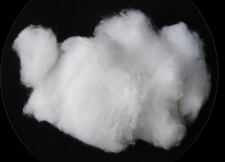

## Le procédé au coton
### Le procédé au coton ou ouate, usage en arts plastique
 **Procédé au coton**

_De quoi s'agit-il ?_

_En fait, de plusieurs procédés dont le point commun est d'associer le plus souvent des couleurs à l'état pulvérulent. Le coton (dans le sens de **ouate**) peut en effet emmagasiner beaucoup de poudre. L'utilisation du coton avec un liquide est traitée en fin d'article._

Sommaire

[Le coton et le pastel](coton.html#lecotonetlepastel)

[Pigments, coton et liant](coton.html#pigmentscotonetliant)

[Coton et liquides](coton.html#cotonetliquides)

_Le coton et le pastel_

Les pastellistes connaissent bien le coton. C'est l'un des rares outils qui autorise l'application d'une nuance extrêmement précise préparée par mélange.

Voici comment procéder :

1.  prélever la poudre des [pastels secs](pastelssecs.html) à mettre en mélange à l'aide de papier abrasif type papier de verre ou d'un couteau en râpant doucement
    
2.  mélanger les poudres dans les proportions souhaitées
    
3.  imbiber le coton de ce mélange
    
4.  appliquer le coton sur la surface picturale.
    



_Pigments, coton et liant_

Il s'agit presque d'un procédé par projection.

Un mélange pigmentaire (pigment pur) est recueilli à l'aide d'une portion de coton.

Parallèlement, la surface picturale est enduite de liant ou d'un mélange liant + diluant, exactement comme en [peinture à fresque](fresque.html).

Le peintre provoque la chute, sur ladite surface, du pigment contenu dans le coton par différents moyens (tapotements, balayage au doigt, etc.).

_Coton et liquides_

Dans ce domaine-ci, il s'agit souvent plus de retrait que de pose. Pourtant, on nous signale l'utilisation de coton pour les [réserves à la vaseline](cirereserves.html) et la peinture au [pochoir](pochoir.html).


 [Communication](http://www.artrealite.com/annonceurs.htm) 

[](index-2.html#20131014)


```
title: Le procédé au coton
date: Fri Dec 22 2023 11:26:44 GMT+0100 (Central European Standard Time)
author: postite
```
