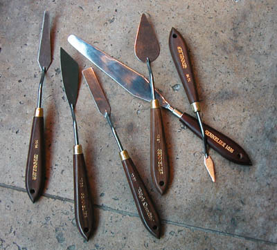

## Le couteau ou spatule
### Le couteau ou spatule, usage ne peinture et arts plastiques
 **Le couteau ou spatule**



Dans cette catégorie d'instruments, le plus classique et le plus utilisé est la spatule. Elle est coudée et doit donc être distinguée du couteau plat, dit "_couteau américain_" (voir image : il y a un grand couteau américain parmi les spatules).

Il est d'usage courant d'employer le terme "couteau" pour "spatule" bien que ce dernier soit peut-être préférable.

Voir aussi [truelle](truelle.html) et [spatule](spatule.html).

Les modèles asymétriques ont en principe une version pour gauchers et une version pour droitiers.

La spatule à peindre permet

> \* de mélanger des substances sur la palette
> 
> \* d'appliquer la pâte sur le support, souvent en [empâtement](empatement.html)
> 
> \* de "lancer" littéralement une peinture un peu liquide
> 
> \* de poser des enduits (ou de finir la pose des enduits) un peu comme avec un [sabre d'encollage](sabredencollage.html). Il faut cependant choisir le plus long modèle possible ! Nous avons constaté la faisabilité d'une enduction à la spatule réalisée à l'aide d'un outil de taille moyenne.


```
title: Le couteau ou spatule
date: Fri Dec 22 2023 11:26:44 GMT+0100 (Central European Standard Time)
author: postite
```
