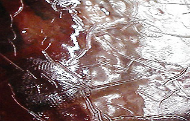

## Les craquelures
### Les craquelures, technique d'application de la peinture
 **Le craquelé**  _Du procédé chimique à la gomme laque bien maîtrisée_



Des procédés tout aussi chimiques mais plus manuels existent mais sont parfois un peu difficiles à mettre en oeuvre. Il s'agit tantôt de prendre "à rebrousse poil" la règle du [gras sur maigre](grassurmaigre.html), tantôt d'exploiter un "défaut" de la [gomme laque](gommelaque.html) : sa tendance très prononcée à craqueler en présence de chaleur (voir photo ci-contre, craquelures sur une laque de Coromandel). Cette dernière méthode est sans doute la plus simple des méthodes chimiques : avant le réchauffement provoqué, la laque peut avoir été recouverte d'une peinture à l'huile ou de [mixtion à dorer](mixtion.html) (donc d'une feuille d'or). Lorsque ces produits sont secs, poser le tout sur un radiateur, par exemple (certains emploient un sèche-cheveux). Surveillez bien, mais ne vous inquiétez pas, le résultat ne se fera pas attendre.

Nous ferons quand même pour l'instant la part belle dans cet article à une technique plus mécanique que chimique, bien connue des peintres décorateurs et pouvant être transposée dans d'autres domaines.

_Technique avec une toile_

Elle s'applique à un gesso blanc, mais pourquoi pas à une peinture colorée  ? L'important est d'utiliser une [gélatine](gelatine.html) comme la colle de peau par exemple (voir [Gesso  : histoire et fabrication, Fabrication maison](fabriquerungesso.html#2fabricationmaison)). D'autres produits conviennent probablement aussi, mais ceux-ci sont éprouvés.

On peint généralement sur une toile de lin fin non encollée tendue sur un plastique fixé sur une planche. Le nombre de couche détermine l'importance des craquelures : beaucoup de couches = beaucoup de craquelures.  L'application pourra être réalisée au [sabre d'encollage](sabredencollage.html) ou à la spatule, de sorte que la surface soit assez arasée.

On fait sécher, on ponce. Jusque là, aucune différence avec l'application standard d'un gesso sur une toile.

Le plastique et la toile peinte sont alors détachés et pour créer les craquelures, on fait glisser l'ensemble sur le bord de la planche - d'où l'intérêt de la feuille plastique qui facilite ce mouvement.

On peut se contenter de retirer à la main les écailles risquant de tomber par la suite, mais il est possible aussi de poncer.

Le reste de l'opération consiste à maroufler la toile sur le support désiré - sur lequel on aura pratiqué si nécessaire une enduction préalable.

_Technique avec la gomme arabique_

Nous ne l'avons pas encore éprouvée.

Il s'agit d'appliquer une première couche de peinture à base de [gomme arabique](gommearabaquar.html) (voire une eau gommée pure) la plus [réversible](liants.html#reversibilite) possible, puis, par-dessus, une épaisse couche de peinture vinylique classique, bien chargée d'eau pour faire gonfler la gomme arabique. La réversibilité assez faible de celle-ci pourrait rendre nécessaire l'adjonction de substances telles que la [dextrine](dextrinefarines.html) par exemple.

Dès que la couche de peinture vinylique a commencé à sécher, il est possible de peindre par-dessus avec de la peinture à l'huile ou d'appliquer de la feuille d'or avec une [mixtion](mixtion.html) à dorer.

Le support doit être placé à l'horizontale pour faciliter le déplacement de l'eau de la couche empâtée vers la surface inférieure.

Le principe semble bon. Il est certainement transposable à d'autres techniques.

Il est notamment employé comme base de travail pour la réalisation des faux cuirs (mobilier).

_Techniques du maigre sur gras_

Il s'agit de prendre à rebrousse-poil la règle du [gras sur maigre](grassurmaigre.html).

C'est une technique simple par le principe mais assez difficile à réaliser.

Voici la méthode classique (dont les variantes sont nombreuses) :

> \* le support doit être de couleur relativement claire. S'il est sombre, il faut inverser les valeurs, c'est à dire utiliser une couleur très claire en couche terminale.
> 
> \* appliquer une couche d'huile à peindre, de [toung](huiledenoix.html#lhuiledecanton) ou de [mixtion](mixtion.html) à dorer, adjointe éventuellement d'un [siccatif](siccatifs.html)
> 
> \* avant qu'elle soit vraiment sèche, au moment où elle est à la fois solide et légèrement collante, la couvrir d'[eau gommée](gommearabaquar.html#eaugommee). Si celle-ci est repoussée, ne pas hésiter à dégraisser la première couche à l'aide d'une [marne blanche](terresblanches.html#degraisserunematiereavecuneterreblanche) et recommencer. Il est possible d'utiliser une [dextrine](dextrinefarines.html) à la place de la gomme arabique
> 
> \* attendre quelques minutes puis masser
> 
> \* laisser sécher quelques semaines en un endroit chaud (pour ne pas solliciter la [réversibilité](liants.html#reversibilite) de la gomme arabique). Les craquelures sont censées apparaître durant cette étape.
> 
> \* préparer une peinture à l'huile (ou autre, grasse) de couleur sombre
> 
> \* l'appliquer de sorte qu'elle se fixe dans les craquelures (les creux), par exemple en essuyant à l'aide d'un chiffon. C'est cette opération qui révèlera les craquelures.

Le choix du liant utilisé en première couche permet de modifier les résultats. Certains utilisent, à la place d'une huile à peindre, un vernis au [polyuréthane](polyurethane.html) de bonne qualité. Cette pratique est contestée mais nous ne souhaitons pas prendre parti, ne l'ayant pas testée.

_Techniques au bitume et à la poix_

Le [bitume](noirs.html#lebitume) est un pigment assez misérable qui causa la perte de quelques chefs d'oeuvres par sa propension naturelle à craqueler. _Le Radeau de la méduse_, par exemple, faillit lui-même échouer sur cet écueil.

La [poix](poix.html) semble afficher sensiblement les mêmes caractéristiques.


 [Communication](http://www.artrealite.com/annonceurs.htm) 

[](index-2.html#20131014)


```
title: Les craquelures
date: Fri Dec 22 2023 11:26:45 GMT+0100 (Central European Standard Time)
author: postite
```
