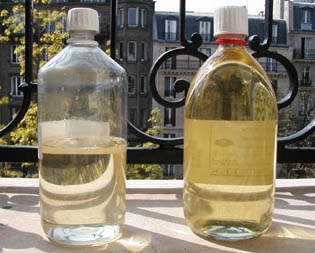
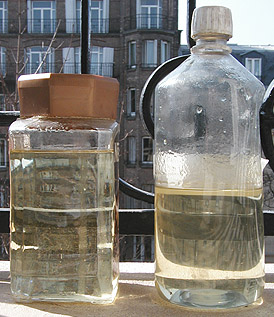
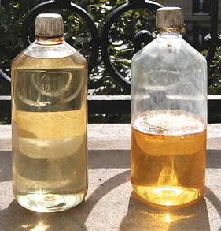
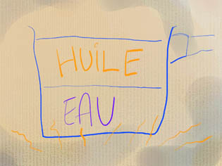

## La cuisine des huiles
### La cuisine des huiles, usage en arts plastiques
 **Cuisson et cuisine des huiles**

La meilleure préparations des huiles à peindre  :

"_Claircer_" l'huile, c'est-à-dire l'exposer au **rayonnement solaire** le plus longtemps possible, dans un lieu dégagé, lumineux. Par la suite, la clarté acquise pourra être partiellement perdue par un séjour prolongé dans l'obscurité, mais même dans ce cas, elle restera plus claire qu'une huile n'ayant pas subi ce traitement (cf. expérimentations de [Xavier de Langlais](livres.html#langlais)).

Le processus est donc bien irréversible ; il se distingue en cela de la réversibilité du jaunissement de l'huile de lin par exposition à la lumière (solaire, directe ou indirecte, ou même non solaire), lié seulement à sa photosensibilité.

Cela est dû, semble-t-il, à la lente action des rayons ultraviolets, qui pulvérisent littéralement les impuretés. Pour cette raison, le mois de mars est le plus propice car le rayonnement solaire est plus riche en UV dans cette période où les huiles exposées connaissent un accroissement sensible de limpidité.

Temps minimal d'exposition : dix mois environ (dont le mois de mars et la belle saison) pour une huile décolorée, quinze mois au moins pour une huile de lin clarifiée ou précuite en atelier.

Ces durées doivent tenir compte de l'état de la couche d'ozone, y compris en France - et bien plus en Australie, au Chili et en Argentine -, mais aussi des périodes de maximum d'activité solaire (voir [Activité solaire in Références](liensutiles.html#activitesolaire)). Les temps d'exposition proposés ci-dessus tiennent déjà compte du rétrécissement normal de la couche d'ozone par rapport à l'époque de l'invention du procédé : 15% de moins. La durée généralement retenue est d'un an. Comme on le verra plus loin, cela dépend du type d'huile.



A gauche, une huile de lin _décolorée_ exposée sur un balcon parisien depuis neuf mois (dont le mois de mars). A droite, une huile de lin _clarifiée_ claircée depuis deux mois. Juger de la différence des teintes et de la clarté vers le bas des flacons !

Note : les médiums et vernis au [mastic](resinemastic.html) pourraient être purifiés de la même façon.

Note 2 : certains auteurs préconisent la fermeture du récipient par une plaque de verre simplement posée. Une fermeture volontairement imparfaite. Cependant, le vent et la pluie peuvent réellement provoquer des catastrophes. Aussi conseillons-nous une fermeture hermétique, à la condition d'ouvrir le flacon tous les trois jours environ. En effet, l'apport d'oxygène est indispensable car il autorise une sorte de "pré-siccativation". L'huile est toujours prête à siccativer. Cela est très sensible après une période de l'ordre de deux semaines : un récipient en plastique peut se déformer sous l'effet de la baisse de pression et à l'ouverture, l'effet de succion est manifeste.

Un an plus tard, les résultats comparés sont instructifs :



Les positions sont inversées : l'huile clarifiée est à gauche, la décolorée à droite.

On aurait pu croire, comme l'annoncent fabricants et manuels de peinture, que l'huile clarifiée aurait peu changé en présence de lumière. Ce qui s'est produit en fait, c'est qu'elle a mis nettement plus de temps à réagir que l'huile décolorée, mais au bout d'un an elle est plus claire et continue encore à évoluer ! Le temps d'exposition optimal pourrait dépasser douze mois.

Au-delà de deux ou trois ans, attention, le résultat est désastreux ! Concernant les huiles décolorées, on parvient à des résultats comme ceux-ci :



A gauche, une huile exposée depuis trois ans. Elle est encore très claire mais commence légèrement à jaunir. Celle de droite est exposée depuis près de quatre ans ans. Elle a totalement changé d'aspect depuis déjà plus de six mois. La surface forme une sorte de croûte, le dessous est devenu trouble et a jauni considérablement. Elle est en plein processus de siccativation/polymérisation. Peut-être possède-t-elle certaines vertus, à l'instar d'une [standolie](cuisinedeshuiles.html#cuissonafeudirectverslastandoil), mais elle ne peut plus être considérée comme une huile à peindre. Noter que l'huile clarifiée donne le même résultat pour des durées du même ordre.

**Conclusion**

**pour l'huile clarifiée comme l'huile décolorée, ne jamais dépasser deux ans et demi d'exposition**

Une exposition de douze à dix-huit mois semble raisonnable en tenant compte de toute façon du quotient UV des lieux et de [l'activité solaire](liensutiles.html#activitesolaire).

Huiles claircées et cuisson

La cuisson des huiles, procédé délicat, n'avait pas atteint le niveau de contrôle de l'industrie contemporaine lorsque les maîtres flamands s'y essayèrent. Ils n'hésitèrent pas à travailler à des températures où les huiles commençaient à se polymériser. C'était un véritable cuisson - non un réchauffement - qui a fait naître le terme ambigu "huile cuite" ([lire texte _in_ Les autres huiles](autreshuiles.html#lhuiledelincuite)).

L'huile de lin bout à 387°C. Les traitements actuels permettent d'atteindre 380°C exactement, (mais plus souvent 290°C pendant 6 à 8 heures). Or, le seul moyen de contrôle dont disposaient les peintres anciens était la plume de poulet jetée dans l'huile, qui ne devait pas friser, ou bien la gousse d'ail, introduite en début de cuisson, qui également ne devait pas friser ! Pourtant, la qualité des peintures obtenues était parfaite ; une visite au Louvre suffit pour s'en convaincre.

Les anciens maîtres, qui pour la plupart cuisaient leurs huiles, préféraient les claircer _après cuisson_. Ce point est sujet à questionnement :

> \> pensaient-ils purifier par le soleil les scories apparues à la suite de la cuisson ?

Certainement !

L'huile de lin jaunit à la cuisson à partir d'une certaine température. _Il y a donc bien un intérêt, effectivement, à claircer l'huile **après**_. Même rendue moins photosensible par ce procédé, elle perdra en bonne partie sa coloration (voir photos ci-dessus).

Les cuissons

[Voir aussi _L'huile de lin cuite_ in _Les autres huiles_](autreshuiles.html#lhuiledelincuite)

Introduction

D'abord, il faut convier ici une petite polémique récurrente sur la matière du récipient à employer pour la cuisson :

> \* différents peintres s'accordent à rappeler que les anciennes recettes mentionnent toujours l'emploi de récipients en terre
> 
> \* certains autres, sans démentir l'intérêt de la tradition, mettent en avant un argument de poids : certaines terres peuvent se fendre, ce qui peut provoquer une catastrophe au cas où l'huile prendrait feu.

Nous préférons nous rendre à ce dernier argument, d'autant plus que certaines casseroles transparentes - ou autres récipients - permettent de mieux contrôler la cuisson.

Plus important encore sur le plan de la sécurité : 

> \* _nous déconseillons radicalement l'emploi de réchauds produisant une flamme (gaz)_
> 
> \* _le traitement à forte chaleur est difficile à mettre en oeuvre et à contrôler. A une température trop élevée, les vapeurs deviennent dangereuses. Informez vous impérativement auprès des pompiers sur les précautions à prendre._ 
> 
> \* au cas où de l'huile serait renversée, nous conseillons aux peintres de _**ne jamais jeter de l'eau sur de l'huile bouillante.**_

Donc, nous ne conseillerons pas à nos chers visiteurs de s'essayer à la fabrication de véritables huiles cuites à l'ancienne et autres standolies "à la flamande". Le sujet est cependant abordé, pour information, dans le paragraphe ci-dessous intitulé [Cuisson à feu direct, vers "l'huile cuite" et la standolie](cuisinedeshuiles.html#cuissonafeudirectverslastandoil).

Intérêt des cuissons :

> \* incorporation d'adjuvants (siccatifs, cires, etc.)
> 
> \* bonification de l'huile de lin, devenant plus visqueuse et plus stable à la lumière. Mais il ne faut pas se leurrer : le simple traitement au bain-marie ou par barbotage ne fournira pas de résultats très spectaculaires, voire aucun résultat !
> 
> \* un satiné plus net, plus fin. La remarque ci-dessus est également valable sur ce point.
> 
> \* une siccativité légèrement supérieure (si les températures sont assez élevées), même sans adjonction de produits siccatifs _sauf pour les cuissons trop proches de la température d'ébullition_ car le phénomène peut s'inverser : la [standolie](standolie.html), qui est certainement l'huile la plus cuite, est moins siccative qu'une huile crue. Par contre, une huile cuite deux ou trois heures à une température intermédiaire peut gagner en siccativité. Cette différence nous signale la présence de deux processus différents :
> 
> > \* l'incorporation d'oxygène (siccativation) favorisée par un excitation moléculaire modérée due à la chaleur
> > 
> > \* la polymérisation, c'est-à-dire la liaison entre molécules insaturées de même nature, à température plus élevée. Elle peut s'opérer indépendamment de l'intégration d'oxygène (comme dans le cas de la standolie).

Inconvénients :

> \* jaunissement-brunissement.  
> Pour obtenir un véritable changement de comportement de l'huile, il faut la cuire réellement. Mais sans même la faire bouillir, on la fait toujours un peu brunir. A l'opposé, une cuisson douce, même très prolongée n'altèrera pas la couleur, mais ne donnera aucun résultat probant (test réalisé au bain-marie pendant seize heures), c'est à dire aucune amélioration de siccativité, d'aspect ou de plasticité.  
> Le principal défaut de la cuisson des huiles semble donc bien résider dans le fait que l'amélioration obtenue est contrebalancée par une coloration peu souhaitable.
> 
> \* risques d'altérer radicalement la qualité de l'huile traitée :
> 
> > \* faire bouillir l'huile l'abîme irréversiblement
> > 
> > \* une huile trop polymérisée risque de devenir trop tirante, comme une [standolie](standolie.html). Il n'est cependant pas certain que ce phénomène se produise si la cuisson est réalisée en présence d'air. On ne se prononcera donc pas !

Remarques

L'accroissement de la siccativité est souvent l'objectif recherché dans la cuisson des huiles, mais quelquefois à tort : une huile trop siccative peut favoriser craquelures et plissements. L'emploi de résines favorisant la [réticulation tridimensionnelle](reticulation.html) peut faciliter une siccativation homogène. Les siccatifs au plomb, aux effets moins foudroyants que le manganèse (contenu par exemple dans le siccatif de Courtrai brun) ou le cobalt, sont conseillés pour la même raison.

[L'huile de noix](huiledenoix.html) (voir [huile noire](cuisinedeshuiles.html#huilenoire), ci-dessous) et [l'huile de lin](huiledelin.html) sont les huiles les plus couramment cuites, mais certains traitements très particuliers des pigments peuvent nécessiter un broyage dans une [huile de tournesol](autreshuiles.html#lhuiledetournesol) cuite, par exemple (voir [blanc de Jupiter](blancssynthetiques.html#leblancdejupiteroublancdebismuth)).

Modes de cuisson

La cuisson indirecte (barbotage, bain-marie) ne fournit évidemment pas les résultats obtenus par les procédés industriels (étuves spéciales), les températures - avoisinant 80°C - restant très éloignées des 290°C ou 380°C nécessaires à la polymérisation.

La "cuisson douce" ou "réchauffement" est donc couramment utile dans les cas de figure suivants :

> \* incorporation de [cires](cires.html) (opération courte qui peut être effectuée à feu direct car la fusion des cires témoigne de la température atteinte)
> 
> \* incorporation de [litharge](siccatifs.html#lalitharge)
> 
> \* incorporation [d'oléorésines](oleoresine.html)
> 
> \* incorporation de résines solides diluées dans l'essence (attention, la présence de fortes quantités d'essence implique des dangers très importants lors de la cuisson) et évaporation de cette essence.

L'intérêt du réchauffement, outre de faire fondre les cires ou s'évaporer les essences, est simplement de faciliter un mélange intime des différents éléments grâce à l'agitation moléculaire du liquide induit par l'accroissement de la température. Il n'est aucunement question ici de polymérisation de l'huile.



**Cuisson douce par barbotage**

Elle n'offre que peu d'intérêt depuis l'invention du bain-marie.

Pour mémoire, se référer au croquis ci-contre. Le temps de cuisson est en principe de deux à trois heures si votre but est l'incorporation d'un agent siccatif.

Un siccatif liquide (type Courtrai) peut être adjoint à froid, avant cuisson. La [litharge](siccatifs.html#lalitharge) (poudre) doit par contre est jetée "à plein feu". Le temps de cuisson est le même car de toute manière l'essence contenue dans les produits liquides s'évapore rapidement.

**Cuisson douce au bain-marie**

Seuls le procédé et le temps de cuisson changent. Pour incorporer un siccatif, il faut théoriquement trois à quatre heures, encore _a minima_.

**Cuisson à feu direct, vers "l'huile cuite" et la standolie**

Le principe est encore plus simple que dans les cas précédents : "on verse dans la casserole bien propre", pour résumer !

Hormis le cas particulier du réchauffement très doux et très court destiné à l'incorporation de cire ou d'autres adjuvants, il s'agit généralement dans ce type de cuissons de réaliser une véritable "[huile cuite](autreshuiles.html#lhuiledelincuite)" ou une [standolie](standolie.html).

Il faut insister sur le fait que _ce procédé est DANGEREUX._ Nous le déconseillons et nous ne le décrirons que sommairement, pour mémoire. Si vous souhaitez quand même réaliser ce type d'expériences, _renseignez vous auprès des pompiers sur les précautions à prendre._

_Un thermomètre adapté est indispensable car l'huile ne doit jamais bouillir. Restez aux environs de 290°C. Il faut se méfier des émanations._

_Si vous laissez cuire pendant 6 ou 8 heures, vous obtenez une standolie (qui ne peut être utilisée comme liant pur) à condition de vous arranger pour éliminer l'air du récipient. Une heure à 290°C (en présence d'air) est une durée raisonnable pour une huile cuite. Incorporer la litharge dès que cette température est atteinte._

_Comme vous pouvez cuire une huile pure plusieurs fois, n'hésitez pas à interrompre la cuisson, laisser refroidir quelques heures et contrôler la viscosité, sans oublier que passé un certain cap, vous perdrez en siccativité._

Huile noire

Recette ancienne, c'est une [huile de noix](huiledenoix.html) cuite (au bain-marie ou en barbotage, mais pas à feu direct) avec du [siccatif](siccatifs.html) à l'oxyde de plomb (2 à 3%).

Elle peut être utilisée au broyage, mais on l'emploie généralement comme médium pour les ébauches, les [jus](jus.html) allongés de térébenthine. On peut l'associer à de la [cire](cires.html) en très petite quantité pour figer les coulées ("méthode vénitienne"). Elle est très siccative.

[Lire le texte dédié à ce produit dans l'article sur les Autres huiles](cuisinedeshuiles.html#huilenoire).


 [Communication](http://www.artrealite.com/annonceurs.htm) 

[](index-2.html#20131014)


```
title: La cuisine des huiles
date: Fri Dec 22 2023 11:26:47 GMT+0100 (Central European Standard Time)
author: postite
```
