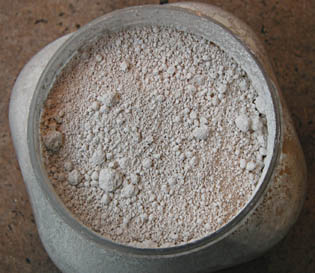

## Le dégraissage
### Le dégraissage de surfaces peintes, usage en arts plastiques et autres
 **Le dégraissage**  

Comment effectuer le dégraissage d'une peinture "grasse" ?

Dans le principe, c'est assez simple : il faut la [saponifier](saponification.html). Ces peintures ont en effet comme principe des [corps gras](gras.html#corpsgras), c'est-à-dire des [esters](ester.html) [triglycériques](t.html#triglycerides). Pour les "casser", les décomposer, il faut leur adjoindre un produit [alcalin](alcali.html). Mais lequel ?

[L'ammoniac](ammoniac.html) a un effet radical, même sur une peinture à l'huile sèche depuis des années. Il est si puissant que l'on peut le considérer comme un dissolvant plus que comme un dégraissant.

Un alcali moins violent est nettement préférable.

Par exemple, certaines peintures peuvent être dégraissées à l'aide de [blanc de Meudon](terresblanches.html#meudon), un produit dont la charge chimique est modérément alcaline.

Un procédé nous a été communiqué par un peintre professionnel spécialiste des imitations de marbre. Il s'applique à une peinture glycérophtalique servant de fond. Le voici, sans garantie de notre part, s'agissant ici d'un cas général :

> **\*** enduire la surface à dégraisser de blanc de Meudon (ou autre [marne](marne.html) - voir _[terres blanches](terresblanches.html)_) adjointe d'un peu d'eau à l'aide d'un chiffon, d'une brosse
> 
> **\*** laisser agir quelques heures, une nuit
> 
> **\*** rincer abondamment à l'eau.



Notre confrère assure expérience à l'appui que l'on peut travailler à la gouache sur une surface ainsi préparée.

A la question logique "_quel est l'intérêt de faire un fond glycérophtalique plutôt qu'acrylique ou vinylique ?_", il répond que le satiné particulier de cette peinture donne un rendu particulièrement intéressant.

Une peinture aqueuse telle que l'acrylique devrait pouvoir remplacer la gouache dans la plupart des cas. Il en va de même avec la sous-couche grasse, qui ne doit pas obligatoirement être glycérophtalique. Cependant, nous préconisons une grande prudence dès lors qu'il s'agit de travaux devant être conservés durablement. Des tests doivent être réalisés dans chaque cas, sur des périodes longues permettant de déduire la validité du procédé.

Les possibilités offertes, les enjeux de ces méthodes de dégraissage sont en fait très importants pour tous les peintres car ils ouvrent des possibilités de peindre _maigre sur gras_, une vieille gageure. Voir [Gras sur maigre.](grassurmaigre.html)

Voir aussi : _[Etonnant ! in Le liant acrylique](acrylique.html#etonnant)_ et _[Surprise ! in Le liant vinylique](vinyle.html#surprise)_.


 [Communication](http://www.artrealite.com/annonceurs.htm) 

[](index-2.html#20131014)


```
title: Le dégraissage
date: Fri Dec 22 2023 11:26:49 GMT+0100 (Central European Standard Time)
author: postite
```
