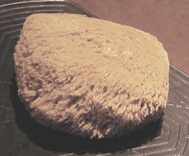

## Le dépouillé
### Le dépouillé, technique de retrait dans le frais, usage en peinture décorative ou autre
 **Le dépouillé**  



Cette technique s'effectuant par retrait est réalisée en deux temps :

> **\*** couvrir intégralement la surface de peinture
> 
> **\*** dans le frais, retirer la peinture à l'aide d'un outil propre pouvant être une [éponge](eponge.html) (très courant), un [chiffon](chiffon.html), une brosse, etc.

Selon

> **\*** le degré de dilution de la peinture et le stade de séchage au moment du retrait,
> 
> **\*** la quantité de diluant contenue dans l'outil de retrait et la fréquence du nettoyage de celui-ci,

on peut faire varier considérablement la clarté et la netteté du résultat, notamment en ce qui concerne les imprimés (empreintes de l'éponge, du chiffon).

**En fait, par extension, tout retrait de peinture dans le frais est considéré comme un dépouillage. Voir _[Le tamponné in L'imprimé et le tamponné](imprime.html#tamponne), [Le chiqueté](chiquetis.html),_ [_Le moucheté_](mouchete.html)_, [Le veiné](veinelisse.html)_.**

La peinture à l'huile appliquée en glacis très dilué apporte le maximum de confort grâce à la lenteur modérée de sa [siccativation](sechagesiccativation.html). Pour des raisons de sécurité, éviter absolument l'adjonction de [siccatif](siccatifs.html) si vous travaillez sur des murs ou du mobilier.


 [Communication](http://www.artrealite.com/annonceurs.htm) 

[](index-2.html#20131014)


```
title: Le dépouillé
date: Fri Dec 22 2023 11:26:49 GMT+0100 (Central European Standard Time)
author: postite
```
