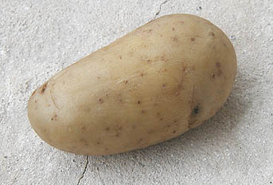

## Dextrine, farine
### Les dextrines, les farines comme liants, usage en arts plastique et autres
 **Dextrine, farine**

_Important : un chapitre des Dialogues de Dotapea  
est consacré à la dextrine et peut servir d'introduction.  
[Cliquer ici](chap09dextrine.html)_

_D'après les témoignages dont nous disposons, la [dextrine](dextrine.html) et les produits similaires sont des liants et des "liants/adjuvants" ou des enduits intéressants plus que de véritables bonnes colles._

_Ils sont tirés de [l'amidon](amidon.html), lui-même une colle ("[empois](empois.html)") à base de [fécule](fecule.html) provenant notamment de tubercules comme la pomme de terre. A noter que l'amidon proprement dit comme la dextrine ferait, dit-on, d'excellents apprêts pour plâtre et bois (voir_ [préparation du bois ou du plâtre avec de l'amidon](preparatboispeinture.html#preparationduboisouduplatreavecdelamidon)_)._



_La "colle de pommes de terres" a été utilisée - et l'est peut-être encore - dans certains pays pauvres ou mal approvisionnés en colles, entre autres comme substitut - médiocre - de colle à maroufler. Un usage dans la Pologne des années 1980 est attesté. Qu'en est-il aujourd'hui, là et ailleurs ?_

_**En tant que liant,** elle serait employée notamment par certains peintres décorateurs de théâtre qui en font ce qu'ils nomment des "**glacis à l'eau**" très réversibles - un terme employé dans différentes disciplines, désignant de multiples techniques. Elle se préparerait avec de la farine (de pomme de terre, de blé, de maïs, etc.) et de la [bière](autresliants.html#biere). Ce mode de fabrication (nauséabond, paraît-il), concerne peut-être [l'amidon](amidon.html) qui se prépare par dessiccation ou [hydrolyse](hydrolyse.html) acide de cette dernière - voir_ [préparation du bois ou du plâtre avec de l'amidon](preparatboispeinture.html#preparationduboisouduplatreavecdelamidon) - mais on nous a quand même bien signalé l'emploi de farine. [Toute information à ce sujet est bienvenue.](ecrire.html)

**Dextrine et colles de farines se diluent aisément dans l'eau.**

Ces procédés donnent un film dur mais très [réversible](liants.html#reversibilite), ce qui est un avantage ou un inconvénient selon le type de pratique artistique. Concernant le [pH](ph.html) des farines et de produits de cette famille, il semble qu'il soit en général neutre. Nous avons réalisés quelques tests qui ont laissé de marbre le [papier tournesol](papiertournesol.html). Mais c'est une information à vérifier au cas par cas lorsque les travaux à réaliser ont une certaine importance.

Par ailleurs, la dextrine peut être combinée à d'autres liants, notamment la [caséine](caseine.html) (également réversible mais pendant un temps limité, après quoi elle est devient permanente). Proportions classiques :

> **\*** Caséine soluble : 80-90%
> 
> **\*** Dextrine : 10-20%

Elle est parfois adjointe à la [gomme arabique](gommearabaquar.html) (assez fixe) avec laquelle la touche acquerrait un meilleur lissant. Mentionnons sa présence dans certaines aquarelles dites "fines" (par opposition aux extra-fines - voir [gammes](gammes.html)). Cette adjonction, compréhensible quand il s'agit de gouache, nous semble entrer en contradiction avec la "philosophie" même de l'aquarelle qui nécessite une faible [réversibilité](liants.html#reversibilite).

Elle est plus souvent employée pour la fabrication de gouaches en poudre ou en pâte et autres peintures destinées aux enfants.


 [Communication](http://www.artrealite.com/annonceurs.htm) 

[](index-2.html#20131014)


```
title: Dextrine, farine
date: Fri Dec 22 2023 11:26:50 GMT+0100 (Central European Standard Time)
author: postite
```
