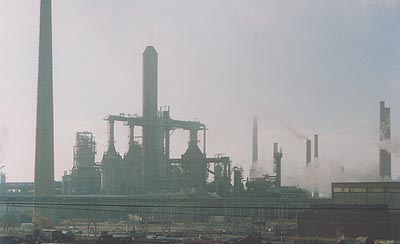

## Distillation et raffinage
### Distillation et raffinage, portée en arts plastiques
 Navig. page/section

[](toxicite.html)  
[](conceptsphysicchim.html)  
[](photoluminescence.html)

\_\_\_\_\_

**Pages soeurs**

[Les dialogues de Dotapea](dialoguesdotapea.html)  
[Les échelles](echelles.html)  
[Gaz, liquides, solides (phases)](gazliquidessolides.html)  

[Diluants, solvants, dissolvants](diluantssolvants.html)  
[La saponification](saponification.html)  
[Saturation](saturation.html)  
[Les liaisons entre atomes](liaisons.html)  
[La conduction électrique](conductionelec.html)  
[Oxydants/réducteurs/acides/bases](oxyreducacidesbases.html)  
[Oxydoréduction](oxydoreduction.html)  
[Les acides](acides.html)  
[Les alcalis](alcali.html)  
[Les sels, leur formation](formationdesels.html)  
[L'émulsion](emulsion.html)  
[L'ester](ester.html)  
[L'ion et l'isotope](ion.html)  
[Electronégativité, polarité](electronega.html)  
[L'onde](onde.html)  
[La tensioactivité](tensioactivite.html)  
[Cisaillement et compression](cisaillecompr.html)  
[Différenciation magmatique](differenciatmagma.html)  
[Pâtes, charges et agrégats](pateschargesagreg.html)  
[Le colloïde](colloide.html)  
[Toxicité, nocivité, pollution](toxicite.html)  
Distillation, raffinage  
[La photoluminescence](photoluminescence.html)

\_\_\_\_\_

Copyright © www.dotapea.com

Tous droits réservés.  
[Précisions cliquer ici](droitscopie.html)

**Distillation, raffinage**



Ces opérations sont des transformations de la matière que l'on a longtemps assimilées à des purifications ([lire passage _in Le raffinage_](raffinage.html#purificationtransformation)).

Le produit à traiter - assez souvent un [corps gras](gras.html#corpsgras) - peut être un liquide ou un solide mêlé ou non à un liquide. Il est disposé dans un [matras](matras.html), un alambic ou une colonne à distillation et chauffé en bas par ce que l'on nomme un "bouilleur", four, feu ou autre.

La vapeur engendrée se condense toujours en haut. La sortie, où l'on récupère différents produits, est appelée "condenseur" (bouilleur et condenseur sont des appellations toujours d'actualité).

Le résidu peut être récupéré en bas et éventuellement mis à profit comme on le verra plus loin.

Entre les deux, c'est la colonne à distillation seule qui autorise la _distillation fractionnée_. Il s'agit de séparer différents produits recueillis à différentes hauteurs de la colonne, comme expliqué dans l'encadré ci-contre. Ce procédé est d'une importance considérable pour l'industrie et l'ensemble du monde contemporain car il permet d'isoler avec une grande précision les "précurseurs" de la plupart des produits synthétiques, sans parler des carburants.

Dans une raffinerie de pétrole, le résidu est en principe le [bitume](noirs.html#lebitume) (on évoque aussi le fioul lourd mais cette information n'est pas confirmée), bitume qui connut une brève heure de gloire dans l'histoire des procédés de peinture. Dans une distillerie d'alcool, c'est un magma impropre à la consommation. Dans le cas de la [térébenthine](terebenthine.html), c'est la [colophane](autresresines.html#colophane).

Moûts, vins, marcs, lies, mélasses, fruits, grains, plantes aromatiques, [résines](resine.html), bois et goudrons de bois, pétrole, houille, [essences](essences.html), [eau](eau.html), entre autres, peuvent être distillés.

Certains produits ou mélanges de produits dits _azéotropes_ ne peuvent être distillés car leur vapeur est de la même composition que la substance initiale.

 

FONCTIONNEMENT

Le principe de la distillation consiste à séparer les produits en fonction de leur point d'ébullition.

Sachant qu'il y a un gradient du bas (chaud) vers le haut (froid) on récupère en haut les produits dont le point d'ébullition est le plus bas.

Ainsi, dans le cas contemporain d'une colonne, le "poids" au sens usuel ne joue aucun rôle, par contre en général les "grosses" molécules, i.e. celles de poids moléculaire élevé ont un point de distillation plus haut. On peut donc sélectionner les substances en fonction de leur poids moléculaire en les puisant à une hauteur (donc à une température) donnée.  
Ceci ne suffit cependant pas à isoler une molécule précise mais des molécules de même masse moléculaire.  
[Quelques précisions](essences.html#coupes) dans un passage de l'article _Les essences_ (coupes et tranches).

Dans le cas d'une distillation "simple" de type alambic, avec un seul point de collecte (en haut), comme on n'a pas le contrôle de la hauteur, on joue sur le temps : on récupère les composants volatils (alcools, arômes) au début de la distillation, les composants lourds (eau) à la fin.

Avec [Jean-Louis](quinoussommes.html#jeanlouis)

Appellations. L'appellation "rectifié" ou "doublement ou triplement rectifié" s'est appliquée - à juste titre ou non - à différents produits. Elle correspondrait à une forme particulière de distillation jouant sur des flux ascendants et descendants entre les différentes [phases](gazliquidessolides.html) des matériaux. La technique existe toujours mais l'appellation est devenue plus rare hors milieux industriels. Sur le terme _raffinage_ et sur différents aspects (notamment alchimiques) de ces techniques, lire l'article _[Le raffinage](raffinage.html)_.

Aspects historiques. Si la [fermentation](fermentation.html) est attestée au néolithique récent (avant 3000 BC à Skara Brae, dans les îles Orcades en Écosse), la distillation, elle, semble être venue plus tard, bien que la date et le lieu de son apparition ne soient pas connus. On sait seulement que des Celtes d'Écosse la pratiquaient pour fabriquer leur "_uisge beatha_" (littéralement _eau-de-vie_), probable ancêtre du scotch.

Depuis 2005, il est rare de voir comme par le passé un bouilleur de cru véhiculant son alambic sur une route de campagne car une loi a interdit la distillation à domicile. On ne distille plus de ferme en ferme mais dans un atelier public ou une coopérative. Ce n'est pas un scoop : le code pénal et le code des impôts semblent bien s'acharner, depuis longtemps déjà, sur ces agriculteurs chimistes. On aura donc bien du mal à croiser fortuitement un véritable alambic. Pour les jeunes générations, disons-le, c'est un instrument parfois fort impressionnant fait de toutes sortes de pièces de verre, une sorte de laboratoire de chimie posé sur une charrette ou une remorque.

Les distillateurs semi-artisanaux voire industriels utilisent parfois des alambics très simples, faits de cuivre ou d'autres métaux.

Dans le passé lointain, avant le verre et même les métaux, l'alambic et le matras ont pu être faits de terre cuite, voire peut-être de pierres. L'archéologie actuelle situerait les premières distillations au IIème millénaire BC en Mésopotamie (information non confirmée). L'avenir nous apportera peut-être des traces plus anciennes et des informations sur les usages impliqués (alcools, parfums, médicaments, ...).


 

 

 [Communication](http://www.artrealite.com/annonceurs.htm) 

[](index-2.html#20131014)


```
title: Distillation et raffinage
date: Fri Dec 22 2023 11:26:53 GMT+0100 (Central European Standard Time)
author: postite
```
