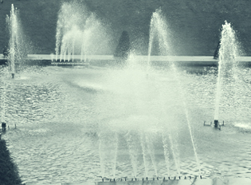

## L'eau
### L'eau, usage en arts plastiques
 **L'eau, les eaux**



_Par ailleurs, son aptitude à mettre des corps en solution ne doit surtout pas être sous-estimé. L'eau n'est pas une substance neutre (même si elle l'est sur le plan électrochimique lorsqu'elle est parfaitement pure), mais un liquide actif et réactif. Il suffit pour s'en convaincre de penser à son action sur de simples cristaux de sel de table, par exemple. Elle en détruit radicalement la structure ! Son action est puissante._

_Marc Havel et Gilbert Delcroix ([réf.](livres.html#delcroix)) l'écrivent : "_L'eau par son caractère [polaire](electronega.html#liaisonpolaire) détruit les liens [électrostatiques](electricite.html#electrostatique) entre les atomes et les molécules du corps à dissoudre et les remplace par de nouveaux liens avec ses propres molécules et conduit à une nouvelle structure._" (p. 112)_

_Structure de l'eau, liaison hydrogène :  
[lire passage in](liaisons.html#hydrogene)_ [Les liaisons entre atomes](liaisons.html#hydrogene)

_Viscosité de l'eau - l'eau, liquide newtonien :  
[lire](rheologie.html)_ [La rhéologie](rheologie.html)

_Les eaux_

_A signaler, une parenthèse sur  
l'eau oxygénée,  
dans le courrier des lecteurs.  
[Lien.](courrierdeslecteurs2011b050.html#20110607tg3)_

L'eau du robinet est assez chargée en éléments divers, [minéraux](selsmineraux.html) (métaux [alcalinoterreux](annexe1.html#alcalinoterreux), [alcalins](annexe1.html#metauxalcalinsnonalcalinoterreux), etc.), "chimiques" (hydrocarbures azotés, etc.), bactériens, végétaux.

Mais surtout, elle est adjointe de [chlore](blancssynthetiques.html#lechlore) en quantité variable, notamment en fonction de la pluviosité.

Cet élément et tous les autres composants indésirables interagissent, et attaquent souvent les pigments et les supports, d'où l'intérêt des eaux...

> \* **déminéralisées** : les sels minéraux sont éliminés par procédé chimique (séparation des anions et des cations puis élimination du CO2). On les trouve dans les grandes surfaces et les quincailleries. Leur conditionnement ne les met généralement pas à l'abri de certaines altérations.
> 
> \* **bouillies** : la plupart des microorganismes sont détruits (pour un temps limité), certains éléments indésirables peuvent s'évaporer, mais elles demeurent chimiquement impures.
> 
> \* **dégazées** : douze ou vingt-quatre heures de repos voire quelques semaines, cela permet d'éliminer une partie du chlore qu'une eau du robinet peut contenir. Une partie des métaux alcalins est décantée
> 
> \* **[distillées](distillationraffinage.html)** : _en théorie_, l'eau distillée _idéale_, c'est de l'eau pure H2O. En fait, sa pureté - comme celle de l'eau déminéralisée - est mesurable et dépend notamment du nombre de distillations. Chacun peut aisément distiller de l'eau et le résultat obtenu n'est d'ailleurs pas médiocre.
> 
> \* **osmosées :** suite à un courrier des lecteurs qui nous a fait nous pencher sur ce cas particulier ([lire l'article](courrierdeslecteurs2010c.html#20100921nm)), on peut considérer cette eau comme nominalement aussi satisfaisante qu'une bonne eau distillée pour des applications de type arts/décoration.
> 
> \* **ultrapures :** elle est à "usage biologique" (cf. le courrier cité ci-dessus), c'est-à-dire dénuée d'agents organiques.

Cependant, l'eau distillée fraîche a tendance à capturer le CO2 atmosphérique ([Delcroix et Havel](livres.html) la considèrent comme "_très réactive_" à cette molécule - p. 115) alors que décarbonater l'eau est l'opération préalable à la fabrication des eaux déminéralisées et distillées. Ce n'est pas sans raison que les flacons vendus en pharmacie sont pourvus d'un bouchon de caoutchouc pouvant être percé par une aiguille. Il n'est pas à exclure, en effet, que CO2+H2O donnent un petit peu de H2CO3 (acide carbonique) et de fait, une légère acidité peut être mesurée bien que cet acide se dissocie instantanément à son tour en présence d'eau (provoquant une réaction cyclique ?).

Il n'existe pas d'eau parfaitement pure - surtout à partir du moment où le contenant a été ouvert. De même, la collision de photons solaires à forte énergie (UV) dissocie les molécules, ce qui peut augmenter la probabilité de formation d'associations r-OH basiques et r-H acides, alors que de toute façon, la dissociation de H2O en H+ et OH- est un phénomène permanent, discret mais non négligeable. La chaleur joue un rôle car elle accentue la probabilité des "rencontres chimiques" indésirables - sans parler de la population bactérienne. Résultat (constaté) : l'eau distillée change progressivement, légèrement, de charge électrochimique, ce qui signifie qu'elle est perdue pour certains emplois.  
On la trouve en pharmacie.

_L'eau pour peindre_

Malgré le manque de neutralité que les eaux distillées et déminéralisées présentent dès qu'elles perdent de leur fraîcheur, elles sont toujours préférables, pour toute peinture à l'eau, à des eaux non traitées, car elles ne contiennent pas certains éléments communs aux autres eaux, qui sont sources d'altérations. Notamment, l'effet du chlore sur les couleurs est rapide et bien connu, de même que celui des métaux alcalins, lent mais beaucoup plus durable. Ces éléments ternissent considérablement les peintures.

Conseil prudent : quel que soit l'emploi auquel on la destine, conserver l'eau distillée ou déminéralisée au frais, à l'abri du soleil et vérifier systématiquement son [pH](ph.html) avant emploi.

L'eau que manipule l'artiste est impure car il ne travaille pas dans des conditions de laboratoire. Il faut donc s'accommoder de cette impureté.

_Pureté et gestion de l'impureté_

La question de la pureté est assez importante. Par exemple, il est déconseillé de verser de l'eau du robinet dans un pot de liant ou de colle acrylique ou vinylique : cela accélère la formation de moisissures qui - comme toute plante - font festin des sels minéraux. Les liants synthétiques aqueux, les tubes et les pots de peinture aqueuse sont en principe préparés à l'eau distillée ou déminéralisée.

Cependant, il est possible, moyennant quelques précautions, d'éviter l'emploi d'eaux "traitées". Par exemple, pour diluer du liant synthétique avec l'eau du robinet sans condamner tout le pot, il suffit de verser la quantité nécessaire dans un second récipient et de s'en servir sans trop attendre. Précaution supplémentaire : tester le [pH](ph.html) de l'eau avec du [papier tournesol](papiertournesol.html).

Une eau _contenant des [métaux alcalinoterreux](alcalinoterreux.html) (ex. : calcium, baryum) ou [alcalins](annexe1.html#metauxalcalinsnonalcalinoterreux) (ex. : sodium)_ et/ou du [chlore](blancssynthetiques.html#lechlore) laisse des dépôts blancs au séchage ou blanchit la couleur. Des oxydes métalliques se reforment au contact de l'oxygène, des [sels](formationdesels.html) apparaissent éventuellement. Il vaut donc mieux éviter l'eau du robinet car elle contient tout ce qu'il faut pour ternir vos travaux.

Pour rendre neutre une eau alcaline, ajouter un acide dans l'eau n'est pas très efficace : il faudrait auparavant oxygéner l'eau, ce qui n'est pas simple, laisser les métaux se précipiter, puis passer l'eau déminéralisée.

_L'eau de vos tests chimiques_

Plusieurs auteurs conseillent à juste titre l'emploi [d'eau distillée](eau.html#eaudistillee) pour les opérations délicates. Elle est indispensable pour certains tests qui nécessitent la mise en solution d'un produit dans une eau neutre. Par précaution, il vaut mieux vérifier le [pH](ph.html) de cette eau préalablement aux tests. C'est même indispensable.

En effet, comme indiqué ci-dessus, cette eau est réactive au carbone atmosphérique. Sans précautions (par exemple, si l'on ouvre le contenant plutôt que de le percer d'une aiguille), elle peut s'altérer et perdre sa neutralité. Un test qui n'est pas réalisé en laboratoire ne peut aucunement être parfait. Le fait de vérifier le pH de l'eau avant le test permet cependant de se faire une idée de la marge d'erreur des résultats du test à effectuer.

_L'eau des roches_

H2O est présente dans la croûte terrestre (plus d'1% de la masse). On la trouve aussi dans la plupart des météorites. Elle est initialement "figée dans la roche" et c'est la cuisson de celle-ci qui est à l'origine de la formation des océans et de la vie sur notre planète - et pourquoi pas quelques autres. Évidemment, l'utilisation concrète de cette information ne semble pas aller de soi. Si vous êtes dans le désert, rien ne dit que la calcination d'un rocher vous permettra d'étancher votre soif, cependant, dans certains domaines des arts du feu, elle peut s'avérer importante.

_Eau et feu_

A l'occasion de l'éruption de l'Eyjafjöll (Islande) du 14 mars 2010, on a pu lire dans la presse des expressions telles que "l'éruption est la conséquence de l'explosion de la glace au contact de la lave". Fallait-il les entendre au pied de la lettre, la glace explose-t-elle vraiment ou s'agit-il d'une figure de style ?

Pas de vulcanologues chez Dotapea pour répondre à cette question avec certitude, cependant on rapportera une intéressante information du [Reptox](liensutiles.html#csst) dans l'article consacré à l'eau :

> **Produits de décomposition  
> **Décomposition thermique: à plus de 1200°C., l'eau, sous forme de vapeur, se dissocie en radicaux libres (hydrogène et hydroxyle).

Ainsi, en présence de laves qui ont précisément cette température dans le cas de l'Eyjafjöll, la glace vaporisée peut se dissocier et devenir un gaz très explosif. Il est donc possible que l'expression "explosion de la glace" ne soit pas tout à fait usurpée. Sous réserve de confirmation. Et sans minimiser les phénomènes liés à l'accumulation de vapeur. N'hésitez pas à [nous écrire](ecrire.html) à ce sujet important car il concerne également les arts du feu.


 [Communication](http://www.artrealite.com/annonceurs.htm) 

[](index-2.html#20131014)


```
title: L'eau
date: Fri Dec 22 2023 11:26:54 GMT+0100 (Central European Standard Time)
author: postite
```
