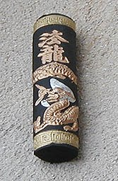
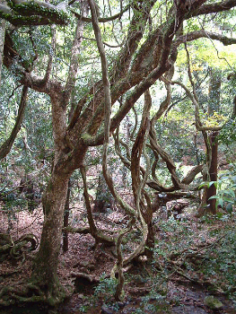
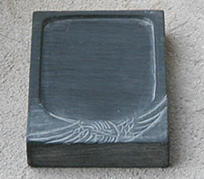

## L'encre de Chine
### L'encre de Chine, fabrications et emplois
 **L'encre de Chine**  

_C'est certainement l'encre la plus riche en qualités. Elle peut être appliquée à la plume, au [calame](calame.html) ou au pinceau (entre autres) et sert aussi bien, depuis des temps immémoriaux, à la peinture qu'à l'écriture._

_Selon certaines sources non confirmées, elle aurait été utilisée dès 2500 ou 3000 BC. Sa fabrication "industrielle" remonterait à 1500 BC._

**Sommaire**

[Préparation traditionnelle](encredechine.html#preparationtraditionnelle)

[L'encre de NARA](encredechine.html#lencredenara)

[Utilisation](encredechine.html#utilisation)

[Fabrication d'imitations](encredechine.html#fabricationdimitations)

_L'enjeu qu'elle représentait était si important que la très puissante administration chinoise nomma des "administrateurs de l'encre" chargés d'en surveiller la fabrication._ 

**Préparation traditionnelle**

Sa composition exacte est encore inconnue de nos jours, non sans raison car il s'agit d'un secret. Nous croyons savoir, cependant, que l'encre de Chine contient _notamment_

> \* un pigment à base de [noir de fumée](noirs.html#lenoirdefumee) bien particulier obtenu par la calcination d'_un mélange d'huile de sésame et d'ivoires divers broyés très finement_, donnant, à l'aide de multiples lampes à huile, une suie aux caractéristiques bien définies. Ce type de noirs a été utilisé en Chine dès le IIIème millénaire BC avant même l'invention de l'encre.  
> Sur le mélange eau/noir de fumée, [lire passage in Les dialogues de Dotapea, chap. I, A propos des liants](chap01liants.html#stabiliteencredechine).
> 
> \* une [gélatine](gelatine.html) pas clairement identifiée. Certains évoquent une "colle de boeuf". On mentionne aussi la _gelée de cerf_ et la colle de poisson... La recette a pu varier au fil du temps. Lire ci-dessous _[L'encre de Nara](encredechine.html#lencredenara)_.
> 
> \* du [camphre](camphre.html) dilué dans l'alcool et/ou un musc, des épices, des huiles (on mentionne notamment les huiles de colza et de sésame), etc.
> 
> \* du sucre, introduit dans le processus sous forme diluée dans l'eau.



Le noir de fumée et la colle seraient cuits ensemble durant environ six heures. C'est le point le plus critique de la fabrication car il est très difficile de mêler noir de carbone et liant aqueux. C'est dans cette phase que résident les secrets de fabrication les plus importants.

La préparation, après le premier séchage des bâtonnets (ou autres formes), détermine la qualité de ceux-ci : ils sont placés une semaine dans une cendre humide changée deux fois par jour, puis, de nouveau séchés pendant 15 à 45 jours en fonction de la qualité recherchée. Ils sont ensuite lissés au pinceau et polis avec un coquillage avant d'être décorés avec des motifs en or et en argent (voir photo), puis sont éventuellement enduits de [sucre](sucre.html) ou d'autres ingrédients solidifiants.

On mentionne aussi des préparations à base de pin, de graisse de porc, de fer, de poudre de charbon, etc. Les encres obtenues n'étaient pas ce que nous nommons "encres de Chine", mais elles furent aussi utilisées en peinture et en écriture.



**L'encre de NARA**

Au Japon, le lieu de fabrication traditionnelle des encres de Chine est à Nara (information confirmée), une cité très emprunte de culture bouddhique et de traditions shinto. Le rayonnement de ce centre de production est international. Donc l'une des meilleures encres de Chine (Indian ink en anglais) serait fabriquée au Japon. De quoi se poser quelques questions telles que : parlons-nous d'une seule et même substance, les Occidentaux n'ont-ils pas une vision un peu confuse de ces produits ?

Quoi qu'il en soit, voici ci-contre une photo prise dans la forêt de Nara (inscrite au patrimoine international). Parmi les essences uniques que l'on y trouve, il existe un arbre nommé KUZU. On tire de ses racines une poudre qui permet de réaliser une gélatine très visqueuse.

Cette gélatine entre-t-elle dans la composition des encres de Nara ? Nul ne saurait l'affirmer. Si c'est le cas, c'est certainement en très faibles quantités car elle se liquéfie vers 20 ou 25°C et présente un [pH](ph.html) 6, donc non neutre.

Son emploi est théoriquement alimentaire. Cependant, la coïncidence géographique est troublante, d'autant plus que la gélatine est sans doute l'élément le plus important de l'encre de Chine, celui sur lequel de nombreuses recherches ont dû être effectuées, celui sur lequel le secret industriel s'est imposé très tôt, comme nous le disions.

**Utilisation du bâton d'encre**



En principe, une bonne encre est brillante à la cassure. Un petit sacrifice n'est pas inutile. N'hésitez pas à casser le bâtonnet pour vous assurer de sa qualité.

Il suffit ensuite de diluer le bâtonnet dans l'eau sur une pierre à encre (voir photo). L'application se fait généralement au pinceau, au [calame](calame.html) ou à la plume.

L'encre de Chine vendue sous forme liquide est plus homogène - et plus pratique - que l'encre des bâtonnets dilués.

**Fabrication d'imitations**

Voici ci-dessous une recette permettant de fabriquer une encre très semblable à l'encre de Chine solide. Nous vous la livrons sans aucune garantie car nous ne l'avons pas testée. Merci de [nous communiquer vos observations expérimentales](ecrire.html). Une autre recette nous est parvenue mais nous ne souhaitons pas la divulguer car elle met en oeuvre de la [potasse](potasse.html), ingrédient bien trop dangereux à manipuler en atelier ou dans une cuisine. Voici donc la recette sans danger dont nous parlions. Les quantités indiquées sont des poids et non des volumes.

> \* Préparer une [caséine](caseine.html#preparationnormale) et la faire bouillir.
> 
> \* Incorporer du [noir de fumée](noirs.html#lenoirdefumee) (100 parts) et du [camphre](camphre.html) (3 parts). La quantité de ce mélange par rapport à celle de caséine est laissée à discrétion du préparateur. A titre indicatif, nous rappelons que le rapport liant/pigment en peinture est souvent de 1 pour 2, mais doit absolument être ajusté aux spécificités du pigment.
> 
> \* Faire sécher dans des moules.

En ce qui concerne l'encre de Chine liquide, nous avons trouvé des recettes invraisemblables, dangereuses et incorporant des éléments introuvables. Nous vous livrons la seule qui nous ait semblé raisonnable à tous points de vue avec la même réserve exprimée ci-dessus : nous n'avons pas testé ce procédé. Les quantités sont des poids. Elles sont approximatives et doivent être adaptées aux produits choisis. Il ne s'agit pas, de toute façon, de réaliser une véritable encre de Chine.

> \* préparer une colle à la [gélatine](gelatine2.html)
> 
> > \* gélatine : 150 parts (ce chiffre sert d'étalon pour le reste de la recette)
> > 
> > \* eau : à votre discrétion, suivant le tirant désiré (voir _[Colle de peau](colledepeau.html)_). Utiliser de préférence une eau déminéralisée ou distillée (voir _[L'eau](eau.html)_)
> > 
> > \* le temps de cuisson variera en fonction du type de gélatine employée
> 
> \* à chaud, incorporer 100 parts de [noir de fumée](noirs.html#lenoirdefumee)
> 
> \* laisser mijoter quelque temps au bain-marie
> 
> \* ajouter de la [glycérine](glycerine.html). Dans les recettes plus anciennes, on employait du sirop de sucre épais. Dans un cas comme dans l'autre, cet apport est important car il détermine la fluidité de l'encre. Certaines sources évoquent une quantité énorme de glycérine (9,5%, à comparer avec les 5% au maximum dans la [fabrication de l'aquarelle](gommearabaquar.html#fabrication)). Certes, une encre doit être liquide, mais la substance dont il est question n'est pas anodine : c'est un trialcool susceptible de réagir à tout élément acide. C'est pour cette raison qu'il n'est généralement incorporé qu'à faible dose.

Merci de [nous faire part de vos expérimentations](ecrire.html).

Lire aussi _[Le lavis](lavis1.html)_, _[La sépia](sepia.html)_, _[Le brou de noix](broudenoix.html)_, _[La sanguine](sanguine.html)_.


 [Communication](http://www.artrealite.com/annonceurs.htm) 

[](index-2.html#20131014)


```
title: L'encre de Chine
date: Fri Dec 22 2023 11:26:57 GMT+0100 (Central European Standard Time)
author: postite
```
