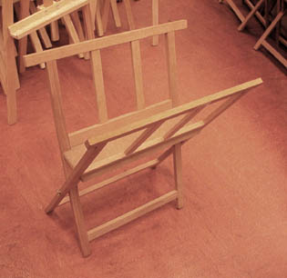

## L'entretien, la restauration
### L'entretien, la conservation et la restauration, arts plastiques
 **Entretien, restauration**

_Il est très difficile d'aborder le sujet de la conservation des oeuvres, de même que celui de la restauration car il s'agit de spécialités professionnelles nécessitant une expertise de très haut niveau._

_Nous nous contenterons donc de donner quelques conseils élémentaires permettant de limiter la détérioration de travaux comme les aquarelles, les dessins, les tableaux peints à l'huile._

Sommaire

[Aquarelles et dessins](entretienrestauration.html#aquarellesetdessins)

[Tableaux sur toile](entretienrestauration.html#tableauxsurtoile)

[Sur châssis](entretienrestauration.html#surchassis)

[Sans châssis](entretienrestauration.html#sanschassis)

_La conservation ou la restauration d'oeuvres de valeur sont du domaine d'intervention des professionnels._

**Aquarelles et dessins**

Dans des conditions correctes de conservation, ces techniques tolèrent généralement mieux que les tableaux un stockage durable. Seuls les [pastels secs](pastelssecs.html) et, dans une moindre mesure, les [fusains](fusain.html), posent de réels problèmes de par leur pulvérulence.

Une disposition simple et efficace peut être prise pour toutes les techniques : les travaux peuvent être mis à l'abri de la lumière, bien à plat dans des **cartons à dessins**.



Précautions :

> **\*** utiliser des supports papier non acides
> 
> **\*** les dessins au fusain, au pastels secs, à la mine de plomb et au crayon doivent avoir été correctement enduits de [fixatif](fixatifs.html). Ne pas lésiner sur les quantités, surtout avec les pastels secs.
> 
> **\*** éviter de trop remplir les cartons : ils se déforment très facilement. A partir d'une certaine quantité de cartons à dessin, une ou plusieurs chèvres (voir photo) deviennent très utile car par leur maintien elles diminuent le risque de déformation et facilitent la consultation
> 
> **\*** éviter les cartons à dessin à bas prix en [carton gris](cartons.html#lescartonsgris) brut : cette substance est acide. Vous pouvez aisément créer vos propres cartons à dessins avec deux feuilles de [carton bois](cartons.html#cartonbois) ([pH](ph.html) neutre), quelques morceaux de scotch toilé et des bouts de ficelle ou des rubans.
> 
> **\*** placer entre chaque dessin ou aquarelle une feuille de [papier cristal paraffiné](papier.html#papiercristal) afin d'éviter friction et adhérence. Pour faire tenir le papier cristal sans le coller, il suffit de le couper deux fois plus haut que la feuille à protéger et de le plier en deux par-dessus celle-ci.
> 
> **\*** éviter les atmosphères humides.

**Tableaux sur toile**

Eux aussi doivent être stockés à plat et non roulés (lire l'article sur le [roulage des oeuvres](oeuvresroulees.html)), même si dans le cas de l'acrylique le risque de détérioration est inférieur. Dans l'ensemble, nous dirons qu'un tableau est fait pour être exposé et non "stocké". Dans le cas de l'exposition sur un mur, nous donnerons seulement deux indications :

> **\*** éviter que les tableaux soient exposés directement à la lumière solaire car cela risquerait d'affecter les pigments et les liants quels qu'ils soient. L'éclairage doit être assez homogène pour éviter les phénomènes locaux.
> 
> **\*** dans le cas de peintures à l'huile vernies, faire remplacer le vernis par un restaurateur au moindre signe de détérioration, de jaunissement excessif.

La conservation à plat à fins de stockage est un tout autre domaine. Elle peut être effectuée de deux manières :

> **\*** sur châssis. Il est important de s'assurer qu'aucune toile n'exerce une pression sur une autre toile et qu'aucune adhérence ni friction n'est infligée sur les surfaces peintes.
> 
> **\*** sans châssis, en piles ou dans des cartons. Nombreux sont les peintres forcés par manque d'espace de stocker leurs tableaux de cette manière vraiment peu satisfaisante. Le danger principal est l'adhérence des surfaces peintes, leur viscosité même à sec. Il est possible de limiter les dégâts en interposant entre chaque tableau une feuille de [papier paraffiné](papier.html#papiercristal) et surtout en n'entassant pas des tableaux trop frais (attendre au moins deux ou trois ans, un peu moins quand la matière est maigre). Il est prudent d'effeuiller régulièrement la pile de tableaux et d'écarter ceux qui entameraient un processus d'adhérence. Le danger secondaire concerne les peintures à l'huile. C'est le noircissement consécutif au manque de lumière. Une exposition prolongée à la lumière permet cependant de retrouver la clarté initiale (huiles de bonne qualité).

Dans tous les cas, il faut stocker les tableaux en des lieux peu humides et vérifier régulièrement leur état. Une foule d'autres dispositions doivent en principe être respectées, mais cela déborde du cadre de notre documentation.


 [Communication](http://www.artrealite.com/annonceurs.htm) 

[](index-2.html#20131014)


```
title: L'entretien, la restauration
date: Fri Dec 22 2023 11:26:58 GMT+0100 (Central European Standard Time)
author: postite
```
