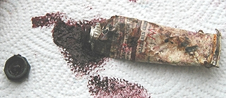

## Les gammes
### Les gammes de peintures
 **Les gammes**

Nous nous permettrons d'élargir le constat : il s'agit d'un **_coût de fabrication_** plus ou moins important se traduisant, dans les faits, chez les plus professionnels par une baisse du taux de pigmentation et chez les moins honnêtes par une baisse de qualité massive de tous les composants ayant parfois pour résultat - inadmissible - l'impossibilité de mélanger deux couleurs de la même gamme sans obtenir une véritable mélasse inutilisable.

On observe d'autres procédés relativement compréhensibles entraînant aussi une baisse du coût de production comme par exemple une fréquence plus basse des contrôles de qualité en usine. Cette logique peut cependant, elle aussi, aboutir à des aberrations (fuites fréquentes avérées pour certaines gammes).

Autres pratiques plus compréhensibles :

> \* la substitution des couleurs les plus chères par des imitations. Les onéreux [cobalts](cobalts.html) et [cadmiums](cadmiums.html) sont remplacés (nommément) par des [phtalos](phtalocyanines.html) et autres [azoïques](azoiques.html). 
> 
> \* la réduction des gammes de couleurs. Elle permet de proposer une offre correspondant au gros de la demande, évitant l'immobilisation prolongée de produits connaissant une demande plus rare.

_**Qualité et transparence de l'information**_

Pour le reste, la question de la qualité des produits n'a pas de réponse univoque. Bien souvent, c'est la transparence de l'information fournie à l'acheteur qui fait la qualité car elle seule autorise une utilisation optimale des produits.

Il est possible d'énumérer des question de base très déterminantes pour l'acquéreur :

> \* comment le fabricant nous informe-t-il de la composition de son produit, mais aussi de sa nocivité éventuelle ?
> 
> \* le fabricant nous offre-t-il une gamme de couleurs miscibles entre elles, et si non, ou si le produit n'est utilisable que sous certaines conditions (ce qui peut être admissible), nous le signale-t-il ?
> 
> \* le fabricant nous propose-t-il un produit conforme à ce qu'il annonce : vais-je vraiment acheter de l'aquarelle ou bien un fac-similé à la [dextrine](dextrinefarines.html) ?

D'autres question peuvent se poser mais nous avons considéré que celles-ci étaient particulièrement déterminantes en termes de qualité.

Comme nous le disions, la question de la miscibilité se pose avec acuité en entrée de gamme (quand le fabricant ne parle pas encore de peinture "fine"). La question de la toxicité, elle, se pose à tous les niveaux. Elle est fonction de la réglementation - sujette à variations périodiques - mais aussi de l'honnêteté du fabricant. Si vous parvenez à détecter la composition d'un produit (pourquoi pas à l'aide de [notre nomenclature](nomenclaturepig.html) en ce qui concerne les pigments ?), vous pouvez interroger les répertoires toxicologiques internationaux en ligne (cf. [adresses en ligne dans les références](liens.html#enligne)) et vous renseigner sur leur comportement intrinsèque et leurs [incompatibilités](pigments.html#compatibilitesetincompatibilites) éventuelles avec d'autres produits.

_**Les liants sont aussi un point capital**_

Certaines marques ont résolu d'adopter une totale transparence quant à la composition des produits et particulièrement des liants - non sans la pression de personnalités importantes du monde des Beaux-arts.

Cependant, nous sommes au regret de constater que certains fabricants régressent sur ce plan, y compris en ce qui concerne leurs gammes extra-fines, ce que ne peuvent que déplorer peintres, vendeurs, distributeurs et intermédiaires.



Il est déplorable que des décisionnaires vraiment très mal informés continuent à considérer ces produits et leurs acheteurs (de l'intermédiaire au client final) sans le respect qui leur est nécessairement dû dès lors que l'argument de la qualité supérieure est avancé (puisqu'il s'agit de gammes "extra-fines"). Les laboratoires mettent au point des produits de qualité - ce qui représente un investissement à rentabiliser - et le consommateur les paye à bon prix. Il est absolument nécessaire que celui-ci sache ce qu'il peut en attendre et comment il peut s'en servir. Sans parler du détaillant censé donner au client fidèle une explication au sujet de ce retour inattendu de l'opacité de l'information ! Il s'agit là de graves erreurs commerciales qui signalent un état d'esprit ne pouvant susciter qu'un rejet.

_**Les couleurs mono ou polypigmentaire****s** **déterminant la qualité des gammes : un débat déplacé**_

La question des couleurs "monopigmentaires" est évoquée par quelques peintres, enseignants et détaillants. La théorie veut qu'une couleur issue d'un mélange préalable ait tendance à grisailler lors d'un mélange ultérieur, ce qui pousse certains peintres à rechercher particulièrement les couleurs monopigmentaires. Si cette pratique - peut-être un peu radicale si elle est systématique - est assez fondée, par contre, en aucun cas l'affirmation selon laquelle une gamme extra-fine peut être exclusivement constituée de couleurs monopigmentaires n'est vraie ! En fait, on ne voit pas comment une gamme de couleurs pourrait exclure des pigments polypigmentaires essentiels comme les terres d'ombre et de Sienne, la terre verte, les ocres, etc. C'est tout simplement impossible !


 [Communication](http://www.artrealite.com/annonceurs.htm) 

[](index-2.html#20131014)


```
title: Les gammes
date: Fri Dec 22 2023 11:27:11 GMT+0100 (Central European Standard Time)
author: postite
```
