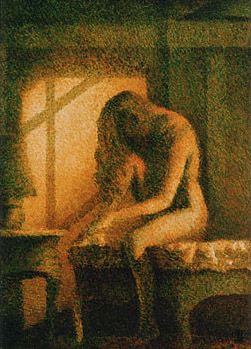
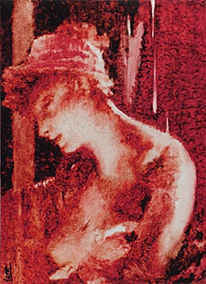

## Le glacis
### Le glacis, procédé d'application de peinture
 **Le glacis**  

_Un glacis ressemble, comme son nom l'indique, à de la glace. C' est une couche de peinture solide et transparente, souvent teintée par le peintre. Certains auteurs évoquent la brillance ou le satiné comme des aspects typiques des glacis, mais de fait il faut bien se résoudre au fait qu'il existe des glacis mats._

_L'étymologie de ce terme ne doit pas nous induire en erreur : le glacis n'a nullement vocation de "geler" une oeuvre comme pourrait le faire un vernis. La traduction en allemand de ce mot,_ Lasur_, qui réfère à l'azur (et donne en français le terme [lasure](lasure.html)) a ceci d'intéressant qu'elle évoque la transparence, certainement la propriété la plus caractéristique des glacis alors que le mot laque a, lui, tellement vu son sens s'altérer qu'il désigne aujourd'hui des surfaces picturales pouvant être opaques._

Sommaire

[Emplois des glacis](glacis.html#emploisdesglacis)

[Contraintes et possibilités](glacis.html#contraintesetpossibilites)

[Pas trop gras si possible](glacis.html#pastropgrassipossible)

[Les glacis et les laques](glacis.html#leglacisetleslaques)

[Peinture à l'huile : substituts partiels à l'huile de lin](glacis.html#peinturealhuilesubstitutsalhuiledelin)

[Types de glacis](glacis.html#typesdeglacis)

[Application des glacis](glacis.html#applicationdesglacis)

_En ce qui concerne les arts décoratifs, on mentionnera l'apparition au XIXème siècle des "glacis à l'huile", mélanges d'huile de lin, de [craie](craie.html) et de pigments (un mélange qui ne doit pas forcément être conseillé pour les travaux artistiques), alors que les "[glacis à l'eau](dextrinefarines.html#glacisaleau)", toujours dans le domaine décoratif, sont des procédés artisanaux éphémères dont la fabrication en atelier, peu coûteuse, toujours pratiquée de nos jours, n'est guère aisée._

Emplois des glacis

On emploie des glacis dans différentes optiques :

  1. tout le tableau est réalisé en glacis successifs (voir [photo ci-dessous](glacis.html#yola) : deux couleurs seulement, ocre jaune et bleu manganèse, ont été utilisées en nombreuses couches sur un fond blanc, formant des verts, des roux et même des noirs en jouant sur le faible pouvoir réflecteur des couches transparentes).

  2. travail à l'ancienne : on pose une [imprimature](imprimatures.html) plutôt sombre, puis on revient par-dessus avec du blanc (ou un mélange couleur du fond + blanc), définissant assez précisément toutes les [valeurs](valeur.html) du tableau sous la forme d'une sorte de [camaïeu](camaieu.html). Il ne reste plus qu'à appliquer des couleurs en glacis tout en conservant, par transparence, les valeurs imposées antérieurement.

  2 bis. autre travail à l'ancienne, basé sur des conditions bien particulières : on est dans une situation où il faut isoler un pigment particulièrement réactif, susceptible de s'altérer s'il est mis en présence d'autres couleurs. Le procédé a plusieurs intérêts : on pose un glacis par-dessus, mais aussi, auparavant, en dessous de la couleur instable, tenant compte par ailleurs de l'évolution des couleurs des différentes couches. Les peintres du Moyen-âge passaient très souvent un glacis garance (voir [laques anciennes](laquesanciennes.html)) au-dessus des aplats [vermillon](vermillons-2.html), connaissant bien l'évolution de chacun de ces éléments.



  3. autre cas, très courant : le tableau a été réalisé avec des couleurs opaques. Il s'agit, lors de la finition, de réaliser quelques corrections chromatiques locales ou bien d'unifier l'ensemble à l'aide d'une dominante appliquée, encore une fois, par transparence.

Dans tous les cas, souvent, les glacis sont appliqués - et souvent séchés - à l'horizontale car sauf exceptions, la matière utilisée est plutôt liquide. Il est possible cependant de travailler sur chevalet en utilisant 

    \* des quantités très faibles de "[jus](jus.html)"

    \* des adjuvants tels que la [cire](cirecommeadjuvant.html) (manière vénitienne) et/ou des [charges incolores](chargesincolores.html) et des [siccatifs](siccatifs.html) pour la peinture à l'huile

    \* des "couleurs spéciales pour glacis", également spécifiques à la peinture à l'huile. Elles sont fort coûteuses.

    \* des [médiums-gels pour l'acrylique](mediumspourlacrylique.html#mediumsgels) pour travailler "glacé mais pâteux" 

    \* ou en se servant des coulures comme effet pictural. Une solution de facilité qui peut "placer" ou lasser selon les cas.

Contraintes et possibilités 

_Des glacis peuvent être superposés infiniment (voir [point 1](glacis.html#1) ci-dessus). Cela est rendu possible par l'emploi de résines naturelles ou synthétiques (quel que soit le procédé de peinture) plus que par l'adjonction massive de [corps gras](gras.html#corpsgras)._

_En peinture à l'huile,_

> _la technique doit respecter la règle du "_[gras sur maigre](grassurmaigre.html)_" et encore plus les temps de séchage, très déterminants._
> 
> _le séchage doit être assez avancé - la surface doit être parfaitement solide et bien sèche - pour qu'un glacis puisse être appliqué sur un autre glacis. Il est assez conseillé de n'introduire dans la pâte que la quantité strictement nécessaire de corps gras comme [l'huile de lin](huiledelin.html), la térébenthine de Venise et la standolie, surtout dans les premières couches. [Lire passage ci-dessous](glacis.html#specialhuile)._
> 
>  _il existe des possibilités de travailler relativement longtemps un glacis dans le frais (de quelques dizaines de minutes à quelques heures), mais le comportement du liquide se transforme sensiblement à mesure que le diluant s'évapore. Ensuite, c'est l'huile qui commence à siccativer, on entre dans le "[demi-frais](demifrais.html)" et ce "processus de métamorphose" pendant lequel il devient risqué d'intervenir est bien plus long._
> 
> _Pour les peintres souhaitant travailler avec précision ou appliquer des corrections franches à leur glacis, il est très conseillé d'attendre environ vingt minutes après application avant d'intervenir. La durée de cette intervention encore "[alla prima](techmelangecouleurs.html#travailallaprima)" est, on l'a dit, très variable. La quantité de corps gras, de résines, la présence d'émulsions, le comportement des pigments et la température ambiante la déterminent._
> 
> _Cela s'apprécie plus que ça ne se calcule parce que cela dépend de la nature de l'intervention._
> 
> _Il reste encore possible dans un demi-frais peu avancé de retirer le glacis mais plus le temps passe, plus cette opération risque de laisser des traces sur la couche inférieure. Dans l'ensemble, il s'agit pour le peintre de faire attention au temps et pour ainsi dire d'être à l'écoute de son glacis._

_Un glacis est généralement réalisé à l'aide de diluants enrichis de résines transparentes (contenues dans des [médiums](mediumsetvernis.html)), plus ou moins épaississantes et solidifiantes, ce qui vaut tant en peinture à l'huile qu'avec les peintures aqueuses contemporaines._

Pas trop gras si possible

Le glacis pose un problème récurrent en peinture, particulièrement en peinture à l'huile mais aussi en techniques mixtes : il doit théoriquement toujours être au moins aussi [gras](gras.html), sinon plus gras, que la couche inférieure (règle importante en peinture : _[gras sur maigre](grassurmaigre.html)_). Il vaut donc mieux éviter de poser des couches inférieures trop grasses. Pour la même raison, les "glacis de finition" sont souvent assez gras (présence de [standolie](standolie.html), notamment).

De plus, la plupart des résines utilisées pour les glacis à l'huile ont un pouvoir liant qui s'ajoute ou se substitue partiellement à celui de l'huile. Un glacis très résineux est relativement gras, mais moins qu'un glacis fortement chargé d'huile. Certaines résines, même tendres, sont cependant un peu cassantes. C'est pour cette raison que l'on adjoint quand même assez souvent de l'huile et/ou des [oléorésines](oleoresine.html) en quantités très variables. Nous conseillons cependant de n'utiliser qu'une dose minime de ces substances-là, surtout pour les premières couches, pour plusieurs raisons :

> \* sans cela, le temps de séchage s'allonge démesurément, ce qui est gênant lorsque l'on souhaite travailler par couches superposées, d'autant plus que le séchage doit souvent être opéré à l'horizontale
> 
> \* risquer d'aller trop vite vers le gras est inutile, sauf support très souples (coton, toile non tendue, papier mou) et autres cas particuliers. Le gras est souple, c'est vrai, mais le "relativement maigre" n'est pas aussi rigide qu'une peinture à la chaux ou à la caséine par exemple, c'est-à-dire que le gras ne s'impose que dans des cas particulièrement extrêmes, particulièrement dans les premières couches
> 
> \* les huiles à peindre sont toutes colorées, de même que les oléorésines sauf le [baume du Canada](canada.html), que l'on n'utilise pas n'importe comment. Il faut donc tenir compte du jaunissement qui s'accroît au fil des couches trop riches en huiles.

Dans le domaine des peintures aqueuses ou à la [gomme laque](gommelaque.html)+éthanol, ces problèmes ne se posent pas.

Le glacis et les "laques"

Les couleurs de type "[laques](laques.html)", particulièrement transparentes, sont souvent employées en glacis (voir photo ci-dessous). De nos jours, il s'agit

> \* de pigments très [colorants](pigments.html#2facteurcolorant) mais peu [couvrants](pigments.html#1facteurcouvrantopposetransparence) (pigments [organiques](organiquesvsinorganiques.html) notamment), nécessitant une [charge incolore transparente](chargesincolores.html) assez faible, voire aucune charge
> 
> \* de pigments plus ou moins colorants mais opaques (souvent [minéraux](organiquesvsinorganiques.html)), pour lesquels l'emploi de charges incolores en quantité un peu plus importante est nécessaire.



Dans le premier cas, il ne faut pas ajouter trop d'huile (ou autre liant) au broyage (au liage), rendant la couleur trop [grasse](gras.html) car il s'agit là d'un réflexe normal qu'il faut maîtriser. Il est possiblement l'une des origines de la réputation de mauvaise siccativité des laques liées à l'huile.

Dans le second cas, la présence accentuée de la charge incolore peut rendre nécessaire l'ajout au broyage d'une quantité de liant correspondant à peu près à celle qui est employée pour un pigment moyen, mais tout dépend de la nature [colloïdale](colloide.html) ou [cristalloïde](cristalloide.html) de la charge. Un cristalloïde ne nécessite pas une adjonction importante de liant mais pose des problèmes de fragilisation alors qu'une charge colloïde peut à peu près être traitée comme un pigment.

Ces questions ne se posent guère avec les peintures qui sèchent plus rapidement que le procédé à l'huile.

Peinture à l'huile : substituts partiels à l'huile de lin

En peinture à l'huile, lorsque c'est le peintre lui-même qui veut rendre plus transparente la couleur qu'il veut appliquer en glacis, il emploie généralement un médium à base d'essence et de résine. Par cette opération, il ne rend pas forcément nécessaire un ajout de liant, comme ce pourrait être le cas s'il employait certaines charges. Si la dilution est telle que le recours à un autre liant compatible devient nécessaire, il peut employer la [méthylcellulose](methylcellulosiqueliant.html) par exemple, ou bien la [cire](cires.html) en très petite quantité. En effet, les [médiums](mediumspourlhuile.html) à peindre et les médiums pour glacis disponibles dans le commerce sont souvent trop gras car chargés d'huile de lin, entraînant des temps de séchage trop longs... inutilement.

Types de glacis

Le glacis, la transparence, créent une impression de profondeur et de mystère. Partant de cette constatation, distinguons trois types de glacis :

> \* les glacis flous. Ils sont souvent produits, en peinture à l'huile, par l'adjonction de [standolie](standolie.html) mais aussi de [chaux](chaux.html) en bonne quantité. En ce qui concerne les peintures aqueuses, un équivalent pourrait être [l'agent diffuseur](produitsacryl.html#diffuseursfusants), en acrylique
> 
> \* les glacis nets, jouant sur les matières. Le médium cristal, les produits contenant de la [silice colloïdale](silicepeinture.html) sont tout indiqués. La [cire](cirecommeadjuvant.html), même en quantité faible, peut également produire ce type d'effets. Certains gels-médiums donnent des résultats à peu près équivalents en peinture acrylique. Le coup de brosse reste visible
> 
> \* les glacis épais, nets ou flous, accentuant l'impression de profondeur. En peinture à l'huile, ils sont produits à l'aide de médiums-gels, de liants "travaillés" ou de médiums faits maison. En peinture acrylique, l'emploi de gels épais est tout indiqué pour obtenir ce type d'effets.

Application des glacis

C'est un vaste sujet. Nous ne nous étendrons pas sur les choix possibles dans le domaine artistique tellement ils sont nombreux.

Par contre, en peinture décorative, le glacis correspond à une technique un peu plus définie. Il est généralement réalisé soit avec de la peinture à l'huile, soit avec un liant à base de bière et de farine, soit avec de l'acrylique adjointe d'un retardateur de séchage. 

Généralement, la peinture diluée, mais certainement moins fluide que dans le domaine artistique (parce qu'il s'agit de traiter des surfaces systématiquement verticales) est d'abord appliquée à la brosse de manière grossière.

Elle est alors étalée puis lissée (presque par retrait, en "[dépouillé](depouille.html)") à l'aide d'une [brosse à adoucir](pincformes.html#brossesaadoucir).

Voir aussi [Mélange de couleurs](techmelangecouleurs.html) et [Vélature](uv.html#velature).


 [Communication](http://www.artrealite.com/annonceurs.htm) 

[](index-2.html#20131014)


```
title: Le glacis
date: Fri Dec 22 2023 11:27:12 GMT+0100 (Central European Standard Time)
author: postite
```
