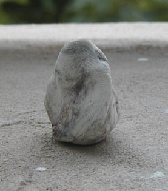
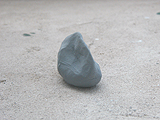
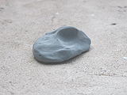
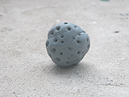
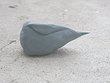
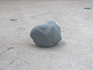

## La gomme mie de pain
### La gomme mie de pain, usage en dessin et arts plastiques
 Elle est parfois nommée "gomme mastic", ce qui peut prêter à confusion. Elle n'a en effet aucun rapport avec la [résine mastic](resinemastic.html).

De variété grise ou blanche, elle est très malléable. C'est un outil indispensable pour le dessin au fusain (lire [l'article](fusain.html) sur cet outil très important en dessin).

Le dessinateur crée des formes (voir images) correspondant très précisément aux opérations qu'il veut effectuer.

> \* Informe, la mie de pain remplace une gomme commune.
> 
> \* En lamelle, le dessinateur fait des retraits extrêmement fins.
> 
> \* En pointe, effleurant la surface dessinée, la mie de pain permet les fondus.
> 
> \* En motif (il suffit de rouler la gomme sur une surface accidentée ou de lui appliquer des formes), la gomme permet toutes sortes d'effets.
> 
> \* En tampon, la mie de pain estompe de vastes zones à éclaircir uniformément.

Sous toute réserve car les normes peuvent changer, on peut décrire des comportements en fonction des couleurs. Bleue, elle est plutôt dure à modeler. Blanche (voir photo ci-dessous), elle efface assez bien les dessins effectué avec des matériaux plus tenaces que le fusain tels que les pastels secs.



Des variétés multicolores sont apparues récemment sur le marché. Personne ne sait quel est leur véritable champ d'application. Elles ne présentent d'attrait que par leurs colorations hurlantes, probablement destinées à attirer une clientèle juvénile qui ne s'apercevra pas tout de suite de la gène occasionnée dans un travail sérieux. La persistance de taches violemment colorées dans le champ de vision, dans l'espace pictural du dessin, peut réellement altérer notre perception de celui-ci, ce qui peut s'avérer gênant au moment, précisément, de gommer.

  








```
title: La gomme mie de pain
date: Fri Dec 22 2023 11:27:16 GMT+0100 (Central European Standard Time)
author: postite
```
