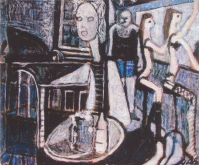
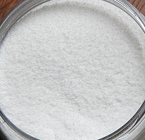

## La gouache
### La gouache, usage en arts plastiques
 **La gouache**  

[](quinoussommes.html#yvonlebars)

_[Etymologie : voir Détrempe](detrempe.html)_

_Les premières versions modernes de cette peinture sont apparues vers le début du siècle dernier. Cela ne signifie pas qu'il n'existait pas d'autres formes de gouaches antérieurement. Cependant, on entend aujourd'hui par le mot gouache plus spécifiquement qu'hier une peinture à l'eau [couvrante](pigments.html#1facteurcouvrantopposetransparence)._

_Raoul Dufy et quelques autres jusqu'à l'époque actuelle ont donné à la gouache contemporaine les lettres de noblesse que sa réputation de "peinture scolaire" ne lui confère pas a priori._

_Nous avons choisi en illustration ci-contre un tableau un peu osé, "_Les infirmières de l'âme_", par [Yvon le Bars](quinoussommes.html#yvonlebars) (gouache sur papier marouflé sur toile), afin de contredire cette opinion encore très répandue. Cependant, cette réputation n'est pas sans fondement dans la réalité pratique et l'on peut à ce sujet lire directement notre [conclusion temporaire](gouache.html#conclusiontemporaire) avant de poursuivre._

_D'autres peintures comparables, plus anciennes (Moyen-âge) sont parfois référencées en tant que "gouaches médiévales" comme la [caséine](caseine.html) et certaines encres. Aucune n'associait opacité, temps de séchage rapide et simplicité d'emploi.  
On comprend donc en quoi la gouache d'aujourd'hui est un pur produit du modernisme, de ses expérimentations multiples, de ses exigences de rapidité et d'efficacité._

_Elle était initialement une [aquarelle](gommearabaquar.html) à laquelle on avait adjoint du [blanc de lithopone](lithopone.html) ou bien du [blanc de zinc](blancssynthetiques.html#leblancdezinc) pur, ou encore du [talc](talc.html), du [kaolin](kaolin.html) ou aussi bien une [marne](terresblanches.html) quelconque, pour la rendre si ce n'est couvrante, du moins épaisse et assez opaque, en conservant une certaine luminosité.  
Aujourd'hui, devant la diversité des produits qui nous sont proposés sous l'intitulé de gouaches, il est devenu difficile de savoir à quel procédé de fabrication, à quelle composition précise nous avons affaire._



Le [liant méthylcellulosique](methylcellulosiqueliant.html) aurait été le plus utilisé. Certains fabricants l'ont même évoqué comme liant "traditionnel" de la gouache, ce qui est moins que jamais une information confirmée. Ce liant est disponible dans le commerce à l'état pulvérulent, beau comme une neige fraîche (voir photo ci-contre), et doit être adjoint, pour pouvoir être mêlé aux pigments, à de l'eau distillée et éventuellement à un agent conservateur.

La [glycérine](glycerine.html) serait souvent employée par les fabricants comme assouplissant et/ou comme retardateur de séchage.

\[Ajout juillet 2011\]  
Avec l'ouverture des marchés et la multiplication des sous-traitances qui en a résulté dans les années 2000 en particulier, les moyens de contrôle des produits sont-ils encore appropriés, y compris pour les commanditaires, face aux flux concernés ? Pouvons-nous encore affirmer que la gouache est plutôt faite de ceci que de cela ? _Non c'est un fait. Nous ne pouvons plus prétendre que la gouache est en général faite de méthylcellulose_ comme nous le faisions antérieurement. On ne sait strictement plus ce que c'est. Comme les industriels continuent à rechigner à communiquer - si tant est qu'ils soient en mesure de le faire -, il ne reste au consommateur que le nom d'un fabricant ou d'une gamme de produits pour accorder telle ou telle confiance à un telle peinture nommée gouache.  
\[Fin de l'ajout\]

Il est excessif d'affirmer que toutes les gouaches se prêtent surtout aux aplats  : certaines gouaches dites "gouaches techniques" sont effectivement destinées à cet emploi, mais pas les extra-fines. Il existe d'ailleurs d'autres grandes différences entre les gammes de produits. On notera particulièrement l'étendue incroyable de certaines gammes de couleurs extra-fines, comparativement aux autres séries et même comparativement à d'autres procédés de peinture. A ce titre, elles peuvent être utilisées pour découvrir ou faire découvrir les caractéristiques de la plupart des pigments en peinture à l'eau.

La gouache contemporaine ne permet aucun empâtement, contrairement à l'acrylique : des craquelures se forment au séchage. L'emploi éventuel et non confirmé de liant méthylcellulosique, par ailleurs paradoxalement _agent épaississant_ lorsqu'elle est employée avec d'autres liants, ne suffit pas à faire de la gouache pure une peinture pour les reliefs.

La gouache peinte est théoriquement [réversible](liants.html#reversibilite).

Son diluant est l'[eau](eau.html) (si possible distillée ou au moins déminéralisée).

Son seul médium vraiment reconnu est le [fiel de boeuf](fieldeboeuf.html). Les particularités de ce produit ne l'apparentent pas, cependant, aux médiums habituels des autres procédés, le fiel étant surtout employé pour permettre un bon accrochage sur supports lisses.

**Protection des gouaches**  : [vernis spéciaux pour gouaches](vernissage.html). C'est vrai : le beau velouté de vos travaux a besoin de protection. Cependant, le vernissage des gouaches peut être très problématique. Nous avons recueilli plusieurs témoignages de vernissages catastrophiques, ce qui se comprend dans la mesure où cette peinture est [réversible](liants.html#reversibilite) et sa composition, très variable. Si la peinture "reprend" ou réagit chimiquement, le tableau est détruit, quel que soit le mode d'application du vernis : soufflette, aérosol ou pinceau. Un essai préalable sur un échantillon est fortement conseillé.

**Conclusion temporaire**

Comme la réponse au courrier d'un lecteur le suggère ([lien](courrierdeslecteurs2011b150.html#20110710pb)), la gouache et les produits associés posent plus que jamais un problème de fiabilité et de confiance car on finit par ne plus rien savoir des produits en présence.

Pour un adulte qui désire utiliser une gouache saine et de qualité raisonnable, la solution pourrait consister à employer l'équivalent des gouaches médiévales, par exemple une [caséine soluble](caseine.html#unerecettetypiquesanschaux) et à effectuer soi-même le liage. Pour les enfants, il existe des dextrines et des gélatines mais **attention :** en aucun cas la question du pigment ne peut être résolue dans le cadre d'une fabrication personnelle ou isolée. Dit autrement, il faut acheter un produit dans le commerce et veiller à sa composition.

Enfin nous suggérons aux détaillants et aux commanditaires publics et privés de ne pas négliger les petites entreprises fabricant de bonnes peintures à la caséine (ou autres, notamment les peintures pour enfants) prêtes à l'emploi. Certains chefs d'entreprises et/ou consultants sont des experts internationaux reconnus. Ils n'attendent que vous pour lancer des productions d'ampleur offrant des garanties de sécurité et de qualité autrement plus sérieuses que celles qui sont disponibles actuellement.


 [Communication](http://www.artrealite.com/annonceurs.htm) 

[](index-2.html#20131014)


```
title: La gouache
date: Fri Dec 22 2023 11:27:16 GMT+0100 (Central European Standard Time)
author: postite
```
